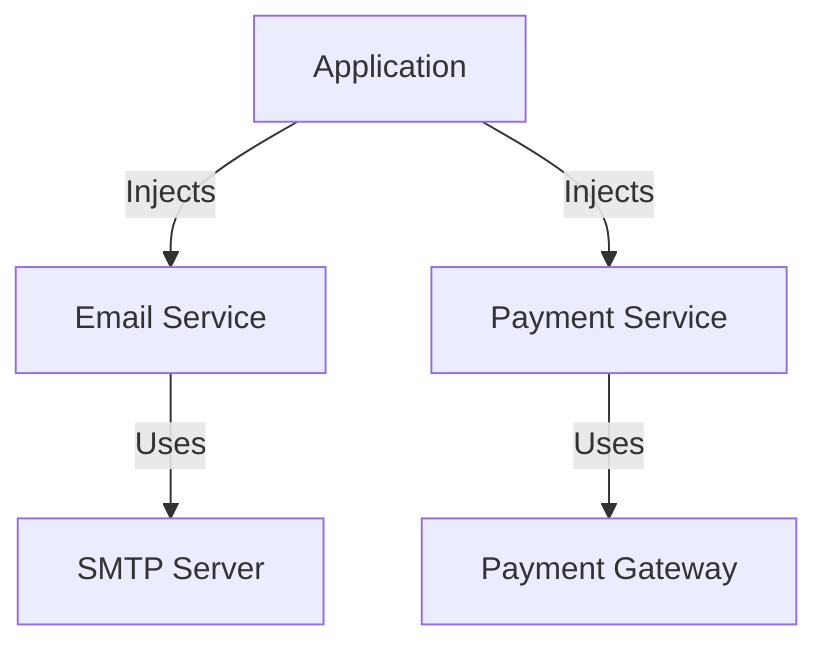

## 9.6 Dependency Injection in Clojure

Dependency Injection (DI) is a powerful design pattern that promotes loose coupling between components by injecting dependencies rather than hard-coding them. This approach enhances modularity, testability, and maintainability, making it a cornerstone of modern software architecture. In Clojure, DI can be achieved using constructors, higher-order functions, or dedicated libraries such as Component and Integrant.

### Introduction to Dependency Injection

Dependency Injection is a technique where an object receives its dependencies from an external source rather than creating them internally. This pattern is crucial for creating flexible and maintainable codebases, as it allows for easy swapping of components and facilitates testing by enabling the use of mock objects.

### Detailed Explanation

#### Key Concepts of Dependency Injection

- **Loose Coupling:** By injecting dependencies, components are decoupled from their implementations, allowing for greater flexibility and easier maintenance.
- **Modularity:** DI encourages the separation of concerns, making it easier to manage and understand individual components.
- **Testability:** With DI, dependencies can be easily replaced with mocks or stubs, simplifying unit testing.

#### Implementing Dependency Injection in Clojure

Clojure, being a functional language, offers several idiomatic ways to implement DI, leveraging its strengths in immutability and higher-order functions.

##### Using Constructors for Components

One of the simplest ways to implement DI in Clojure is by using constructors to create components with their dependencies injected as arguments.

```clojure
(defn create-email-service [smtp-server]
  {:send-email (fn [to subject body]
                 ;; Implementation using smtp-server
                 )})

(def email-service (create-email-service my-smtp-server))
```

In this example, the `create-email-service` function takes an `smtp-server` as an argument, creating an email service component that can send emails using the provided server.

##### Passing Dependencies as Arguments

Another approach is to pass dependencies directly as arguments to functions that require them.

```clojure
(defn process-order [order email-service payment-service]
  ;; Use email-service and payment-service
  )
```

This method is straightforward and works well for functions that need to interact with multiple services.

##### Leveraging Higher-Order Functions

Higher-order functions can encapsulate dependencies, providing a flexible way to manage them.

```clojure
(defn make-handler [dependencies]
  (fn [request]
    (let [{:keys [db logger]} dependencies]
      ;; Handle request
      )))

(def handler (make-handler {:db my-db :logger my-logger}))
```

Here, `make-handler` creates a request handler function that uses the provided `db` and `logger` dependencies.

##### Utilizing Dependency Injection Libraries

Clojure's ecosystem includes libraries specifically designed for managing dependencies, such as Component and Integrant.

###### Component Library

The Component library provides a structured way to manage the lifecycle of stateful components.

```clojure
(require '[com.stuartsierra.component :as component])

(defrecord DatabaseComponent [config]
  component/Lifecycle
  (start [this] (assoc this :connection (connect config)))
  (stop [this] (disconnect (:connection this)) this))

(def system (component/system-map
              :database (map->DatabaseComponent {:config db-config})))

(def started-system (component/start system))
```

In this example, `DatabaseComponent` is a component that manages a database connection, with lifecycle methods to start and stop the connection.

###### Integrant Library

Integrant is another library that provides a flexible approach to dependency injection, focusing on configuration-driven initialization.

```clojure
(require '[integrant.core :as ig])

(def config
  {:db {:config db-config}
   :web-server {:port 8080}})

(defmethod ig/init-key :db [_ {:keys [config]}]
  (connect config))

(defmethod ig/halt-key! :db [_ db]
  (disconnect db))

(def system (ig/init config))
```

Integrant uses a configuration map to define system components and their initialization logic, allowing for easy reconfiguration and testing.

##### Facilitating Testing by Injecting Mocks

Testing is a critical aspect of software development, and DI makes it easier to test components in isolation by injecting mock dependencies.

```clojure
(def mock-email-service
  {:send-email (fn [to subject body]
                 (println "Mock send email to" to))})

;; Use mock-email-service in tests
```

By using a mock email service, tests can verify the behavior of components without relying on external systems.

##### Managing Lifecycle of Dependencies

Proper management of resource lifecycles is essential to prevent resource leaks and ensure system stability. Libraries like Component and Integrant provide mechanisms to manage the start and stop phases of components, ensuring resources are initialized and cleaned up properly.

### Visual Aids

To better understand the flow of Dependency Injection in Clojure, consider the following conceptual diagram:



This diagram illustrates how an application injects dependencies like the Email Service and Payment Service, which in turn use external resources such as an SMTP Server and Payment Gateway.

### Use Cases

- **Web Applications:** DI is commonly used in web applications to manage services like databases, email, and logging.
- **Microservices:** In a microservices architecture, DI helps manage service dependencies and facilitates testing.
- **Command-Line Tools:** DI can be used to inject configuration and service dependencies into command-line tools, enhancing flexibility.

### Advantages and Disadvantages

#### Advantages

- **Flexibility:** Easily swap out implementations without changing the dependent code.
- **Testability:** Simplifies testing by allowing the injection of mock dependencies.
- **Modularity:** Encourages separation of concerns and cleaner code organization.

#### Disadvantages

- **Complexity:** Can introduce additional complexity, especially in large systems.
- **Overhead:** May require additional setup and configuration, particularly when using DI libraries.

### Best Practices

- **Use DI Libraries:** Leverage libraries like Component and Integrant to manage dependencies and lifecycle efficiently.
- **Keep It Simple:** Start with simple DI techniques like constructors and higher-order functions before introducing libraries.
- **Focus on Testability:** Design components with testability in mind, using DI to facilitate the injection of mocks and stubs.

### Comparisons

Dependency Injection can be compared with other patterns like Service Locator, which provides a centralized registry for service instances. While Service Locator can simplify service discovery, it often leads to tighter coupling compared to DI.

### Conclusion

Dependency Injection is a vital pattern for building modular, testable, and maintainable Clojure applications. By using constructors, higher-order functions, and libraries like Component and Integrant, developers can effectively manage dependencies and enhance the flexibility of their systems. As you explore DI in your projects, consider the trade-offs and best practices to achieve optimal results.

## Quiz Time!



### What is the primary benefit of Dependency Injection?

- [x] Loose coupling between components
- [ ] Increased code complexity
- [ ] Hard-coding dependencies
- [ ] Reduced testability

> **Explanation:** Dependency Injection promotes loose coupling by injecting dependencies rather than hard-coding them, enhancing flexibility and maintainability.

### Which Clojure library is commonly used for managing component lifecycles?

- [x] Component
- [ ] Ring
- [ ] Reagent
- [ ] Pedestal

> **Explanation:** The Component library is designed to manage the lifecycle of stateful components in Clojure applications.

### How can dependencies be injected in Clojure?

- [x] Using constructors
- [x] Using higher-order functions
- [x] Using DI libraries
- [ ] Using global variables

> **Explanation:** Dependencies can be injected using constructors, higher-order functions, or dedicated DI libraries like Component and Integrant.

### What is a disadvantage of Dependency Injection?

- [x] Can introduce additional complexity
- [ ] Reduces code flexibility
- [ ] Makes testing harder
- [ ] Encourages tight coupling

> **Explanation:** While DI offers many benefits, it can introduce additional complexity, especially in large systems.

### Which of the following is a DI library in Clojure?

- [x] Integrant
- [ ] Compojure
- [ ] Hiccup
- [ ] Aleph

> **Explanation:** Integrant is a library that provides a flexible approach to dependency injection in Clojure.

### What is a common use case for Dependency Injection?

- [x] Web applications
- [x] Microservices
- [x] Command-line tools
- [ ] Hard-coding configurations

> **Explanation:** DI is commonly used in web applications, microservices, and command-line tools to manage dependencies.

### How does Dependency Injection enhance testability?

- [x] By allowing the injection of mock dependencies
- [ ] By hard-coding test cases
- [ ] By reducing code flexibility
- [ ] By increasing code complexity

> **Explanation:** DI enhances testability by allowing developers to inject mock dependencies, simplifying unit testing.

### What is a key principle of Dependency Injection?

- [x] Separation of concerns
- [ ] Tight coupling
- [ ] Hard-coding dependencies
- [ ] Reducing modularity

> **Explanation:** DI promotes separation of concerns by decoupling components from their dependencies.

### Which pattern is often compared with Dependency Injection?

- [x] Service Locator
- [ ] Singleton
- [ ] Factory Method
- [ ] Observer

> **Explanation:** Service Locator is often compared with Dependency Injection, as both manage dependencies but in different ways.

### Dependency Injection can be achieved using higher-order functions in Clojure.

- [x] True
- [ ] False

> **Explanation:** Higher-order functions can encapsulate dependencies, providing a flexible way to manage them in Clojure.


