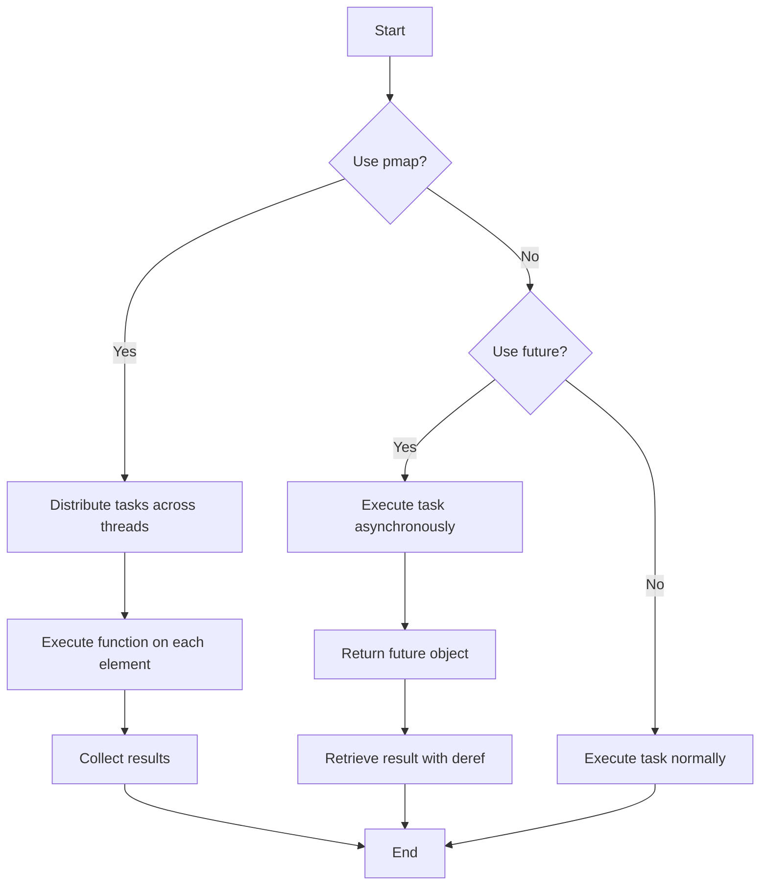

## 9.6. Parallel Processing with `pmap` and `future`

Parallel processing is a powerful technique that allows us to perform multiple computations simultaneously, leveraging multi-core processors to improve performance and efficiency. In Clojure, two primary tools for parallel processing are `pmap` and `future`. This section will guide you through understanding and using these tools effectively.

### Understanding `pmap`

`pmap` is a parallel version of the `map` function in Clojure. It is designed to apply a function to each element of a collection in parallel, distributing the workload across multiple threads. This can significantly speed up operations that are computationally intensive and can be performed independently.

#### How `pmap` Works

`pmap` works by creating a pool of threads and distributing the elements of the collection across these threads. Each thread applies the given function to its assigned elements, and the results are collected and returned as a lazy sequence. This means that `pmap` can start returning results before all computations are complete, which is useful for processing large datasets.

#### When to Use `pmap`

Use `pmap` when:
- You have a large collection to process.
- The function applied to each element is computationally intensive.
- The operations on each element are independent of each other.
- You want to take advantage of multi-core processors to improve performance.

#### Example: Using `pmap`

Let's consider an example where we want to compute the square of a large list of numbers. Using `pmap`, we can parallelize this operation:

```clojure
(defn square [n]
  (* n n))

(def numbers (range 1 1000000))

(def squares (pmap square numbers))

;; Print the first 10 squares
(println (take 10 squares))
```

In this example, `pmap` will distribute the computation of squaring each number across multiple threads, potentially speeding up the process compared to using `map`.

#### Benefits of `pmap`

- **Concurrency**: Utilizes multiple CPU cores for concurrent execution.
- **Efficiency**: Reduces the time required for processing large datasets.
- **Simplicity**: Easy to use and integrate into existing codebases.

### Introducing `future`

`future` is another powerful tool in Clojure for parallel processing. It allows you to execute a block of code asynchronously, returning immediately with a placeholder for the result. This is useful for tasks that can be performed in the background while the main program continues executing.

#### Creating Asynchronous Computations with `future`

A `future` is created using the `future` macro. It executes the given expression in a separate thread and returns a future object. You can later retrieve the result using `deref` or the `@` reader macro.

#### Example: Using `future`

Consider a scenario where we want to perform a time-consuming computation without blocking the main thread:

```clojure
(defn long-computation []
  (Thread/sleep 5000) ; Simulate a long computation
  "Computation Complete")

(def result (future (long-computation)))

;; Do other work here...

;; Retrieve the result of the future
(println @result)
```

In this example, the `long-computation` function is executed in a separate thread, allowing the main program to continue executing. The result is retrieved using `@result`, which will block until the computation is complete.

#### Synchronization of Futures

When working with futures, it's important to handle synchronization properly. The `deref` function (or `@`) will block until the future is complete, so be mindful of where and when you use it to avoid unnecessary blocking.

#### Performance Considerations

- **Overhead**: Creating too many futures can lead to overhead from context switching and thread management.
- **Blocking**: Avoid blocking operations within futures, as this can negate the benefits of parallelism.
- **Resource Management**: Be aware of resource limitations, such as memory and CPU, when creating multiple futures.

### Combining `pmap` and `future`

In some cases, you may want to combine `pmap` and `future` for more complex parallel processing tasks. For example, you can use `pmap` to distribute tasks across threads and `future` to handle asynchronous operations within each task.

#### Example: Combining `pmap` and `future`

```clojure
(defn async-task [n]
  (future
    (Thread/sleep 1000) ; Simulate a task
    (* n n)))

(def tasks (pmap async-task (range 1 10)))

;; Retrieve results
(def results (map deref tasks))

(println results)
```

In this example, `pmap` is used to distribute the creation of futures across threads, and each future performs an asynchronous task. The results are then retrieved using `map deref`.

### Visualizing Parallel Processing with `pmap` and `future`

To better understand how `pmap` and `future` work together, let's visualize the process using a flowchart.



### Key Takeaways

- **`pmap`** is ideal for parallelizing operations on large collections where each operation is independent.
- **`future`** allows for asynchronous execution of tasks, enabling non-blocking operations.
- **Combining `pmap` and `future`** can provide powerful parallel processing capabilities for complex tasks.
- **Performance considerations** are crucial when using these tools to avoid overhead and resource exhaustion.

### Try It Yourself

Experiment with the code examples provided. Try modifying the functions or the size of the collections to see how `pmap` and `future` behave under different conditions. Consider measuring the execution time to observe the performance benefits.

### Further Reading

For more information on parallel processing in Clojure, consider exploring the following resources:

- [Clojure Official Documentation](https://clojure.org/reference)
- [Clojure Programming by Chas Emerick, Brian Carper, and Christophe Grand](https://www.oreilly.com/library/view/clojure-programming/9781449310387/)
- [Concurrency in Clojure](https://clojure.org/about/concurrent_programming)

## **Ready to Test Your Knowledge?**



### What is the primary purpose of `pmap` in Clojure?

- [x] To parallelize map operations across multiple threads
- [ ] To execute a single function asynchronously
- [ ] To manage shared state in concurrent programs
- [ ] To handle errors in functional programming

> **Explanation:** `pmap` is used to parallelize map operations, distributing tasks across multiple threads for concurrent execution.

### How does `future` in Clojure work?

- [x] It executes a block of code asynchronously in a separate thread
- [ ] It blocks the main thread until the computation is complete
- [ ] It is used for error handling in asynchronous code
- [ ] It manages shared state in concurrent programs

> **Explanation:** `future` executes code asynchronously, allowing the main thread to continue executing while the future runs in the background.

### What function is used to retrieve the result of a `future`?

- [x] `deref` or `@`
- [ ] `await`
- [ ] `resolve`
- [ ] `get`

> **Explanation:** The `deref` function or the `@` reader macro is used to retrieve the result of a `future`.

### When should you use `pmap` over `map`?

- [x] When processing a large collection with independent operations
- [ ] When the function applied is I/O bound
- [ ] When you need to manage shared state
- [ ] When the operations are dependent on each other

> **Explanation:** `pmap` is beneficial for large collections with independent operations, leveraging parallel processing for efficiency.

### What is a potential downside of using too many `futures`?

- [x] Overhead from context switching and thread management
- [ ] Increased memory usage due to lazy sequences
- [ ] Blocking the main thread
- [ ] Decreased readability of code

> **Explanation:** Creating too many futures can lead to overhead from managing multiple threads and context switching.

### Which of the following is true about `pmap`?

- [x] It returns a lazy sequence
- [ ] It blocks until all computations are complete
- [ ] It is used for managing shared state
- [ ] It is only suitable for I/O bound tasks

> **Explanation:** `pmap` returns a lazy sequence, allowing results to be processed as they become available.

### How can you combine `pmap` and `future` effectively?

- [x] Use `pmap` to distribute tasks and `future` for asynchronous operations within each task
- [ ] Use `future` to distribute tasks and `pmap` for asynchronous operations
- [ ] Use both for managing shared state
- [ ] Use both for error handling

> **Explanation:** Combining `pmap` and `future` allows for distributing tasks across threads and handling asynchronous operations within each task.

### What is the role of `deref` in working with `future`?

- [x] It retrieves the result of a future, blocking if necessary
- [ ] It cancels the execution of a future
- [ ] It manages shared state in concurrent programs
- [ ] It handles errors in asynchronous code

> **Explanation:** `deref` retrieves the result of a future, blocking until the computation is complete if necessary.

### What should you avoid within a `future` to maintain performance?

- [x] Blocking operations
- [ ] Lazy sequences
- [ ] Pure functions
- [ ] Immutable data structures

> **Explanation:** Blocking operations within a future can negate the benefits of parallelism, as they can cause unnecessary delays.

### True or False: `pmap` is always faster than `map`.

- [ ] True
- [x] False

> **Explanation:** `pmap` is not always faster than `map`. It depends on the nature of the task and the overhead of managing multiple threads. For small tasks or I/O bound operations, `map` might be more efficient.



Remember, mastering parallel processing in Clojure with `pmap` and `future` can significantly enhance the performance of your applications. Keep experimenting, stay curious, and enjoy the journey!
