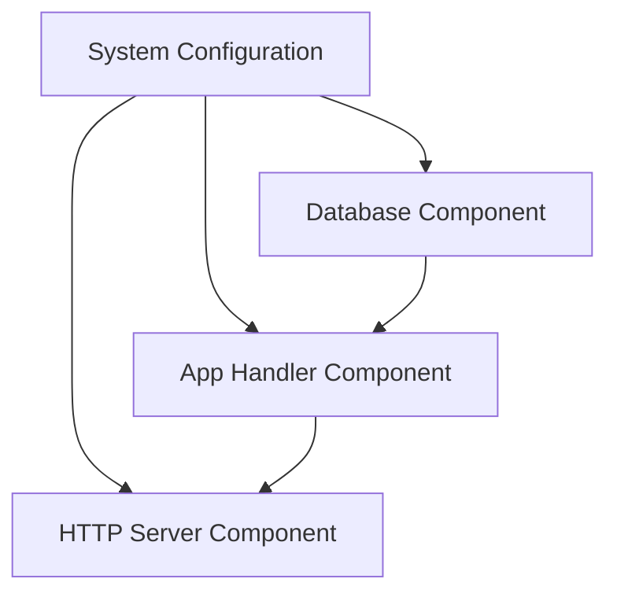

## 9.7 Component Pattern in Clojure

In modern software development, managing the lifecycle and dependencies of system components is crucial for building modular, maintainable, and testable applications. The Component Pattern in Clojure addresses these needs by providing a structured approach to system composition. This article delves into the Component Pattern, focusing on Stuart Sierra's Component library and its alternative, Integrant, to illustrate how Clojure developers can effectively manage system components.

### Introduction

The Component Pattern is a design pattern that facilitates the management of system components' lifecycle and dependencies. It allows developers to define components that can be started, stopped, and have dependencies injected, making it easier to develop, test, and maintain complex systems. In Clojure, the Component library by Stuart Sierra and the Integrant library are popular tools for implementing this pattern.

### Detailed Explanation

#### The Need for Component Management

In any non-trivial application, various parts of the system need to interact with each other. These interactions often require careful management of dependencies and lifecycle events such as initialization and teardown. The Component Pattern provides a framework to address these concerns by:

- **Encapsulating Dependencies:** Each component explicitly declares its dependencies, promoting loose coupling and high cohesion.
- **Managing Lifecycle:** Components can be started and stopped in a controlled manner, ensuring that resources are allocated and released appropriately.
- **Facilitating Testing:** Components can be independently tested by starting them in isolation, allowing for more granular and effective testing strategies.

#### Stuart Sierra's Component Library

Stuart Sierra's Component library is a popular choice for implementing the Component Pattern in Clojure. It provides a simple yet powerful framework for defining components and managing their lifecycle.

##### Key Concepts

- **Component Records:** Define components as records that implement the `component/Lifecycle` protocol, which includes `start` and `stop` methods.
- **System Map:** Assemble components into a system map, specifying dependencies and their relationships.
- **Lifecycle Management:** Use the `component/start` and `component/stop` functions to manage the lifecycle of the entire system or individual components.

##### Using the Component Library

###### Include the Component Library

To use the Component library, add it to your project dependencies:

```clojure
;; Add to your project dependencies:
[com.stuartsierra/component "1.0.0"]
```

###### Require the Component Namespace

```clojure
(require '[com.stuartsierra.component :as component])
```

###### Define Component Records

Define components as records that implement the `component/Lifecycle` protocol. Here are examples of a Database component, an HTTP Server component, and an Application Handler component:

- **Database Component:**

```clojure
(defrecord Database [config connection]
  component/Lifecycle
  (start [this]
    (println "Starting Database")
    (let [conn (connect-to-db config)]
      (assoc this :connection conn)))
  (stop [this]
    (println "Stopping Database")
    (when connection
      (disconnect connection))
    (assoc this :connection nil)))
```

- **HTTP Server Component:**

```clojure
(defrecord HttpServer [config handler server]
  component/Lifecycle
  (start [this]
    (println "Starting HTTP Server")
    (let [srv (start-server handler config)]
      (assoc this :server srv)))
  (stop [this]
    (println "Stopping HTTP Server")
    (when server
      (stop-server server))
    (assoc this :server nil)))
```

- **Application Handler Component:**

```clojure
(defrecord AppHandler [database]
  component/Lifecycle
  (start [this]
    (println "Starting App Handler")
    ;; Initialize handler with database dependency
    this)
  (stop [this]
    (println "Stopping App Handler")
    this))
```

###### Assemble the System with Dependencies

Create a system map to assemble components and specify their dependencies:

```clojure
(defn app-system [config]
  (component/system-map
    :database (map->Database {:config (:db config)})
    :handler (component/using
               (map->AppHandler {})
               [:database])
    :http-server (component/using
                   (map->HttpServer {:config (:server config)})
                   [:handler])))
```

###### Initialize and Start the System

```clojure
(def config {:db {...}
             :server {...}})
(def system (app-system config))
(def started-system (component/start system))
```

###### Stop the System When Done

```clojure
(component/stop started-system)
```

###### Access Components During Runtime

```clojure
(def db (:database started-system))
(def handler (:handler started-system))
```

###### Facilitate Testing by Starting Components Independently

```clojure
(def test-db (component/start (map->Database {:config test-db-config})))
```

#### Integrant Library

Integrant is an alternative to the Component library that emphasizes a data-driven architecture and configuration-based system building. It provides a flexible approach to defining and managing system components.

##### Key Concepts

- **Configuration Map:** Define the system configuration as a map, specifying components and their dependencies.
- **Lifecycle Methods:** Implement `init-key` and `halt-key!` methods to manage component initialization and teardown.
- **Data-Driven Architecture:** Use data to describe the system structure, promoting flexibility and ease of modification.

##### Using the Integrant Library

###### Include the Integrant Library

To use Integrant, add it to your project dependencies:

```clojure
;; Add to your project dependencies:
[integrant "0.8.0"]
```

###### Require the Integrant Namespace

```clojure
(require '[integrant.core :as ig])
```

###### Define Configuration Map

Define the system configuration as a map:

```clojure
(def config
  {:db.connection {:config db-config}
   :app/handler    {:db (ig/ref :db.connection)}
   :http/server    {:handler (ig/ref :app/handler)
                    :config server-config}})
```

###### Implement Init and Halt Methods

Define `init-key` and `halt-key!` methods for each component:

- **Database Connection:**

```clojure
(defmethod ig/init-key :db.connection [_ {:keys [config]}]
  (println "Initializing Database Connection")
  (connect-to-db config))

(defmethod ig/halt-key! :db.connection [_ conn]
  (println "Closing Database Connection")
  (disconnect conn))
```

- **Application Handler:**

```clojure
(defmethod ig/init-key :app/handler [_ {:keys [db]}]
  (println "Initializing App Handler with DB")
  {:db db})

(defmethod ig/halt-key! :app/handler [_ _]
  (println "Stopping App Handler"))
```

- **HTTP Server:**

```clojure
(defmethod ig/init-key :http/server [_ {:keys [handler config]}]
  (println "Starting HTTP Server")
  (start-server handler config))

(defmethod ig/halt-key! :http/server [_ server]
  (println "Stopping HTTP Server")
  (stop-server server))
```

###### Initialize and Manage the System

Initialize the system and manage its components:

```clojure
(def system (ig/init config))
;; Access components:
(def db (:db.connection system))
;; When done:
(ig/halt! system)
```

### Visual Aids

To better understand the Component Pattern, let's visualize the system architecture using a conceptual diagram:



### Use Cases

The Component Pattern is particularly useful in scenarios where:

- **Complex Systems:** Applications with multiple interacting components benefit from clear dependency management and lifecycle control.
- **Microservices Architecture:** Each microservice can be treated as a component, allowing for independent deployment and scaling.
- **Test-Driven Development:** Components can be tested in isolation, facilitating a test-driven approach to development.

### Advantages and Disadvantages

#### Advantages

- **Modularity:** Promotes a modular design, making it easier to manage and extend systems.
- **Testability:** Components can be tested independently, improving test coverage and reliability.
- **Lifecycle Management:** Provides a structured approach to managing component lifecycles, ensuring resources are used efficiently.

#### Disadvantages

- **Learning Curve:** Requires understanding of the Component or Integrant library and its concepts.
- **Overhead:** May introduce additional complexity in simple applications where component management is unnecessary.

### Best Practices

- **Define Clear Interfaces:** Ensure each component has a well-defined interface, promoting loose coupling and high cohesion.
- **Use Configuration Maps:** Leverage configuration maps to describe system structure, making it easier to modify and extend.
- **Test Components Independently:** Take advantage of the ability to start components in isolation for testing purposes.

### Comparisons

The Component Pattern can be compared to other patterns such as the Service Locator pattern, which provides a centralized registry for service instances. While the Service Locator pattern focuses on locating services, the Component Pattern emphasizes lifecycle management and dependency injection.

### Conclusion

The Component Pattern in Clojure, facilitated by libraries like Stuart Sierra's Component and Integrant, provides a robust framework for managing system components. By encapsulating dependencies and managing lifecycles, developers can build modular, maintainable, and testable applications. Whether you're building a complex system or a microservice architecture, the Component Pattern offers valuable tools for effective system design.

## Quiz Time!



### What is the primary purpose of the Component Pattern in Clojure?

- [x] To manage the lifecycle and dependencies of system components
- [ ] To provide a centralized registry for service instances
- [ ] To optimize database queries
- [ ] To handle user authentication

> **Explanation:** The Component Pattern is designed to manage the lifecycle and dependencies of system components, facilitating modular and maintainable system design.

### Which library is commonly used in Clojure to implement the Component Pattern?

- [x] Stuart Sierra's Component
- [ ] Ring
- [ ] Pedestal
- [ ] Re-frame

> **Explanation:** Stuart Sierra's Component library is a popular choice for implementing the Component Pattern in Clojure.

### What is a key feature of the Integrant library?

- [x] Data-driven architecture and configuration-based system building
- [ ] Centralized logging
- [ ] Real-time data processing
- [ ] User interface design

> **Explanation:** Integrant emphasizes a data-driven architecture and configuration-based system building, allowing for flexible and modular system design.

### In the Component library, how are components typically defined?

- [x] As records implementing the `component/Lifecycle` protocol
- [ ] As functions returning maps
- [ ] As Java classes
- [ ] As XML configurations

> **Explanation:** Components in the Component library are defined as records implementing the `component/Lifecycle` protocol, which includes `start` and `stop` methods.

### What is the role of the `component/system-map` function?

- [x] To assemble components into a system map with specified dependencies
- [ ] To start all components in a system
- [ ] To stop all components in a system
- [ ] To log system events

> **Explanation:** The `component/system-map` function is used to assemble components into a system map, specifying their dependencies and relationships.

### How does the Integrant library manage component initialization?

- [x] Using `init-key` methods
- [ ] Using XML configuration files
- [ ] Through a centralized service registry
- [ ] By automatically detecting dependencies

> **Explanation:** Integrant manages component initialization using `init-key` methods, which define how each component should be initialized.

### What is a common use case for the Component Pattern?

- [x] Building complex systems with multiple interacting components
- [ ] Designing user interfaces
- [ ] Optimizing network protocols
- [ ] Managing file storage

> **Explanation:** The Component Pattern is commonly used in building complex systems with multiple interacting components, where dependency management and lifecycle control are crucial.

### What is a disadvantage of using the Component Pattern?

- [x] It may introduce additional complexity in simple applications
- [ ] It lacks support for dependency injection
- [ ] It cannot be used in microservices architectures
- [ ] It is incompatible with Clojure

> **Explanation:** The Component Pattern may introduce additional complexity in simple applications where component management is unnecessary.

### Which of the following is NOT a benefit of the Component Pattern?

- [ ] Modularity
- [ ] Testability
- [x] Centralized logging
- [ ] Lifecycle management

> **Explanation:** Centralized logging is not a direct benefit of the Component Pattern, which focuses on modularity, testability, and lifecycle management.

### True or False: The Component Pattern can be used to facilitate testing by starting components independently.

- [x] True
- [ ] False

> **Explanation:** True. The Component Pattern allows components to be started independently, facilitating isolated testing and improving test coverage.


