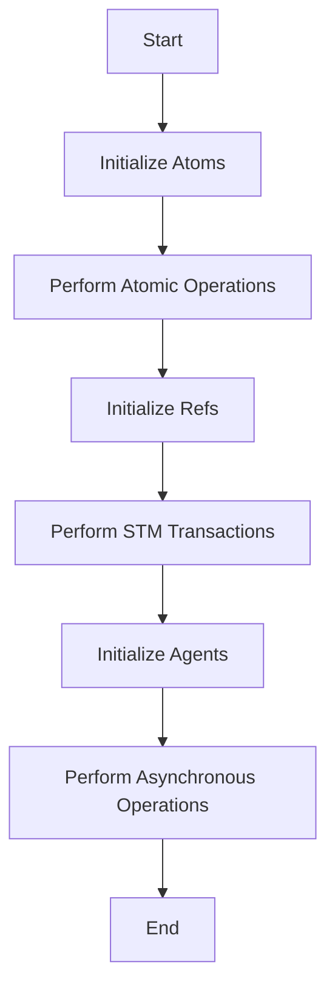

## 9.7. Designing for Performance and Scalability

In today's fast-paced digital world, designing applications that are both performant and scalable is crucial. Clojure, with its functional programming paradigm and emphasis on immutability, offers unique advantages in building such systems. This section delves into the principles and practices that can help you design Clojure applications that excel in performance and scalability, particularly in concurrent environments.

### Principles of Scalable System Design

Scalability is the ability of a system to handle increased load without compromising performance. Here are some key principles to consider:

1. **Decouple Components**: Design your system in a way that allows components to operate independently. This reduces dependencies and makes it easier to scale individual parts.

2. **Leverage Concurrency**: Utilize Clojure's concurrency primitives like atoms, refs, and agents to manage state changes efficiently across multiple threads.

3. **Optimize for Latency and Throughput**: Focus on reducing response times and increasing the number of requests your system can handle simultaneously.

4. **Use Asynchronous Processing**: Offload tasks that can be processed in the background to improve responsiveness and throughput.

5. **Design for Failure**: Implement strategies to handle failures gracefully, ensuring that your system remains robust under stress.

### Immutability and Pure Functions

Immutability and pure functions are foundational concepts in Clojure that contribute significantly to performance and scalability:

- **Immutability**: By default, data structures in Clojure are immutable. This means once a data structure is created, it cannot be changed. Immutability simplifies reasoning about code and eliminates issues related to shared mutable state, which is a common source of bugs in concurrent programming.

- **Pure Functions**: Functions that always produce the same output for the same input and have no side effects are called pure functions. They are easier to test, debug, and parallelize, making them ideal for scalable systems.

#### Code Example: Immutability and Pure Functions

```clojure
(defn add [x y]
  (+ x y)) ; Pure function: no side effects, same output for same inputs

(defn update-user [user new-email]
  (assoc user :email new-email)) ; Returns a new user map with updated email
```

### Avoiding Contention and Bottlenecks

Contention occurs when multiple threads compete for the same resources, leading to performance degradation. Here are some strategies to avoid contention:

- **Minimize Shared State**: Use local variables and function arguments instead of global state whenever possible.

- **Use Concurrency Primitives**: Clojure provides atoms, refs, and agents to manage shared state safely. Choose the right primitive based on your use case.

- **Optimize Critical Sections**: Identify and optimize parts of your code that are frequently accessed by multiple threads.

#### Code Example: Using Atoms to Manage State

```clojure
(def counter (atom 0))

(defn increment-counter []
  (swap! counter inc)) ; Atomically increments the counter
```

### Efficient Data Structures and Algorithms

Choosing the right data structures and algorithms is crucial for performance:

- **Persistent Data Structures**: Clojure's persistent data structures provide efficient ways to create modified versions of data without copying the entire structure.

- **Transients**: For performance-critical sections, use transients to perform temporary mutable operations on persistent data structures.

- **Algorithm Complexity**: Always consider the time and space complexity of your algorithms. Opt for algorithms that scale well with input size.

#### Code Example: Using Transients for Performance

```clojure
(defn build-large-vector []
  (persistent!
    (loop [v (transient []) i 0]
      (if (< i 1000000)
        (recur (conj! v i) (inc i))
        v)))) ; Efficiently builds a large vector using transients
```

### Scaling Applications with Concurrency Primitives

Clojure's concurrency primitives are powerful tools for building scalable applications:

- **Atoms**: Use atoms for managing independent, synchronous state changes.

- **Refs and Software Transactional Memory (STM)**: Use refs for coordinated state changes across multiple variables.

- **Agents**: Use agents for asynchronous state changes, ideal for tasks that can be processed in the background.

#### Code Example: Using Refs for Coordinated State Changes

```clojure
(def account-a (ref 1000))
(def account-b (ref 2000))

(defn transfer [amount]
  (dosync
    (alter account-a - amount)
    (alter account-b + amount))) ; Transfers amount from account-a to account-b
```

### Visualizing Concurrency in Clojure

To better understand how Clojure's concurrency primitives work together, let's visualize the process using a Mermaid.js diagram:



**Diagram Description**: This flowchart illustrates the sequence of initializing and using Clojure's concurrency primitives: atoms, refs, and agents, to manage state changes in a scalable application.

### Guidelines for Designing Scalable Clojure Applications

1. **Profile and Benchmark**: Regularly profile your application to identify bottlenecks and optimize them.

2. **Use Caching Wisely**: Implement caching strategies to reduce redundant computations and database calls.

3. **Load Balancing**: Distribute load evenly across servers to prevent any single point from becoming a bottleneck.

4. **Horizontal Scaling**: Design your application to scale horizontally by adding more nodes to handle increased load.

5. **Monitor and Optimize**: Continuously monitor performance metrics and optimize your application based on real-world usage patterns.

### Try It Yourself

Experiment with the provided code examples by modifying them to suit your needs. For instance, try changing the data structures or concurrency primitives used and observe the impact on performance.

### References and Further Reading

- [Clojure Official Documentation](https://clojure.org/reference)
- [Concurrency in Clojure](https://clojure.org/about/concurrent_programming)
- [Functional Programming Principles](https://www.manning.com/books/functional-programming-in-scala)

### Knowledge Check

To reinforce your understanding, let's test your knowledge with some questions.

## **Ready to Test Your Knowledge?**



### What is a key benefit of immutability in Clojure?

- [x] Simplifies reasoning about code
- [ ] Increases memory usage
- [ ] Requires more complex algorithms
- [ ] Reduces performance

> **Explanation:** Immutability simplifies reasoning about code by eliminating issues related to shared mutable state.

### Which concurrency primitive is best for asynchronous state changes?

- [ ] Atoms
- [ ] Refs
- [x] Agents
- [ ] Vars

> **Explanation:** Agents are designed for asynchronous state changes, allowing tasks to be processed in the background.

### What is the purpose of using transients in Clojure?

- [x] To perform temporary mutable operations for performance
- [ ] To create immutable data structures
- [ ] To manage asynchronous state changes
- [ ] To handle errors

> **Explanation:** Transients allow for temporary mutable operations on persistent data structures, improving performance.

### How can you avoid contention in a concurrent Clojure application?

- [x] Minimize shared state
- [ ] Use global variables
- [ ] Increase the number of threads
- [ ] Ignore critical sections

> **Explanation:** Minimizing shared state reduces the chances of contention among threads.

### What is the role of pure functions in scalable systems?

- [x] Easier to test and parallelize
- [ ] Increase complexity
- [ ] Require more memory
- [ ] Reduce code readability

> **Explanation:** Pure functions are easier to test, debug, and parallelize, making them ideal for scalable systems.

### Which data structure is used for coordinated state changes in Clojure?

- [ ] Atoms
- [x] Refs
- [ ] Agents
- [ ] Lists

> **Explanation:** Refs are used for coordinated state changes across multiple variables in Clojure.

### What is a key principle of scalable system design?

- [x] Decouple components
- [ ] Use monolithic architecture
- [ ] Increase code complexity
- [ ] Reduce server count

> **Explanation:** Decoupling components allows them to operate independently, facilitating scalability.

### How does Clojure handle shared state safely?

- [x] Using concurrency primitives like atoms, refs, and agents
- [ ] By using global variables
- [ ] Through mutable data structures
- [ ] By increasing thread count

> **Explanation:** Clojure uses concurrency primitives like atoms, refs, and agents to manage shared state safely.

### What is the benefit of using persistent data structures in Clojure?

- [x] Efficiently create modified versions without copying
- [ ] Increase memory usage
- [ ] Require complex algorithms
- [ ] Reduce code readability

> **Explanation:** Persistent data structures allow for efficient creation of modified versions without copying the entire structure.

### True or False: Horizontal scaling involves adding more nodes to handle increased load.

- [x] True
- [ ] False

> **Explanation:** Horizontal scaling involves adding more nodes to distribute load and handle increased demand.



Remember, designing for performance and scalability is an ongoing process. Keep experimenting, stay curious, and enjoy the journey of building robust Clojure applications!
