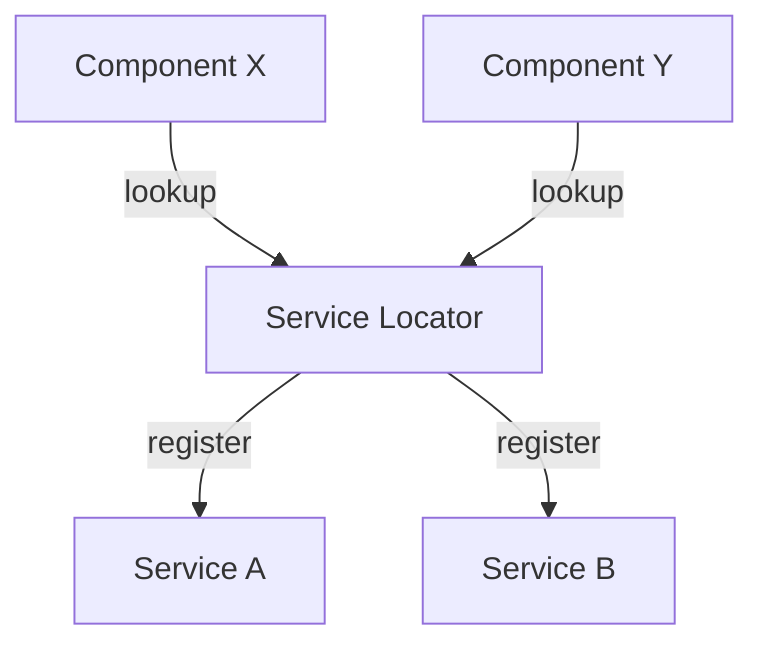

## 9.8 Service Locator in Clojure

In the realm of software design patterns, the Service Locator pattern stands out as a mechanism to manage dependencies by providing a centralized registry for service instances. This pattern is particularly useful in scenarios where Dependency Injection is not feasible, offering a way for components to locate and interact with required services without tight coupling. However, it comes with its own set of challenges and should be used judiciously to avoid hidden dependencies and reduced code clarity.

### Introduction

The Service Locator pattern is a design pattern used to decouple the logic of service retrieval from the components that use those services. It acts as a registry that holds references to various services, allowing components to request services by name or key. This pattern can simplify access to shared services across an application, but it also has potential drawbacks, such as hidden dependencies and difficulties in testing.

### Detailed Explanation

#### Conceptual Diagram

To better understand the Service Locator pattern, let's visualize its structure and interactions:



In this diagram, the Service Locator acts as a central hub where services are registered and from which components can retrieve these services.

#### Implementing a Simple Service Locator in Clojure

Let's dive into a practical implementation of the Service Locator pattern in Clojure.

1. **Define the Service Registry:**

   We'll use an atom to store our service registry, which will hold key-service pairs.

   ```clojure
   (def service-registry (atom {}))
   ```

2. **Register Services:**

   The `register-service` function allows us to add services to the registry.

   ```clojure
   (defn register-service [key service]
     (swap! service-registry assoc key service))
   ```

3. **Lookup Services:**

   The `get-service` function retrieves services from the registry by their key.

   ```clojure
   (defn get-service [key]
     (get @service-registry key))
   ```

4. **Example Usage:**

   Here's how you might register and access services within your application:

   ```clojure
   ;; Register services at application startup
   (register-service :database (create-database-connection db-config))
   (register-service :email-service (create-email-service smtp-config))

   ;; Access services within components
   (defn send-notification [user message]
     (let [email-service (get-service :email-service)]
       (send-email email-service (:email user) message)))
   ```

### Advantages and Disadvantages

#### Advantages

- **Simplified Access:** The Service Locator pattern simplifies access to shared services across the application, reducing the need to pass dependencies through multiple layers.
- **Centralized Management:** It provides a single point of management for service instances, making it easier to configure and maintain services.

#### Disadvantages

- **Hidden Dependencies:** Overuse of the Service Locator can lead to hidden dependencies, making the codebase harder to understand and maintain.
- **Testing Challenges:** It can complicate testing, as services are not explicitly passed to components, making it difficult to mock or replace them in tests.
- **Reduced Clarity:** Compared to Dependency Injection, the Service Locator pattern is less explicit, potentially reducing code clarity.

### Best Practices

- **Limit Usage:** Use the Service Locator pattern sparingly, only in scenarios where it significantly simplifies the architecture.
- **Document Services:** Clearly document the services registered in the locator and their intended usage to avoid confusion.
- **Consider Alternatives:** Evaluate alternatives like Dependency Injection or explicitly passing dependencies, which can offer more clarity and testability.

### Use Cases

The Service Locator pattern is best suited for applications where:

- **Dynamic Service Resolution:** Services need to be resolved dynamically at runtime.
- **Legacy Systems:** Integrating with legacy systems where Dependency Injection is not feasible.
- **Simplified Architecture:** The architecture benefits from a centralized service registry to reduce complexity.

### Conclusion

The Service Locator pattern in Clojure provides a powerful tool for managing service dependencies in a centralized manner. While it offers advantages in terms of simplified access and centralized management, it also requires careful consideration to avoid pitfalls like hidden dependencies and testing difficulties. By adhering to best practices and understanding its appropriate use cases, developers can leverage the Service Locator pattern to enhance their application's architecture.

## Quiz Time!



### What is the primary purpose of the Service Locator pattern?

- [x] To provide a centralized registry for service instances.
- [ ] To enforce strict type checking in service interactions.
- [ ] To replace all instances of Dependency Injection.
- [ ] To manage user authentication and authorization.

> **Explanation:** The Service Locator pattern provides a centralized registry for service instances, allowing components to locate and interact with required services without tight coupling.

### Which of the following is a disadvantage of the Service Locator pattern?

- [x] It can lead to hidden dependencies.
- [ ] It simplifies access to shared services.
- [ ] It centralizes service management.
- [ ] It enhances code clarity.

> **Explanation:** The Service Locator pattern can lead to hidden dependencies, making the codebase harder to understand and maintain.

### How does the Service Locator pattern affect testing?

- [x] It can complicate testing by making it difficult to mock or replace services.
- [ ] It simplifies testing by providing a single point of service access.
- [ ] It has no impact on testing.
- [ ] It eliminates the need for unit tests.

> **Explanation:** The Service Locator pattern can complicate testing because services are not explicitly passed to components, making it difficult to mock or replace them in tests.

### In which scenario is the Service Locator pattern most appropriate?

- [x] When services need to be resolved dynamically at runtime.
- [ ] When strict compile-time type checking is required.
- [ ] When all dependencies are known at compile time.
- [ ] When there is no need for service management.

> **Explanation:** The Service Locator pattern is most appropriate when services need to be resolved dynamically at runtime.

### What is a best practice when using the Service Locator pattern?

- [x] Clearly document the services registered in the locator.
- [ ] Use it as the primary method for dependency management.
- [ ] Avoid documenting services to reduce overhead.
- [ ] Use it to replace all instances of Dependency Injection.

> **Explanation:** A best practice when using the Service Locator pattern is to clearly document the services registered in the locator to avoid confusion.

### What is a potential alternative to the Service Locator pattern?

- [x] Dependency Injection
- [ ] Singleton Pattern
- [ ] Factory Pattern
- [ ] Observer Pattern

> **Explanation:** Dependency Injection is a potential alternative to the Service Locator pattern, offering more clarity and testability.

### How can thread safety be ensured when using a Service Locator in Clojure?

- [x] Use synchronized access when modifying or reading the registry.
- [ ] Avoid using atoms for the service registry.
- [ ] Use global variables for service storage.
- [ ] Ignore thread safety concerns.

> **Explanation:** To ensure thread safety when using a Service Locator in Clojure, use synchronized access when modifying or reading the registry.

### What is a key benefit of the Service Locator pattern?

- [x] It simplifies access to shared services across the application.
- [ ] It enforces strict compile-time type checking.
- [ ] It eliminates the need for service management.
- [ ] It reduces the need for documentation.

> **Explanation:** A key benefit of the Service Locator pattern is that it simplifies access to shared services across the application.

### Which of the following is NOT a characteristic of the Service Locator pattern?

- [x] It enforces strict compile-time type checking.
- [ ] It provides a centralized registry for service instances.
- [ ] It can lead to hidden dependencies.
- [ ] It centralizes service management.

> **Explanation:** The Service Locator pattern does not enforce strict compile-time type checking; it provides a centralized registry for service instances.

### True or False: The Service Locator pattern is always the best choice for managing dependencies.

- [ ] True
- [x] False

> **Explanation:** False. The Service Locator pattern is not always the best choice for managing dependencies; it should be used judiciously and in scenarios where it significantly simplifies the architecture.


