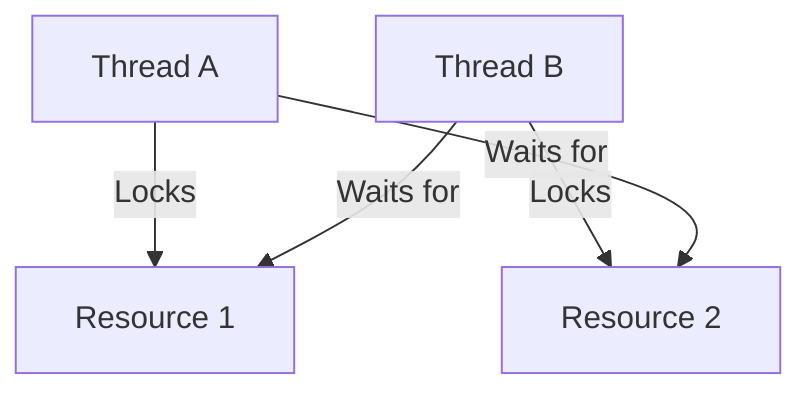
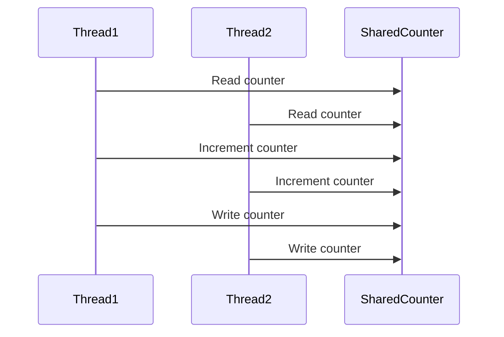

## 9.8. Avoiding Deadlocks and Race Conditions

Concurrency is a powerful tool in modern software development, allowing programs to perform multiple tasks simultaneously. However, it also introduces complexities such as deadlocks and race conditions, which can lead to unpredictable behavior and difficult-to-debug errors. In this section, we will explore these concurrency issues, understand their causes, and learn how Clojure's concurrency model can help mitigate them. We will also provide practical examples and best practices for avoiding these pitfalls in your Clojure applications.

### Understanding Deadlocks and Race Conditions

#### What is a Deadlock?

A deadlock occurs when two or more threads are unable to proceed because each is waiting for the other to release a resource. This situation results in a standstill where no progress can be made. Deadlocks are often caused by improper ordering of resource acquisition, leading to a circular wait condition.

**Example of a Deadlock:**

Consider two threads, A and B, and two resources, R1 and R2. If thread A locks R1 and waits for R2, while thread B locks R2 and waits for R1, neither thread can proceed, resulting in a deadlock.

#### What is a Race Condition?

A race condition occurs when the outcome of a program depends on the relative timing of events, such as the order in which threads execute. This can lead to inconsistent or incorrect results, especially when multiple threads access shared data without proper synchronization.

**Example of a Race Condition:**

Imagine two threads incrementing a shared counter variable. Without synchronization, both threads might read the same initial value, increment it, and write back the same result, effectively losing one increment operation.

### Clojure's Concurrency Model

Clojure is designed with concurrency in mind, offering a robust model that helps mitigate issues like deadlocks and race conditions. Let's explore how Clojure's features contribute to safer concurrent programming.

#### Immutable Data Structures

Clojure's core philosophy revolves around immutability. Immutable data structures eliminate the need for locks when accessing shared data, as they cannot be modified once created. This reduces the risk of race conditions, as concurrent reads do not interfere with each other.

#### Concurrency Primitives

Clojure provides several concurrency primitives that help manage shared state safely:

- **Atoms**: Provide a way to manage shared, synchronous, independent state. They ensure atomic updates using compare-and-swap (CAS) operations.
- **Refs**: Used for coordinated, synchronous updates to multiple pieces of state. They leverage Software Transactional Memory (STM) to ensure consistency.
- **Agents**: Facilitate asynchronous updates to state, allowing changes to be applied in the background.

#### Avoiding Deadlocks with STM

Clojure's STM system helps avoid deadlocks by ensuring that transactions are retried automatically if they conflict. This eliminates the need for explicit locks and reduces the likelihood of circular wait conditions.

### Practical Examples and Best Practices

#### Example: Avoiding Deadlocks with Refs

Let's consider a scenario where we need to transfer money between two accounts. Using Clojure's refs, we can ensure that the transfer is atomic and free from deadlocks.

```clojure
(def account-a (ref 1000))
(def account-b (ref 2000))

(defn transfer [from to amount]
  (dosync
    (alter from - amount)
    (alter to + amount)))

;; Transfer $100 from account-a to account-b
(transfer account-a account-b 100)
```

In this example, the `dosync` block ensures that both account updates occur atomically. If any part of the transaction fails, it will be retried, preventing deadlocks.

#### Example: Avoiding Race Conditions with Atoms

Atoms are ideal for managing independent state updates. Let's see how they can be used to safely increment a counter.

```clojure
(def counter (atom 0))

(defn increment-counter []
  (swap! counter inc))

;; Increment the counter concurrently
(doseq [_ (range 100)]
  (future (increment-counter)))

;; Wait for all futures to complete
(Thread/sleep 1000)

(println @counter) ;; Expected output: 100
```

The `swap!` function ensures that the counter is incremented atomically, avoiding race conditions.

### Minimizing Mutable Shared State

One of the best practices in concurrent programming is to minimize mutable shared state. By reducing the amount of shared data, you decrease the chances of race conditions and deadlocks. Clojure's emphasis on immutability naturally encourages this practice.

#### Using Local State

Whenever possible, use local state within functions. This confines the state to a single thread, eliminating the need for synchronization.

```clojure
(defn process-data [data]
  (let [local-state (atom 0)]
    ;; Perform operations on local-state
    ))
```

### Proper Synchronization Techniques

When shared state is necessary, ensure proper synchronization using Clojure's concurrency primitives. Avoid low-level synchronization mechanisms like locks, which are more error-prone.

#### Example: Using Agents for Asynchronous Updates

Agents are useful for managing state that can be updated asynchronously. They allow you to offload work to a separate thread, reducing contention.

```clojure
(def agent-state (agent 0))

(defn update-agent [value]
  (send agent-state + value))

;; Update the agent state asynchronously
(update-agent 10)
(update-agent 20)

;; Wait for all updates to complete
(await agent-state)

(println @agent-state) ;; Expected output: 30
```

### Tools and Techniques for Detecting Concurrency Problems

Detecting and debugging concurrency issues can be challenging. Here are some tools and techniques to help:

- **Logging**: Use logging to trace the execution flow and identify potential deadlocks or race conditions.
- **Profilers**: Tools like VisualVM can help identify thread contention and deadlocks.
- **Testing**: Write tests that simulate concurrent access to shared resources. Use libraries like `test.check` for property-based testing.

### Visualizing Concurrency Issues

To better understand how deadlocks and race conditions occur, let's visualize these concepts using Mermaid.js diagrams.

#### Deadlock Visualization



**Caption**: This diagram illustrates a deadlock scenario where Thread A and Thread B are waiting for each other's resources, resulting in a circular wait.

#### Race Condition Visualization



**Caption**: This sequence diagram shows a race condition where two threads read and write to a shared counter without synchronization, leading to inconsistent results.

### Conclusion

Avoiding deadlocks and race conditions is crucial for building robust concurrent applications. By leveraging Clojure's concurrency model, including immutable data structures and powerful concurrency primitives, you can minimize these issues. Remember to minimize mutable shared state, use proper synchronization techniques, and employ tools for detecting concurrency problems. As you continue your journey with Clojure, keep experimenting and refining your approach to concurrency.

## **Ready to Test Your Knowledge?**



### What is a deadlock?

- [x] A situation where two or more threads are unable to proceed because each is waiting for the other to release a resource.
- [ ] A condition where a program runs indefinitely without producing a result.
- [ ] A scenario where multiple threads access shared data without synchronization.
- [ ] A type of error that occurs during compilation.

> **Explanation:** A deadlock occurs when threads are stuck waiting for each other, leading to a standstill.

### How does Clojure's STM help avoid deadlocks?

- [x] By automatically retrying transactions that conflict.
- [ ] By using locks to manage resource access.
- [ ] By preventing threads from accessing shared data.
- [ ] By using a single-threaded execution model.

> **Explanation:** Clojure's STM automatically retries conflicting transactions, reducing the likelihood of deadlocks.

### What is a race condition?

- [x] A situation where the outcome of a program depends on the relative timing of events.
- [ ] A condition where a program runs slower than expected.
- [ ] A scenario where a program crashes due to memory overflow.
- [ ] A type of error that occurs during compilation.

> **Explanation:** Race conditions occur when the timing of events affects the program's outcome, often due to unsynchronized access to shared data.

### Which Clojure primitive is best for managing independent state updates?

- [x] Atoms
- [ ] Refs
- [ ] Agents
- [ ] Vars

> **Explanation:** Atoms are ideal for managing independent state updates using atomic operations.

### What is the primary benefit of immutable data structures in concurrency?

- [x] They eliminate the need for locks when accessing shared data.
- [ ] They allow for faster data processing.
- [ ] They reduce memory usage.
- [ ] They simplify code syntax.

> **Explanation:** Immutable data structures cannot be modified, eliminating the need for locks and reducing race conditions.

### How can logging help in detecting concurrency issues?

- [x] By tracing the execution flow and identifying potential deadlocks or race conditions.
- [ ] By speeding up the execution of concurrent programs.
- [ ] By reducing the memory footprint of the application.
- [ ] By simplifying the codebase.

> **Explanation:** Logging provides insights into the execution flow, helping identify concurrency issues.

### Which tool can help identify thread contention and deadlocks?

- [x] VisualVM
- [ ] Leiningen
- [ ] ClojureScript
- [ ] Ring

> **Explanation:** VisualVM is a profiling tool that can help identify thread contention and deadlocks.

### What is the purpose of the `dosync` block in Clojure?

- [x] To ensure that multiple state updates occur atomically.
- [ ] To execute code asynchronously.
- [ ] To lock resources for exclusive access.
- [ ] To compile Clojure code into Java bytecode.

> **Explanation:** The `dosync` block ensures that multiple state updates occur atomically, preventing partial updates.

### How do agents facilitate asynchronous updates in Clojure?

- [x] By allowing changes to be applied in the background.
- [ ] By locking resources for exclusive access.
- [ ] By executing code in a single-threaded manner.
- [ ] By preventing access to shared data.

> **Explanation:** Agents allow state changes to be applied asynchronously in the background, reducing contention.

### True or False: Minimizing mutable shared state decreases the chances of race conditions and deadlocks.

- [x] True
- [ ] False

> **Explanation:** Minimizing mutable shared state reduces the need for synchronization, decreasing the chances of race conditions and deadlocks.


