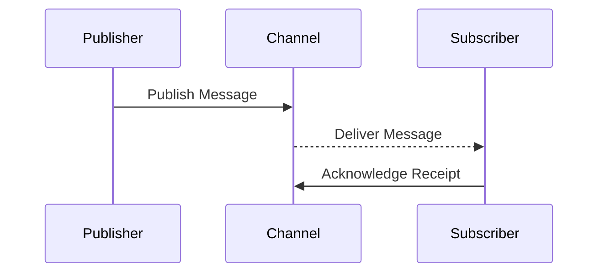

## 9.9. Patterns in Asynchronous Programming

Asynchronous programming is a cornerstone of modern software development, enabling applications to perform multiple tasks concurrently without blocking the main execution thread. In Clojure, asynchronous programming is facilitated by a variety of patterns and libraries, most notably `core.async`. This section delves into the challenges of asynchronous programming and explores key patterns such as Reactive, Futures and Promises, and Publish/Subscribe (Pub/Sub), providing practical examples and best practices for writing maintainable asynchronous code.

### Understanding the Challenges of Asynchronous Programming

Asynchronous programming introduces several challenges, including:

- **Complexity in Control Flow**: Managing the sequence of operations can become convoluted, especially when dealing with multiple asynchronous tasks.
- **Error Handling**: Errors in asynchronous code can be difficult to track and manage, as they may occur in different contexts or threads.
- **State Management**: Keeping track of state across asynchronous operations can lead to race conditions and inconsistent data.
- **Debugging Difficulties**: Asynchronous code can be harder to debug due to its non-linear execution flow.

Despite these challenges, asynchronous programming is essential for building responsive and efficient applications. Let's explore some common patterns that help manage these complexities in Clojure.

### Reactive Programming Pattern

Reactive programming is a paradigm that focuses on data streams and the propagation of change. In Clojure, reactive programming can be implemented using libraries like `core.async` and `manifold`.

#### Key Concepts

- **Data Streams**: Continuous flows of data that can be observed and manipulated.
- **Observers**: Functions or components that react to changes in data streams.
- **Backpressure**: A mechanism to handle situations where data producers are faster than consumers.

#### Example with `core.async`

```clojure
(require '[clojure.core.async :as async])

(defn reactive-example []
  (let [ch (async/chan)]
    (async/go
      (loop []
        (when-let [val (async/<! ch)]
          (println "Received:" val)
          (recur))))
    (async/go
      (doseq [i (range 5)]
        (async/>! ch i)
        (async/<! (async/timeout 1000))))))

(reactive-example)
```

In this example, we create a channel `ch` and two `go` blocks. The first block continuously listens for values on the channel and prints them. The second block sends values to the channel with a delay, simulating a data stream.

#### Advantages and Trade-offs

- **Advantages**: Reactive programming allows for a clean separation of concerns, making it easier to manage complex data flows.
- **Trade-offs**: It can introduce additional complexity in understanding and managing data streams and backpressure.

### Futures and Promises Pattern

Futures and promises are constructs that represent values that may not yet be available. They are useful for handling asynchronous computations that will eventually produce a result.

#### Key Concepts

- **Future**: A placeholder for a result that will be available at some point.
- **Promise**: A writable, single-assignment container that can be used to deliver a value or an error.

#### Example with Futures

```clojure
(defn future-example []
  (let [f (future (Thread/sleep 2000) "Hello, Future!")]
    (println "Doing other work...")
    (println "Future result:" @f)))

(future-example)
```

In this example, we create a future that sleeps for 2 seconds before returning a string. Meanwhile, the main thread continues executing other work. The result of the future is accessed using the `@` dereferencing operator.

#### Example with Promises

```clojure
(defn promise-example []
  (let [p (promise)]
    (future
      (Thread/sleep 2000)
      (deliver p "Hello, Promise!"))
    (println "Doing other work...")
    (println "Promise result:" @p)))

(promise-example)
```

Here, we create a promise and a future that delivers a value to the promise after a delay. The main thread can continue executing other tasks while waiting for the promise to be fulfilled.

#### Advantages and Trade-offs

- **Advantages**: Futures and promises provide a straightforward way to handle asynchronous computations and synchronize results.
- **Trade-offs**: They can lead to blocking operations if not managed carefully, especially when dereferencing futures.

### Publish/Subscribe (Pub/Sub) Pattern

The Pub/Sub pattern is a messaging paradigm where senders (publishers) do not send messages directly to receivers (subscribers). Instead, messages are published to channels, and subscribers receive messages from these channels.

#### Key Concepts

- **Publisher**: An entity that sends messages to a channel.
- **Subscriber**: An entity that receives messages from a channel.
- **Channel**: A medium through which messages are transmitted.

#### Example with `core.async`

```clojure
(defn pub-sub-example []
  (let [ch (async/chan)
        pub (async/pub ch :topic)]
    (async/sub pub :greetings (async/chan))
    (async/go
      (async/>! ch {:topic :greetings :msg "Hello, World!"}))
    (async/go
      (when-let [msg (async/<! (async/sub pub :greetings (async/chan)))]
        (println "Received message:" (:msg msg))))))

(pub-sub-example)
```

In this example, we create a channel `ch` and a publisher `pub` that categorizes messages by topic. We then subscribe to the `:greetings` topic and send a message to it.

#### Advantages and Trade-offs

- **Advantages**: Pub/Sub decouples senders and receivers, allowing for flexible and scalable communication.
- **Trade-offs**: It can introduce latency and complexity in managing subscriptions and message delivery.

### Best Practices for Asynchronous Programming

1. **Avoid Blocking Operations**: Use non-blocking constructs like channels and futures to prevent blocking the main thread.
2. **Handle Errors Gracefully**: Implement robust error handling to manage exceptions in asynchronous code.
3. **Manage State Carefully**: Use immutable data structures and concurrency primitives like atoms and refs to manage state safely.
4. **Test Thoroughly**: Write comprehensive tests to cover different scenarios and edge cases in asynchronous code.
5. **Document Code**: Clearly document the flow and purpose of asynchronous operations to aid understanding and maintenance.

### Visualizing Asynchronous Patterns

To better understand the flow of asynchronous operations, let's visualize the Pub/Sub pattern using a sequence diagram.



This diagram illustrates how a publisher sends a message to a channel, which then delivers it to a subscriber. The subscriber acknowledges receipt, completing the communication cycle.

### Try It Yourself

Experiment with the provided code examples by modifying the delay times, message contents, or adding additional channels and subscribers. Observe how these changes affect the flow and behavior of the asynchronous operations.

### References and Further Reading

- [Clojure Core.Async Documentation](https://clojure.github.io/core.async/)
- [Reactive Programming in Clojure](https://www.reactivemanifesto.org/)
- [Understanding Futures and Promises](https://en.wikipedia.org/wiki/Futures_and_promises)

### Knowledge Check

To reinforce your understanding of asynchronous programming patterns in Clojure, try answering the following questions.

## **Ready to Test Your Knowledge?**



### What is a key challenge of asynchronous programming?

- [x] Complexity in control flow
- [ ] Synchronous execution
- [ ] Lack of concurrency
- [ ] Limited scalability

> **Explanation:** Asynchronous programming often involves managing complex control flows due to its non-linear execution nature.

### Which Clojure library is commonly used for asynchronous programming?

- [x] core.async
- [ ] clojure.java.io
- [ ] clojure.string
- [ ] clojure.set

> **Explanation:** `core.async` is a Clojure library designed for asynchronous programming, providing constructs like channels and go blocks.

### What is the purpose of a promise in Clojure?

- [x] To represent a value that will be available in the future
- [ ] To block execution until a condition is met
- [ ] To handle synchronous computations
- [ ] To manage state across threads

> **Explanation:** A promise is a writable, single-assignment container that can be used to deliver a value or an error in the future.

### How does the Pub/Sub pattern decouple senders and receivers?

- [x] By using channels to transmit messages
- [ ] By directly connecting senders to receivers
- [ ] By using shared memory
- [ ] By blocking the main thread

> **Explanation:** The Pub/Sub pattern uses channels to transmit messages, allowing senders and receivers to operate independently.

### What is a common trade-off of using futures in Clojure?

- [x] Potential for blocking operations
- [ ] Increased complexity in synchronous code
- [ ] Lack of concurrency
- [ ] Reduced performance

> **Explanation:** Futures can lead to blocking operations if not managed carefully, especially when dereferencing them.

### Which pattern focuses on data streams and change propagation?

- [x] Reactive programming
- [ ] Pub/Sub
- [ ] Futures and Promises
- [ ] Singleton

> **Explanation:** Reactive programming focuses on data streams and the propagation of change, allowing components to react to data updates.

### What is a key advantage of the Pub/Sub pattern?

- [x] Decoupling of senders and receivers
- [ ] Direct communication between components
- [ ] Simplified error handling
- [ ] Synchronous message delivery

> **Explanation:** The Pub/Sub pattern decouples senders and receivers, allowing for flexible and scalable communication.

### How can you prevent blocking the main thread in asynchronous code?

- [x] Use non-blocking constructs like channels and futures
- [ ] Use blocking I/O operations
- [ ] Avoid using concurrency primitives
- [ ] Rely on synchronous execution

> **Explanation:** Non-blocking constructs like channels and futures help prevent blocking the main thread in asynchronous code.

### What is backpressure in reactive programming?

- [x] A mechanism to handle situations where data producers are faster than consumers
- [ ] A method for synchronous execution
- [ ] A technique for blocking operations
- [ ] A way to manage state across threads

> **Explanation:** Backpressure is a mechanism to handle situations where data producers are faster than consumers, ensuring smooth data flow.

### True or False: Asynchronous programming is only useful for web applications.

- [ ] True
- [x] False

> **Explanation:** Asynchronous programming is useful in various domains, including web applications, data processing, and real-time systems.



Remember, mastering asynchronous programming in Clojure is a journey. As you continue to explore and experiment with different patterns, you'll gain a deeper understanding of how to build efficient, responsive applications. Keep experimenting, stay curious, and enjoy the journey!
