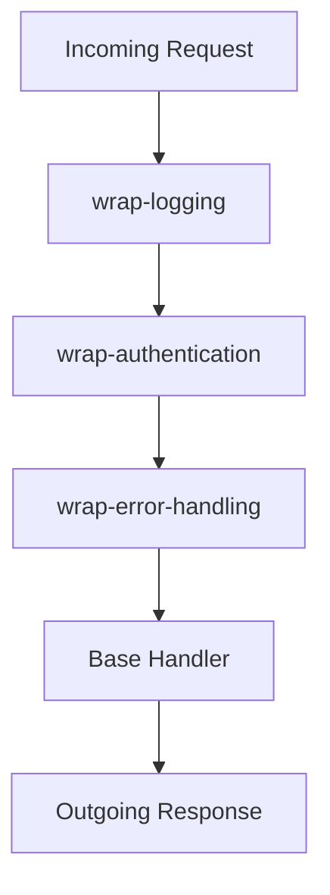

## 9.9 Middleware Pattern in Clojure

Middleware is a powerful design pattern that plays a crucial role in modern software architecture, particularly in web development. It allows developers to intercept and process requests or data as they pass through different layers of an application, enabling the separation of concerns such as logging, authentication, error handling, and more. In Clojure, middleware is commonly implemented as higher-order functions, especially in web frameworks like Ring.

### Understanding Middleware as Higher-Order Functions

In Clojure, middleware functions are higher-order functions that wrap a handler function to enhance or modify its behavior. This wrapping mechanism allows middleware to add functionality to the request-handling process without altering the core logic of the handler. The general form of a middleware function is:

```clojure
(defn wrap-middleware [handler]
  (fn [request]
    ;; Middleware logic here
    (handler request)))
```

This pattern is elegant and flexible, allowing developers to compose complex request-processing pipelines by chaining multiple middleware functions together.

### Implementing Common Middleware Functions

Let's explore some common middleware functions that are frequently used in web applications.

#### Logging Middleware

Logging middleware is used to record incoming requests and outgoing responses, which is invaluable for debugging and monitoring.

```clojure
(defn wrap-logging [handler]
  (fn [request]
    (println "Incoming request:" request)
    (let [response (handler request)]
      (println "Outgoing response:" response)
      response)))
```

#### Authentication Middleware

Authentication middleware checks whether a request is from an authenticated user. If not, it returns an unauthorized response.

```clojure
(defn wrap-authentication [handler]
  (fn [request]
    (if (authenticated? request)
      (handler request)
      {:status 401 :body "Unauthorized"})))
```

#### Error Handling Middleware

Error handling middleware catches exceptions that occur during request processing and returns a standardized error response.

```clojure
(defn wrap-error-handling [handler]
  (fn [request]
    (try
      (handler request)
      (catch Exception e
        (println "Error processing request:" (.getMessage e))
        {:status 500 :body "Internal Server Error"}))))
```

### Applying Middleware to Handlers

Middleware functions can be composed using the `->` macro, which threads the handler through each middleware function, wrapping it step by step.

```clojure
(def app-handler
  (-> base-handler
      wrap-logging
      wrap-authentication
      wrap-error-handling))
```

### Using Middleware in Web Applications

Middleware is a fundamental concept in web frameworks like Ring, which is widely used in Clojure web development.

#### With Ring Framework

Here's how you can use middleware with the Ring framework:

```clojure
(require '[ring.adapter.jetty :refer [run-jetty]])

(defn base-handler [request]
  {:status 200 :body "Hello, World!"})

(def app
  (-> base-handler
      wrap-logging
      wrap-authentication
      wrap-error-handling))

(run-jetty app {:port 3000})
```

#### With Pedestal or Other Frameworks

The principles of middleware apply to other frameworks like Pedestal, where middleware is used to enhance or modify request handling.

### Order of Middleware Matters

The sequence in which middleware is applied can significantly affect application behavior. For example, error handling should typically wrap as much of the stack as possible to catch exceptions from all layers.

### Creating Custom Middleware for Application-Specific Needs

Beyond the common middleware functions, you can implement custom middleware to address specific needs, such as:

- **Rate Limiting:** Control the number of requests a client can make in a given time period.
- **Content Negotiation:** Serve different content types based on client preferences.
- **Input Validation:** Ensure that incoming requests meet certain criteria before processing.

### Middleware Beyond Web Applications

While middleware is often associated with web applications, the pattern can be applied to any system where inputs and outputs are processed, such as data pipelines or message processing systems.

### Visualizing Middleware Flow

To better understand how middleware functions interact with each other and the handler, consider the following diagram:



This diagram illustrates the flow of a request through a series of middleware functions, each adding its own layer of processing before reaching the base handler.

### Advantages and Disadvantages

**Advantages:**
- **Separation of Concerns:** Middleware allows for clean separation of different aspects of request processing.
- **Reusability:** Middleware functions can be reused across different handlers and applications.
- **Composability:** Middleware can be composed in various ways to create flexible processing pipelines.

**Disadvantages:**
- **Complexity:** Managing the order and interaction of multiple middleware functions can become complex.
- **Performance Overhead:** Each middleware layer adds processing time, which can impact performance if not managed carefully.

### Best Practices

- **Keep Middleware Focused:** Each middleware function should have a single responsibility.
- **Mind the Order:** Carefully consider the order in which middleware is applied.
- **Test Thoroughly:** Ensure that middleware functions work correctly both individually and in combination.

### Comparisons with Other Patterns

Middleware is similar to the Decorator pattern in that both involve wrapping functionality to add behavior. However, middleware is typically used in the context of request processing, while decorators are more general-purpose.

### Conclusion

The middleware pattern is a versatile and powerful tool in Clojure, particularly for web development. By leveraging higher-order functions, developers can create clean, modular, and reusable components that enhance the functionality of their applications. Whether you're building a web service with Ring or processing data in a pipeline, understanding and applying middleware can greatly improve the structure and maintainability of your code.

## Quiz Time!



### What is the primary purpose of middleware in Clojure applications?

- [x] To intercept and process requests or data as they pass through different layers of an application.
- [ ] To directly modify the core logic of the application.
- [ ] To replace the need for a database in web applications.
- [ ] To serve as a replacement for all error handling mechanisms.

> **Explanation:** Middleware is used to intercept and process requests or data, allowing for separation of concerns such as logging, authentication, and error handling.

### How is middleware typically implemented in Clojure?

- [x] As higher-order functions.
- [ ] As macros.
- [ ] As Java classes.
- [ ] As standalone scripts.

> **Explanation:** Middleware in Clojure is commonly implemented as higher-order functions that wrap a handler function to enhance or modify its behavior.

### Which of the following is a common use case for middleware?

- [x] Logging requests and responses.
- [ ] Compiling Clojure code.
- [ ] Managing database migrations.
- [ ] Designing user interfaces.

> **Explanation:** Middleware is often used for logging requests and responses, among other tasks like authentication and error handling.

### What is the role of the `->` macro in applying middleware?

- [x] It threads the handler through each middleware function, wrapping it step by step.
- [ ] It compiles the middleware functions into a single executable.
- [ ] It replaces the need for middleware entirely.
- [ ] It serves as a debugging tool for middleware.

> **Explanation:** The `->` macro is used to thread the handler through each middleware function, effectively wrapping it in a sequence.

### Why does the order of middleware matter?

- [x] Because the sequence can affect application behavior and the handling of requests.
- [ ] Because middleware must be applied alphabetically.
- [ ] Because middleware functions are only executed in reverse order.
- [ ] Because middleware order determines the application's database schema.

> **Explanation:** The order of middleware matters because it can significantly affect how requests are processed and handled.

### What is a potential disadvantage of using middleware?

- [x] Complexity in managing the order and interaction of multiple middleware functions.
- [ ] Inability to handle HTTP requests.
- [ ] Lack of support for functional programming.
- [ ] Requirement to use only Java libraries.

> **Explanation:** Managing the order and interaction of multiple middleware functions can become complex, which is a potential disadvantage.

### Which of the following is NOT a typical middleware function?

- [ ] Logging
- [ ] Authentication
- [ ] Error Handling
- [x] Database Schema Design

> **Explanation:** Database schema design is not typically handled by middleware, which focuses on request processing tasks like logging, authentication, and error handling.

### Can middleware be used outside of web applications?

- [x] Yes, it can be applied to any system where inputs and outputs are processed.
- [ ] No, it is exclusive to web applications.
- [ ] Only if the application is written in Java.
- [ ] Only if the application uses a SQL database.

> **Explanation:** Middleware can be applied to any system where inputs and outputs are processed, not just web applications.

### What is a best practice when implementing middleware?

- [x] Keep each middleware function focused on a single responsibility.
- [ ] Combine all middleware functions into one large function.
- [ ] Avoid using middleware for error handling.
- [ ] Use middleware only for authentication.

> **Explanation:** A best practice is to keep each middleware function focused on a single responsibility to maintain clarity and modularity.

### True or False: Middleware functions in Clojure can be composed using the `->` macro.

- [x] True
- [ ] False

> **Explanation:** True. The `->` macro is used to compose middleware functions by threading the handler through each one.


