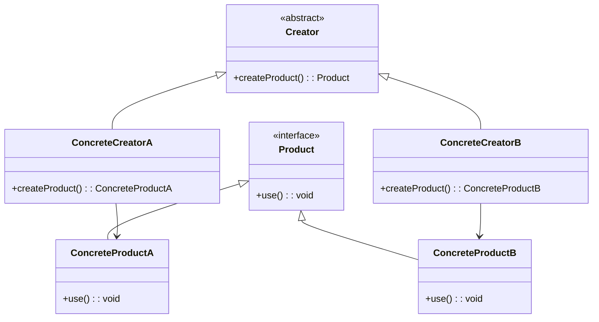

## 1.1 What Are Design Patterns?

In the realm of software engineering, design patterns are akin to blueprints that provide proven solutions to recurring design problems. They encapsulate best practices and facilitate the creation of robust, maintainable, and scalable software systems. As expert developers, understanding and applying design patterns in C++ can significantly enhance the quality of your codebase and streamline the development process.

### The Essence of Design Patterns

Design patterns are not about reinventing the wheel but about leveraging time-tested solutions to common problems. They offer a shared vocabulary for developers, enabling efficient communication and collaboration. By abstracting complex design issues, patterns allow us to focus on higher-level architecture rather than getting bogged down by implementation details.

#### Key Characteristics of Design Patterns

1. **Reusability**: Patterns provide solutions that can be reused across different projects and contexts, reducing redundancy and promoting efficiency.
2. **Modularity**: By encapsulating specific design challenges, patterns help in breaking down complex systems into manageable components.
3. **Scalability**: Patterns facilitate the design of systems that can grow and adapt to changing requirements.
4. **Maintainability**: With clear structure and separation of concerns, patterns make code easier to understand, modify, and extend.

### Historical Context and Evolution

The concept of design patterns was popularized by the seminal book "Design Patterns: Elements of Reusable Object-Oriented Software" by Erich Gamma, Richard Helm, Ralph Johnson, and John Vlissides, known as the "Gang of Four" (GoF). This book categorized patterns into three main types: creational, structural, and behavioral, each addressing different aspects of software design.

#### The Gang of Four's Influence

The GoF book laid the foundation for modern software design by formalizing the concept of design patterns. It introduced 23 classic patterns that have become the cornerstone of object-oriented design. These patterns have been adapted and extended over time to accommodate new programming paradigms and languages, including C++.

### The Role of Design Patterns in C++ Programming

C++ is a powerful, versatile language that supports multiple programming paradigms, including procedural, object-oriented, and generic programming. Design patterns in C++ leverage these paradigms to address specific design challenges, such as object creation, structural organization, and behavior management.

#### Leveraging C++ Features

C++ offers unique features that enhance the implementation of design patterns:

- **Templates**: Enable the creation of generic and reusable components.
- **Smart Pointers**: Facilitate memory management and resource handling.
- **Lambda Expressions**: Allow concise and flexible function definitions.
- **Concurrency Libraries**: Support multithreading and parallel execution.

### Types of Design Patterns

Design patterns are broadly categorized into three types, each serving a distinct purpose in software design:

1. **Creational Patterns**: Focus on object creation mechanisms, optimizing the instantiation process.
2. **Structural Patterns**: Concerned with the composition of classes and objects, ensuring efficient organization.
3. **Behavioral Patterns**: Address communication and interaction between objects, defining clear protocols for collaboration.

#### Creational Patterns

Creational patterns abstract the instantiation process, allowing for greater flexibility in object creation. They help manage object lifecycle and dependencies, ensuring that the system remains decoupled and adaptable.

- **Singleton Pattern**: Ensures a class has only one instance and provides a global point of access.
- **Factory Method Pattern**: Defines an interface for creating objects, allowing subclasses to alter the type of objects created.
- **Abstract Factory Pattern**: Provides an interface for creating families of related objects without specifying their concrete classes.

#### Structural Patterns

Structural patterns deal with the composition of classes and objects, facilitating the creation of complex structures while maintaining flexibility and efficiency.

- **Adapter Pattern**: Allows incompatible interfaces to work together by converting the interface of a class into another interface expected by clients.
- **Composite Pattern**: Composes objects into tree structures to represent part-whole hierarchies, enabling clients to treat individual objects and compositions uniformly.
- **Decorator Pattern**: Attaches additional responsibilities to an object dynamically, providing a flexible alternative to subclassing for extending functionality.

#### Behavioral Patterns

Behavioral patterns focus on the interaction and responsibility distribution among objects, ensuring that communication is efficient and well-defined.

- **Observer Pattern**: Defines a one-to-many dependency between objects, allowing multiple observers to listen for changes in a subject.
- **Strategy Pattern**: Enables selecting an algorithm's behavior at runtime, encapsulating each algorithm in a separate class.
- **Command Pattern**: Encapsulates a request as an object, allowing for parameterization and queuing of requests.

### Implementing Design Patterns in C++

Implementing design patterns in C++ involves leveraging the language's features to create efficient, reusable solutions. Let's explore some examples to illustrate how these patterns can be applied in practice.

#### Singleton Pattern Example

The Singleton pattern ensures that a class has only one instance and provides a global point of access to it. This is particularly useful for managing shared resources, such as configuration settings or logging mechanisms.

```cpp
#include <iostream>
#include <mutex>

class Singleton {
public:
    // Static method to access the singleton instance
    static Singleton& getInstance() {
        static Singleton instance; // Guaranteed to be destroyed.
        return instance;
    }

    // Delete copy constructor and assignment operator
    Singleton(const Singleton&) = delete;
    Singleton& operator=(const Singleton&) = delete;

    void showMessage() {
        std::cout << "Singleton Instance Accessed!" << std::endl;
    }

private:
    Singleton() {} // Private constructor
};

// Usage
int main() {
    Singleton& instance = Singleton::getInstance();
    instance.showMessage();
    return 0;
}
```

**Key Points**:
- The `getInstance` method ensures that only one instance of the `Singleton` class is created.
- The constructor is private, preventing direct instantiation.
- Copy constructor and assignment operator are deleted to prevent copying.

#### Factory Method Pattern Example

The Factory Method pattern defines an interface for creating objects, allowing subclasses to decide which class to instantiate. This pattern promotes loose coupling by delegating the instantiation process to subclasses.

```cpp
#include <iostream>
#include <memory>

// Product interface
class Product {
public:
    virtual void use() const = 0;
    virtual ~Product() = default;
};

// Concrete Product A
class ConcreteProductA : public Product {
public:
    void use() const override {
        std::cout << "Using ConcreteProductA" << std::endl;
    }
};

// Concrete Product B
class ConcreteProductB : public Product {
public:
    void use() const override {
        std::cout << "Using ConcreteProductB" << std::endl;
    }
};

// Creator class
class Creator {
public:
    virtual std::unique_ptr<Product> createProduct() const = 0;
    virtual ~Creator() = default;
};

// Concrete Creator A
class ConcreteCreatorA : public Creator {
public:
    std::unique_ptr<Product> createProduct() const override {
        return std::make_unique<ConcreteProductA>();
    }
};

// Concrete Creator B
class ConcreteCreatorB : public Creator {
public:
    std::unique_ptr<Product> createProduct() const override {
        return std::make_unique<ConcreteProductB>();
    }
};

// Usage
int main() {
    std::unique_ptr<Creator> creatorA = std::make_unique<ConcreteCreatorA>();
    std::unique_ptr<Product> productA = creatorA->createProduct();
    productA->use();

    std::unique_ptr<Creator> creatorB = std::make_unique<ConcreteCreatorB>();
    std::unique_ptr<Product> productB = creatorB->createProduct();
    productB->use();

    return 0;
}
```

**Key Points**:
- The `Creator` class defines a factory method `createProduct`.
- Subclasses `ConcreteCreatorA` and `ConcreteCreatorB` override this method to instantiate specific products.
- This pattern promotes flexibility and scalability by allowing new product types to be added without modifying existing code.

### Visualizing Design Patterns

To better understand the relationships and interactions within design patterns, let's visualize the Factory Method pattern using a class diagram.



**Diagram Description**: The class diagram illustrates the Factory Method pattern, showing the relationships between the `Creator`, `ConcreteCreatorA`, `ConcreteCreatorB`, `Product`, `ConcreteProductA`, and `ConcreteProductB` classes. The `Creator` class defines the factory method, which is overridden by concrete creators to instantiate specific products.

### Try It Yourself

Experiment with the provided code examples by modifying the product classes or adding new creators. Consider how the design pattern facilitates the addition of new product types without altering existing code. This hands-on approach will deepen your understanding of the pattern's flexibility and scalability.

### Knowledge Check

Before we move on, let's reinforce our understanding of design patterns with a few questions:

1. What are the main benefits of using design patterns in software development?
2. How do creational patterns differ from structural and behavioral patterns?
3. Can you identify a real-world scenario where the Singleton pattern might be useful?
4. How does the Factory Method pattern promote loose coupling in software design?

### Embrace the Journey

Remember, mastering design patterns is a journey. As you continue to explore and apply these patterns, you'll develop a deeper understanding of software design principles and enhance your ability to create efficient, maintainable, and scalable systems. Keep experimenting, stay curious, and enjoy the journey!

### References and Further Reading

- [Design Patterns: Elements of Reusable Object-Oriented Software](https://en.wikipedia.org/wiki/Design_Patterns) by Erich Gamma, Richard Helm, Ralph Johnson, and John Vlissides
- [C++ Programming Language](https://en.cppreference.com/w/) - A comprehensive reference for C++ features and libraries
- [Modern C++ Design: Generic Programming and Design Patterns Applied](https://www.amazon.com/Modern-Design-Generic-Programming-Patterns/dp/0201704315) by Andrei Alexandrescu

## Quiz Time!



### What is the primary purpose of design patterns in software development?

- [x] To provide reusable solutions to common design problems
- [ ] To increase the complexity of code
- [ ] To replace the need for documentation
- [ ] To enforce strict coding standards

> **Explanation:** Design patterns offer reusable solutions to common design problems, enhancing code quality and maintainability.

### Which book popularized the concept of design patterns?

- [x] "Design Patterns: Elements of Reusable Object-Oriented Software"
- [ ] "The Pragmatic Programmer"
- [ ] "Clean Code"
- [ ] "Introduction to Algorithms"

> **Explanation:** The book "Design Patterns: Elements of Reusable Object-Oriented Software" by the Gang of Four introduced and popularized design patterns.

### What are the three main categories of design patterns?

- [x] Creational, Structural, Behavioral
- [ ] Functional, Procedural, Object-Oriented
- [ ] Static, Dynamic, Hybrid
- [ ] Synchronous, Asynchronous, Concurrent

> **Explanation:** Design patterns are categorized into Creational, Structural, and Behavioral patterns, each addressing different aspects of software design.

### How does the Singleton pattern ensure a class has only one instance?

- [x] By providing a static method that returns a single instance
- [ ] By using multiple constructors
- [ ] By allowing multiple instances but tracking them
- [ ] By using inheritance

> **Explanation:** The Singleton pattern uses a static method to ensure only one instance of a class is created and accessible.

### What is the primary benefit of the Factory Method pattern?

- [x] It promotes loose coupling by delegating object creation to subclasses
- [ ] It ensures a class has only one instance
- [ ] It allows incompatible interfaces to work together
- [ ] It provides a unified interface to a set of interfaces

> **Explanation:** The Factory Method pattern promotes loose coupling by allowing subclasses to decide which class to instantiate.

### In the context of design patterns, what does "reusability" mean?

- [x] Solutions can be applied across different projects and contexts
- [ ] Code must be rewritten for each new project
- [ ] Patterns are specific to a single use case
- [ ] Patterns replace the need for testing

> **Explanation:** Reusability means that design patterns provide solutions that can be applied across various projects and contexts, reducing redundancy.

### Which C++ feature enhances the implementation of design patterns?

- [x] Templates
- [ ] Macros
- [ ] Global variables
- [ ] Goto statements

> **Explanation:** Templates in C++ enable the creation of generic and reusable components, enhancing the implementation of design patterns.

### What is the role of structural patterns in software design?

- [x] To facilitate the composition of classes and objects
- [ ] To manage object creation mechanisms
- [ ] To address communication between objects
- [ ] To enforce strict coding standards

> **Explanation:** Structural patterns are concerned with the composition of classes and objects, ensuring efficient organization.

### Which pattern allows incompatible interfaces to work together?

- [x] Adapter Pattern
- [ ] Singleton Pattern
- [ ] Observer Pattern
- [ ] Strategy Pattern

> **Explanation:** The Adapter Pattern allows incompatible interfaces to work together by converting one interface into another.

### True or False: Design patterns eliminate the need for documentation.

- [ ] True
- [x] False

> **Explanation:** Design patterns do not eliminate the need for documentation; they complement it by providing a shared vocabulary and structure for design solutions.


