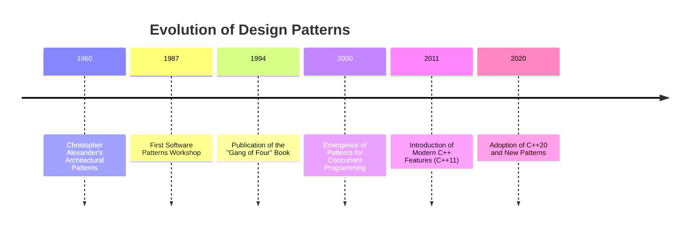

## 1.2 History and Evolution of Design Patterns

Design patterns have become an integral part of software engineering, offering reusable solutions to common problems in software design. The journey of design patterns is a fascinating tale that spans decades, involving the contributions of many brilliant minds. In this section, we will trace the origins and development of design patterns, focusing on their evolution and significance in modern C++ programming.

### The Origins of Design Patterns

The concept of design patterns in software engineering was inspired by the work of architect Christopher Alexander, who introduced the idea of patterns in the context of urban planning and building architecture. In his seminal work, "A Pattern Language," Alexander described a pattern as a solution to a problem in a context. This concept was later adapted by software engineers to address recurring problems in software design.

#### Christopher Alexander's Influence

Christopher Alexander's influence on design patterns cannot be overstated. His approach to architecture emphasized the importance of context and the relationships between different elements. This philosophy resonated with software engineers who sought to create more structured and maintainable code. Alexander's work laid the foundation for the pattern movement in software engineering, which sought to capture best practices in a formalized way.

### The Birth of Software Design Patterns

The formalization of design patterns in software engineering began in the late 1980s and early 1990s. A group of computer scientists and engineers, inspired by Alexander's work, started to document and share patterns that addressed common software design challenges. This movement gained momentum with the publication of the influential book "Design Patterns: Elements of Reusable Object-Oriented Software" by Erich Gamma, Richard Helm, Ralph Johnson, and John Vlissides, collectively known as the "Gang of Four" (GoF).

#### The "Gang of Four" Book

Published in 1994, the "Gang of Four" book was a groundbreaking work that introduced 23 design patterns for object-oriented software development. These patterns were categorized into three types: creational, structural, and behavioral. The book provided a common vocabulary for software designers and became a cornerstone of software engineering education.

**Key Contributions of the GoF Book:**

- **Standardization of Terminology:** The book established a standardized terminology for design patterns, making it easier for developers to communicate and collaborate.
- **Pattern Catalog:** It offered a catalog of 23 patterns, each with a clear description, applicability, and implementation guidelines.
- **Focus on Object-Oriented Design:** The patterns emphasized the principles of object-oriented design, such as encapsulation, inheritance, and polymorphism.

### The Evolution of Design Patterns

Since the publication of the GoF book, design patterns have evolved significantly. They have been adapted to new programming paradigms, languages, and technologies. Let's explore how design patterns have evolved over the years and their relevance in modern C++ programming.

#### Expansion Beyond Object-Oriented Programming

While the GoF book focused on object-oriented design, the concept of design patterns has expanded to include other programming paradigms, such as functional programming and concurrent programming. This expansion reflects the diversity of software development practices and the need for patterns that address different types of problems.

#### Integration with Modern C++ Features

The evolution of the C++ programming language has had a profound impact on the application of design patterns. Modern C++ features, such as templates, lambda expressions, and smart pointers, have enabled more efficient and expressive implementations of design patterns.

**Example: Singleton Pattern in Modern C++**

The Singleton pattern ensures that a class has only one instance and provides a global point of access to it. In modern C++, this pattern can be implemented using the `std::unique_ptr` and `std::call_once` features to ensure thread safety and efficient resource management.

```cpp
#include <memory>
#include <mutex>

class Singleton {
public:
    static Singleton& getInstance() {
        std::call_once(initInstanceFlag, &Singleton::initSingleton);
        return *instance;
    }

    // Other non-static member functions

private:
    Singleton() = default;
    ~Singleton() = default;
    Singleton(const Singleton&) = delete;
    Singleton& operator=(const Singleton&) = delete;

    static void initSingleton() {
        instance.reset(new Singleton);
    }

    static std::unique_ptr<Singleton> instance;
    static std::once_flag initInstanceFlag;
};

std::unique_ptr<Singleton> Singleton::instance;
std::once_flag Singleton::initInstanceFlag;
```

#### Patterns for Concurrency and Parallelism

With the rise of multi-core processors and the need for concurrent programming, new patterns have emerged to address the challenges of parallelism. Patterns such as the Active Object, Monitor Object, and Reactor patterns provide solutions for managing concurrency in software systems.

**Example: Active Object Pattern**

The Active Object pattern decouples method execution from method invocation to enhance concurrency. It involves the use of a scheduler to manage requests and execute methods asynchronously.

```cpp
#include <iostream>
#include <thread>
#include <queue>
#include <mutex>
#include <condition_variable>
#include <functional>

class ActiveObject {
public:
    ActiveObject() : done(false) {
        worker = std::thread(&ActiveObject::processTasks, this);
    }

    ~ActiveObject() {
        {
            std::lock_guard<std::mutex> lock(mtx);
            done = true;
        }
        cv.notify_all();
        worker.join();
    }

    void enqueueTask(std::function<void()> task) {
        {
            std::lock_guard<std::mutex> lock(mtx);
            tasks.push(task);
        }
        cv.notify_one();
    }

private:
    void processTasks() {
        while (true) {
            std::function<void()> task;
            {
                std::unique_lock<std::mutex> lock(mtx);
                cv.wait(lock, [this]{ return !tasks.empty() || done; });
                if (done && tasks.empty()) break;
                task = tasks.front();
                tasks.pop();
            }
            task();
        }
    }

    std::thread worker;
    std::queue<std::function<void()>> tasks;
    std::mutex mtx;
    std::condition_variable cv;
    bool done;
};

int main() {
    ActiveObject ao;
    ao.enqueueTask([]{ std::cout << "Task 1 executed\n"; });
    ao.enqueueTask([]{ std::cout << "Task 2 executed\n"; });
    std::this_thread::sleep_for(std::chrono::seconds(1));
    return 0;
}
```

### Visualizing the Evolution of Design Patterns

To better understand the evolution of design patterns, let's visualize the timeline and key milestones in their development.



### The Impact of Design Patterns on Software Engineering

Design patterns have had a profound impact on software engineering. They have provided a common language for developers, facilitated the sharing of best practices, and improved the quality and maintainability of software systems. Let's explore some of the key benefits and challenges associated with design patterns.

#### Benefits of Design Patterns

- **Reusability:** Design patterns promote code reuse by providing proven solutions to common problems.
- **Modularity:** Patterns encourage the separation of concerns, leading to more modular and maintainable code.
- **Communication:** A shared vocabulary of patterns enhances communication and collaboration among developers.
- **Scalability:** Patterns help design scalable systems by addressing architectural challenges.

#### Challenges and Criticisms

- **Overuse:** The inappropriate use of patterns can lead to overly complex designs.
- **Learning Curve:** Understanding and applying patterns requires a significant investment of time and effort.
- **Context Sensitivity:** Patterns must be adapted to the specific context of a problem, which can be challenging.

### The Future of Design Patterns

As software development continues to evolve, so too will design patterns. Emerging technologies, such as artificial intelligence, cloud computing, and the Internet of Things, present new challenges and opportunities for pattern development. The future of design patterns will likely involve the integration of these technologies and the creation of new patterns to address novel problems.

#### Patterns for Emerging Technologies

- **AI and Machine Learning:** Patterns for managing data pipelines, model training, and deployment.
- **Cloud Computing:** Patterns for microservices, serverless architectures, and distributed systems.
- **IoT:** Patterns for device management, data aggregation, and real-time processing.

### Conclusion

The history and evolution of design patterns is a testament to the ingenuity and collaboration of the software engineering community. From their origins in architectural design to their application in modern C++ programming, design patterns have transformed the way we approach software development. As we continue to face new challenges and opportunities, design patterns will remain a vital tool for creating robust, scalable, and maintainable software systems.

Remember, this is just the beginning. As you progress in your journey as a software engineer, you'll encounter new patterns and techniques that will enhance your skills and broaden your understanding of software design. Keep experimenting, stay curious, and enjoy the journey!

## Quiz Time!



### Who introduced the concept of patterns in the context of architecture?

- [x] Christopher Alexander
- [ ] Erich Gamma
- [ ] Richard Helm
- [ ] John Vlissides

> **Explanation:** Christopher Alexander introduced the concept of patterns in architecture, which later inspired software design patterns.


### What is the "Gang of Four" book known for?

- [x] Introducing 23 design patterns for object-oriented software
- [ ] Describing patterns for functional programming
- [ ] Providing a history of software engineering
- [ ] Discussing the evolution of programming languages

> **Explanation:** The "Gang of Four" book introduced 23 design patterns for object-oriented software, which became foundational in software engineering.


### Which C++ feature is used in the modern implementation of the Singleton pattern?

- [x] `std::unique_ptr`
- [ ] `std::vector`
- [ ] `std::map`
- [ ] `std::list`

> **Explanation:** The modern implementation of the Singleton pattern in C++ often uses `std::unique_ptr` for efficient resource management.


### What is the primary benefit of design patterns?

- [x] Reusability of code
- [ ] Increasing code complexity
- [ ] Reducing the need for documentation
- [ ] Eliminating the need for testing

> **Explanation:** Design patterns promote the reusability of code by providing proven solutions to common problems.


### Which pattern is used to decouple method execution from method invocation?

- [x] Active Object Pattern
- [ ] Singleton Pattern
- [ ] Factory Pattern
- [ ] Observer Pattern

> **Explanation:** The Active Object Pattern decouples method execution from method invocation to enhance concurrency.


### What is a challenge associated with design patterns?

- [x] Overuse can lead to complex designs
- [ ] They eliminate the need for testing
- [ ] They reduce the need for documentation
- [ ] They are only applicable to small projects

> **Explanation:** Overuse of design patterns can lead to overly complex designs, which is a common challenge.


### What is a key contribution of the "Gang of Four" book?

- [x] Standardization of terminology for design patterns
- [ ] Introduction of functional programming
- [ ] Development of the C++ language
- [ ] Creation of the first computer

> **Explanation:** The "Gang of Four" book standardized the terminology for design patterns, facilitating better communication among developers.


### Which modern C++ feature enhances the implementation of design patterns?

- [x] Lambda expressions
- [ ] Pointers
- [ ] Arrays
- [ ] Macros

> **Explanation:** Lambda expressions in modern C++ enhance the implementation of design patterns by providing more expressive and concise code.


### True or False: Design patterns are only applicable to object-oriented programming.

- [ ] True
- [x] False

> **Explanation:** Design patterns have expanded beyond object-oriented programming to include other paradigms, such as functional and concurrent programming.


### What is the future trend for design patterns?

- [x] Integration with emerging technologies like AI and cloud computing
- [ ] Elimination from software engineering
- [ ] Focus solely on desktop applications
- [ ] Restriction to academic use

> **Explanation:** The future trend for design patterns involves integration with emerging technologies like AI and cloud computing, addressing new challenges and opportunities.


