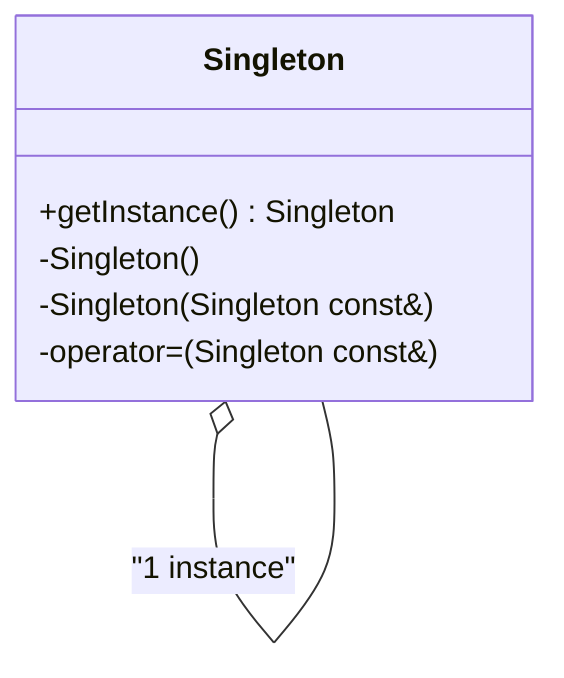
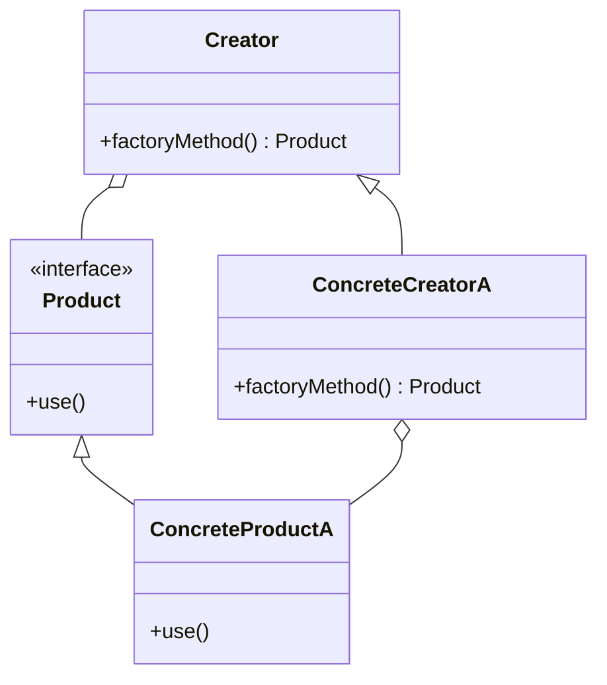

## 1.3 Importance of Design Patterns in C++ Programming

Design patterns are a cornerstone of software engineering, providing reusable solutions to common problems in software design. In the context of C++ programming, design patterns play a crucial role in creating robust, scalable, and maintainable applications. This section delves into the significance of design patterns in C++ development, exploring how they enhance code modularity, reusability, and maintainability, and how they fit into the broader landscape of software architecture.

### Understanding Design Patterns

Design patterns are established solutions to recurring design problems. They encapsulate best practices and provide a shared language for developers to communicate complex ideas succinctly. Design patterns are not about code reuse in the traditional sense but about reusing successful design strategies. They help in structuring code in a way that is both efficient and easy to understand.

### The Role of Design Patterns in C++ Development

C++ is a powerful language that offers a rich set of features, such as object-oriented programming, templates, and the Standard Template Library (STL). These features make C++ an ideal candidate for implementing design patterns. Let's explore how design patterns fit into C++ development:

1. **Enhancing Modularity and Reusability**: Design patterns promote modularity by encouraging the separation of concerns. This makes it easier to reuse code across different projects. For example, the Factory Pattern allows for the creation of objects without specifying the exact class of object that will be created, promoting loose coupling and enhancing reusability.

2. **Improving Maintainability**: By providing a clear structure and organization to the code, design patterns make it easier to maintain and extend software systems. The Observer Pattern, for instance, decouples the subject from its observers, allowing changes to either without affecting the other.

3. **Facilitating Communication**: Design patterns provide a common vocabulary for developers. When a developer mentions a "Singleton," others immediately understand the intent and structure of the solution, reducing the need for extensive documentation and discussion.

4. **Encouraging Best Practices**: Design patterns encapsulate best practices that have been refined over time. They guide developers in making design decisions that lead to efficient and effective software solutions.

### Key Design Patterns in C++ Programming

Let's explore some key design patterns and their relevance to C++ programming:

#### Singleton Pattern

**Intent**: Ensure a class has only one instance and provide a global point of access to it.

**C++ Implementation**:
```cpp
class Singleton {
public:
    static Singleton& getInstance() {
        static Singleton instance; // Guaranteed to be destroyed and instantiated on first use.
        return instance;
    }
    Singleton(Singleton const&) = delete;
    void operator=(Singleton const&) = delete;

private:
    Singleton() {}
};

// Usage
Singleton& singleton = Singleton::getInstance();
```

**Design Considerations**: The Singleton Pattern is useful when exactly one object is needed to coordinate actions across the system. However, it can introduce global state into an application, which can complicate testing and increase coupling.

#### Factory Method Pattern

**Intent**: Define an interface for creating an object, but let subclasses alter the type of objects that will be created.

**C++ Implementation**:
```cpp
class Product {
public:
    virtual void use() = 0;
};

class ConcreteProductA : public Product {
public:
    void use() override {
        std::cout << "Using ConcreteProductA" << std::endl;
    }
};

class Creator {
public:
    virtual Product* factoryMethod() = 0;
};

class ConcreteCreatorA : public Creator {
public:
    Product* factoryMethod() override {
        return new ConcreteProductA();
    }
};

// Usage
Creator* creator = new ConcreteCreatorA();
Product* product = creator->factoryMethod();
product->use();
delete product;
delete creator;
```

**Design Considerations**: The Factory Method Pattern promotes loose coupling by eliminating the need to bind application-specific classes into the code. It allows for greater flexibility in the types of objects that can be created.

#### Observer Pattern

**Intent**: Define a one-to-many dependency between objects so that when one object changes state, all its dependents are notified and updated automatically.

**C++ Implementation**:
```cpp
#include <iostream>
#include <vector>
#include <algorithm>

class Observer {
public:
    virtual void update() = 0;
};

class Subject {
    std::vector<Observer*> observers;
public:
    void attach(Observer* observer) {
        observers.push_back(observer);
    }
    void detach(Observer* observer) {
        observers.erase(std::remove(observers.begin(), observers.end(), observer), observers.end());
    }
    void notify() {
        for (Observer* observer : observers) {
            observer->update();
        }
    }
};

class ConcreteObserver : public Observer {
public:
    void update() override {
        std::cout << "Observer updated!" << std::endl;
    }
};

// Usage
Subject subject;
ConcreteObserver observer;
subject.attach(&observer);
subject.notify();
```

**Design Considerations**: The Observer Pattern is ideal for implementing distributed event-handling systems. It promotes loose coupling between the subject and observers, allowing either to change independently.

### Visualizing Design Patterns in C++

To better understand how design patterns fit into C++ programming, let's visualize the relationships between objects in some of these patterns using Mermaid.js diagrams.

#### Singleton Pattern Diagram



**Description**: This diagram illustrates the Singleton Pattern, where a single instance of the class is maintained, and access is provided through a static method.

#### Factory Method Pattern Diagram



**Description**: This diagram shows the Factory Method Pattern, highlighting the relationship between the creator and product classes, and how subclasses can define the type of product created.

### Applying Design Patterns in Real-World C++ Projects

Design patterns are not just theoretical constructs; they have practical applications in real-world C++ projects. Here are some scenarios where design patterns can be effectively applied:

1. **Game Development**: In game development, design patterns like the Observer Pattern are used to manage events and updates across different game components. The Singleton Pattern is often used for managing game states or configurations.

2. **GUI Applications**: The Model-View-Controller (MVC) architecture, which employs several design patterns, is commonly used in GUI applications to separate the user interface from the business logic.

3. **Embedded Systems**: In embedded systems, design patterns help manage resource constraints and improve code efficiency. The Strategy Pattern, for instance, can be used to switch between different algorithms based on runtime conditions.

4. **Networking and Distributed Systems**: Patterns like the Proxy Pattern and the Adapter Pattern are used to manage network communications and interface with different protocols.

### Try It Yourself

To deepen your understanding of design patterns in C++, try modifying the code examples provided:

- **Singleton Pattern**: Implement a thread-safe Singleton using `std::mutex` and `std::lock_guard`.
- **Factory Method Pattern**: Extend the Factory Method example to include additional product types and creators.
- **Observer Pattern**: Add more observers to the Observer Pattern example and implement a mechanism to notify only specific observers based on certain conditions.

### Knowledge Check

To reinforce your understanding of the importance of design patterns in C++ programming, consider the following questions:

1. How do design patterns enhance code modularity and reusability in C++?
2. What are the potential drawbacks of using the Singleton Pattern in a C++ application?
3. How does the Factory Method Pattern promote loose coupling in software design?
4. In what scenarios would the Observer Pattern be particularly useful in a C++ application?

### Embrace the Journey

Remember, mastering design patterns is a journey. As you continue to explore and apply these patterns in your C++ projects, you'll gain a deeper understanding of software design principles and improve your ability to create efficient, maintainable, and scalable applications. Keep experimenting, stay curious, and enjoy the journey!

## Quiz Time!



### How do design patterns enhance code modularity in C++?

- [x] By promoting separation of concerns
- [ ] By increasing code complexity
- [ ] By reducing code readability
- [ ] By enforcing strict coding standards

> **Explanation:** Design patterns promote separation of concerns, which enhances code modularity by allowing different parts of the code to be developed and maintained independently.

### What is a potential drawback of using the Singleton Pattern?

- [x] It can introduce global state
- [ ] It simplifies testing
- [ ] It reduces code coupling
- [ ] It enhances code readability

> **Explanation:** The Singleton Pattern can introduce global state into an application, which can complicate testing and increase coupling.

### How does the Factory Method Pattern promote loose coupling?

- [x] By defining an interface for creating objects
- [ ] By using global variables
- [ ] By enforcing strict inheritance
- [ ] By reducing the number of classes

> **Explanation:** The Factory Method Pattern promotes loose coupling by defining an interface for creating objects, allowing subclasses to alter the type of objects that will be created.

### In what scenario would the Observer Pattern be useful?

- [x] In event-driven systems
- [ ] In systems with no dependencies
- [ ] In systems with static configurations
- [ ] In systems with no user interaction

> **Explanation:** The Observer Pattern is particularly useful in event-driven systems where changes in one object need to be communicated to dependent objects.

### What is the primary benefit of using design patterns?

- [x] They provide reusable solutions to common problems
- [ ] They increase code complexity
- [ ] They enforce strict coding standards
- [ ] They reduce the need for documentation

> **Explanation:** The primary benefit of using design patterns is that they provide reusable solutions to common problems, improving code efficiency and maintainability.

### Which pattern is often used for managing game states?

- [x] Singleton Pattern
- [ ] Factory Method Pattern
- [ ] Observer Pattern
- [ ] Strategy Pattern

> **Explanation:** The Singleton Pattern is often used for managing game states or configurations in game development.

### What is a key feature of the Observer Pattern?

- [x] It defines a one-to-many dependency
- [ ] It reduces code readability
- [ ] It enforces strict inheritance
- [ ] It uses global variables

> **Explanation:** A key feature of the Observer Pattern is that it defines a one-to-many dependency between objects, allowing changes in one object to be communicated to dependent objects.

### How can the Factory Method Pattern be extended?

- [x] By adding additional product types and creators
- [ ] By reducing the number of classes
- [ ] By using global variables
- [ ] By enforcing strict inheritance

> **Explanation:** The Factory Method Pattern can be extended by adding additional product types and creators, providing greater flexibility in the types of objects that can be created.

### What is a common use case for the Proxy Pattern?

- [x] Managing network communications
- [ ] Simplifying user interfaces
- [ ] Reducing code readability
- [ ] Enforcing strict inheritance

> **Explanation:** A common use case for the Proxy Pattern is managing network communications and interfacing with different protocols.

### True or False: Design patterns are about reusing code in the traditional sense.

- [ ] True
- [x] False

> **Explanation:** Design patterns are not about code reuse in the traditional sense but about reusing successful design strategies to solve common problems.


