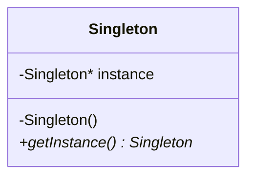
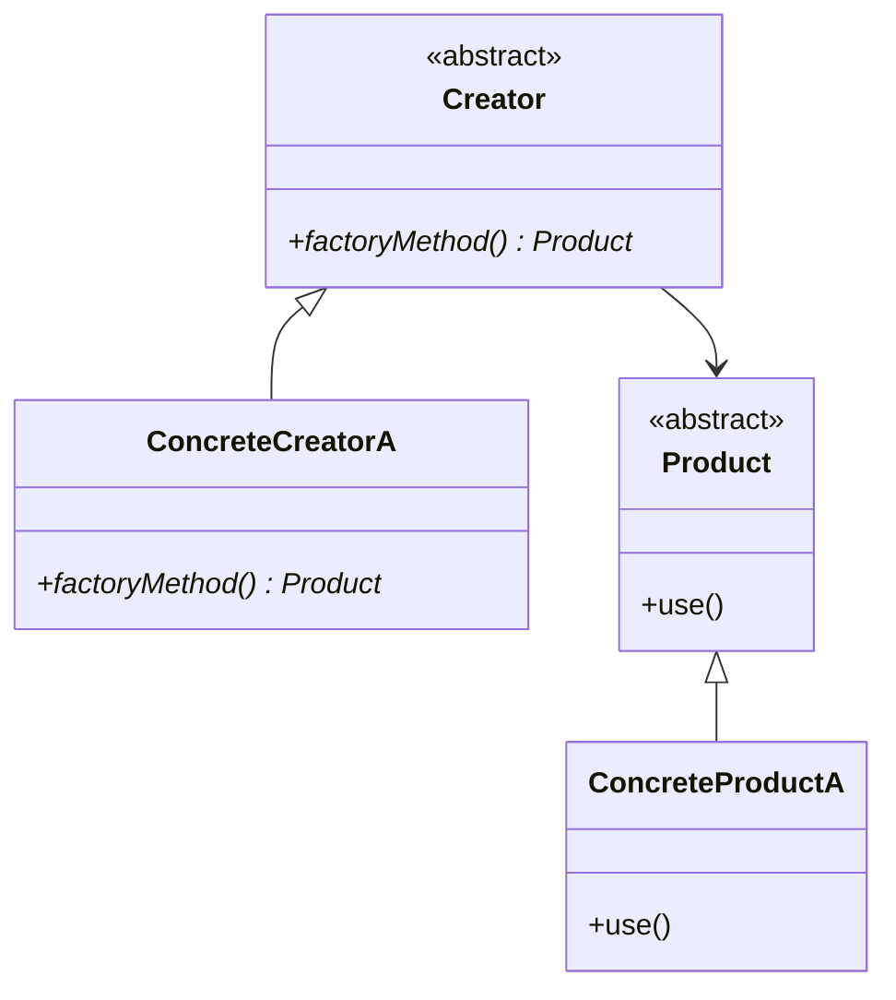

## 1.4 Benefits of Using Design Patterns in C++

Design patterns are a fundamental aspect of software engineering, offering time-tested solutions to common design problems. In C++ programming, they play a crucial role in enhancing code modularity, reusability, and maintainability. This section delves into the myriad benefits of using design patterns in C++, providing insights and examples to illustrate their impact on software development.

### Enhancing Code Modularity

**Modularity** refers to the degree to which a system's components can be separated and recombined. Design patterns promote modularity by encouraging the separation of concerns, allowing developers to break down complex systems into manageable, independent modules.

#### Separation of Concerns

Design patterns such as the **Facade** and **Adapter** patterns help in separating concerns by providing a simplified interface to a complex subsystem or by allowing incompatible interfaces to work together. This separation makes it easier to manage and understand the codebase.

```cpp
// Adapter Pattern Example
class OldInterface {
public:
    void oldMethod() {
        // Old method implementation
    }
};

class NewInterface {
public:
    virtual void newMethod() = 0;
};

class Adapter : public NewInterface {
private:
    OldInterface* oldInterface;
public:
    Adapter(OldInterface* oi) : oldInterface(oi) {}
    void newMethod() override {
        oldInterface->oldMethod(); // Adapting old method to new interface
    }
};
```

In this example, the `Adapter` class allows `OldInterface` to be used where `NewInterface` is expected, promoting modularity by decoupling the client code from the specific implementation of `OldInterface`.

#### Encapsulation

Design patterns also enhance modularity through encapsulation. The **Decorator** pattern, for instance, allows behavior to be added to individual objects, without affecting the behavior of other objects from the same class.

```cpp
// Decorator Pattern Example
class Coffee {
public:
    virtual double cost() = 0;
    virtual ~Coffee() = default;
};

class SimpleCoffee : public Coffee {
public:
    double cost() override {
        return 5.0;
    }
};

class MilkDecorator : public Coffee {
private:
    Coffee* coffee;
public:
    MilkDecorator(Coffee* c) : coffee(c) {}
    double cost() override {
        return coffee->cost() + 1.5; // Adding milk cost
    }
};
```

Here, `MilkDecorator` adds functionality to `SimpleCoffee` without altering its structure, demonstrating encapsulation and promoting modularity.

### Improving Code Reusability

**Reusability** is the ability to use existing code for new purposes. Design patterns facilitate reusability by providing generic solutions that can be adapted to different contexts.

#### Standardized Solutions

Design patterns offer standardized solutions that can be reused across different projects. The **Singleton** pattern, for instance, ensures a class has only one instance and provides a global point of access to it.

```cpp
// Singleton Pattern Example
class Singleton {
private:
    static Singleton* instance;
    Singleton() {} // Private constructor

public:
    static Singleton* getInstance() {
        if (!instance) {
            instance = new Singleton();
        }
        return instance;
    }
};

Singleton* Singleton::instance = nullptr;
```

This pattern can be reused in any situation where a single instance is required, such as logging or configuration management.

#### Flexibility and Extensibility

Patterns like the **Factory Method** and **Abstract Factory** provide interfaces for creating objects, allowing subclasses to alter the type of objects that will be created. This flexibility makes it easy to extend and reuse code.

```cpp
// Factory Method Pattern Example
class Product {
public:
    virtual void use() = 0;
    virtual ~Product() = default;
};

class ConcreteProductA : public Product {
public:
    void use() override {
        // Implementation for Product A
    }
};

class Creator {
public:
    virtual Product* factoryMethod() = 0;
};

class ConcreteCreatorA : public Creator {
public:
    Product* factoryMethod() override {
        return new ConcreteProductA();
    }
};
```

By defining a standard way to create objects, the Factory Method pattern enables developers to reuse and extend code without modifying existing classes.

### Enhancing Code Maintainability

**Maintainability** refers to the ease with which a software system can be modified to fix defects, improve performance, or adapt to a changing environment. Design patterns contribute to maintainability by promoting clear, understandable, and well-organized code.

#### Clear Structure

Patterns like the **Model-View-Controller (MVC)** provide a clear structure for organizing code, separating the data model, user interface, and control logic. This separation simplifies maintenance by isolating changes to specific components.

```cpp
// MVC Pattern Example
class Model {
    // Data model
};

class View {
public:
    void display() {
        // Display logic
    }
};

class Controller {
private:
    Model* model;
    View* view;
public:
    Controller(Model* m, View* v) : model(m), view(v) {}
    void updateView() {
        view->display();
    }
};
```

The MVC pattern makes it easy to update the user interface or data model independently, enhancing maintainability.

#### Reduced Complexity

Design patterns reduce complexity by providing a proven solution to common problems. The **Observer** pattern, for example, defines a one-to-many dependency between objects, allowing an object to notify multiple observers of any state changes.

```cpp
// Observer Pattern Example
class Observer {
public:
    virtual void update() = 0;
};

class Subject {
private:
    std::vector<Observer*> observers;
public:
    void attach(Observer* observer) {
        observers.push_back(observer);
    }
    void notify() {
        for (Observer* observer : observers) {
            observer->update();
        }
    }
};
```

By using the Observer pattern, developers can manage complex interactions between objects with minimal coupling, reducing the overall complexity of the system.

### Design Patterns and C++ Specific Features

C++ offers several features that complement design patterns, enhancing their effectiveness and applicability.

#### Templates and Generic Programming

C++ templates enable the creation of generic and reusable components. Patterns like the **Strategy** pattern can be implemented using templates to allow compile-time polymorphism.

```cpp
// Strategy Pattern with Templates
template <typename Strategy>
class Context {
private:
    Strategy strategy;
public:
    void executeStrategy() {
        strategy.execute();
    }
};

class ConcreteStrategyA {
public:
    void execute() {
        // Strategy A implementation
    }
};
```

Using templates, the Strategy pattern can be adapted to different algorithms without runtime overhead, leveraging C++'s powerful generic programming capabilities.

#### Smart Pointers and Resource Management

C++ smart pointers, such as `std::unique_ptr` and `std::shared_ptr`, facilitate resource management in design patterns. For instance, the **Composite** pattern can use smart pointers to manage the lifecycle of component objects.

```cpp
// Composite Pattern with Smart Pointers
class Component {
public:
    virtual void operation() = 0;
    virtual ~Component() = default;
};

class Composite : public Component {
private:
    std::vector<std::unique_ptr<Component>> children;
public:
    void add(std::unique_ptr<Component> component) {
        children.push_back(std::move(component));
    }
    void operation() override {
        for (auto& child : children) {
            child->operation();
        }
    }
};
```

Smart pointers ensure that resources are automatically released when they are no longer needed, preventing memory leaks and simplifying resource management.

### Visualizing Design Patterns in C++

To better understand the relationships and interactions within design patterns, let's visualize some common patterns using Mermaid.js diagrams.

#### Singleton Pattern



This diagram illustrates the Singleton pattern, highlighting the private constructor and static instance method.

#### Factory Method Pattern



The Factory Method pattern is depicted here, showing the relationship between the creator and product classes.

### Try It Yourself

To deepen your understanding of design patterns, try modifying the code examples provided:

- **Adapter Pattern**: Create a new adapter that adapts a different old interface to the new interface.
- **Decorator Pattern**: Add another decorator, such as `SugarDecorator`, to enhance the `Coffee` class.
- **Singleton Pattern**: Implement a thread-safe Singleton using `std::mutex` for synchronization.
- **Factory Method Pattern**: Add another product type and corresponding creator to the factory method example.

### Knowledge Check

1. **What is the primary benefit of using the Adapter pattern?**
   - To allow incompatible interfaces to work together.
   - To ensure a class has only one instance.
   - To add behavior to individual objects.

2. **How does the Decorator pattern enhance modularity?**
   - By providing a global point of access to a class.
   - By allowing behavior to be added to individual objects dynamically.
   - By defining a one-to-many dependency between objects.

3. **What is a key advantage of using the Factory Method pattern?**
   - It reduces the number of classes in a system.
   - It provides a way to create objects without specifying the exact class.
   - It ensures that objects are created in a thread-safe manner.

4. **How do smart pointers benefit the Composite pattern?**
   - They allow for compile-time polymorphism.
   - They manage the lifecycle of component objects automatically.
   - They reduce the overall complexity of the system.

5. **What role do templates play in the Strategy pattern?**
   - They provide a global point of access to a class.
   - They enable compile-time polymorphism for strategy selection.
   - They ensure a class has only one instance.

### References and Links

- [Design Patterns: Elements of Reusable Object-Oriented Software](https://en.wikipedia.org/wiki/Design_Patterns) - The "Gang of Four" book that introduced design patterns.
- [C++ Reference](https://en.cppreference.com/) - Comprehensive reference for C++ language features.
- [Smart Pointers in C++](https://www.geeksforgeeks.org/smart-pointers-cpp/) - An article explaining smart pointers and their usage.

### Embrace the Journey

Remember, mastering design patterns is a journey. As you continue to explore and apply these patterns, you'll find new ways to enhance the quality and efficiency of your C++ code. Keep experimenting, stay curious, and enjoy the process of becoming a more proficient software engineer!

## Quiz Time!



### What is the primary benefit of using design patterns in C++?

- [x] Enhancing code modularity, reusability, and maintainability.
- [ ] Reducing the number of lines of code.
- [ ] Increasing the complexity of code.
- [ ] Making code execution faster.

> **Explanation:** Design patterns provide proven solutions to common problems, enhancing modularity, reusability, and maintainability.

### Which pattern ensures a class has only one instance?

- [x] Singleton
- [ ] Factory Method
- [ ] Adapter
- [ ] Observer

> **Explanation:** The Singleton pattern ensures that a class has only one instance and provides a global point of access to it.

### How does the Decorator pattern enhance modularity?

- [x] By allowing behavior to be added to individual objects dynamically.
- [ ] By providing a global point of access to a class.
- [ ] By ensuring a class has only one instance.
- [ ] By defining a one-to-many dependency between objects.

> **Explanation:** The Decorator pattern allows additional responsibilities to be attached to an object dynamically, enhancing modularity.

### What is a key advantage of using the Factory Method pattern?

- [x] It provides a way to create objects without specifying the exact class.
- [ ] It reduces the number of classes in a system.
- [ ] It ensures that objects are created in a thread-safe manner.
- [ ] It allows incompatible interfaces to work together.

> **Explanation:** The Factory Method pattern defines an interface for creating objects, allowing subclasses to decide which class to instantiate.

### How do smart pointers benefit the Composite pattern?

- [x] They manage the lifecycle of component objects automatically.
- [ ] They allow for compile-time polymorphism.
- [ ] They reduce the overall complexity of the system.
- [ ] They provide a global point of access to a class.

> **Explanation:** Smart pointers automatically manage memory, ensuring that resources are released when no longer needed, which is beneficial in managing the lifecycle of components in the Composite pattern.

### What role do templates play in the Strategy pattern?

- [x] They enable compile-time polymorphism for strategy selection.
- [ ] They provide a global point of access to a class.
- [ ] They ensure a class has only one instance.
- [ ] They reduce the number of lines of code.

> **Explanation:** Templates allow the Strategy pattern to be implemented with compile-time polymorphism, enabling different strategies to be selected at compile time.

### Which pattern is used to separate the data model, user interface, and control logic?

- [x] Model-View-Controller (MVC)
- [ ] Singleton
- [ ] Adapter
- [ ] Observer

> **Explanation:** The MVC pattern separates the data model, user interface, and control logic, promoting a clear structure and enhancing maintainability.

### What is the primary benefit of using the Observer pattern?

- [x] It defines a one-to-many dependency between objects.
- [ ] It ensures a class has only one instance.
- [ ] It allows behavior to be added to individual objects dynamically.
- [ ] It provides a way to create objects without specifying the exact class.

> **Explanation:** The Observer pattern allows an object to notify multiple observers of any state changes, defining a one-to-many dependency.

### How does the Adapter pattern promote modularity?

- [x] By allowing incompatible interfaces to work together.
- [ ] By providing a global point of access to a class.
- [ ] By ensuring a class has only one instance.
- [ ] By defining a one-to-many dependency between objects.

> **Explanation:** The Adapter pattern allows incompatible interfaces to work together, promoting modularity by decoupling the client code from specific implementations.

### True or False: Design patterns can only be used in object-oriented programming languages.

- [ ] True
- [x] False

> **Explanation:** While design patterns are often associated with object-oriented programming, many patterns can be applied in other paradigms as well.


