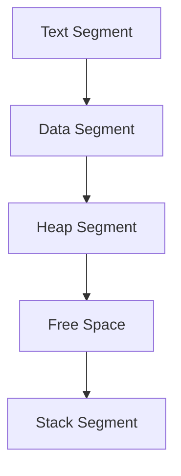

## 10.1 Understanding Memory in C++

Memory management is a cornerstone of C++ programming, offering both power and complexity. Understanding how memory is allocated, managed, and optimized is crucial for developing efficient and robust applications. In this section, we will explore the differences between stack and heap allocation, delve into the memory layout of C++ programs, and discuss memory alignment and padding. Let's embark on this journey to master memory management in C++.

### Stack vs. Heap Allocation

Memory in C++ is primarily allocated in two regions: the stack and the heap. Each serves different purposes and has distinct characteristics.

#### Stack Allocation

The stack is a region of memory that stores temporary variables created by each function (including the main function). It operates in a last-in, first-out (LIFO) manner, meaning that the last piece of data pushed onto the stack is the first one to be popped off. The stack is used for static memory allocation, where the size and lifetime of variables are known at compile time.

**Characteristics of Stack Allocation:**

- **Automatic Management:** Variables are automatically allocated and deallocated as functions are called and return.
- **Fast Access:** Accessing stack memory is faster due to its LIFO nature and proximity to the CPU.
- **Limited Size:** The stack size is limited, typically a few megabytes, which can lead to stack overflow if exceeded.
- **Scope-bound Lifetime:** Variables exist only within the scope of the function that created them.

**Example of Stack Allocation:**

```cpp
#include <iostream>

void stackExample() {
    int a = 10; // Allocated on the stack
    int b = 20; // Allocated on the stack
    std::cout << "a + b = " << a + b << std::endl;
}

int main() {
    stackExample();
    return 0;
}
```

In this example, `a` and `b` are local variables allocated on the stack. They are automatically deallocated when `stackExample` returns.

#### Heap Allocation

The heap is a region of memory used for dynamic memory allocation, where the size of data structures can change during runtime. Unlike the stack, the heap is managed manually by the programmer, using operators such as `new` and `delete`.

**Characteristics of Heap Allocation:**

- **Manual Management:** The programmer is responsible for allocating and deallocating memory.
- **Flexible Size:** The heap can grow as needed, limited only by the system's available memory.
- **Slower Access:** Accessing heap memory is slower due to its dynamic nature and potential fragmentation.
- **Persistent Lifetime:** Variables can persist beyond the scope of the function that created them.

**Example of Heap Allocation:**

```cpp
#include <iostream>

void heapExample() {
    int* p = new int(42); // Allocated on the heap
    std::cout << "Value: " << *p << std::endl;
    delete p; // Deallocated from the heap
}

int main() {
    heapExample();
    return 0;
}
```

Here, `p` is a pointer to an integer allocated on the heap. The memory must be explicitly deallocated using `delete` to prevent memory leaks.

### Memory Layout of C++ Programs

Understanding the memory layout of a C++ program is essential for effective memory management. A typical C++ program's memory is divided into several segments:

1. **Text Segment:** Contains the compiled code of the program. It is read-only to prevent accidental modification of instructions.

2. **Data Segment:** Divided into initialized and uninitialized sections. The initialized section stores global and static variables with defined values, while the uninitialized section (also known as the BSS segment) stores variables without initial values.

3. **Heap Segment:** Used for dynamic memory allocation. It grows upwards as more memory is allocated.

4. **Stack Segment:** Used for static memory allocation. It grows downwards as functions are called.

5. **Free Space:** Lies between the heap and stack segments, allowing them to grow as needed.

**Visualizing Memory Layout:**



This diagram illustrates the typical layout of a C++ program's memory. The text segment is at the lowest address, followed by the data segment, heap, free space, and stack.

### Memory Alignment and Padding

Memory alignment refers to aligning data in memory according to specific boundaries. Proper alignment can improve performance by ensuring that data accesses are efficient.

#### Why Alignment Matters

- **Performance:** Misaligned data can lead to additional CPU cycles for access, reducing performance.
- **Hardware Requirements:** Some hardware architectures require data to be aligned to specific boundaries.

#### Padding

Padding is the addition of extra bytes to ensure proper alignment. It is often introduced by the compiler to align data structures.

**Example of Padding:**

Consider the following structure:

```cpp
struct Example {
    char a;    // 1 byte
    int b;     // 4 bytes
    char c;    // 1 byte
};
```

Without padding, `Example` would occupy 6 bytes. However, to align `b` to a 4-byte boundary, the compiler adds 3 bytes of padding after `a`, resulting in a total size of 12 bytes.

**Visualizing Padding:**

```mermaid
graph TD;
    A[char a (1 byte)] --> B[Padding (3 bytes)];
    B --> C[int b (4 bytes)];
    C --> D[char c (1 byte)];
    D --> E[Padding (3 bytes)];
```

This diagram shows how padding is added to align `b` and `c` to 4-byte boundaries.

### Try It Yourself

Experiment with the following code to understand memory alignment and padding:

```cpp
#include <iostream>

struct Example {
    char a;
    int b;
    char c;
};

int main() {
    Example ex;
    std::cout << "Size of Example: " << sizeof(Example) << " bytes" << std::endl;
    return 0;
}
```

**Suggested Modifications:**

- Add more members of different types to `Example` and observe how the size changes.
- Use `pragma pack` to control padding and alignment.

### References and Links

- [C++ Memory Management](https://en.cppreference.com/w/cpp/memory)
- [Understanding Stack and Heap](https://www.geeksforgeeks.org/stack-vs-heap-memory-allocation/)
- [Memory Alignment in C++](https://en.wikipedia.org/wiki/Data_structure_alignment)

### Knowledge Check

- What are the key differences between stack and heap allocation?
- How does memory alignment affect performance?
- Why is padding necessary in data structures?

### Embrace the Journey

Remember, mastering memory management in C++ is a journey. As you progress, you'll gain deeper insights into optimizing performance and writing efficient code. Keep experimenting, stay curious, and enjoy the process!

## Quiz Time!



### What is the primary characteristic of stack allocation?

- [x] Automatic management of memory
- [ ] Manual management of memory
- [ ] Unlimited size
- [ ] Persistent lifetime

> **Explanation:** Stack allocation is characterized by automatic management, where memory is allocated and deallocated as functions are called and return.

### Which segment of memory is used for dynamic memory allocation?

- [ ] Stack Segment
- [x] Heap Segment
- [ ] Text Segment
- [ ] Data Segment

> **Explanation:** The heap segment is used for dynamic memory allocation, where memory can be allocated and deallocated at runtime.

### What is the purpose of padding in data structures?

- [x] To ensure proper alignment of data
- [ ] To increase the size of data structures
- [ ] To reduce memory usage
- [ ] To improve readability

> **Explanation:** Padding is used to ensure proper alignment of data, which can improve performance and meet hardware requirements.

### How does the stack segment grow in memory?

- [ ] Upwards
- [x] Downwards
- [ ] Sideways
- [ ] It does not grow

> **Explanation:** The stack segment grows downwards in memory as functions are called and more memory is needed.

### Which of the following is a characteristic of heap allocation?

- [x] Manual management of memory
- [ ] Automatic deallocation
- [ ] Limited size
- [ ] Fast access

> **Explanation:** Heap allocation requires manual management of memory, where the programmer must explicitly allocate and deallocate memory.

### What is the typical size limitation of the stack?

- [ ] Unlimited
- [x] A few megabytes
- [ ] A few kilobytes
- [ ] A few gigabytes

> **Explanation:** The stack typically has a size limitation of a few megabytes, which can lead to stack overflow if exceeded.

### What does the text segment of a C++ program contain?

- [x] Compiled code of the program
- [ ] Global variables
- [ ] Dynamic memory
- [ ] Function call stack

> **Explanation:** The text segment contains the compiled code of the program and is read-only to prevent modification.

### Why is memory alignment important?

- [x] It improves performance by ensuring efficient data access
- [ ] It increases the size of data structures
- [ ] It reduces the need for padding
- [ ] It simplifies code readability

> **Explanation:** Memory alignment improves performance by ensuring that data accesses are efficient and meet hardware requirements.

### What is the function of the free space in memory layout?

- [x] To allow the heap and stack to grow as needed
- [ ] To store temporary variables
- [ ] To contain compiled code
- [ ] To hold global variables

> **Explanation:** Free space lies between the heap and stack segments, allowing them to grow as needed.

### True or False: The heap segment grows downwards in memory.

- [ ] True
- [x] False

> **Explanation:** The heap segment grows upwards in memory as more memory is allocated dynamically.


