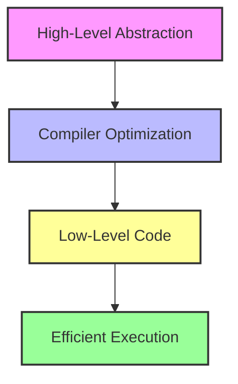

## 10.10 Zero-Cost Abstractions

In the realm of C++ programming, achieving high performance without sacrificing code readability and maintainability is a crucial goal. Zero-cost abstractions are a powerful concept that allows developers to write clean, abstract code without incurring additional runtime costs. In this section, we will delve into the principles of zero-cost abstractions, focusing on the use of inline functions and templates to design efficient abstractions that avoid runtime overhead.

### Understanding Zero-Cost Abstractions

Zero-cost abstractions refer to the ability to use high-level abstractions in programming without incurring any performance penalty compared to low-level code. The idea is that the abstraction should not introduce any additional runtime cost beyond what would be incurred if the code were written in a more direct, lower-level manner.

#### The Philosophy Behind Zero-Cost Abstractions

The philosophy of zero-cost abstractions is rooted in the belief that programmers should be able to express their ideas clearly and concisely without worrying about performance degradation. This is particularly important in C++, where performance is often a critical concern. By leveraging language features such as inline functions and templates, developers can create abstractions that are both expressive and efficient.

### Designing Efficient Abstractions

To achieve zero-cost abstractions, it's essential to design abstractions that are efficient by nature. This involves understanding how C++ compilers optimize code and how to leverage language features to minimize overhead.

#### Inline Functions

Inline functions are a key tool in achieving zero-cost abstractions. By suggesting to the compiler that a function should be expanded inline, you can eliminate the overhead associated with function calls. This is particularly useful for small, frequently called functions.

**Example: Inline Function**

```cpp
inline int add(int a, int b) {
    return a + b;
}

int main() {
    int result = add(5, 3); // No function call overhead
    return 0;
}
```

In the above example, the `add` function is declared as `inline`, which suggests to the compiler to replace the function call with the actual code of the function. This can eliminate the overhead of a function call, resulting in more efficient code.

#### Templates

Templates are another powerful feature in C++ that can be used to create zero-cost abstractions. By allowing functions and classes to operate with generic types, templates enable code reuse without sacrificing performance.

**Example: Template Function**

```cpp
template <typename T>
inline T max(T a, T b) {
    return (a > b) ? a : b;
}

int main() {
    int maxInt = max(10, 20); // Works for integers
    double maxDouble = max(10.5, 20.5); // Works for doubles
    return 0;
}
```

In this example, the `max` function template can operate on any data type, providing flexibility without incurring additional runtime costs. The compiler generates optimized code for each specific type used with the template.

### Avoiding Runtime Overhead

To ensure that abstractions remain zero-cost, it's important to avoid introducing runtime overhead. This involves understanding how the compiler optimizes code and how to write code that takes advantage of these optimizations.

#### Compiler Optimizations

Modern C++ compilers are highly sophisticated and capable of performing a wide range of optimizations. By understanding how these optimizations work, you can write code that is more likely to be optimized effectively.

- **Inlining**: The compiler can automatically inline functions, eliminating the overhead of function calls.
- **Constant Folding**: The compiler can evaluate constant expressions at compile time, reducing runtime computations.
- **Loop Unrolling**: The compiler can optimize loops by unrolling them, reducing the overhead of loop control.

#### Writing Optimizable Code

To take full advantage of compiler optimizations, it's important to write code that is easy for the compiler to optimize. This includes:

- **Avoiding unnecessary complexity**: Write simple, straightforward code that the compiler can easily analyze and optimize.
- **Using standard library functions**: The C++ Standard Library is highly optimized, and using its functions can often result in better performance than writing custom code.
- **Leveraging language features**: Use features like `constexpr`, `auto`, and `decltype` to enable more efficient code generation.

### Code Examples and Analysis

Let's explore some code examples to illustrate how zero-cost abstractions can be achieved in practice.

#### Example 1: Inline Function for Mathematical Operations

Consider a scenario where you need to perform a series of mathematical operations on a set of data. By using inline functions, you can eliminate the overhead of function calls.

```cpp
#include <iostream>
#include <vector>

inline double square(double x) {
    return x * x;
}

inline double cube(double x) {
    return x * x * x;
}

int main() {
    std::vector<double> data = {1.0, 2.0, 3.0, 4.0};
    for (double& value : data) {
        value = square(value) + cube(value);
    }

    for (const double& value : data) {
        std::cout << value << " ";
    }
    return 0;
}
```

In this example, the `square` and `cube` functions are declared as `inline`, allowing the compiler to expand them inline and eliminate function call overhead. This results in more efficient code, especially when these functions are called repeatedly in a loop.

#### Example 2: Template for Generic Algorithms

Templates can be used to create generic algorithms that work with any data type, providing flexibility without sacrificing performance.

```cpp
#include <iostream>
#include <vector>

template <typename T>
inline T sum(const std::vector<T>& data) {
    T total = T();
    for (const T& value : data) {
        total += value;
    }
    return total;
}

int main() {
    std::vector<int> intData = {1, 2, 3, 4};
    std::vector<double> doubleData = {1.1, 2.2, 3.3, 4.4};

    std::cout << "Sum of integers: " << sum(intData) << std::endl;
    std::cout << "Sum of doubles: " << sum(doubleData) << std::endl;

    return 0;
}
```

In this example, the `sum` function template can operate on vectors of any data type, allowing for code reuse without introducing runtime overhead. The compiler generates optimized code for each specific type used with the template.

### Visualizing Zero-Cost Abstractions

To better understand how zero-cost abstractions work, let's visualize the process using a diagram.



**Diagram Description**: This diagram illustrates the process of achieving zero-cost abstractions. High-level abstractions are optimized by the compiler into low-level code, resulting in efficient execution without additional runtime costs.

### Try It Yourself

To deepen your understanding of zero-cost abstractions, try modifying the code examples provided. Experiment with different data types and operations to see how the compiler optimizes the code. Consider adding additional inline functions or templates to further explore the concept.

### Key Takeaways

- **Zero-cost abstractions** allow you to write high-level, expressive code without incurring additional runtime costs.
- **Inline functions** and **templates** are powerful tools for achieving zero-cost abstractions in C++.
- **Compiler optimizations** play a crucial role in eliminating overhead and ensuring efficient execution.
- Writing **optimizable code** is essential for taking full advantage of zero-cost abstractions.

### References and Further Reading

- [C++ Standard Library](https://en.cppreference.com/w/)
- [Modern C++ Programming with Test-Driven Development](https://www.oreilly.com/library/view/modern-c-programming/9781491906542/)
- [Effective Modern C++](https://www.oreilly.com/library/view/effective-modern-c/9781491908416/)

## Quiz Time!



### What is the primary goal of zero-cost abstractions in C++?

- [x] To provide high-level abstractions without additional runtime costs.
- [ ] To eliminate the need for inline functions.
- [ ] To increase the complexity of code.
- [ ] To reduce the use of templates.

> **Explanation:** Zero-cost abstractions aim to provide high-level abstractions without incurring additional runtime costs, allowing for efficient code execution.

### Which C++ feature is commonly used to achieve zero-cost abstractions?

- [x] Inline functions
- [ ] Virtual functions
- [ ] Dynamic memory allocation
- [ ] Macros

> **Explanation:** Inline functions are commonly used to achieve zero-cost abstractions by eliminating function call overhead.

### How do templates contribute to zero-cost abstractions?

- [x] By allowing generic programming without runtime overhead.
- [ ] By increasing the complexity of code.
- [ ] By reducing code readability.
- [ ] By eliminating the need for inline functions.

> **Explanation:** Templates allow for generic programming without introducing runtime overhead, contributing to zero-cost abstractions.

### What role do compiler optimizations play in zero-cost abstractions?

- [x] They eliminate overhead and ensure efficient execution.
- [ ] They increase the complexity of code.
- [ ] They reduce code readability.
- [ ] They eliminate the need for templates.

> **Explanation:** Compiler optimizations play a crucial role in eliminating overhead and ensuring efficient execution, which is essential for zero-cost abstractions.

### Which of the following is a benefit of using inline functions?

- [x] Elimination of function call overhead
- [ ] Increased code complexity
- [ ] Reduced code readability
- [ ] Increased runtime costs

> **Explanation:** Inline functions eliminate function call overhead, contributing to more efficient code execution.

### What is the purpose of the `inline` keyword in C++?

- [x] To suggest to the compiler to expand the function inline.
- [ ] To increase the complexity of code.
- [ ] To reduce code readability.
- [ ] To eliminate the need for templates.

> **Explanation:** The `inline` keyword suggests to the compiler to expand the function inline, eliminating function call overhead.

### How can you ensure that your code is optimizable by the compiler?

- [x] By writing simple, straightforward code.
- [ ] By increasing the complexity of code.
- [ ] By reducing code readability.
- [ ] By eliminating the use of templates.

> **Explanation:** Writing simple, straightforward code ensures that the compiler can easily analyze and optimize it.

### What is a key advantage of using the C++ Standard Library?

- [x] It is highly optimized for performance.
- [ ] It increases code complexity.
- [ ] It reduces code readability.
- [ ] It eliminates the need for inline functions.

> **Explanation:** The C++ Standard Library is highly optimized for performance, making it a valuable resource for writing efficient code.

### True or False: Zero-cost abstractions allow for high-level, expressive code without incurring additional runtime costs.

- [x] True
- [ ] False

> **Explanation:** Zero-cost abstractions allow for high-level, expressive code without incurring additional runtime costs, ensuring efficient execution.

### Which of the following is NOT a characteristic of zero-cost abstractions?

- [ ] High-level abstractions
- [ ] Efficient execution
- [x] Increased runtime costs
- [ ] Compiler optimizations

> **Explanation:** Zero-cost abstractions are characterized by high-level abstractions, efficient execution, and compiler optimizations, without increased runtime costs.



Remember, mastering zero-cost abstractions is just the beginning of your journey to writing efficient and maintainable C++ code. Keep experimenting, stay curious, and enjoy the journey!
