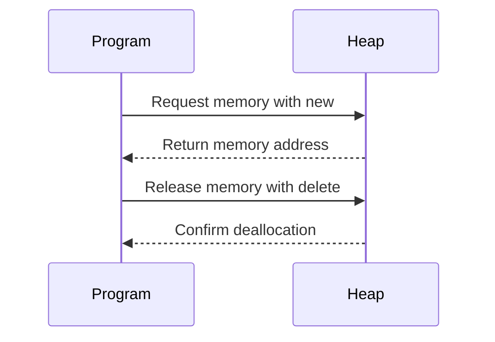

## 10.2 Dynamic Memory Allocation

Dynamic memory allocation is a cornerstone of C++ programming, enabling developers to manage memory efficiently and flexibly. Understanding how to allocate and deallocate memory dynamically is crucial for building robust and performant applications. In this section, we will explore the intricacies of dynamic memory allocation in C++, including the use of `new` and `delete`, overloading allocation operators, and creating allocator-aware data structures.

### Understanding Dynamic Memory Allocation

Dynamic memory allocation allows programs to request memory from the heap at runtime, which is essential for applications that require variable amounts of memory or need to manage complex data structures. Unlike stack memory, which is automatically managed and limited in size, heap memory provides greater flexibility but requires explicit management by the programmer.

#### Key Concepts

- **Heap Memory**: A large pool of memory available for dynamic allocation. Unlike stack memory, heap memory is not automatically freed when a function exits.
- **Pointers**: Variables that store memory addresses, used to access dynamically allocated memory.
- **Memory Leaks**: Occur when dynamically allocated memory is not properly deallocated, leading to wasted resources.

### Using `new` and `delete`

In C++, the `new` operator is used to allocate memory dynamically, while the `delete` operator is used to deallocate memory. Let's delve into how these operators work and how to use them effectively.

#### Allocating Memory with `new`

The `new` operator allocates memory on the heap and returns a pointer to the allocated memory. It can be used to allocate memory for a single object or an array of objects.

```cpp
// Allocating memory for a single integer
int* ptr = new int;

// Allocating memory for an array of integers
int* arr = new int[10];
```

#### Deallocating Memory with `delete`

The `delete` operator frees the memory allocated by `new`. It is crucial to use `delete` to prevent memory leaks.

```cpp
// Deallocating memory for a single integer
delete ptr;

// Deallocating memory for an array of integers
delete[] arr;
```

#### Best Practices

- Always pair `new` with `delete` and `new[]` with `delete[]`.
- Set pointers to `nullptr` after deleting to avoid dangling pointers.
- Avoid using `delete` on pointers that were not allocated with `new`.

### Overloading Allocation Operators

C++ allows developers to overload the `new` and `delete` operators to customize memory allocation and deallocation. This can be useful for implementing custom memory management strategies, such as pooling or tracking allocations.

#### Overloading `new` and `delete`

To overload `new` and `delete`, define them as static member functions or global functions. Here's an example of overloading these operators for a class:

```cpp
class MyClass {
public:
    void* operator new(size_t size) {
        std::cout << "Custom new for MyClass\n";
        return ::operator new(size);
    }

    void operator delete(void* ptr) {
        std::cout << "Custom delete for MyClass\n";
        ::operator delete(ptr);
    }
};
```

#### Considerations

- Ensure that overloaded operators handle all cases, including exceptions.
- Use overloading judiciously, as it can complicate memory management.

### Allocator-Aware Data Structures

Allocator-aware data structures allow developers to specify custom memory allocators, providing greater control over memory allocation. This is particularly useful in performance-critical applications where memory allocation patterns can significantly impact performance.

#### The Standard Allocator Interface

The C++ Standard Library provides an allocator interface that can be used to define custom allocators. The `std::allocator` class template is the default allocator used by STL containers.

```cpp
template <typename T>
class MyAllocator {
public:
    using value_type = T;

    MyAllocator() = default;

    template <typename U>
    MyAllocator(const MyAllocator<U>&) {}

    T* allocate(std::size_t n) {
        std::cout << "Allocating " << n << " elements\n";
        return static_cast<T*>(::operator new(n * sizeof(T)));
    }

    void deallocate(T* ptr, std::size_t n) {
        std::cout << "Deallocating " << n << " elements\n";
        ::operator delete(ptr);
    }
};
```

#### Using Custom Allocators with STL Containers

STL containers can be instantiated with custom allocators, allowing fine-grained control over memory allocation.

```cpp
#include <vector>

int main() {
    std::vector<int, MyAllocator<int>> vec;
    vec.push_back(10);
    vec.push_back(20);
}
```

### Visualizing Dynamic Memory Allocation

To better understand the flow of dynamic memory allocation, let's visualize the process using a sequence diagram.



### Try It Yourself

Experiment with the following code by modifying the number of elements allocated or changing the custom allocator's behavior.

```cpp
#include <iostream>
#include <vector>

template <typename T>
class MyAllocator {
public:
    using value_type = T;

    MyAllocator() = default;

    template <typename U>
    MyAllocator(const MyAllocator<U>&) {}

    T* allocate(std::size_t n) {
        std::cout << "Allocating " << n << " elements\n";
        return static_cast<T*>(::operator new(n * sizeof(T)));
    }

    void deallocate(T* ptr, std::size_t n) {
        std::cout << "Deallocating " << n << " elements\n";
        ::operator delete(ptr);
    }
};

int main() {
    std::vector<int, MyAllocator<int>> vec;
    vec.push_back(10);
    vec.push_back(20);

    // Try changing the number of elements or the allocator's behavior
    vec.resize(5);
}
```

### Knowledge Check

- **What is the difference between stack and heap memory?**
- **Why is it important to pair `new` with `delete`?**
- **How can overloading `new` and `delete` benefit memory management?**

### References and Links

- [C++ Reference on `new` and `delete`](https://en.cppreference.com/w/cpp/memory/new)
- [Allocator-aware containers in C++](https://en.cppreference.com/w/cpp/memory/allocator)

### Embrace the Journey

Remember, mastering dynamic memory allocation is a journey. As you continue to explore and experiment with these concepts, you'll gain deeper insights into efficient memory management. Keep experimenting, stay curious, and enjoy the journey!

## Quiz Time!



### What is the primary purpose of dynamic memory allocation in C++?

- [x] To allocate memory at runtime for flexible data management
- [ ] To allocate memory at compile time
- [ ] To manage stack memory
- [ ] To avoid using pointers

> **Explanation:** Dynamic memory allocation allows programs to request memory from the heap at runtime, providing flexibility for variable data management.

### Which operator is used to allocate memory dynamically in C++?

- [x] `new`
- [ ] `malloc`
- [ ] `alloc`
- [ ] `calloc`

> **Explanation:** The `new` operator is used in C++ to allocate memory dynamically.

### What must always accompany a `new` operation to prevent memory leaks?

- [x] `delete`
- [ ] `free`
- [ ] `release`
- [ ] `clear`

> **Explanation:** The `delete` operator must be used to deallocate memory allocated with `new` to prevent memory leaks.

### What is a potential downside of overloading `new` and `delete`?

- [x] It can complicate memory management
- [ ] It simplifies memory management
- [ ] It makes the code run faster
- [ ] It is always beneficial

> **Explanation:** Overloading `new` and `delete` can complicate memory management and should be used judiciously.

### How can custom allocators benefit STL containers?

- [x] By providing fine-grained control over memory allocation
- [ ] By making containers faster
- [ ] By reducing code size
- [ ] By simplifying syntax

> **Explanation:** Custom allocators allow developers to control memory allocation patterns, which can be beneficial in performance-critical applications.

### What is the default allocator used by STL containers?

- [x] `std::allocator`
- [ ] `custom_allocator`
- [ ] `default_allocator`
- [ ] `heap_allocator`

> **Explanation:** The `std::allocator` class template is the default allocator used by STL containers.

### Which of the following is a best practice when using `new` and `delete`?

- [x] Pair `new` with `delete` and `new[]` with `delete[]`
- [ ] Use `delete` for all pointers
- [ ] Avoid using `new` and `delete`
- [ ] Use `new` without `delete`

> **Explanation:** It is important to pair `new` with `delete` and `new[]` with `delete[]` to ensure proper memory management.

### What is a memory leak?

- [x] Memory that is allocated but not deallocated
- [ ] Memory that is deallocated twice
- [ ] Memory that is allocated on the stack
- [ ] Memory that is not allocated

> **Explanation:** A memory leak occurs when memory is allocated but not properly deallocated, leading to wasted resources.

### Which of the following is a key concept in dynamic memory allocation?

- [x] Pointers
- [ ] Functions
- [ ] Variables
- [ ] Constants

> **Explanation:** Pointers are used to access dynamically allocated memory, making them a key concept in dynamic memory allocation.

### True or False: Dynamic memory allocation is automatically managed by the C++ runtime.

- [ ] True
- [x] False

> **Explanation:** Dynamic memory allocation requires explicit management by the programmer, unlike stack memory which is automatically managed.


