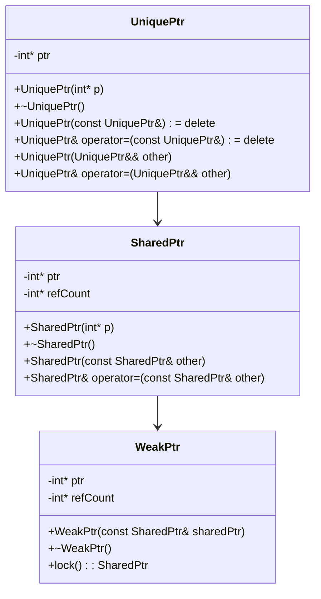

## 10.3 Smart Pointers

In modern C++ programming, managing memory efficiently and safely is crucial. Smart pointers, introduced in C++11, provide a robust mechanism for automatic memory management, reducing the risk of memory leaks and dangling pointers. This section delves into the world of smart pointers, exploring their types, best practices, common pitfalls, and the implementation of custom deleters.

### Introduction to Smart Pointers

Smart pointers are template classes that encapsulate raw pointers, providing automatic memory management. They help manage the lifetime of dynamically allocated objects, ensuring proper cleanup and preventing resource leaks. The three primary types of smart pointers in C++ are `std::unique_ptr`, `std::shared_ptr`, and `std::weak_ptr`.

#### Why Use Smart Pointers?

- **Automatic Resource Management**: Smart pointers automatically manage the memory of the objects they point to, ensuring that resources are released when no longer needed.
- **Exception Safety**: By managing resources automatically, smart pointers help prevent resource leaks in the presence of exceptions.
- **Improved Code Readability**: Smart pointers make ownership semantics explicit, improving code readability and maintainability.

### Types of Smart Pointers

#### `std::unique_ptr`

`std::unique_ptr` is a smart pointer that owns a dynamically allocated object exclusively. It ensures that only one `std::unique_ptr` can point to a given object at any time, preventing multiple ownership issues.

```cpp
#include <iostream>
#include <memory>

void demonstrateUniquePtr() {
    std::unique_ptr<int> ptr1(new int(10)); // Create a unique_ptr
    std::cout << "Value: " << *ptr1 << std::endl;

    // Transfer ownership
    std::unique_ptr<int> ptr2 = std::move(ptr1);
    if (!ptr1) {
        std::cout << "ptr1 is now empty." << std::endl;
    }
    std::cout << "ptr2 Value: " << *ptr2 << std::endl;
}
```

**Key Points:**
- **Ownership Transfer**: Use `std::move` to transfer ownership from one `std::unique_ptr` to another.
- **No Copying**: `std::unique_ptr` cannot be copied, only moved.

#### `std::shared_ptr`

`std::shared_ptr` is a smart pointer that allows multiple pointers to share ownership of a dynamically allocated object. It maintains a reference count to keep track of how many `std::shared_ptr` instances point to the same object.

```cpp
#include <iostream>
#include <memory>

void demonstrateSharedPtr() {
    std::shared_ptr<int> ptr1 = std::make_shared<int>(20);
    std::shared_ptr<int> ptr2 = ptr1; // Shared ownership

    std::cout << "Value: " << *ptr1 << ", Count: " << ptr1.use_count() << std::endl;
    ptr2.reset(); // Decrease reference count
    std::cout << "Count after reset: " << ptr1.use_count() << std::endl;
}
```

**Key Points:**
- **Reference Counting**: Automatically deletes the managed object when the last `std::shared_ptr` goes out of scope.
- **Thread Safety**: Reference counting operations are thread-safe.

#### `std::weak_ptr`

`std::weak_ptr` is a smart pointer that holds a non-owning reference to an object managed by `std::shared_ptr`. It is used to break circular references that could lead to memory leaks.

```cpp
#include <iostream>
#include <memory>

void demonstrateWeakPtr() {
    std::shared_ptr<int> sharedPtr = std::make_shared<int>(30);
    std::weak_ptr<int> weakPtr = sharedPtr; // Non-owning reference

    if (auto lockedPtr = weakPtr.lock()) { // Convert to shared_ptr
        std::cout << "Value: " << *lockedPtr << std::endl;
    } else {
        std::cout << "Object no longer exists." << std::endl;
    }
}
```

**Key Points:**
- **Non-Owning**: Does not affect the reference count of `std::shared_ptr`.
- **Use `lock()`**: Convert to `std::shared_ptr` to access the object safely.

### Best Practices for Smart Pointers

#### Prefer `std::make_unique` and `std::make_shared`

Use `std::make_unique` and `std::make_shared` to create smart pointers. These functions are safer and more efficient than using `new` directly, as they prevent resource leaks in case of exceptions.

```cpp
auto ptr = std::make_unique<int>(42); // For unique_ptr
auto sharedPtr = std::make_shared<int>(42); // For shared_ptr
```

#### Avoid Raw Pointers

Minimize the use of raw pointers. Use smart pointers for managing dynamic memory to ensure automatic cleanup and avoid memory leaks.

#### Use `std::weak_ptr` to Break Cycles

When using `std::shared_ptr`, be cautious of circular references. Use `std::weak_ptr` to break cycles and prevent memory leaks.

```cpp
class Node {
public:
    std::shared_ptr<Node> next;
    std::weak_ptr<Node> prev; // Break cycle with weak_ptr
};
```

#### Be Mindful of Ownership Semantics

Clearly define ownership semantics in your code. Use `std::unique_ptr` for exclusive ownership and `std::shared_ptr` for shared ownership.

### Avoiding Common Pitfalls

#### Dangling Pointers

Avoid creating dangling pointers by ensuring that smart pointers are always valid. Do not use raw pointers to access objects managed by smart pointers.

#### Overhead of `std::shared_ptr`

Be aware of the overhead associated with `std::shared_ptr`, especially in performance-critical applications. The reference counting mechanism can introduce additional overhead.

#### Custom Deleters

Use custom deleters when you need to perform specific cleanup actions beyond simple memory deallocation. Custom deleters can be specified when creating a smart pointer.

```cpp
#include <iostream>
#include <memory>

void customDeleter(int* ptr) {
    std::cout << "Custom deleter called." << std::endl;
    delete ptr;
}

void demonstrateCustomDeleter() {
    std::unique_ptr<int, decltype(&customDeleter)> ptr(new int(50), customDeleter);
}
```

### Implementing Custom Deleters

Custom deleters are useful when you need to perform specific cleanup actions. They can be functions, function objects, or lambdas.

#### Function Deleter

```cpp
void customDeleterFunction(int* ptr) {
    std::cout << "Deleting resource using custom function." << std::endl;
    delete ptr;
}

void useFunctionDeleter() {
    std::unique_ptr<int, decltype(&customDeleterFunction)> ptr(new int(100), customDeleterFunction);
}
```

#### Lambda Deleter

```cpp
void useLambdaDeleter() {
    auto deleter = [](int* ptr) {
        std::cout << "Deleting resource using lambda." << std::endl;
        delete ptr;
    };
    std::unique_ptr<int, decltype(deleter)> ptr(new int(200), deleter);
}
```

#### Functor Deleter

```cpp
struct FunctorDeleter {
    void operator()(int* ptr) const {
        std::cout << "Deleting resource using functor." << std::endl;
        delete ptr;
    }
};

void useFunctorDeleter() {
    std::unique_ptr<int, FunctorDeleter> ptr(new int(300));
}
```

### Visualizing Smart Pointer Relationships

To better understand the relationships between different types of smart pointers, let's visualize their interactions using a class diagram.



**Diagram Explanation:**
- **UniquePtr**: Represents exclusive ownership with no copy operations.
- **SharedPtr**: Manages shared ownership with reference counting.
- **WeakPtr**: Provides a non-owning reference to a `SharedPtr`.

### Try It Yourself

Experiment with the code examples provided. Try modifying the custom deleters to perform different actions, such as logging or resource cleanup. Observe how changing the ownership semantics affects the behavior of your program.

### References and Further Reading

- [C++ Reference: Smart Pointers](https://en.cppreference.com/w/cpp/memory)
- [ISO C++ Committee: Smart Pointers](https://isocpp.org/wiki/faq/smart-pointers)
- [Boost Smart Pointers](https://www.boost.org/doc/libs/release/libs/smart_ptr/)

### Knowledge Check

Let's reinforce what we've learned with a few questions:

1. What is the primary purpose of smart pointers in C++?
2. How does `std::unique_ptr` differ from `std::shared_ptr`?
3. Why is `std::make_shared` preferred over using `new` with `std::shared_ptr`?
4. What role does `std::weak_ptr` play in managing memory?
5. How can custom deleters be beneficial in smart pointer usage?

### Conclusion

Smart pointers are a powerful feature in modern C++ that provide automatic memory management, reducing the risk of memory leaks and dangling pointers. By understanding their types, best practices, and common pitfalls, you can effectively manage resources in your C++ applications. Remember, this is just the beginning. As you progress, you'll build more complex and efficient applications. Keep experimenting, stay curious, and enjoy the journey!

## Quiz Time!



### What is the primary purpose of smart pointers in C++?

- [x] To automatically manage memory and prevent leaks
- [ ] To increase the complexity of code
- [ ] To replace all raw pointers
- [ ] To improve the speed of the program

> **Explanation:** Smart pointers are designed to manage memory automatically, ensuring that resources are released when no longer needed, thus preventing memory leaks.

### How does `std::unique_ptr` differ from `std::shared_ptr`?

- [x] `std::unique_ptr` provides exclusive ownership, while `std::shared_ptr` allows shared ownership.
- [ ] `std::unique_ptr` is slower than `std::shared_ptr`.
- [ ] `std::unique_ptr` can be copied, while `std::shared_ptr` cannot.
- [ ] `std::unique_ptr` uses reference counting.

> **Explanation:** `std::unique_ptr` provides exclusive ownership and cannot be copied, while `std::shared_ptr` allows multiple pointers to share ownership of an object using reference counting.

### Why is `std::make_shared` preferred over using `new` with `std::shared_ptr`?

- [x] It is safer and more efficient.
- [ ] It is more complex to use.
- [ ] It does not allow custom deleters.
- [ ] It is slower than using `new`.

> **Explanation:** `std::make_shared` is preferred because it is safer (prevents resource leaks in case of exceptions) and more efficient (allocates memory for the object and control block in a single allocation).

### What role does `std::weak_ptr` play in managing memory?

- [x] It provides a non-owning reference to an object managed by `std::shared_ptr`.
- [ ] It increases the reference count of `std::shared_ptr`.
- [ ] It deletes the object when the last `std::shared_ptr` is destroyed.
- [ ] It prevents the use of `std::shared_ptr`.

> **Explanation:** `std::weak_ptr` provides a non-owning reference to an object managed by `std::shared_ptr`, allowing you to break circular references and prevent memory leaks.

### How can custom deleters be beneficial in smart pointer usage?

- [x] They allow specific cleanup actions beyond simple memory deallocation.
- [ ] They make the code more complex.
- [ ] They prevent the use of `std::make_shared`.
- [ ] They increase the reference count.

> **Explanation:** Custom deleters are beneficial because they allow you to perform specific cleanup actions, such as logging or resource cleanup, when a smart pointer is destroyed.

### Which smart pointer should be used for exclusive ownership?

- [x] `std::unique_ptr`
- [ ] `std::shared_ptr`
- [ ] `std::weak_ptr`
- [ ] Raw pointer

> **Explanation:** `std::unique_ptr` is designed for exclusive ownership, ensuring that only one pointer can manage a given object at any time.

### What is a common pitfall when using `std::shared_ptr`?

- [x] Overhead due to reference counting
- [ ] Lack of thread safety
- [ ] Inability to transfer ownership
- [ ] No support for custom deleters

> **Explanation:** `std::shared_ptr` introduces overhead due to reference counting, which can impact performance in critical applications.

### How can you break a circular reference when using `std::shared_ptr`?

- [x] Use `std::weak_ptr` to hold one of the references
- [ ] Use `std::unique_ptr` instead
- [ ] Avoid using smart pointers
- [ ] Use raw pointers

> **Explanation:** To break a circular reference, use `std::weak_ptr` to hold one of the references, as it does not affect the reference count.

### What is the advantage of using `std::make_unique`?

- [x] It prevents resource leaks and is more efficient.
- [ ] It allows copying of `std::unique_ptr`.
- [ ] It increases the reference count.
- [ ] It is slower than using `new`.

> **Explanation:** `std::make_unique` is preferred because it prevents resource leaks and is more efficient, as it handles memory allocation and construction in one step.

### True or False: `std::weak_ptr` increases the reference count of `std::shared_ptr`.

- [ ] True
- [x] False

> **Explanation:** `std::weak_ptr` does not increase the reference count of `std::shared_ptr`, allowing it to provide a non-owning reference to the object.


