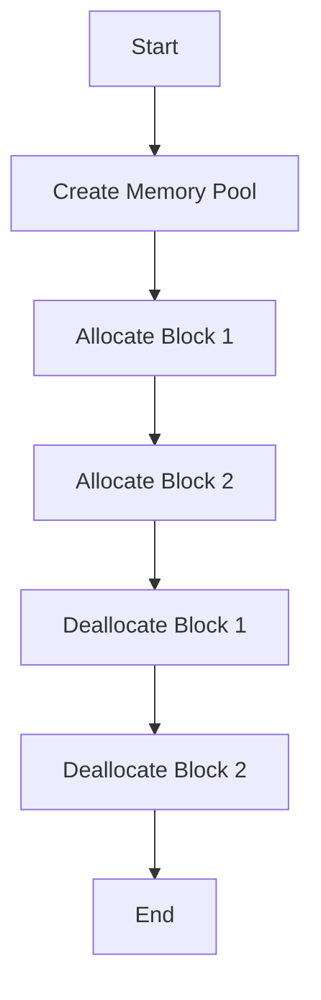

## 10.4 Memory Pools and Custom Allocators

Efficient memory management is crucial for high-performance applications, especially in C++ where developers have fine-grained control over memory allocation and deallocation. This section explores memory pools and custom allocators, two powerful techniques for optimizing memory usage and improving application performance. Let's dive into the details of implementing memory pools, using custom allocators with STL containers, and leveraging Boost pool libraries.

### Introduction to Memory Pools

Memory pools, also known as fixed-size allocators, are a memory management technique that pre-allocates a large block of memory and divides it into smaller chunks for efficient allocation and deallocation. This approach reduces the overhead associated with frequent dynamic memory operations, such as those performed by `new` and `delete`.

#### Benefits of Memory Pools

- **Reduced Fragmentation**: By allocating memory in fixed-size blocks, memory pools minimize fragmentation, which can occur with frequent allocations and deallocations of varying sizes.
- **Improved Performance**: Memory pools can significantly speed up memory allocation and deallocation by avoiding the overhead of system calls.
- **Predictable Memory Usage**: Since the memory is pre-allocated, the maximum memory usage is known in advance, making it easier to manage resources.

#### Implementing a Simple Memory Pool

Let's implement a simple memory pool in C++ to understand how it works. We'll create a memory pool that manages fixed-size blocks of memory.

```cpp
#include <iostream>
#include <vector>

class MemoryPool {
public:
    MemoryPool(size_t blockSize, size_t blockCount)
        : blockSize(blockSize), blockCount(blockCount) {
        pool.resize(blockSize * blockCount);
        for (size_t i = 0; i < blockCount; ++i) {
            freeBlocks.push_back(&pool[i * blockSize]);
        }
    }

    void* allocate() {
        if (freeBlocks.empty()) {
            throw std::bad_alloc();
        }
        void* block = freeBlocks.back();
        freeBlocks.pop_back();
        return block;
    }

    void deallocate(void* block) {
        freeBlocks.push_back(block);
    }

private:
    size_t blockSize;
    size_t blockCount;
    std::vector<char> pool;
    std::vector<void*> freeBlocks;
};

int main() {
    MemoryPool pool(32, 10); // Create a pool for 10 blocks of 32 bytes each

    void* block1 = pool.allocate();
    void* block2 = pool.allocate();

    pool.deallocate(block1);
    pool.deallocate(block2);

    return 0;
}
```

In this example, the `MemoryPool` class manages a pool of memory blocks. The `allocate` method provides a block of memory, and the `deallocate` method returns a block to the pool. This implementation uses a vector to store the pool and another vector to manage free blocks.

### Using Custom Allocators with STL Containers

C++ Standard Template Library (STL) containers, such as `std::vector`, `std::list`, and `std::map`, use allocators to manage memory. By default, these containers use the `std::allocator`, but you can provide a custom allocator to control memory allocation.

#### Creating a Custom Allocator

A custom allocator must implement the following member types and functions:

- **Member Types**: `value_type`, `pointer`, `const_pointer`, `reference`, `const_reference`, `size_type`, `difference_type`, `rebind`.
- **Member Functions**: `allocate`, `deallocate`, `construct`, `destroy`.

Here's an example of a simple custom allocator:

```cpp
#include <memory>
#include <iostream>

template <typename T>
class CustomAllocator {
public:
    using value_type = T;

    CustomAllocator() = default;

    template <typename U>
    CustomAllocator(const CustomAllocator<U>&) {}

    T* allocate(std::size_t n) {
        std::cout << "Allocating " << n << " elements." << std::endl;
        return static_cast<T*>(::operator new(n * sizeof(T)));
    }

    void deallocate(T* p, std::size_t n) {
        std::cout << "Deallocating " << n << " elements." << std::endl;
        ::operator delete(p);
    }
};

template <typename T, typename U>
bool operator==(const CustomAllocator<T>&, const CustomAllocator<U>&) {
    return true;
}

template <typename T, typename U>
bool operator!=(const CustomAllocator<T>&, const CustomAllocator<U>&) {
    return false;
}

int main() {
    std::vector<int, CustomAllocator<int>> vec;
    vec.push_back(1);
    vec.push_back(2);
    vec.push_back(3);

    for (int i : vec) {
        std::cout << i << " ";
    }
    std::cout << std::endl;

    return 0;
}
```

In this example, the `CustomAllocator` class provides custom memory allocation and deallocation for a `std::vector`. The `allocate` and `deallocate` methods are overridden to include custom behavior, such as logging allocation and deallocation events.

### Boost Pool Libraries

Boost provides a set of libraries for memory management, including pool libraries that offer efficient memory allocation and deallocation. These libraries are part of the Boost C++ Libraries, a collection of peer-reviewed, portable C++ source libraries.

#### Overview of Boost Pool Libraries

Boost pool libraries offer several types of memory pools, including:

- **Pool**: A simple memory pool for fixed-size blocks.
- **Object Pool**: A memory pool for objects of a specific type.
- **Singleton Pool**: A memory pool shared across multiple instances.
- **Pool Allocator**: An allocator that uses a memory pool for allocation.

#### Using Boost Pool Libraries

To use Boost pool libraries, you need to include the necessary headers and link against the Boost libraries. Here's an example of using a Boost pool:

```cpp
#include <boost/pool/pool.hpp>
#include <iostream>

int main() {
    boost::pool<> pool(sizeof(int)); // Create a pool for integers

    int* p1 = static_cast<int*>(pool.malloc());
    int* p2 = static_cast<int*>(pool.malloc());

    *p1 = 10;
    *p2 = 20;

    std::cout << *p1 << " " << *p2 << std::endl;

    pool.free(p1);
    pool.free(p2);

    return 0;
}
```

In this example, a Boost pool is created for integers, and memory is allocated and deallocated using the `malloc` and `free` methods. Boost pools provide efficient memory management with minimal overhead.

### Visualizing Memory Pool Operations

To better understand how memory pools work, let's visualize the allocation and deallocation process using a diagram.



This flowchart illustrates the sequence of operations in a memory pool, from creating the pool to allocating and deallocating memory blocks.

### Design Considerations for Memory Pools and Custom Allocators

When implementing memory pools and custom allocators, consider the following design aspects:

- **Block Size**: Choose an appropriate block size based on the expected usage pattern. Smaller blocks may lead to higher fragmentation, while larger blocks may waste memory.
- **Thread Safety**: Ensure that memory pools and custom allocators are thread-safe if used in a multithreaded environment. Consider using synchronization mechanisms such as mutexes or atomic operations.
- **Performance**: Measure the performance impact of using memory pools and custom allocators. While they can improve performance, they may also introduce overhead if not implemented efficiently.
- **Flexibility**: Design memory pools and custom allocators to be flexible and adaptable to different use cases. Consider providing configuration options for block size, pool size, and other parameters.

### Differences and Similarities with Other Patterns

Memory pools and custom allocators are often compared to other memory management patterns, such as:

- **Garbage Collection**: Unlike garbage collection, memory pools and custom allocators require explicit memory management by the developer. They provide more control but also require more effort to manage memory correctly.
- **Smart Pointers**: Smart pointers automate memory management by managing the lifecycle of objects. They complement memory pools and custom allocators by providing automatic deallocation and preventing memory leaks.
- **RAII (Resource Acquisition Is Initialization)**: RAII is a design pattern that ties resource management to object lifetime. Memory pools and custom allocators can be used in conjunction with RAII to manage memory resources efficiently.

### Try It Yourself

Now that we've covered the basics of memory pools and custom allocators, try modifying the code examples to experiment with different block sizes, pool sizes, and allocation patterns. Observe how these changes affect performance and memory usage.

### Knowledge Check

To reinforce your understanding, consider the following questions:

- What are the main benefits of using memory pools?
- How do custom allocators differ from the default `std::allocator`?
- What are some design considerations when implementing memory pools?
- How can Boost pool libraries help in managing memory efficiently?

### Conclusion

Memory pools and custom allocators are powerful tools for optimizing memory management in C++ applications. By understanding and implementing these techniques, you can improve performance, reduce fragmentation, and gain greater control over memory usage. Remember, this is just the beginning. As you progress, you'll build more complex and efficient memory management solutions. Keep experimenting, stay curious, and enjoy the journey!

## Quiz Time!



### What is a primary benefit of using memory pools?

- [x] Reduced memory fragmentation
- [ ] Automatic garbage collection
- [ ] Increased memory usage
- [ ] Simplified code structure

> **Explanation:** Memory pools reduce fragmentation by allocating memory in fixed-size blocks, which minimizes the gaps between allocations.

### Which function must a custom allocator implement?

- [x] allocate
- [ ] init
- [ ] copy
- [ ] resize

> **Explanation:** A custom allocator must implement the `allocate` function to provide memory allocation functionality.

### What is the role of Boost pool libraries?

- [x] Efficient memory allocation and deallocation
- [ ] Automatic memory management
- [ ] Simplifying syntax
- [ ] Enhancing security

> **Explanation:** Boost pool libraries provide efficient memory management by offering various types of memory pools for different use cases.

### How does a memory pool improve performance?

- [x] By reducing the overhead of frequent dynamic memory operations
- [ ] By increasing the size of memory blocks
- [ ] By using garbage collection
- [ ] By simplifying code logic

> **Explanation:** Memory pools improve performance by reducing the overhead associated with frequent dynamic memory operations like `new` and `delete`.

### What is a key consideration when designing a memory pool?

- [x] Block size
- [ ] Color of the code
- [ ] Number of functions
- [ ] Type of variables

> **Explanation:** Choosing an appropriate block size is crucial for balancing memory usage and fragmentation.

### Which of the following is NOT a type of Boost pool?

- [ ] Pool
- [ ] Object Pool
- [ ] Singleton Pool
- [x] Dynamic Pool

> **Explanation:** Boost provides Pool, Object Pool, and Singleton Pool, but not a Dynamic Pool.

### What does RAII stand for?

- [x] Resource Acquisition Is Initialization
- [ ] Random Access Is Immediate
- [ ] Resource Allocation Is Immediate
- [ ] Random Allocation Is Initialization

> **Explanation:** RAII stands for Resource Acquisition Is Initialization, a pattern that ties resource management to object lifetime.

### How can you ensure thread safety in memory pools?

- [x] By using synchronization mechanisms like mutexes
- [ ] By avoiding memory pools
- [ ] By using larger block sizes
- [ ] By reducing the number of allocations

> **Explanation:** Thread safety can be ensured by using synchronization mechanisms such as mutexes or atomic operations.

### What is the main difference between memory pools and garbage collection?

- [x] Memory pools require explicit memory management
- [ ] Memory pools automatically manage memory
- [ ] Garbage collection is faster
- [ ] Garbage collection uses fixed-size blocks

> **Explanation:** Memory pools require explicit memory management by the developer, unlike garbage collection, which automatically manages memory.

### True or False: Custom allocators can be used with STL containers.

- [x] True
- [ ] False

> **Explanation:** Custom allocators can be used with STL containers to control memory allocation and deallocation.


