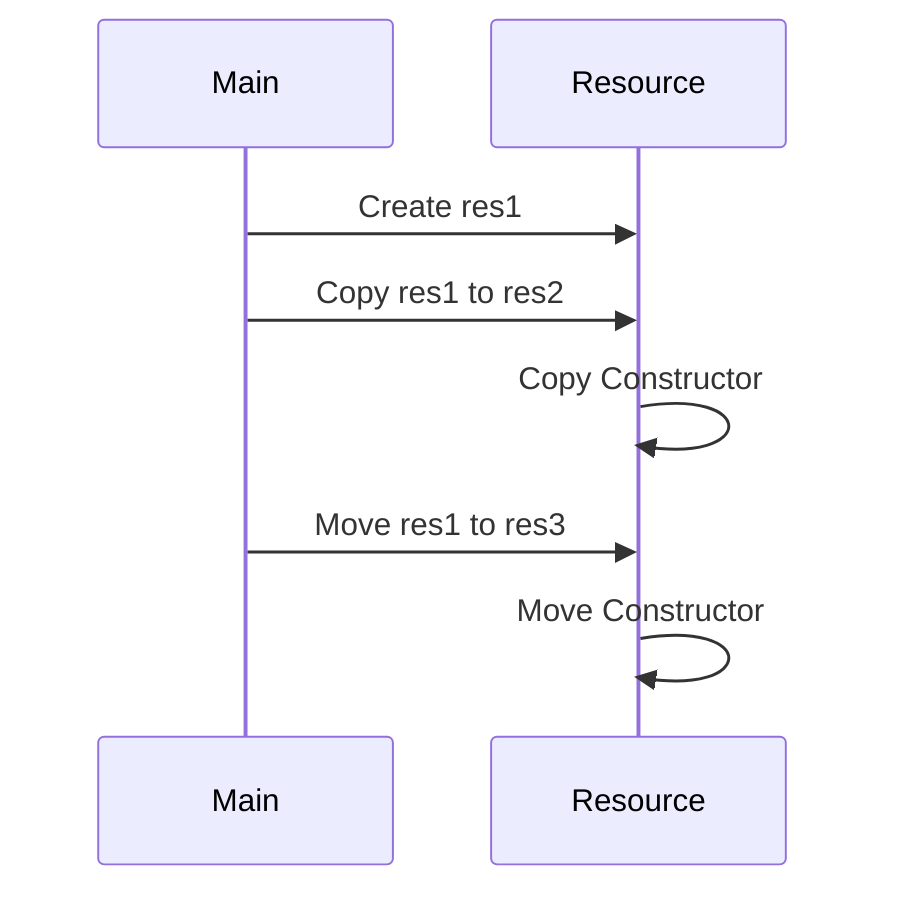

## 10.5 Copy Control and Resource Management

In C++ programming, managing resources efficiently is crucial for building robust, scalable, and maintainable applications. This section delves into the principles of copy control and resource management, focusing on the Rule of Three, Five, and Zero. By understanding these rules, you can ensure that your C++ classes handle resources correctly, avoiding common pitfalls such as memory leaks and undefined behavior.

### The Rule of Three, Five, and Zero

The Rule of Three, Five, and Zero are guidelines for managing resources in C++ classes. They help you decide when and how to define special member functions: the destructor, copy constructor, copy assignment operator, move constructor, and move assignment operator.

#### Rule of Three

The Rule of Three states that if a class requires a user-defined destructor, copy constructor, or copy assignment operator, it likely needs all three. This rule arises because these functions are responsible for managing the class's resources, such as dynamic memory, file handles, or network connections.

##### Destructor

The destructor is a special member function that cleans up resources when an object goes out of scope or is explicitly deleted. If your class allocates resources that need to be released, you must define a destructor.

```cpp
class Resource {
public:
    Resource() {
        data = new int[100]; // Allocate memory
    }

    ~Resource() {
        delete[] data; // Release memory
    }

private:
    int* data;
};
```

##### Copy Constructor

The copy constructor initializes a new object as a copy of an existing object. If your class manages resources, you must define a copy constructor to ensure that the resources are copied correctly.

```cpp
class Resource {
public:
    Resource() {
        data = new int[100];
    }

    Resource(const Resource& other) {
        data = new int[100];
        std::copy(other.data, other.data + 100, data);
    }

    ~Resource() {
        delete[] data;
    }

private:
    int* data;
};
```

##### Copy Assignment Operator

The copy assignment operator assigns the contents of one object to another existing object. Like the copy constructor, it must ensure that resources are copied correctly.

```cpp
class Resource {
public:
    Resource() {
        data = new int[100];
    }

    Resource(const Resource& other) {
        data = new int[100];
        std::copy(other.data, other.data + 100, data);
    }

    Resource& operator=(const Resource& other) {
        if (this != &other) {
            delete[] data; // Release old memory
            data = new int[100];
            std::copy(other.data, other.data + 100, data);
        }
        return *this;
    }

    ~Resource() {
        delete[] data;
    }

private:
    int* data;
};
```

#### Rule of Five

With the introduction of move semantics in C++11, the Rule of Three expanded to the Rule of Five. This rule includes the move constructor and move assignment operator, which optimize resource management by transferring resources instead of copying them.

##### Move Constructor

The move constructor transfers resources from a temporary object to a new object, leaving the temporary object in a valid but unspecified state.

```cpp
class Resource {
public:
    Resource() {
        data = new int[100];
    }

    Resource(const Resource& other) {
        data = new int[100];
        std::copy(other.data, other.data + 100, data);
    }

    Resource(Resource&& other) noexcept : data(other.data) {
        other.data = nullptr; // Leave the temporary object in a safe state
    }

    Resource& operator=(const Resource& other) {
        if (this != &other) {
            delete[] data;
            data = new int[100];
            std::copy(other.data, other.data + 100, data);
        }
        return *this;
    }

    Resource& operator=(Resource&& other) noexcept {
        if (this != &other) {
            delete[] data;
            data = other.data;
            other.data = nullptr;
        }
        return *this;
    }

    ~Resource() {
        delete[] data;
    }

private:
    int* data;
};
```

##### Move Assignment Operator

The move assignment operator transfers resources from a temporary object to an existing object, again leaving the temporary object in a valid but unspecified state.

#### Rule of Zero

The Rule of Zero advocates for designing classes that do not manage resources directly, thus avoiding the need to define any of the special member functions. By using RAII (Resource Acquisition Is Initialization) and standard library components like smart pointers, you can often adhere to this rule.

```cpp
#include <memory>

class Resource {
public:
    Resource() : data(std::make_unique<int[]>(100)) {}

private:
    std::unique_ptr<int[]> data;
};
```

### Implementing Proper Copy and Move Semantics

Implementing proper copy and move semantics ensures that your classes handle resources efficiently and safely. Let's explore some best practices and considerations.

#### Use Smart Pointers

Smart pointers, such as `std::unique_ptr` and `std::shared_ptr`, automatically manage the lifetime of dynamically allocated resources, making it easier to follow the Rule of Zero.

```cpp
#include <memory>

class Resource {
public:
    Resource() : data(std::make_unique<int[]>(100)) {}

private:
    std::unique_ptr<int[]> data;
};
```

#### Avoid Resource Leaks

Always ensure that resources are released when they are no longer needed. Use RAII to tie resource management to object lifetime.

#### Handle Self-Assignment

In the copy assignment operator, always check for self-assignment to avoid unnecessary work and potential errors.

```cpp
Resource& operator=(const Resource& other) {
    if (this != &other) {
        delete[] data;
        data = new int[100];
        std::copy(other.data, other.data + 100, data);
    }
    return *this;
}
```

#### Use `noexcept` with Move Operations

Mark move constructors and move assignment operators as `noexcept` to enable optimizations and ensure exception safety.

```cpp
Resource(Resource&& other) noexcept : data(other.data) {
    other.data = nullptr;
}

Resource& operator=(Resource&& other) noexcept {
    if (this != &other) {
        delete[] data;
        data = other.data;
        other.data = nullptr;
    }
    return *this;
}
```

#### Prefer `std::move` for Efficiency

Use `std::move` to explicitly indicate that an object can be moved, enabling move semantics.

```cpp
Resource res1;
Resource res2 = std::move(res1); // Move constructor is called
```

### Visualizing Copy and Move Semantics

To better understand the flow of copy and move operations, let's visualize the process using a sequence diagram.



**Diagram Description:** This sequence diagram illustrates the creation of a `Resource` object (`res1`), followed by a copy operation to `res2` using the copy constructor, and a move operation to `res3` using the move constructor.

### Try It Yourself

Experiment with the provided code examples by modifying them to handle different types of resources, such as file handles or network connections. Implement additional error checking and exception handling to make the classes more robust.

### References and Links

- [C++ Core Guidelines](https://isocpp.github.io/CppCoreGuidelines/CppCoreGuidelines)
- [C++ Reference: std::unique_ptr](https://en.cppreference.com/w/cpp/memory/unique_ptr)
- [C++ Reference: std::shared_ptr](https://en.cppreference.com/w/cpp/memory/shared_ptr)

### Knowledge Check

- What is the Rule of Three, and why is it important?
- How does the Rule of Five extend the Rule of Three?
- What are the benefits of using smart pointers in C++?
- How can `noexcept` improve the performance of move operations?
- Why is self-assignment checking necessary in the copy assignment operator?

### Embrace the Journey

Remember, mastering copy control and resource management in C++ is a journey that requires practice and experimentation. As you explore these concepts, you'll develop a deeper understanding of how to build efficient and reliable software. Keep experimenting, stay curious, and enjoy the journey!

## Quiz Time!



### What is the Rule of Three?

- [x] If a class requires a user-defined destructor, copy constructor, or copy assignment operator, it likely needs all three.
- [ ] A guideline for optimizing move semantics.
- [ ] A rule for defining default constructors.
- [ ] A principle for avoiding resource leaks.

> **Explanation:** The Rule of Three states that if a class requires a user-defined destructor, copy constructor, or copy assignment operator, it likely needs all three to manage resources correctly.

### How does the Rule of Five extend the Rule of Three?

- [x] By including the move constructor and move assignment operator.
- [ ] By adding default constructors.
- [ ] By removing the need for a destructor.
- [ ] By focusing on exception handling.

> **Explanation:** The Rule of Five extends the Rule of Three by including the move constructor and move assignment operator, which optimize resource management with move semantics.

### What is the primary benefit of using smart pointers?

- [x] They automatically manage the lifetime of dynamically allocated resources.
- [ ] They increase the speed of resource allocation.
- [ ] They eliminate the need for destructors.
- [ ] They simplify the syntax for pointer arithmetic.

> **Explanation:** Smart pointers like `std::unique_ptr` and `std::shared_ptr` automatically manage the lifetime of dynamically allocated resources, reducing the risk of memory leaks.

### Why should move constructors and move assignment operators be marked as `noexcept`?

- [x] To enable optimizations and ensure exception safety.
- [ ] To prevent the function from being called.
- [ ] To allow the function to throw exceptions.
- [ ] To improve readability.

> **Explanation:** Marking move constructors and move assignment operators as `noexcept` allows the compiler to perform certain optimizations and ensures that these operations are exception-safe.

### Why is self-assignment checking necessary in the copy assignment operator?

- [x] To avoid unnecessary work and potential errors.
- [ ] To increase the speed of the operation.
- [ ] To simplify the code.
- [ ] To ensure the destructor is called.

> **Explanation:** Self-assignment checking is necessary to avoid unnecessary work and potential errors when an object is assigned to itself.

### What is the Rule of Zero?

- [x] A guideline advocating for designing classes that do not manage resources directly.
- [ ] A rule for defining default constructors.
- [ ] A principle for optimizing move semantics.
- [ ] A guideline for avoiding resource leaks.

> **Explanation:** The Rule of Zero advocates for designing classes that do not manage resources directly, often by using RAII and standard library components like smart pointers.

### What is the purpose of `std::move`?

- [x] To explicitly indicate that an object can be moved, enabling move semantics.
- [ ] To copy an object.
- [ ] To delete an object.
- [ ] To initialize an object.

> **Explanation:** `std::move` is used to explicitly indicate that an object can be moved, enabling move semantics and allowing resources to be transferred efficiently.

### What is RAII?

- [x] Resource Acquisition Is Initialization, a technique that ties resource management to object lifetime.
- [ ] A method for optimizing move semantics.
- [ ] A principle for defining default constructors.
- [ ] A guideline for avoiding resource leaks.

> **Explanation:** RAII stands for Resource Acquisition Is Initialization, a technique that ties resource management to object lifetime, ensuring resources are released when an object is destroyed.

### How can you avoid resource leaks in C++?

- [x] By using RAII and smart pointers.
- [ ] By avoiding the use of destructors.
- [ ] By relying on garbage collection.
- [ ] By using global variables.

> **Explanation:** Using RAII and smart pointers ensures that resources are automatically released when they are no longer needed, preventing resource leaks.

### True or False: The move constructor transfers resources from a temporary object to a new object, leaving the temporary object in an invalid state.

- [ ] True
- [x] False

> **Explanation:** The move constructor transfers resources from a temporary object to a new object, leaving the temporary object in a valid but unspecified state.


