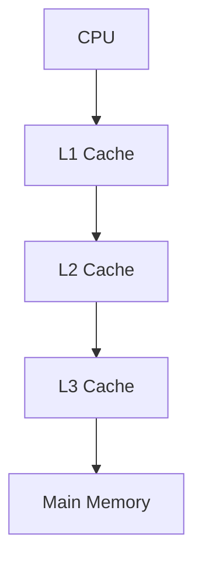
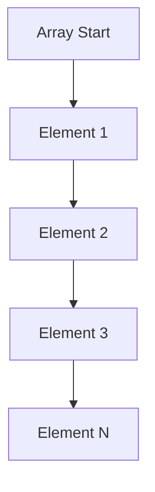

## 10.6 Cache Optimization

In the realm of high-performance C++ programming, understanding and optimizing cache usage is paramount. The cache is a small, fast memory located close to the CPU, designed to store frequently accessed data and instructions. Efficient cache usage can significantly enhance the performance of your applications by reducing the time the CPU spends waiting for data from the main memory. In this section, we will delve into the intricacies of cache hierarchies, explore strategies for optimizing data structures and access patterns, and introduce the concept of data-oriented design.

### Understanding Cache Hierarchies

To optimize cache usage, it's crucial to understand how cache hierarchies are structured. Modern CPUs typically have multiple levels of cache, each with different sizes and speeds. Let's explore these levels:

1. **L1 Cache**: The smallest and fastest cache, typically split into separate instruction and data caches. It is located closest to the CPU cores.
2. **L2 Cache**: Larger than L1, but slower. It serves as a backup for L1 and is shared among a few cores.
3. **L3 Cache**: Even larger and slower, shared across all cores in a CPU. It acts as a last-level cache before accessing the main memory.

#### Cache Line and Cache Misses

A cache line is the smallest unit of data that can be transferred between the cache and main memory. Understanding cache lines is crucial for optimizing data access patterns. Cache misses occur when the data requested by the CPU is not found in the cache, leading to a time-consuming fetch from the main memory. There are three types of cache misses:

- **Cold Miss**: Occurs when data is accessed for the first time.
- **Capacity Miss**: Happens when the cache cannot contain all the data needed by the application.
- **Conflict Miss**: Arises when multiple data blocks compete for the same cache line.

### Optimizing Data Structures and Access Patterns

Efficient data structures and access patterns can significantly reduce cache misses. Here are some strategies to consider:

#### Spatial and Temporal Locality

- **Spatial Locality**: Accessing data elements that are close to each other in memory. For example, iterating over an array sequentially leverages spatial locality.
- **Temporal Locality**: Accessing the same data element multiple times within a short period. Caching frequently accessed data can exploit temporal locality.

#### Example: Optimizing Array Access

Consider a simple example of iterating over a 2D array:

```cpp
#include <iostream>
#include <vector>

void processMatrix(std::vector<std::vector<int>>& matrix) {
    size_t rows = matrix.size();
    size_t cols = matrix[0].size();

    // Row-major order iteration
    for (size_t i = 0; i < rows; ++i) {
        for (size_t j = 0; j < cols; ++j) {
            matrix[i][j] *= 2; // Process each element
        }
    }
}

int main() {
    std::vector<std::vector<int>> matrix(1000, std::vector<int>(1000, 1));
    processMatrix(matrix);
    return 0;
}
```

In this example, the matrix is accessed in a row-major order, which is cache-friendly due to spatial locality. Accessing elements in a column-major order would lead to more cache misses.

#### Data Alignment and Padding

Data alignment ensures that data structures are aligned to cache line boundaries, reducing cache misses. Padding can be used to align data structures manually. Consider the following struct:

```cpp
struct AlignedData {
    alignas(64) int data[16]; // Align to 64-byte cache line
};
```

Using the `alignas` keyword, we can align the `data` array to a 64-byte boundary, which is typical for cache lines.

### Data-Oriented Design

Data-oriented design (DOD) is an approach that emphasizes organizing code around data structures rather than functions. This design paradigm aims to optimize data access patterns and leverage cache efficiency. Let's explore how DOD can be applied in C++.

#### Principles of Data-Oriented Design

1. **Focus on Data**: Identify the most critical data and organize your code around it.
2. **Optimize Data Layout**: Arrange data in memory to minimize cache misses.
3. **Separate Data and Behavior**: Decouple data structures from the functions that operate on them.

#### Example: Transforming Object-Oriented Code to Data-Oriented Design

Consider an object-oriented approach to a particle system:

```cpp
class Particle {
public:
    float x, y, z; // Position
    float vx, vy, vz; // Velocity

    void update(float dt) {
        x += vx * dt;
        y += vy * dt;
        z += vz * dt;
    }
};

std::vector<Particle> particles(1000);
```

In a data-oriented design, we separate data from behavior:

```cpp
struct ParticleData {
    std::vector<float> x, y, z;
    std::vector<float> vx, vy, vz;
};

void updateParticles(ParticleData& data, float dt) {
    for (size_t i = 0; i < data.x.size(); ++i) {
        data.x[i] += data.vx[i] * dt;
        data.y[i] += data.vy[i] * dt;
        data.z[i] += data.vz[i] * dt;
    }
}

ParticleData particles;
particles.x.resize(1000);
particles.y.resize(1000);
particles.z.resize(1000);
particles.vx.resize(1000);
particles.vy.resize(1000);
particles.vz.resize(1000);
```

In this example, data is stored in contiguous arrays, improving cache efficiency by leveraging spatial locality.

### Visualizing Cache Optimization

To better understand cache optimization, let's visualize the concept of cache hierarchies and data access patterns using Mermaid.js diagrams.

#### Cache Hierarchy Diagram



*Caption: This diagram illustrates the hierarchy of caches in a typical CPU architecture, showing the flow of data from the CPU to the main memory.*

#### Data Access Pattern Diagram



*Caption: This diagram represents a sequential access pattern in an array, which is cache-friendly due to spatial locality.*

### Try It Yourself

To gain a deeper understanding of cache optimization, try modifying the code examples provided. Experiment with different data layouts, access patterns, and alignment strategies. Observe the impact on performance using profiling tools such as `gprof` or `Valgrind`.

### References and Further Reading

- [Intel's Optimization Reference Manual](https://www.intel.com/content/www/us/en/developer/articles/technical/intel-sdm.html)
- [Agner Fog's Optimizing Software in C++](https://www.agner.org/optimize/)
- [Data-Oriented Design by Richard Fabian](https://www.dataorienteddesign.com/dodbook/)

### Knowledge Check

Let's reinforce what we've learned about cache optimization:

- Explain the difference between spatial and temporal locality.
- How can data alignment improve cache efficiency?
- What are the benefits of data-oriented design?

### Embrace the Journey

Remember, cache optimization is a journey of continuous learning and experimentation. As you delve deeper into the world of C++ performance optimization, you'll uncover new techniques and insights. Stay curious, keep experimenting, and enjoy the process of mastering cache optimization!

## Quiz Time!



### What is the primary purpose of cache in a CPU?

- [x] To store frequently accessed data and instructions close to the CPU
- [ ] To increase the size of the main memory
- [ ] To replace the need for RAM
- [ ] To slow down the CPU operations

> **Explanation:** The cache is designed to store frequently accessed data and instructions close to the CPU to reduce the time the CPU spends waiting for data from the main memory.

### Which type of cache miss occurs when data is accessed for the first time?

- [x] Cold Miss
- [ ] Capacity Miss
- [ ] Conflict Miss
- [ ] Temporal Miss

> **Explanation:** A cold miss occurs when data is accessed for the first time and is not found in the cache.

### What is spatial locality?

- [x] Accessing data elements that are close to each other in memory
- [ ] Accessing the same data element multiple times within a short period
- [ ] Storing data in non-contiguous memory locations
- [ ] Accessing data elements in a random order

> **Explanation:** Spatial locality refers to accessing data elements that are close to each other in memory, which is cache-friendly.

### How can data alignment improve cache efficiency?

- [x] By aligning data structures to cache line boundaries
- [ ] By increasing the size of the data structures
- [ ] By storing data in non-contiguous memory locations
- [ ] By using larger data types

> **Explanation:** Data alignment ensures that data structures are aligned to cache line boundaries, reducing cache misses and improving efficiency.

### What is the main focus of data-oriented design?

- [x] Organizing code around data structures
- [ ] Organizing code around functions
- [ ] Increasing the number of classes
- [ ] Decreasing the size of data structures

> **Explanation:** Data-oriented design focuses on organizing code around data structures to optimize data access patterns and leverage cache efficiency.

### Which cache level is typically the smallest and fastest?

- [x] L1 Cache
- [ ] L2 Cache
- [ ] L3 Cache
- [ ] Main Memory

> **Explanation:** The L1 cache is the smallest and fastest cache, located closest to the CPU cores.

### What is a conflict miss?

- [x] When multiple data blocks compete for the same cache line
- [ ] When data is accessed for the first time
- [ ] When the cache cannot contain all the data needed
- [ ] When data is accessed in a random order

> **Explanation:** A conflict miss occurs when multiple data blocks compete for the same cache line, leading to cache inefficiency.

### How does data-oriented design separate data and behavior?

- [x] By decoupling data structures from the functions that operate on them
- [ ] By combining data structures and functions into a single class
- [ ] By using inheritance to link data and behavior
- [ ] By storing data and behavior in separate files

> **Explanation:** Data-oriented design separates data and behavior by decoupling data structures from the functions that operate on them, optimizing data access patterns.

### What is the benefit of using contiguous arrays in data-oriented design?

- [x] Improved cache efficiency by leveraging spatial locality
- [ ] Reduced memory usage
- [ ] Increased complexity of code
- [ ] Decreased performance

> **Explanation:** Using contiguous arrays in data-oriented design improves cache efficiency by leveraging spatial locality, reducing cache misses.

### True or False: Data-oriented design focuses on organizing code around functions rather than data structures.

- [ ] True
- [x] False

> **Explanation:** Data-oriented design focuses on organizing code around data structures rather than functions to optimize data access patterns and leverage cache efficiency.


