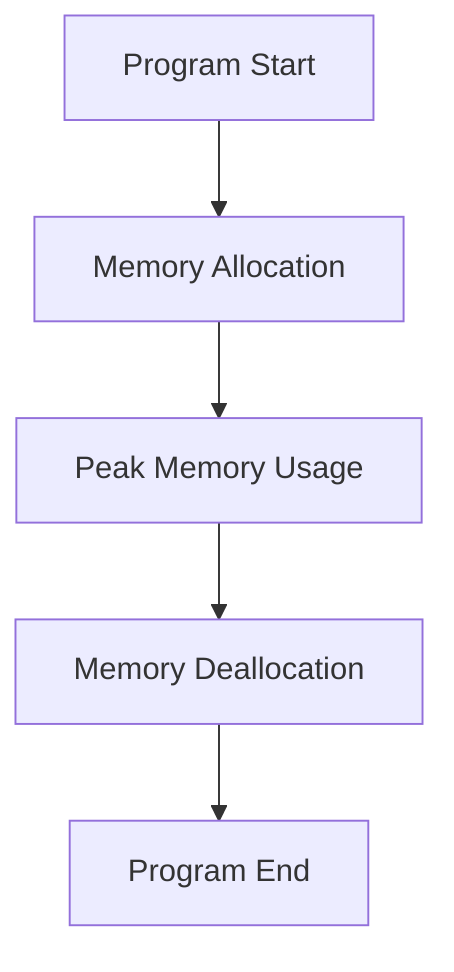

## 10.8 Profiling and Memory Leak Detection

In the realm of C++ programming, efficient memory management is crucial for developing robust and high-performance applications. Profiling and memory leak detection are essential practices that help developers identify performance bottlenecks and memory issues, ensuring that applications run smoothly and efficiently. This section delves into the tools and techniques used for profiling and memory leak detection in C++, providing expert insights and practical examples to enhance your software development skills.

### Introduction to Profiling and Memory Leak Detection

Profiling is the process of analyzing a program to determine where it spends most of its time or which parts of the code consume the most resources. Memory leak detection, on the other hand, involves identifying and resolving instances where a program fails to release memory that is no longer needed, leading to increased memory usage and potential application crashes.

#### Why Profiling and Memory Leak Detection Matter

- **Performance Optimization**: Profiling helps identify performance bottlenecks, allowing developers to optimize code for better efficiency.
- **Resource Management**: Detecting memory leaks ensures that applications use memory resources effectively, preventing unnecessary memory consumption.
- **Reliability**: Addressing memory issues enhances application stability and reduces the likelihood of crashes or unexpected behavior.
- **Scalability**: Efficient memory management is crucial for applications that need to scale, especially in resource-constrained environments.

### Tools for Profiling and Memory Leak Detection

Several tools are available to assist developers in profiling their applications and detecting memory leaks. Two of the most widely used tools in the C++ ecosystem are Valgrind and AddressSanitizer.

#### Valgrind

Valgrind is a powerful instrumentation framework for building dynamic analysis tools. It is widely used for memory debugging, memory leak detection, and profiling.

- **Memcheck**: Valgrind's Memcheck tool detects memory-related errors such as illegal memory access, use of uninitialized memory, and memory leaks.
- **Callgrind**: This tool helps profile the program's call graph, providing insights into function call frequencies and execution times.

##### Using Valgrind

To use Valgrind, you need to compile your C++ program with debugging information. This is typically done by including the `-g` flag during compilation.

```bash
g++ -g -o my_program my_program.cpp
valgrind --leak-check=full ./my_program
```

- **`--leak-check=full`**: This option provides detailed information about memory leaks, including the location in the code where the leak occurred.

Valgrind outputs a report indicating any memory leaks or errors detected during execution. Here's an example of what the output might look like:

```
==12345== 10 bytes in 1 blocks are definitely lost in loss record 1 of 1
==12345==    at 0x4C2BBAF: malloc (vg_replace_malloc.c:299)
==12345==    by 0x4005ED: main (example.cpp:5)
```

##### Interpreting Valgrind Output

- **Definitely Lost**: Memory that is unreachable and cannot be freed.
- **Indirectly Lost**: Memory that is lost because it is pointed to by another block of lost memory.
- **Possibly Lost**: Memory that is still reachable but not freed.

#### AddressSanitizer

AddressSanitizer (ASan) is a fast memory error detector for C++ programs. It is part of the LLVM and GCC compiler toolchains and is used to detect various memory-related errors, including buffer overflows, use-after-free, and memory leaks.

##### Enabling AddressSanitizer

To enable AddressSanitizer, compile your program with the `-fsanitize=address` flag:

```bash
g++ -fsanitize=address -o my_program my_program.cpp
./my_program
```

AddressSanitizer provides detailed reports on memory errors, including stack traces and memory maps, making it easier to pinpoint the source of the error.

##### Example of AddressSanitizer Output

```
==12345==ERROR: AddressSanitizer: heap-buffer-overflow on address 0x602000000014 at pc 0x0000004005f7 bp 0x7ffd5f2d9f70 sp 0x7ffd5f2d9f68
READ of size 4 at 0x602000000014 thread T0
    #0 0x4005f6 in main example.cpp:5
    #1 0x7f2c5f2d8b96 in __libc_start_main (/lib/x86_64-linux-gnu/libc.so.6+0x21b96)
    #2 0x4004c9 in _start (/path/to/my_program+0x4004c9)
```

### Best Practices for Avoiding Memory Issues

Avoiding memory issues in C++ requires a combination of good coding practices and the use of modern C++ features. Here are some best practices to help you manage memory effectively:

#### Use Smart Pointers

Smart pointers, such as `std::unique_ptr` and `std::shared_ptr`, automate memory management by ensuring that memory is released when it is no longer needed.

```cpp
#include <memory>

void example() {
    std::unique_ptr<int> ptr(new int(10)); // Automatically deleted when out of scope
}
```

#### Follow the Rule of Three/Five

Implement the destructor, copy constructor, and copy assignment operator (Rule of Three) or include the move constructor and move assignment operator (Rule of Five) to manage resource ownership correctly.

```cpp
class Resource {
public:
    Resource() { /* allocate resource */ }
    ~Resource() { /* release resource */ }
    Resource(const Resource& other) { /* copy resource */ }
    Resource& operator=(const Resource& other) { /* copy assignment */ return *this; }
    Resource(Resource&& other) noexcept { /* move resource */ }
    Resource& operator=(Resource&& other) noexcept { /* move assignment */ return *this; }
};
```

#### Avoid Raw Pointers

Minimize the use of raw pointers. If you must use them, ensure that ownership and lifetime are clearly defined and managed.

#### Use RAII (Resource Acquisition Is Initialization)

RAII is a programming idiom that ties resource management to object lifetime, ensuring that resources are acquired and released in a controlled manner.

```cpp
class FileHandle {
    FILE* file;
public:
    FileHandle(const char* filename) : file(fopen(filename, "r")) {}
    ~FileHandle() { if (file) fclose(file); }
};
```

#### Regularly Profile and Test

Incorporate profiling and memory leak detection into your development workflow. Regular testing helps catch issues early and ensures that your application remains efficient and stable.

### Analyzing Memory Usage

Analyzing memory usage involves understanding how your application allocates and deallocates memory. This can help identify patterns that lead to inefficient memory use or potential leaks.

#### Memory Profiling Tools

In addition to Valgrind and AddressSanitizer, other tools can help analyze memory usage:

- **Massif**: A heap profiler that is part of the Valgrind suite. It provides detailed information about heap memory usage over time.
- **Heaptrack**: A tool that traces all memory allocations and provides a detailed analysis of memory usage.

##### Using Massif

Massif generates a detailed report of heap memory usage, which can be visualized using tools like `massif-visualizer`.

```bash
valgrind --tool=massif ./my_program
massif-visualizer massif.out.<pid>
```

##### Example Massif Output

Massif provides a snapshot of memory usage at various points during execution, allowing you to identify peaks and analyze which parts of your code are responsible for high memory consumption.

#### Visualizing Memory Usage

Visualizing memory usage can help identify trends and patterns that may not be immediately obvious from raw data. Tools like `massif-visualizer` provide graphical representations of memory usage over time.



### Try It Yourself

To gain hands-on experience with profiling and memory leak detection, try the following exercises:

1. **Experiment with Valgrind**: Compile a simple C++ program with intentional memory leaks and use Valgrind to identify and fix them.
2. **Use AddressSanitizer**: Enable AddressSanitizer in a C++ project and introduce a buffer overflow error. Observe how AddressSanitizer reports the error and use the information to correct it.
3. **Visualize Memory Usage**: Use Massif to profile a C++ application and visualize the memory usage with `massif-visualizer`. Identify any unexpected memory peaks and investigate their causes.

### Knowledge Check

- What are the main differences between Valgrind and AddressSanitizer?
- How do smart pointers help prevent memory leaks?
- What is the Rule of Three/Five, and why is it important in C++?
- How does RAII contribute to effective memory management?

### Summary

Profiling and memory leak detection are vital components of C++ development, enabling developers to optimize performance and ensure reliable memory management. By leveraging tools like Valgrind and AddressSanitizer, and adhering to best practices, you can create efficient, stable, and scalable C++ applications. Remember, this is just the beginning. As you progress, you'll build more complex and interactive applications. Keep experimenting, stay curious, and enjoy the journey!

## Quiz Time!



### What is the primary purpose of profiling in C++ development?

- [x] To identify performance bottlenecks and optimize code efficiency.
- [ ] To automatically fix memory leaks in the code.
- [ ] To compile the code with debugging information.
- [ ] To generate documentation for the code.

> **Explanation:** Profiling is used to analyze a program's performance, identifying areas that consume the most resources or time, allowing developers to optimize these sections for better efficiency.

### Which tool is part of the Valgrind suite and is used for heap profiling?

- [ ] AddressSanitizer
- [ ] Callgrind
- [x] Massif
- [ ] Memcheck

> **Explanation:** Massif is a heap profiler in the Valgrind suite that provides detailed information about heap memory usage over time.

### How does AddressSanitizer help in memory leak detection?

- [x] By detecting various memory-related errors, including buffer overflows and use-after-free.
- [ ] By automatically freeing unused memory.
- [ ] By providing graphical representations of memory usage.
- [ ] By generating a call graph of function calls.

> **Explanation:** AddressSanitizer detects memory-related errors such as buffer overflows, use-after-free, and memory leaks, providing detailed reports to help developers identify and fix these issues.

### What is the Rule of Three/Five in C++?

- [x] A guideline for implementing destructor, copy constructor, and copy assignment operator (and move counterparts) to manage resource ownership.
- [ ] A method for optimizing memory allocation and deallocation.
- [ ] A technique for visualizing memory usage in C++ applications.
- [ ] A strategy for compiling C++ programs with debugging information.

> **Explanation:** The Rule of Three/Five is a guideline for implementing special member functions to ensure proper resource management in C++ classes.

### Which of the following is NOT a benefit of using smart pointers in C++?

- [ ] Automating memory management.
- [x] Increasing the complexity of code.
- [ ] Preventing memory leaks.
- [ ] Ensuring resources are released when no longer needed.

> **Explanation:** Smart pointers simplify memory management by automating the release of resources, reducing complexity, and preventing memory leaks.

### What does RAII stand for, and how does it help in C++?

- [x] Resource Acquisition Is Initialization; it ties resource management to object lifetime.
- [ ] Resource Allocation Is Initialization; it allocates resources at program start.
- [ ] Resource Acquisition Is Immediate; it immediately acquires resources when needed.
- [ ] Resource Allocation Is Immediate; it allocates resources as soon as they are declared.

> **Explanation:** RAII is a programming idiom that ensures resources are acquired and released in a controlled manner, tied to the lifetime of objects.

### How can you enable AddressSanitizer in a C++ program?

- [x] By compiling the program with the `-fsanitize=address` flag.
- [ ] By using the `--leak-check=full` option in Valgrind.
- [ ] By linking against the AddressSanitizer library.
- [ ] By adding `#include <asan.h>` in the source code.

> **Explanation:** AddressSanitizer is enabled by compiling the program with the `-fsanitize=address` flag, which instruments the code to detect memory errors.

### What is the purpose of using `massif-visualizer` with Massif?

- [x] To provide graphical representations of memory usage over time.
- [ ] To automatically fix memory leaks detected by Massif.
- [ ] To generate a call graph of function calls.
- [ ] To compile the program with debugging information.

> **Explanation:** `massif-visualizer` is used to visualize the memory usage data collected by Massif, providing graphical insights into memory consumption trends.

### Which of the following is a key feature of Valgrind's Memcheck tool?

- [x] Detecting illegal memory access and use of uninitialized memory.
- [ ] Generating documentation for the code.
- [ ] Compiling the code with debugging information.
- [ ] Providing graphical representations of memory usage.

> **Explanation:** Memcheck is a tool in the Valgrind suite that detects memory-related errors, such as illegal memory access and use of uninitialized memory.

### True or False: Profiling and memory leak detection are only necessary during the final stages of software development.

- [ ] True
- [x] False

> **Explanation:** Profiling and memory leak detection should be integrated into the development workflow from the early stages to catch issues early and ensure efficient and stable applications.


