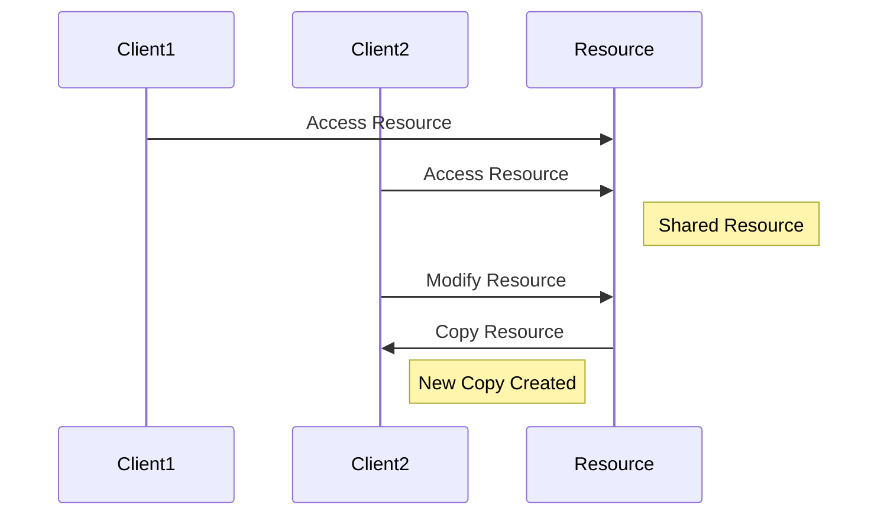
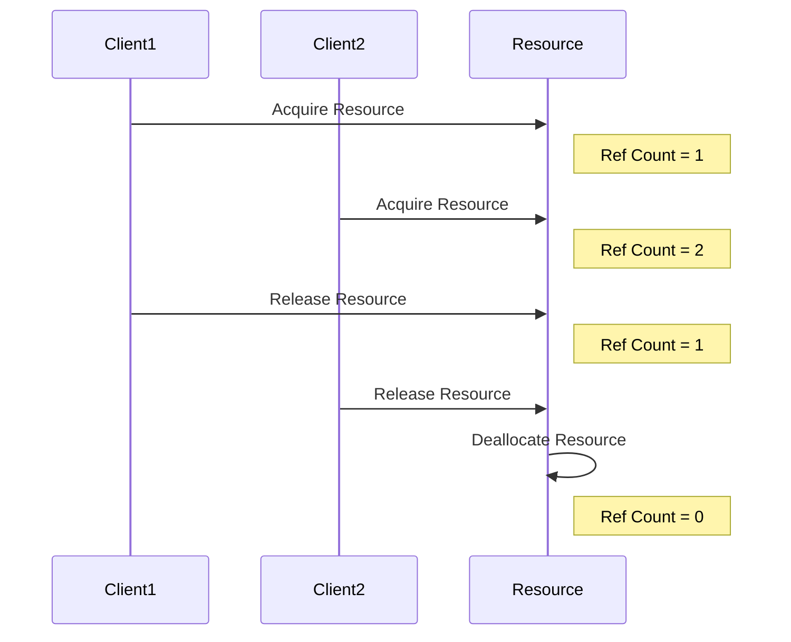

## 10.9 Copy-on-Write and Reference Counting

In the realm of C++ programming, efficient memory management is crucial for developing robust and high-performance applications. Two powerful techniques that aid in achieving this are Copy-on-Write (COW) and Reference Counting. These strategies help manage shared resources and avoid unnecessary copying, ultimately leading to optimized memory usage and improved application performance. In this section, we'll delve into these concepts, explore their implementation, and understand their significance in modern C++ programming.

### Understanding Copy-on-Write (COW)

**Copy-on-Write (COW)** is a resource management technique used to optimize memory usage by delaying the copying of an object until it is modified. This approach is particularly useful when dealing with large data structures or objects that are frequently read but rarely modified.

#### Intent of Copy-on-Write

The primary intent of Copy-on-Write is to minimize memory usage and improve performance by sharing resources until a modification is necessary. This technique is commonly used in scenarios where multiple clients need to access the same data without altering it, such as in string manipulation libraries, image processing, and more.

#### Key Participants in Copy-on-Write

- **Shared Resource**: The data or object being shared among multiple clients.
- **Reference Counter**: Tracks the number of clients sharing the resource.
- **Copy Mechanism**: Triggers a copy of the resource when a modification is attempted.

#### Applicability of Copy-on-Write

Copy-on-Write is applicable in situations where:

- Large data structures are frequently accessed but rarely modified.
- Memory usage needs to be optimized by sharing resources.
- Performance improvements are desired by avoiding unnecessary copying.

#### Implementing Copy-on-Write in C++

Let's explore how to implement Copy-on-Write in C++ with a practical example. We'll create a simple `String` class that uses COW to efficiently manage memory.

```cpp
#include <iostream>
#include <cstring>

class String {
public:
    String(const char* str = "") : data_(new Data(str)) {}

    String(const String& other) : data_(other.data_) {
        ++data_->ref_count;
    }

    ~String() {
        if (--data_->ref_count == 0) {
            delete data_;
        }
    }

    String& operator=(const String& other) {
        if (this != &other) {
            if (--data_->ref_count == 0) {
                delete data_;
            }
            data_ = other.data_;
            ++data_->ref_count;
        }
        return *this;
    }

    char& operator[](size_t index) {
        if (data_->ref_count > 1) {
            data_ = new Data(data_->str);
        }
        return data_->str[index];
    }

    const char& operator[](size_t index) const {
        return data_->str[index];
    }

    void print() const {
        std::cout << data_->str << std::endl;
    }

private:
    struct Data {
        char* str;
        size_t ref_count;

        Data(const char* str) : str(new char[strlen(str) + 1]), ref_count(1) {
            strcpy(this->str, str);
        }

        ~Data() {
            delete[] str;
        }
    };

    Data* data_;
};

int main() {
    String s1("Hello");
    String s2 = s1; // No copy, just share the data
    s2[0] = 'J';    // Copy occurs here
    s1.print();     // Outputs: Hello
    s2.print();     // Outputs: Jello
    return 0;
}
```

**Explanation:**

- **Data Structure**: The `String` class contains a nested `Data` structure that holds the actual string and a reference count.
- **Reference Counting**: The reference count tracks how many `String` objects share the same `Data`.
- **Copy-on-Write**: When a modification is attempted (e.g., `s2[0] = 'J'`), a new `Data` object is created if the reference count is greater than one, ensuring that changes do not affect other shared instances.

#### Design Considerations for Copy-on-Write

- **Thread Safety**: Ensure that reference counting and copying mechanisms are thread-safe to avoid race conditions.
- **Performance Overhead**: While COW can improve performance, the overhead of managing reference counts and copying data should be considered.
- **Use Cases**: Evaluate whether COW is suitable for your application, as it may not be beneficial for all scenarios.

### Understanding Reference Counting

**Reference Counting** is a technique used to manage the lifetime of shared resources by keeping track of how many clients are using a particular resource. When the reference count drops to zero, the resource can be safely deallocated.

#### Intent of Reference Counting

The intent of Reference Counting is to automate resource management by ensuring that resources are only deallocated when they are no longer in use. This technique is commonly used in smart pointers, garbage collection, and other memory management systems.

#### Key Participants in Reference Counting

- **Resource**: The object or data being managed.
- **Reference Counter**: An integer that tracks the number of clients using the resource.
- **Deallocation Mechanism**: Frees the resource when the reference count reaches zero.

#### Applicability of Reference Counting

Reference Counting is applicable in scenarios where:

- Resources need to be shared among multiple clients.
- Automatic memory management is desired.
- Resources should be deallocated when no longer in use.

#### Implementing Reference Counting in C++

Let's explore how to implement Reference Counting in C++ using a simple `SharedPointer` class.

```cpp
#include <iostream>

template <typename T>
class SharedPointer {
public:
    explicit SharedPointer(T* ptr = nullptr) : ptr_(ptr), ref_count_(new size_t(1)) {}

    SharedPointer(const SharedPointer& other) : ptr_(other.ptr_), ref_count_(other.ref_count_) {
        ++(*ref_count_);
    }

    ~SharedPointer() {
        if (--(*ref_count_) == 0) {
            delete ptr_;
            delete ref_count_;
        }
    }

    SharedPointer& operator=(const SharedPointer& other) {
        if (this != &other) {
            if (--(*ref_count_) == 0) {
                delete ptr_;
                delete ref_count_;
            }
            ptr_ = other.ptr_;
            ref_count_ = other.ref_count_;
            ++(*ref_count_);
        }
        return *this;
    }

    T& operator*() const {
        return *ptr_;
    }

    T* operator->() const {
        return ptr_;
    }

private:
    T* ptr_;
    size_t* ref_count_;
};

int main() {
    SharedPointer<int> sp1(new int(42));
    SharedPointer<int> sp2 = sp1; // Share the resource
    std::cout << *sp1 << std::endl; // Outputs: 42
    std::cout << *sp2 << std::endl; // Outputs: 42
    return 0;
}
```

**Explanation:**

- **Shared Resource**: The `SharedPointer` class manages a resource of type `T`.
- **Reference Counter**: A separate `size_t` pointer tracks the reference count.
- **Automatic Deallocation**: The resource is deallocated when the reference count reaches zero.

#### Design Considerations for Reference Counting

- **Circular References**: Be cautious of circular references, as they can lead to memory leaks.
- **Performance Overhead**: Reference counting introduces some overhead due to the need to manage the reference count.
- **Thread Safety**: Ensure that reference counting is thread-safe in multithreaded environments.

### Differences and Similarities

While Copy-on-Write and Reference Counting are distinct techniques, they share some similarities and differences:

- **Similarities**:
  - Both techniques aim to optimize memory usage and manage shared resources.
  - Both involve tracking the usage of resources to determine when deallocation is safe.

- **Differences**:
  - Copy-on-Write focuses on delaying copying until necessary, while Reference Counting focuses on managing the lifetime of resources.
  - Copy-on-Write is often used in scenarios where data is frequently read but rarely modified, whereas Reference Counting is used for automatic memory management.

### Visualizing Copy-on-Write and Reference Counting

To better understand these concepts, let's visualize the process of Copy-on-Write and Reference Counting using Mermaid.js diagrams.

#### Copy-on-Write Process



**Description**: This diagram illustrates the Copy-on-Write process, where multiple clients access a shared resource. When a modification is attempted, a new copy of the resource is created for the modifying client.

#### Reference Counting Process



**Description**: This diagram illustrates the Reference Counting process, where clients acquire and release a resource. The resource is deallocated when the reference count reaches zero.

### Try It Yourself

To deepen your understanding of Copy-on-Write and Reference Counting, try modifying the provided code examples:

- **Experiment with Copy-on-Write**: Modify the `String` class to handle different types of data, such as arrays or complex objects. Observe how the Copy-on-Write mechanism adapts to these changes.
- **Enhance Reference Counting**: Extend the `SharedPointer` class to include additional features, such as weak pointers or custom deleters. Test the impact of these enhancements on memory management.

### Knowledge Check

Let's reinforce what we've learned with a few questions:

1. What is the primary intent of Copy-on-Write?
2. How does Reference Counting help manage shared resources?
3. What are some potential pitfalls of using Reference Counting?
4. How can Copy-on-Write improve performance in certain scenarios?
5. What are the key differences between Copy-on-Write and Reference Counting?

### Embrace the Journey

Remember, mastering Copy-on-Write and Reference Counting is just one step in your journey to becoming an expert C++ developer. As you continue to explore these concepts, you'll gain valuable insights into memory management and optimization. Keep experimenting, stay curious, and enjoy the journey!

## Quiz Time!



### What is the primary intent of Copy-on-Write?

- [x] To minimize memory usage by sharing resources until modification is necessary
- [ ] To increase the speed of data processing
- [ ] To simplify code readability
- [ ] To enhance security features

> **Explanation:** Copy-on-Write aims to minimize memory usage by delaying the copying of resources until a modification occurs, thus sharing resources among clients.

### How does Reference Counting manage shared resources?

- [x] By tracking the number of clients using a resource and deallocating it when the count reaches zero
- [ ] By creating a new copy for each client
- [ ] By using a centralized resource manager
- [ ] By locking resources to prevent access

> **Explanation:** Reference Counting tracks the number of clients using a resource and automatically deallocates it when the reference count drops to zero.

### What is a potential pitfall of using Reference Counting?

- [x] Circular references can lead to memory leaks
- [ ] It requires complex algorithms to implement
- [ ] It is incompatible with modern C++ standards
- [ ] It does not work with smart pointers

> **Explanation:** Circular references can prevent the reference count from reaching zero, leading to memory leaks.

### How can Copy-on-Write improve performance?

- [x] By avoiding unnecessary copying of large data structures
- [ ] By increasing the CPU clock speed
- [ ] By reducing the number of function calls
- [ ] By simplifying the codebase

> **Explanation:** Copy-on-Write improves performance by sharing resources and avoiding unnecessary copying until a modification is needed.

### What is a key difference between Copy-on-Write and Reference Counting?

- [x] Copy-on-Write delays copying until modification, while Reference Counting manages resource lifetime
- [ ] Copy-on-Write is used for security, while Reference Counting is for performance
- [ ] Copy-on-Write is a hardware feature, while Reference Counting is a software technique
- [ ] Copy-on-Write is faster than Reference Counting

> **Explanation:** Copy-on-Write focuses on delaying copying, whereas Reference Counting manages the lifetime of resources through tracking usage.

### Which of the following is a common use case for Copy-on-Write?

- [x] String manipulation libraries
- [ ] Real-time data processing
- [ ] Network communication protocols
- [ ] Database management systems

> **Explanation:** Copy-on-Write is often used in string manipulation libraries to optimize memory usage when handling large strings.

### What is a common use case for Reference Counting?

- [x] Smart pointers for automatic memory management
- [ ] High-frequency trading systems
- [ ] Real-time operating systems
- [ ] Video game graphics rendering

> **Explanation:** Reference Counting is commonly used in smart pointers to manage the lifetime of dynamically allocated resources.

### What should be considered when implementing Copy-on-Write?

- [x] Thread safety and performance overhead
- [ ] Compatibility with legacy systems
- [ ] Encryption and data security
- [ ] Network latency

> **Explanation:** When implementing Copy-on-Write, it's important to consider thread safety and the potential performance overhead of managing reference counts and copying data.

### What is a benefit of using Reference Counting?

- [x] Automatic deallocation of resources when no longer in use
- [ ] Increased code complexity
- [ ] Reduced execution speed
- [ ] Enhanced security features

> **Explanation:** Reference Counting automatically deallocates resources when they are no longer in use, simplifying memory management.

### True or False: Copy-on-Write and Reference Counting can be used together in a single application.

- [x] True
- [ ] False

> **Explanation:** Copy-on-Write and Reference Counting can be used together to optimize memory usage and manage shared resources effectively.


