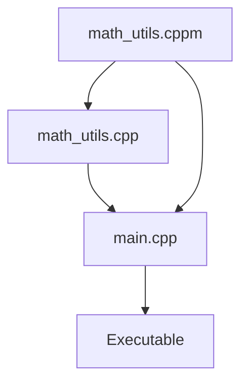

## 11.1 Module System (C++20)

The introduction of the module system in C++20 marks a significant leap forward in how we manage dependencies and organize code. This feature aims to address some of the longstanding issues associated with traditional header files, such as slow compilation times and complex dependency management. In this section, we will explore the concepts, advantages, and practical applications of the C++20 module system, providing you with the knowledge to effectively utilize this powerful feature in your projects.

### Understanding the C++20 Module System

#### What Are Modules?

Modules in C++20 are a new way to organize and encapsulate code. They provide a mechanism for defining interfaces and implementations separately, allowing for better encapsulation and reduced compilation dependencies. Unlike traditional header files, modules are designed to be self-contained units of code that can be compiled independently.

#### Key Concepts

- **Module Interface**: The part of the module that is exposed to other translation units. It defines the public API of the module.
- **Module Implementation**: The internal details of the module that are not exposed to other translation units. This is where the actual implementation of the module's functionality resides.
- **Import Declaration**: A statement used to include a module's interface in another translation unit. This replaces the traditional `#include` directive for modules.

### Advantages of Using Modules

#### Improved Compilation Times

One of the most significant benefits of using modules is the potential for improved compilation times. Traditional header files often lead to redundant parsing and compilation of the same code across multiple translation units. Modules, on the other hand, are compiled once and can be reused across different parts of a program, reducing the overall compilation workload.

#### Better Encapsulation

Modules provide a clear separation between interface and implementation, allowing developers to hide implementation details and expose only the necessary parts of a module. This leads to cleaner and more maintainable code, as the internal workings of a module can be changed without affecting other parts of the program.

#### Simplified Dependency Management

With modules, dependencies are explicitly declared through import statements, making it easier to track and manage dependencies within a project. This reduces the risk of circular dependencies and makes the build process more predictable.

### Creating and Importing Modules

Let's dive into the practical aspects of creating and using modules in C++20.

#### Creating a Module

To create a module, you need to define a module interface and, optionally, a module implementation. The module interface is defined in a file with the `.cppm` extension, while the implementation can be in a `.cpp` file.

```cpp
// math_utils.cppm
export module math_utils;

export int add(int a, int b);
export int multiply(int a, int b);
```

In this example, `math_utils` is the name of the module. The `export` keyword is used to specify which functions are part of the module's public interface.

#### Implementing the Module

The implementation of the module can be done in a separate `.cpp` file.

```cpp
// math_utils.cpp
module math_utils;

int add(int a, int b) {
    return a + b;
}

int multiply(int a, int b) {
    return a * b;
}
```

Here, we define the actual implementation of the `add` and `multiply` functions. Notice that we do not use the `export` keyword in the implementation file.

#### Importing a Module

To use a module in another translation unit, you need to import it using the `import` keyword.

```cpp
// main.cpp
import math_utils;
#include <iostream>

int main() {
    std::cout << "5 + 3 = " << add(5, 3) << std::endl;
    std::cout << "5 * 3 = " << multiply(5, 3) << std::endl;
    return 0;
}
```

In this example, we import the `math_utils` module and use its functions in the `main` function.

### Visualizing Module Interactions

To better understand how modules interact with each other and with traditional code, let's visualize the process using a diagram.



**Diagram Description**: This diagram shows the relationship between the module interface (`math_utils.cppm`), the module implementation (`math_utils.cpp`), and the main program (`main.cpp`). The module interface is imported by the main program, which then links to the module implementation to create the final executable.

### Design Considerations

When designing modules, consider the following:

- **Granularity**: Decide on the appropriate level of granularity for your modules. Too many small modules can lead to complex dependency graphs, while large modules may become difficult to maintain.
- **Backward Compatibility**: Ensure that your modules are backward compatible with existing code. This may involve providing traditional header files for parts of your codebase that are not yet modularized.
- **Build System Integration**: Update your build system to support modules. This may involve configuring your compiler and linker to recognize and handle module files.

### Differences and Similarities with Header Files

While modules and header files serve similar purposes, they have key differences:

- **Compilation**: Modules are compiled once and reused, while header files are included and compiled in every translation unit that uses them.
- **Encapsulation**: Modules provide better encapsulation by separating interface and implementation, whereas header files often expose implementation details.
- **Dependency Management**: Modules use explicit import statements, making dependencies clearer and reducing the risk of circular dependencies.

### Try It Yourself

To get hands-on experience with modules, try modifying the code examples provided:

- **Experiment with Module Interfaces**: Add more functions to the `math_utils` module and see how they can be used in the main program.
- **Create Your Own Modules**: Define a new module for a different functionality, such as string manipulation or file handling, and import it into your main program.
- **Test Compilation Times**: Compare the compilation times of a project using traditional header files versus modules to see the performance benefits firsthand.

### Conclusion

The C++20 module system represents a significant advancement in how we manage dependencies and organize code. By providing a more efficient and encapsulated way to define and use code, modules can lead to faster compilation times, better code organization, and simpler dependency management. As you continue to explore and experiment with modules, you'll discover new ways to enhance your C++ projects and improve your development workflow.

Remember, this is just the beginning. As you progress, you'll build more complex and interactive applications using modules. Keep experimenting, stay curious, and enjoy the journey!

## Quiz Time!



### What is a key advantage of using modules over traditional header files in C++20?

- [x] Improved compilation times
- [ ] Increased code verbosity
- [ ] More complex dependency management
- [ ] Larger executable sizes

> **Explanation:** Modules improve compilation times by allowing code to be compiled once and reused, unlike header files which are compiled in every translation unit.

### What keyword is used to define the public interface of a module in C++20?

- [ ] import
- [ ] module
- [x] export
- [ ] include

> **Explanation:** The `export` keyword is used to specify which parts of a module are part of its public interface.

### How do you import a module in C++20?

- [ ] #include "module_name"
- [x] import module_name;
- [ ] using module module_name;
- [ ] require module_name;

> **Explanation:** The `import` keyword is used to include a module's interface in another translation unit.

### What file extension is commonly used for module interface files in C++20?

- [ ] .hpp
- [ ] .h
- [x] .cppm
- [ ] .mod

> **Explanation:** The `.cppm` extension is commonly used for module interface files in C++20.

### Which of the following is NOT a benefit of using modules in C++20?

- [ ] Better encapsulation
- [ ] Simplified dependency management
- [ ] Improved compilation times
- [x] Increased code redundancy

> **Explanation:** Modules reduce code redundancy by allowing code to be compiled once and reused, unlike header files which can lead to redundant code compilation.

### What is the main purpose of the module implementation file in C++20?

- [ ] To define the public API of the module
- [x] To provide the actual implementation of the module's functionality
- [ ] To import other modules
- [ ] To replace the main function

> **Explanation:** The module implementation file contains the actual implementation of the module's functionality, separate from the public API defined in the module interface.

### How do modules help with dependency management in C++20?

- [x] By using explicit import statements
- [ ] By increasing the number of header files
- [ ] By requiring more complex build systems
- [ ] By hiding all dependencies

> **Explanation:** Modules use explicit import statements, making dependencies clearer and reducing the risk of circular dependencies.

### What is a potential drawback of having too many small modules?

- [ ] Improved encapsulation
- [ ] Faster compilation times
- [x] Complex dependency graphs
- [ ] Simplified code organization

> **Explanation:** Having too many small modules can lead to complex dependency graphs, making the project harder to manage.

### True or False: Modules in C++20 can completely replace traditional header files in all scenarios.

- [ ] True
- [x] False

> **Explanation:** While modules offer many advantages, they may not be suitable for all scenarios, especially in projects that require backward compatibility with older codebases.

### What is the role of the `import` keyword in C++20?

- [x] To include a module's interface in another translation unit
- [ ] To define a module's implementation
- [ ] To export functions from a module
- [ ] To replace the `main` function

> **Explanation:** The `import` keyword is used to include a module's interface in another translation unit, allowing the use of its public API.


