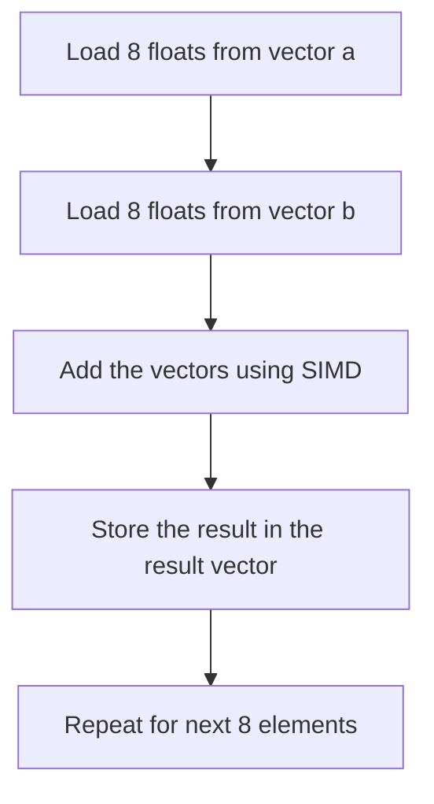

## 11.10 SIMD and Hardware Intrinsics

In the realm of high-performance computing, achieving optimal performance is often a critical requirement. Single Instruction, Multiple Data (SIMD) and hardware intrinsics are powerful tools that allow developers to write highly efficient numerical code by leveraging the capabilities of modern processors. In this section, we will explore the concepts of SIMD and hardware intrinsics, demonstrate their application in C++, and provide insights into hardware acceleration techniques.

### Understanding SIMD

**Single Instruction, Multiple Data (SIMD)** is a parallel computing architecture that allows a single instruction to be applied to multiple data points simultaneously. This is particularly useful in applications that involve repetitive operations on large datasets, such as graphics processing, scientific simulations, and machine learning.

#### Key Concepts of SIMD

- **Parallelism**: SIMD exploits data-level parallelism by performing the same operation on multiple data points concurrently.
- **Vectorization**: SIMD instructions operate on vectors, which are arrays of data elements. This is in contrast to scalar operations, which process one element at a time.
- **Efficiency**: By processing multiple data elements in a single instruction cycle, SIMD can significantly improve the performance of numerical computations.

#### SIMD in Modern Processors

Modern CPUs, such as those from Intel and AMD, include SIMD instruction sets like SSE (Streaming SIMD Extensions), AVX (Advanced Vector Extensions), and AVX-512. These instruction sets provide a range of operations for handling vectors, including arithmetic, logical, and data movement operations.

### Introduction to Hardware Intrinsics

**Hardware intrinsics** are low-level functions that provide direct access to the SIMD instructions of the CPU. They allow developers to write code that takes advantage of the processor's SIMD capabilities without resorting to assembly language.

#### Benefits of Using Intrinsics

- **Performance**: Intrinsics enable fine-grained control over SIMD operations, allowing developers to optimize performance-critical sections of code.
- **Portability**: While intrinsics are specific to a particular CPU architecture, they are often more portable than assembly language, as they can be used across different compilers that support the same architecture.
- **Ease of Use**: Intrinsics provide a higher-level interface to SIMD instructions, making them easier to use than raw assembly code.

### Writing High-Performance Numerical Code with SIMD

To illustrate the use of SIMD and hardware intrinsics in C++, let's consider a simple example: vector addition. We will demonstrate how to perform this operation using both scalar and SIMD approaches.

#### Scalar Vector Addition

```cpp
#include <vector>
#include <iostream>

void addVectorsScalar(const std::vector<float>& a, const std::vector<float>& b, std::vector<float>& result) {
    for (size_t i = 0; i < a.size(); ++i) {
        result[i] = a[i] + b[i];
    }
}

int main() {
    std::vector<float> a = {1.0f, 2.0f, 3.0f, 4.0f};
    std::vector<float> b = {5.0f, 6.0f, 7.0f, 8.0f};
    std::vector<float> result(4);

    addVectorsScalar(a, b, result);

    for (float value : result) {
        std::cout << value << " ";
    }
    std::cout << std::endl;

    return 0;
}
```

In this example, we perform vector addition using a simple loop. While this approach is straightforward, it does not take advantage of SIMD capabilities.

#### SIMD Vector Addition with Intrinsics

```cpp
#include <immintrin.h> // Header for AVX intrinsics
#include <vector>
#include <iostream>

void addVectorsSIMD(const std::vector<float>& a, const std::vector<float>& b, std::vector<float>& result) {
    size_t i = 0;
    size_t size = a.size();
    
    // Process 8 elements at a time using AVX
    for (; i + 7 < size; i += 8) {
        __m256 va = _mm256_loadu_ps(&a[i]); // Load 8 floats from a
        __m256 vb = _mm256_loadu_ps(&b[i]); // Load 8 floats from b
        __m256 vresult = _mm256_add_ps(va, vb); // Add the vectors
        _mm256_storeu_ps(&result[i], vresult); // Store the result
    }

    // Handle remaining elements
    for (; i < size; ++i) {
        result[i] = a[i] + b[i];
    }
}

int main() {
    std::vector<float> a = {1.0f, 2.0f, 3.0f, 4.0f, 5.0f, 6.0f, 7.0f, 8.0f};
    std::vector<float> b = {9.0f, 10.0f, 11.0f, 12.0f, 13.0f, 14.0f, 15.0f, 16.0f};
    std::vector<float> result(8);

    addVectorsSIMD(a, b, result);

    for (float value : result) {
        std::cout << value << " ";
    }
    std::cout << std::endl;

    return 0;
}
```

In this example, we use AVX intrinsics to perform vector addition on 8 elements at a time. The `_mm256_loadu_ps` function loads 8 floats into an AVX register, `_mm256_add_ps` performs the addition, and `_mm256_storeu_ps` stores the result back into the result vector.

### Visualizing SIMD Operations

To better understand how SIMD operations work, let's visualize the process of vector addition using a flowchart.



**Figure 1:** Flowchart of SIMD Vector Addition

### Hardware Acceleration Techniques

Beyond SIMD, hardware acceleration involves leveraging other specialized hardware features to improve performance. This can include using GPUs for parallel processing, leveraging FPGAs for custom computations, or utilizing specialized hardware instructions for cryptography or compression.

#### Techniques for Hardware Acceleration

- **GPUs**: Graphics Processing Units (GPUs) are highly parallel processors that excel at handling large-scale computations. Libraries like CUDA and OpenCL allow developers to harness GPU power for general-purpose computing.
- **FPGAs**: Field-Programmable Gate Arrays (FPGAs) can be programmed to perform specific tasks with high efficiency. They are often used in applications requiring real-time processing and low latency.
- **Specialized Instructions**: Modern CPUs include specialized instructions for tasks like encryption, compression, and machine learning. These instructions can be accessed through intrinsics or libraries.

### Practical Considerations for Using SIMD and Intrinsics

While SIMD and hardware intrinsics offer significant performance benefits, they also come with certain challenges and considerations.

#### Alignment and Data Layout

SIMD operations often require data to be aligned in memory. Misaligned data can lead to performance penalties or even runtime errors. It is important to ensure that data structures are properly aligned for SIMD operations.

#### Portability and Compatibility

SIMD intrinsics are specific to particular CPU architectures. Code that uses intrinsics may need to be adapted for different architectures or instruction sets. It is crucial to consider portability and compatibility when using SIMD in cross-platform applications.

#### Debugging and Maintenance

Code that uses SIMD and intrinsics can be more complex and harder to debug than scalar code. It is important to maintain clear documentation and comments to aid in debugging and maintenance.

### Try It Yourself

To gain hands-on experience with SIMD and hardware intrinsics, try modifying the SIMD vector addition example to perform other operations, such as subtraction or multiplication. Experiment with different data types, such as integers or doubles, and explore the impact on performance.

### Knowledge Check

Let's reinforce our understanding of SIMD and hardware intrinsics with a few questions:

- What is the primary advantage of using SIMD over scalar operations?
- How do hardware intrinsics provide access to SIMD instructions?
- What are some common challenges when using SIMD and intrinsics in C++?

### Conclusion

SIMD and hardware intrinsics are powerful tools for writing high-performance numerical code in C++. By leveraging these capabilities, developers can significantly improve the efficiency of their applications. However, it is important to consider factors such as alignment, portability, and maintainability when using SIMD and intrinsics. As you continue to explore high-performance computing, keep experimenting with SIMD and hardware acceleration techniques to unlock the full potential of modern processors.

## Quiz Time!



### What is the primary advantage of using SIMD over scalar operations?

- [x] SIMD allows multiple data points to be processed simultaneously, improving performance.
- [ ] SIMD simplifies code by reducing the number of lines.
- [ ] SIMD is easier to debug than scalar operations.
- [ ] SIMD reduces memory usage.

> **Explanation:** SIMD processes multiple data points in parallel, which enhances performance by reducing the number of instruction cycles needed.

### How do hardware intrinsics provide access to SIMD instructions?

- [x] Hardware intrinsics are low-level functions that directly map to SIMD instructions.
- [ ] Hardware intrinsics are high-level abstractions that simplify SIMD usage.
- [ ] Hardware intrinsics are only used for GPU programming.
- [ ] Hardware intrinsics are specific to a single compiler.

> **Explanation:** Hardware intrinsics provide a direct interface to the SIMD instructions of the CPU, allowing fine-grained control over SIMD operations.

### What is a common challenge when using SIMD and intrinsics in C++?

- [x] Ensuring data alignment for optimal performance.
- [ ] Writing code that is too simple.
- [ ] Lack of compiler support for SIMD.
- [ ] SIMD operations are slower than scalar operations.

> **Explanation:** SIMD operations often require aligned data, and misalignment can lead to performance penalties or errors.

### Which of the following is a hardware acceleration technique?

- [x] Using GPUs for parallel processing.
- [ ] Using scalar operations for simplicity.
- [ ] Avoiding specialized instructions.
- [ ] Writing code in assembly language.

> **Explanation:** GPUs are highly parallel processors that can be used for general-purpose computing, providing significant performance improvements.

### What is the role of AVX in SIMD operations?

- [x] AVX is an instruction set that provides SIMD operations for floating-point data.
- [ ] AVX is a compiler optimization flag.
- [ ] AVX is a debugging tool for SIMD code.
- [ ] AVX is a memory management technique.

> **Explanation:** AVX (Advanced Vector Extensions) is an instruction set that enhances SIMD capabilities, particularly for floating-point operations.

### Why is portability a concern when using SIMD intrinsics?

- [x] SIMD intrinsics are specific to particular CPU architectures.
- [ ] SIMD intrinsics are not supported by any compilers.
- [ ] SIMD intrinsics are deprecated in modern C++.
- [ ] SIMD intrinsics are only available on GPUs.

> **Explanation:** SIMD intrinsics are tied to specific CPU architectures, requiring code adaptation for different platforms.

### What is the purpose of the `_mm256_loadu_ps` intrinsic?

- [x] It loads 8 floats into an AVX register.
- [ ] It stores 8 floats from an AVX register.
- [ ] It adds two AVX registers.
- [ ] It multiplies two AVX registers.

> **Explanation:** `_mm256_loadu_ps` loads 8 floating-point values into an AVX register, preparing them for SIMD operations.

### How can you ensure data alignment for SIMD operations?

- [x] Use aligned data structures and memory allocation functions.
- [ ] Avoid using SIMD operations altogether.
- [ ] Use scalar operations to handle alignment.
- [ ] Rely on the compiler to automatically align data.

> **Explanation:** Properly aligned data structures and memory allocation functions are necessary to ensure optimal performance in SIMD operations.

### What is a benefit of using hardware intrinsics over assembly language?

- [x] Intrinsics are more portable across different compilers.
- [ ] Intrinsics are more complex to write.
- [ ] Intrinsics provide less control over the hardware.
- [ ] Intrinsics are slower than assembly language.

> **Explanation:** Hardware intrinsics offer a higher-level interface to SIMD instructions, making them more portable and easier to use than assembly language.

### True or False: SIMD operations can only be used for floating-point data.

- [ ] True
- [x] False

> **Explanation:** SIMD operations can be used for various data types, including integers and floating-point numbers, depending on the instruction set.


