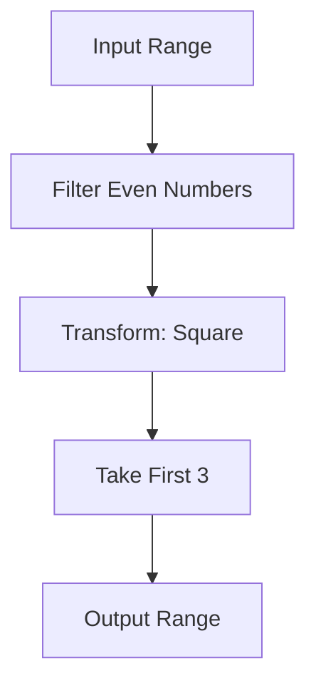

## 11.2 Ranges Library (C++20)

The C++20 Ranges Library introduces a powerful paradigm shift in how we handle collections and sequences in C++. It builds upon the Standard Template Library (STL) to provide a more expressive and flexible way to work with data. This section will delve into the core concepts of the Ranges Library, focusing on lazy evaluation, composing operations, and customizing ranges. By mastering these concepts, you can write more efficient, readable, and maintainable C++ code.

### Introduction to Ranges

The Ranges Library is a significant addition to C++20, designed to enhance the way we work with sequences of data. It aims to make code more expressive and concise by providing a set of tools to manipulate ranges of elements. A range in C++20 is an abstraction that represents a sequence of elements, similar to how iterators work but with more powerful capabilities.

#### Key Concepts

- **Range**: An abstraction representing a sequence of elements.
- **View**: A lightweight, non-owning range that can be used to transform or filter data.
- **Adaptor**: A component that modifies a range to produce a new range.
- **Lazy Evaluation**: The process of deferring computation until the result is needed, improving performance by avoiding unnecessary calculations.

### Lazy Evaluation in Ranges

Lazy evaluation is a cornerstone of the Ranges Library, allowing operations to be deferred until the results are explicitly required. This can lead to significant performance improvements, especially when dealing with large datasets or complex transformations.

#### How Lazy Evaluation Works

In traditional programming, operations on collections are often eager, meaning they are executed immediately. In contrast, lazy evaluation defers these operations, constructing a pipeline of transformations that are only executed when necessary.

Consider the following example:

```cpp
#include <iostream>
#include <ranges>
#include <vector>

int main() {
    std::vector<int> numbers = {1, 2, 3, 4, 5};

    auto even_numbers = numbers | std::views::filter([](int n) { return n % 2 == 0; });

    for (int n : even_numbers) {
        std::cout << n << " ";
    }

    return 0;
}
```

In this code, the `filter` view creates a pipeline that filters out odd numbers. However, the filtering operation is not performed until the range is iterated over in the `for` loop. This is an example of lazy evaluation, where the computation is deferred until the result is needed.

#### Benefits of Lazy Evaluation

- **Performance**: By deferring computations, you can avoid unnecessary operations, leading to faster execution times.
- **Memory Efficiency**: Lazy evaluation can reduce memory usage by not storing intermediate results.
- **Composability**: Operations can be composed into pipelines, making code more modular and easier to understand.

### Composing Operations with Ranges

One of the most powerful features of the Ranges Library is the ability to compose operations using range adaptors. This allows you to build complex data processing pipelines in a concise and readable manner.

#### Range Adaptors

Range adaptors are components that transform a range into another range. They can be chained together to form pipelines of operations. Some common adaptors include:

- **`filter`**: Filters elements based on a predicate.
- **`transform`**: Applies a function to each element.
- **`take`**: Takes the first N elements.
- **`drop`**: Drops the first N elements.

Let's see an example of composing operations using range adaptors:

```cpp
#include <iostream>
#include <ranges>
#include <vector>

int main() {
    std::vector<int> numbers = {1, 2, 3, 4, 5, 6, 7, 8, 9, 10};

    auto result = numbers 
                | std::views::filter([](int n) { return n % 2 == 0; })
                | std::views::transform([](int n) { return n * n; })
                | std::views::take(3);

    for (int n : result) {
        std::cout << n << " ";
    }

    return 0;
}
```

In this example, we filter the even numbers, square them, and then take the first three results. The operations are composed into a single pipeline, making the code concise and expressive.

#### Visualizing Range Pipelines

To better understand how range pipelines work, let's visualize the flow of data through the pipeline:



This diagram illustrates how data flows through the pipeline, with each adaptor transforming the range step by step.

### Customizing and Extending Ranges

The Ranges Library is designed to be extensible, allowing you to create custom views and adaptors to suit your specific needs.

#### Creating Custom Views

A custom view is a user-defined range that can be used to implement specialized behavior. To create a custom view, you typically define a class that models the range concept.

Here's an example of a custom view that generates a range of Fibonacci numbers:

```cpp
#include <iostream>
#include <ranges>
#include <vector>

class FibonacciView : public std::ranges::view_interface<FibonacciView> {
    size_t count_;
    mutable size_t a_ = 0, b_ = 1;

public:
    FibonacciView(size_t count) : count_(count) {}

    auto begin() const {
        return std::ranges::subrange_iterator([this]() mutable {
            if (count_ == 0) return std::ranges::default_sentinel;
            --count_;
            auto temp = a_;
            a_ = b_;
            b_ += temp;
            return temp;
        });
    }

    auto end() const {
        return std::ranges::default_sentinel;
    }
};

int main() {
    FibonacciView fib(10);

    for (auto n : fib) {
        std::cout << n << " ";
    }

    return 0;
}
```

In this example, we define a `FibonacciView` class that generates Fibonacci numbers. The view implements the `begin` and `end` methods to provide an iterator interface.

#### Extending Ranges with Custom Adaptors

Custom adaptors allow you to define new transformations that can be applied to ranges. To create a custom adaptor, you typically define a function object that takes a range and returns a new range.

Here's an example of a custom adaptor that reverses the elements of a range:

```cpp
#include <iostream>
#include <ranges>
#include <vector>

struct reverse_adaptor {
    template <std::ranges::viewable_range R>
    auto operator()(R&& r) const {
        return std::ranges::subrange(std::ranges::rbegin(r), std::ranges::rend(r));
    }
};

inline constexpr reverse_adaptor reverse;

int main() {
    std::vector<int> numbers = {1, 2, 3, 4, 5};

    auto reversed = numbers | reverse;

    for (int n : reversed) {
        std::cout << n << " ";
    }

    return 0;
}
```

In this example, we define a `reverse_adaptor` that reverses the elements of a range. We then use this adaptor in a pipeline to reverse a vector of numbers.

### Try It Yourself

To deepen your understanding of the Ranges Library, try modifying the code examples provided. Here are some suggestions:

- **Experiment with Different Adaptors**: Try using different adaptors such as `drop`, `take_while`, or `join` to see how they affect the output.
- **Create Your Own Custom View**: Implement a custom view that generates a sequence of prime numbers.
- **Combine Multiple Pipelines**: Create a pipeline that filters, transforms, and combines multiple ranges.

### Knowledge Check

Before moving on, let's review some key concepts:

- **What is lazy evaluation, and why is it beneficial?**
- **How do range adaptors enable the composition of operations?**
- **What are the steps to create a custom view or adaptor?**

### Conclusion

The Ranges Library in C++20 is a powerful tool that enhances the expressiveness and efficiency of C++ code. By leveraging lazy evaluation, composing operations with adaptors, and customizing ranges, you can write more modular and maintainable code. As you continue to explore the Ranges Library, remember to experiment with different views and adaptors to fully harness the power of this new feature.

## Quiz Time!



### What is the primary benefit of lazy evaluation in the Ranges Library?

- [x] It defers computation until results are needed, improving performance.
- [ ] It immediately executes all operations, ensuring quick results.
- [ ] It requires more memory to store intermediate results.
- [ ] It simplifies the syntax of range operations.

> **Explanation:** Lazy evaluation defers computation until results are explicitly needed, which can improve performance by avoiding unnecessary calculations.

### Which of the following is a range adaptor in the Ranges Library?

- [x] `filter`
- [ ] `sort`
- [ ] `push_back`
- [ ] `emplace`

> **Explanation:** `filter` is a range adaptor that filters elements based on a predicate. Other options are not range adaptors.

### How does the `transform` adaptor modify a range?

- [x] It applies a function to each element in the range.
- [ ] It removes elements that do not match a condition.
- [ ] It sorts the elements in ascending order.
- [ ] It duplicates each element in the range.

> **Explanation:** The `transform` adaptor applies a function to each element in the range, modifying them according to the function's logic.

### What is the purpose of a custom view in the Ranges Library?

- [x] To implement specialized behavior for a range.
- [ ] To store elements in a range.
- [ ] To sort elements in a range.
- [ ] To duplicate elements in a range.

> **Explanation:** A custom view is used to implement specialized behavior for a range, allowing for custom transformations or data generation.

### Which of the following best describes a range pipeline?

- [x] A sequence of operations composed using range adaptors.
- [ ] A collection of elements stored in a vector.
- [ ] A function that sorts elements in a range.
- [ ] A loop that iterates over a range.

> **Explanation:** A range pipeline is a sequence of operations composed using range adaptors, allowing for complex data processing.

### What is a key advantage of using range adaptors?

- [x] They enable the composition of operations in a concise and readable manner.
- [ ] They increase the memory usage of a program.
- [ ] They require more complex syntax than traditional loops.
- [ ] They are only applicable to vectors.

> **Explanation:** Range adaptors enable the composition of operations in a concise and readable manner, improving code clarity and maintainability.

### How can you create a custom adaptor in the Ranges Library?

- [x] By defining a function object that takes a range and returns a new range.
- [ ] By modifying the elements of a vector directly.
- [ ] By using a `for` loop to iterate over elements.
- [ ] By sorting elements in a range.

> **Explanation:** A custom adaptor is created by defining a function object that takes a range and returns a new range, allowing for custom transformations.

### What is the role of the `begin` and `end` methods in a custom view?

- [x] They provide an iterator interface for the view.
- [ ] They sort the elements in the view.
- [ ] They duplicate elements in the view.
- [ ] They remove elements from the view.

> **Explanation:** The `begin` and `end` methods provide an iterator interface for the view, allowing it to be used in range-based for loops.

### True or False: Lazy evaluation can reduce memory usage in a program.

- [x] True
- [ ] False

> **Explanation:** True. Lazy evaluation can reduce memory usage by not storing intermediate results, as operations are only performed when needed.

### Which C++20 feature allows for the composition of operations on ranges?

- [x] Ranges Library
- [ ] Lambda Expressions
- [ ] Smart Pointers
- [ ] Exception Handling

> **Explanation:** The Ranges Library in C++20 allows for the composition of operations on ranges, enhancing code expressiveness and efficiency.


