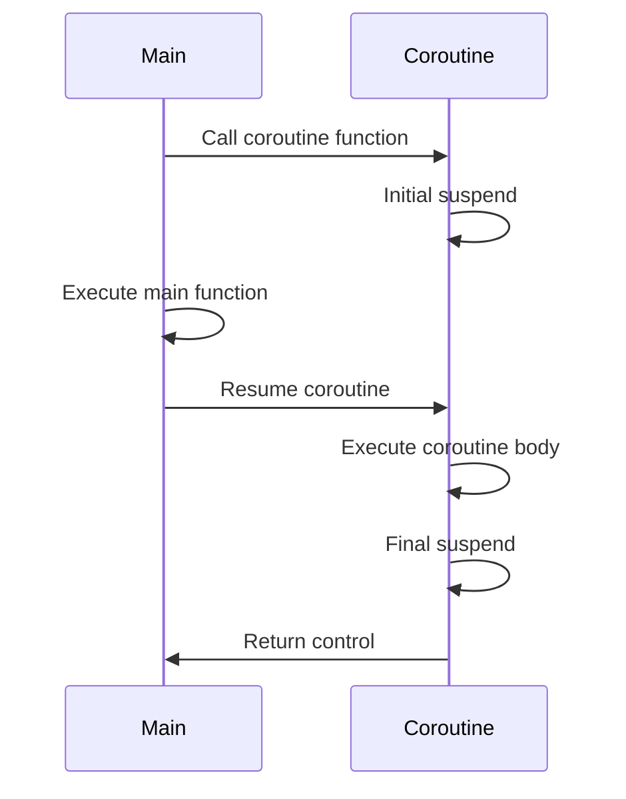

## 11.3 Coroutine Support (C++20)

In the ever-evolving world of C++ programming, C++20 introduces a powerful feature that revolutionizes asynchronous programming: coroutines. Coroutines provide a way to write asynchronous code that is both efficient and easy to understand. This section will guide you through the intricacies of C++20 coroutines, including implementing generators and async tasks, as well as managing coroutine lifetimes. By the end of this guide, you'll have a solid grasp of how to leverage coroutines to build robust and scalable applications.

### Understanding Coroutines

Coroutines are a generalization of subroutines (functions) that allow for pausing and resuming execution at certain points. Unlike traditional functions, which run to completion, coroutines can suspend their execution and later resume from the point of suspension. This capability makes them ideal for asynchronous programming, where tasks can be paused while waiting for external events (like I/O operations) to complete.

#### Key Concepts

- **Suspend and Resume**: Coroutines can suspend execution to wait for an event and resume once the event occurs.
- **Asynchronous Execution**: Coroutines enable writing non-blocking code, improving application responsiveness.
- **Generators**: Coroutines can be used to implement generators, which yield values one at a time.
- **Coroutine Lifetime**: Managing the lifecycle of coroutines is crucial to ensure resources are properly allocated and deallocated.

### Implementing Generators with Coroutines

Generators are a type of coroutine that produce a sequence of values over time. They are particularly useful when dealing with large data sets or streams, as they allow you to process data incrementally.

#### Example: Fibonacci Sequence Generator

Let's implement a simple generator for the Fibonacci sequence using C++20 coroutines.

```cpp
#include <coroutine>
#include <iostream>
#include <optional>

template<typename T>
struct Generator {
    struct promise_type {
        T current_value;
        std::suspend_always yield_value(T value) {
            current_value = value;
            return {};
        }
        std::suspend_always initial_suspend() { return {}; }
        std::suspend_always final_suspend() noexcept { return {}; }
        Generator get_return_object() { return Generator{this}; }
        void return_void() {}
        void unhandled_exception() { std::terminate(); }
    };

    struct iterator {
        std::coroutine_handle<promise_type> handle;
        bool done;

        iterator(std::coroutine_handle<promise_type> h, bool d) : handle(h), done(d) {}

        iterator& operator++() {
            handle.resume();
            done = handle.done();
            return *this;
        }

        T operator*() const { return handle.promise().current_value; }
        bool operator!=(std::default_sentinel_t) const { return !done; }
    };

    std::coroutine_handle<promise_type> handle;

    Generator(promise_type* p) : handle(std::coroutine_handle<promise_type>::from_promise(*p)) {}
    ~Generator() { if (handle) handle.destroy(); }

    iterator begin() {
        handle.resume();
        return iterator{handle, handle.done()};
    }

    std::default_sentinel_t end() { return {}; }
};

Generator<int> fibonacci() {
    int a = 0, b = 1;
    while (true) {
        co_yield a;
        auto next = a + b;
        a = b;
        b = next;
    }
}

int main() {
    for (auto i : fibonacci()) {
        if (i > 100) break;
        std::cout << i << " ";
    }
    return 0;
}
```

**Explanation**:
- **Generator Structure**: The `Generator` template class encapsulates the coroutine logic. It defines a `promise_type` that manages the coroutine state.
- **Yielding Values**: The `yield_value` method is used to yield values from the coroutine.
- **Iterator Support**: The `iterator` struct allows the generator to be used in range-based for loops.

### Asynchronous Tasks with Coroutines

Coroutines can also be used to implement asynchronous tasks, allowing you to write non-blocking code that waits for operations to complete without halting the entire program.

#### Example: Asynchronous File Reader

Consider an asynchronous file reader that reads data from a file without blocking the main thread.

```cpp
#include <coroutine>
#include <fstream>
#include <iostream>
#include <string>
#include <thread>

struct FileReader {
    struct promise_type {
        std::string current_line;
        std::suspend_always yield_value(std::string line) {
            current_line = std::move(line);
            return {};
        }
        std::suspend_always initial_suspend() { return {}; }
        std::suspend_always final_suspend() noexcept { return {}; }
        FileReader get_return_object() { return FileReader{this}; }
        void return_void() {}
        void unhandled_exception() { std::terminate(); }
    };

    struct iterator {
        std::coroutine_handle<promise_type> handle;
        bool done;

        iterator(std::coroutine_handle<promise_type> h, bool d) : handle(h), done(d) {}

        iterator& operator++() {
            handle.resume();
            done = handle.done();
            return *this;
        }

        std::string operator*() const { return handle.promise().current_line; }
        bool operator!=(std::default_sentinel_t) const { return !done; }
    };

    std::coroutine_handle<promise_type> handle;

    FileReader(promise_type* p) : handle(std::coroutine_handle<promise_type>::from_promise(*p)) {}
    ~FileReader() { if (handle) handle.destroy(); }

    iterator begin() {
        handle.resume();
        return iterator{handle, handle.done()};
    }

    std::default_sentinel_t end() { return {}; }
};

FileReader read_file(const std::string& filename) {
    std::ifstream file(filename);
    std::string line;
    while (std::getline(file, line)) {
        co_yield line;
    }
}

int main() {
    for (auto line : read_file("example.txt")) {
        std::cout << line << std::endl;
    }
    return 0;
}
```

**Explanation**:
- **FileReader Structure**: Similar to the `Generator`, `FileReader` uses a coroutine to read lines from a file asynchronously.
- **Non-blocking I/O**: The coroutine suspends after reading each line, allowing other tasks to execute concurrently.

### Managing Coroutine Lifetimes

Managing the lifecycle of coroutines is crucial to ensure that resources are properly allocated and deallocated. This involves understanding when coroutines are created, suspended, resumed, and destroyed.

#### Coroutine Lifecycle

1. **Creation**: A coroutine is created when its function is called. This initializes the coroutine state and prepares it for execution.
2. **Suspension**: The coroutine can suspend its execution at any `co_await`, `co_yield`, or `co_return` point.
3. **Resumption**: The coroutine can be resumed from the point of suspension, continuing its execution.
4. **Destruction**: Once the coroutine completes its execution or is no longer needed, it is destroyed, freeing any resources it used.

#### Example: Coroutine Lifecycle Management

Let's explore a simple example that demonstrates the lifecycle of a coroutine.

```cpp
#include <coroutine>
#include <iostream>

struct Coroutine {
    struct promise_type {
        Coroutine get_return_object() { return Coroutine{this}; }
        std::suspend_always initial_suspend() { return {}; }
        std::suspend_always final_suspend() noexcept { return {}; }
        void return_void() {}
        void unhandled_exception() { std::terminate(); }
    };

    std::coroutine_handle<promise_type> handle;

    Coroutine(promise_type* p) : handle(std::coroutine_handle<promise_type>::from_promise(*p)) {}
    ~Coroutine() { if (handle) handle.destroy(); }

    void resume() {
        if (handle) handle.resume();
    }
};

Coroutine simple_coroutine() {
    std::cout << "Coroutine started" << std::endl;
    co_await std::suspend_always{};
    std::cout << "Coroutine resumed" << std::endl;
}

int main() {
    auto coro = simple_coroutine();
    std::cout << "Main function" << std::endl;
    coro.resume();
    return 0;
}
```

**Explanation**:
- **Initial Suspension**: The coroutine suspends immediately after starting, allowing the main function to execute.
- **Resumption**: The coroutine is resumed manually, continuing its execution from the suspension point.

### Visualizing Coroutine Execution

To better understand coroutine execution, let's visualize the process using a sequence diagram.



**Diagram Description**: This sequence diagram illustrates the flow of execution between the main function and the coroutine. The coroutine suspends initially, allowing the main function to execute, and then resumes when explicitly called.

### Advanced Coroutine Concepts

C++20 coroutines offer several advanced features that enhance their flexibility and power. Understanding these concepts will enable you to write more sophisticated asynchronous code.

#### Awaitables and Awaiters

Coroutines interact with awaitable objects, which define how the coroutine should suspend and resume. An awaitable object must provide three methods:

- **await_ready**: Determines if the coroutine should suspend.
- **await_suspend**: Defines what happens when the coroutine suspends.
- **await_resume**: Specifies what happens when the coroutine resumes.

#### Example: Custom Awaitable

Let's create a custom awaitable object that simulates a delay.

```cpp
#include <coroutine>
#include <iostream>
#include <thread>
#include <chrono>

struct Delay {
    std::chrono::milliseconds duration;

    bool await_ready() const noexcept { return false; }
    void await_suspend(std::coroutine_handle<> handle) const {
        std::thread([handle, this]() {
            std::this_thread::sleep_for(duration);
            handle.resume();
        }).detach();
    }
    void await_resume() const noexcept {}
};

struct Coroutine {
    struct promise_type {
        Coroutine get_return_object() { return Coroutine{this}; }
        std::suspend_always initial_suspend() { return {}; }
        std::suspend_always final_suspend() noexcept { return {}; }
        void return_void() {}
        void unhandled_exception() { std::terminate(); }
    };

    std::coroutine_handle<promise_type> handle;

    Coroutine(promise_type* p) : handle(std::coroutine_handle<promise_type>::from_promise(*p)) {}
    ~Coroutine() { if (handle) handle.destroy(); }

    void resume() {
        if (handle) handle.resume();
    }
};

Coroutine delayed_task() {
    std::cout << "Task started" << std::endl;
    co_await Delay{std::chrono::seconds(2)};
    std::cout << "Task resumed after delay" << std::endl;
}

int main() {
    auto task = delayed_task();
    std::cout << "Main function" << std::endl;
    task.resume();
    std::this_thread::sleep_for(std::chrono::seconds(3)); // Ensure main doesn't exit early
    return 0;
}
```

**Explanation**:
- **Custom Awaitable**: The `Delay` struct implements the awaitable interface, allowing the coroutine to suspend for a specified duration.
- **Threaded Suspension**: The coroutine suspends and resumes using a separate thread, simulating an asynchronous delay.

### Coroutine Design Considerations

When designing coroutines, consider the following:

- **Resource Management**: Ensure that resources are properly managed, especially when coroutines are suspended for extended periods.
- **Error Handling**: Implement robust error handling to manage exceptions within coroutines.
- **Performance**: Coroutines can introduce overhead; optimize their usage for performance-critical applications.

### Differences and Similarities with Other Patterns

Coroutines share similarities with other asynchronous programming patterns, such as futures and promises. However, they offer unique advantages:

- **Compared to Futures/Promises**: Coroutines provide a more natural syntax for asynchronous code, avoiding the need for complex callback chains.
- **Compared to Threads**: Coroutines are more lightweight than threads, as they don't require a separate stack for each coroutine.

### Try It Yourself

Experiment with the code examples provided in this guide. Try modifying the generator to produce a different sequence or adjust the delay in the asynchronous task. Understanding how these changes affect coroutine behavior will deepen your understanding of C++20 coroutines.

### References and Further Reading

- [C++ Coroutines Proposal](http://www.open-std.org/jtc1/sc22/wg21/docs/papers/2018/p0912r5.html)
- [C++20 Standard](https://en.cppreference.com/w/cpp/20)
- [Coroutines in C++20](https://www.modernescpp.com/index.php/c-20-coroutines-theory)

### Embrace the Journey

Coroutines are a powerful tool in your C++ arsenal, enabling you to write efficient asynchronous code. As you explore coroutines further, remember that this is just the beginning. Keep experimenting, stay curious, and enjoy the journey of mastering C++20 coroutines!

## Quiz Time!



### What is a coroutine in C++20?

- [x] A generalization of subroutines that allows pausing and resuming execution.
- [ ] A function that runs to completion without interruption.
- [ ] A type of thread that can be paused and resumed.
- [ ] A method for parallel execution of code.

> **Explanation:** Coroutines are a generalization of subroutines that allow pausing and resuming execution, making them ideal for asynchronous programming.

### Which keyword is used to yield values in a coroutine?

- [x] `co_yield`
- [ ] `yield`
- [ ] `await`
- [ ] `return`

> **Explanation:** The `co_yield` keyword is used in coroutines to yield values.

### What is the purpose of the `await_ready` method in an awaitable object?

- [x] To determine if the coroutine should suspend.
- [ ] To specify what happens when the coroutine resumes.
- [ ] To define what happens when the coroutine suspends.
- [ ] To manage the coroutine's lifecycle.

> **Explanation:** The `await_ready` method determines if the coroutine should suspend immediately or not.

### How do coroutines differ from traditional threads?

- [x] Coroutines are more lightweight and do not require a separate stack.
- [ ] Coroutines provide parallel execution.
- [ ] Coroutines require more resources than threads.
- [ ] Coroutines are a type of thread.

> **Explanation:** Coroutines are more lightweight than threads and do not require a separate stack for each coroutine.

### What is the role of the `promise_type` in a coroutine?

- [x] To manage the coroutine state and lifecycle.
- [ ] To yield values from the coroutine.
- [ ] To define the coroutine's entry point.
- [ ] To handle exceptions within the coroutine.

> **Explanation:** The `promise_type` manages the coroutine state and lifecycle, including suspension and resumption.

### Which method in an awaitable object specifies what happens when the coroutine suspends?

- [x] `await_suspend`
- [ ] `await_ready`
- [ ] `await_resume`
- [ ] `await_finalize`

> **Explanation:** The `await_suspend` method specifies what happens when the coroutine suspends.

### What is a generator in the context of coroutines?

- [x] A coroutine that produces a sequence of values over time.
- [ ] A coroutine that executes tasks asynchronously.
- [ ] A coroutine that manages resources.
- [ ] A coroutine that handles exceptions.

> **Explanation:** A generator is a type of coroutine that produces a sequence of values over time.

### What is the advantage of using coroutines over futures and promises?

- [x] Coroutines provide a more natural syntax for asynchronous code.
- [ ] Coroutines are faster than futures and promises.
- [ ] Coroutines require less memory than futures and promises.
- [ ] Coroutines can handle more complex tasks than futures and promises.

> **Explanation:** Coroutines provide a more natural syntax for asynchronous code, avoiding complex callback chains.

### Which method in an awaitable object specifies what happens when the coroutine resumes?

- [x] `await_resume`
- [ ] `await_ready`
- [ ] `await_suspend`
- [ ] `await_finalize`

> **Explanation:** The `await_resume` method specifies what happens when the coroutine resumes.

### True or False: Coroutines can introduce overhead in performance-critical applications.

- [x] True
- [ ] False

> **Explanation:** Coroutines can introduce overhead, so it's important to optimize their usage in performance-critical applications.


