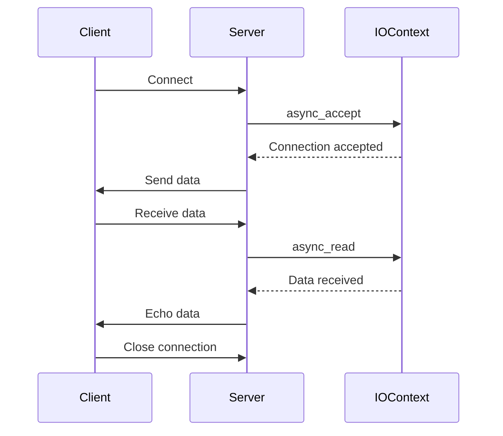

## 11.4 Networking TS (Technical Specification)

In this section, we delve into the Networking Technical Specification (TS) for C++, a significant advancement in the language that aims to standardize networking capabilities. This TS provides a foundation for implementing asynchronous I/O, a crucial aspect of modern network applications. We will explore how to leverage these features to build efficient network applications and discuss the future directions for networking in C++.

### Introduction to Networking TS

The Networking TS is a proposed extension to the C++ standard library that introduces a comprehensive set of networking capabilities. It aims to provide a consistent and portable API for network programming, addressing the need for asynchronous I/O operations in C++ applications. The TS is based on the Boost.Asio library, which has been widely used in the C++ community for network programming.

#### Key Concepts

- **Asynchronous I/O**: Enables non-blocking operations, allowing applications to perform other tasks while waiting for I/O operations to complete.
- **Networking API**: A standardized interface for network communication, including sockets, protocols, and endpoints.
- **Portability**: Ensures that network applications can run on different platforms without modification.

### Asynchronous I/O in Networking TS

Asynchronous I/O is a cornerstone of the Networking TS, enabling applications to handle multiple network operations concurrently without blocking the main execution thread. This is particularly important for high-performance applications that require efficient resource utilization.

#### Implementing Asynchronous I/O

To implement asynchronous I/O using the Networking TS, you need to understand the core components involved:

1. **IO Context**: The central object that manages asynchronous operations. It is responsible for dispatching handlers when operations complete.
2. **Sockets**: Represent endpoints for network communication. They can be used for both TCP and UDP protocols.
3. **Handlers**: Callback functions that are invoked when asynchronous operations complete.

Let's look at a simple example of setting up an asynchronous TCP server using the Networking TS:

```cpp
#include <experimental/net>
#include <iostream>

namespace net = std::experimental::net;

void handle_accept(const std::error_code& ec, net::ip::tcp::socket socket) {
    if (!ec) {
        std::cout << "Accepted connection from: " << socket.remote_endpoint() << std::endl;
        // Handle the connection...
    }
}

int main() {
    try {
        net::io_context io_context;

        net::ip::tcp::acceptor acceptor(io_context, net::ip::tcp::endpoint(net::ip::tcp::v4(), 8080));

        acceptor.async_accept(handle_accept);

        io_context.run();
    } catch (std::exception& e) {
        std::cerr << "Exception: " << e.what() << std::endl;
    }

    return 0;
}
```

In this example, we create an `io_context` object to manage asynchronous operations. We then set up a TCP acceptor to listen for incoming connections on port 8080. The `async_accept` function initiates an asynchronous accept operation, and the `handle_accept` function is called when a connection is accepted.

#### Key Participants

- **IO Context**: Manages the lifecycle of asynchronous operations.
- **Acceptor**: Listens for incoming connections.
- **Socket**: Represents a network endpoint.
- **Handler**: Processes completed operations.

### Building Network Applications

The Networking TS provides a robust framework for building network applications. By leveraging asynchronous I/O, you can create scalable and responsive applications that handle multiple connections efficiently.

#### Designing a Simple Echo Server

An echo server is a basic network application that sends back any data it receives. Let's build an asynchronous echo server using the Networking TS:

```cpp
#include <experimental/net>
#include <iostream>
#include <memory>

namespace net = std::experimental::net;

class EchoSession : public std::enable_shared_from_this<EchoSession> {
public:
    EchoSession(net::ip::tcp::socket socket)
        : socket_(std::move(socket)) {}

    void start() {
        do_read();
    }

private:
    void do_read() {
        auto self(shared_from_this());
        socket_.async_read_some(net::buffer(data_),
            [this, self](std::error_code ec, std::size_t length) {
                if (!ec) {
                    do_write(length);
                }
            });
    }

    void do_write(std::size_t length) {
        auto self(shared_from_this());
        net::async_write(socket_, net::buffer(data_, length),
            [this, self](std::error_code ec, std::size_t /*length*/) {
                if (!ec) {
                    do_read();
                }
            });
    }

    net::ip::tcp::socket socket_;
    std::array<char, 1024> data_;
};

class EchoServer {
public:
    EchoServer(net::io_context& io_context, short port)
        : acceptor_(io_context, net::ip::tcp::endpoint(net::ip::tcp::v4(), port)) {
        do_accept();
    }

private:
    void do_accept() {
        acceptor_.async_accept(
            [this](std::error_code ec, net::ip::tcp::socket socket) {
                if (!ec) {
                    std::make_shared<EchoSession>(std::move(socket))->start();
                }
                do_accept();
            });
    }

    net::ip::tcp::acceptor acceptor_;
};

int main() {
    try {
        net::io_context io_context;
        EchoServer server(io_context, 8080);
        io_context.run();
    } catch (std::exception& e) {
        std::cerr << "Exception: " << e.what() << std::endl;
    }

    return 0;
}
```

In this example, the `EchoSession` class handles individual client connections. It reads data from the client and writes it back, effectively echoing the input. The `EchoServer` class listens for incoming connections and creates a new `EchoSession` for each client.

### Future Directions for Networking in C++

The Networking TS is a significant step towards standardizing networking in C++, but it is not yet part of the official C++ standard. The future of networking in C++ involves further refinement and integration of the TS into the standard library.

#### Potential Enhancements

- **Improved Asynchronous Models**: Future versions may include more advanced asynchronous models, such as coroutines, to simplify asynchronous programming.
- **Expanded Protocol Support**: Additional protocols beyond TCP and UDP could be standardized, such as HTTP/2 or WebSockets.
- **Security Features**: Built-in support for secure communication protocols like TLS/SSL could be integrated.

#### Community and Standardization Efforts

The C++ community continues to work on refining the Networking TS, with contributions from experts in both academia and industry. The goal is to create a robust and flexible networking API that meets the needs of modern applications.

### Visualizing Asynchronous I/O

To better understand how asynchronous I/O works in the Networking TS, let's visualize the process using a sequence diagram:



This diagram illustrates the flow of an asynchronous I/O operation in a network application. The server uses the `IOContext` to manage asynchronous operations, allowing it to handle multiple connections concurrently.

### Try It Yourself

Experiment with the code examples provided in this section. Try modifying the echo server to add new features, such as logging client connections or handling multiple clients simultaneously. You can also explore different protocols and experiment with error handling to make the server more robust.

### Knowledge Check

- What is the role of the `io_context` in the Networking TS?
- How does asynchronous I/O improve the performance of network applications?
- What are some potential future enhancements for networking in C++?

### Conclusion

The Networking TS is a powerful tool for C++ developers looking to implement efficient network applications. By leveraging asynchronous I/O, you can build scalable and responsive applications that meet the demands of modern computing. As the C++ community continues to refine and expand the Networking TS, we can expect even more robust networking capabilities in future versions of the language.

## Quiz Time!



### What is the primary purpose of the Networking TS in C++?

- [x] To standardize networking capabilities in C++
- [ ] To provide a GUI framework for C++
- [ ] To improve file handling in C++
- [ ] To enhance database connectivity in C++

> **Explanation:** The Networking TS aims to standardize networking capabilities in C++, providing a consistent and portable API for network programming.

### Which library is the Networking TS based on?

- [x] Boost.Asio
- [ ] Qt
- [ ] OpenSSL
- [ ] POCO

> **Explanation:** The Networking TS is based on the Boost.Asio library, which is widely used for network programming in C++.

### What is the role of the `io_context` in the Networking TS?

- [x] It manages asynchronous operations
- [ ] It handles database connections
- [ ] It provides a GUI interface
- [ ] It manages memory allocation

> **Explanation:** The `io_context` is responsible for managing asynchronous operations in the Networking TS.

### How does asynchronous I/O benefit network applications?

- [x] It allows non-blocking operations
- [ ] It improves database performance
- [ ] It enhances file system access
- [ ] It simplifies GUI design

> **Explanation:** Asynchronous I/O allows non-blocking operations, enabling applications to perform other tasks while waiting for I/O operations to complete.

### What is a potential future enhancement for networking in C++?

- [x] Improved asynchronous models
- [ ] Built-in GUI support
- [ ] Enhanced file handling
- [ ] Better database connectivity

> **Explanation:** Future enhancements for networking in C++ may include improved asynchronous models, such as coroutines, to simplify asynchronous programming.

### Which protocol is NOT currently supported by the Networking TS?

- [x] HTTP/2
- [ ] TCP
- [ ] UDP
- [ ] IPv4

> **Explanation:** The Networking TS currently supports TCP and UDP protocols, but not HTTP/2.

### What is the main advantage of using asynchronous I/O in network applications?

- [x] It allows handling multiple connections concurrently
- [ ] It improves database access speed
- [ ] It enhances file system operations
- [ ] It simplifies GUI development

> **Explanation:** Asynchronous I/O allows handling multiple connections concurrently, improving the scalability and responsiveness of network applications.

### What is a key component of the Networking TS for handling network communication?

- [x] Sockets
- [ ] Threads
- [ ] Files
- [ ] Databases

> **Explanation:** Sockets are a key component of the Networking TS for handling network communication.

### True or False: The Networking TS is already part of the official C++ standard.

- [ ] True
- [x] False

> **Explanation:** The Networking TS is not yet part of the official C++ standard, but it is a proposed extension.

### What is a common use case for the Networking TS in C++?

- [x] Building scalable network applications
- [ ] Creating graphical user interfaces
- [ ] Managing file systems
- [ ] Developing database applications

> **Explanation:** The Networking TS is commonly used for building scalable network applications due to its support for asynchronous I/O.


