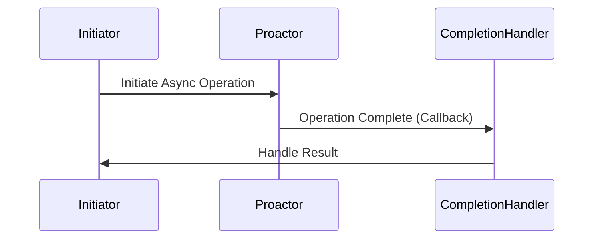

## 11.6 Design Patterns with ASIO (Asynchronous I/O)

In the realm of modern C++ programming, mastering asynchronous I/O (Input/Output) is crucial for developing high-performance, scalable network applications. ASIO, or Asynchronous I/O, is a powerful concept that allows developers to handle multiple I/O operations concurrently without blocking the execution of a program. This section delves into the design patterns associated with ASIO, particularly focusing on the Proactor pattern, and how they can be implemented using Boost.Asio, a popular C++ library for network and low-level I/O programming.

### Understanding Asynchronous I/O

Asynchronous I/O is a method of performing I/O operations without blocking the execution of a program. Unlike synchronous I/O, where the program waits for an operation to complete before proceeding, asynchronous I/O allows a program to continue executing other tasks while waiting for the I/O operation to finish. This approach is particularly beneficial in network programming, where I/O operations can be time-consuming and unpredictable.

#### Key Concepts of Asynchronous I/O

- **Non-blocking Operations**: I/O operations that do not halt the execution of a program. The program can continue executing other tasks while waiting for the I/O operation to complete.
- **Event-driven Programming**: A programming paradigm where the flow of the program is determined by events such as user actions, sensor outputs, or message passing.
- **Callbacks**: Functions that are passed as arguments to other functions and are executed after the completion of an I/O operation.
- **Futures and Promises**: Abstractions used to handle asynchronous operations, allowing a program to retrieve the result of an operation at a later time.

### Introducing Boost.Asio

Boost.Asio is a cross-platform C++ library that provides a consistent asynchronous I/O model using modern C++ features. It supports a wide range of I/O services, including TCP/IP, UDP, serial ports, and file I/O. Boost.Asio is built on top of the Proactor design pattern, which we'll explore in detail.

#### Key Features of Boost.Asio

- **Cross-platform Support**: Works on Windows, Linux, macOS, and other platforms.
- **Scalable and Efficient**: Designed to handle thousands of concurrent connections efficiently.
- **Comprehensive I/O Services**: Supports various I/O operations such as networking, timers, and file I/O.
- **Integration with Boost Libraries**: Seamlessly integrates with other Boost libraries for enhanced functionality.

### The Proactor Pattern

The Proactor pattern is a design pattern used in asynchronous programming to handle I/O operations efficiently. It decouples the initiation of an operation from its completion, allowing a program to handle multiple operations concurrently.

#### Intent

The intent of the Proactor pattern is to handle asynchronous operations by delegating the completion of an operation to a separate handler, allowing the main program to continue executing other tasks.

#### Key Participants

- **Initiator**: The component that initiates an asynchronous operation.
- **Proactor**: The component that manages the completion of the operation and invokes the appropriate handler.
- **Completion Handler**: A callback function that processes the result of the operation once it is complete.

#### Applicability

The Proactor pattern is applicable in scenarios where:

- Multiple I/O operations need to be handled concurrently.
- The program needs to remain responsive while waiting for I/O operations to complete.
- Efficient resource utilization is critical, such as in high-performance network servers.

#### Sample Code Snippet

Let's explore a simple example of using Boost.Asio to implement the Proactor pattern for asynchronous TCP server operations.

```cpp
#include <boost/asio.hpp>
#include <iostream>

using boost::asio::ip::tcp;

class AsyncTCPServer {
public:
    AsyncTCPServer(boost::asio::io_context& io_context, short port)
        : acceptor_(io_context, tcp::endpoint(tcp::v4(), port)) {
        startAccept();
    }

private:
    void startAccept() {
        auto new_socket = std::make_shared<tcp::socket>(acceptor_.get_executor().context());
        acceptor_.async_accept(*new_socket, [this, new_socket](boost::system::error_code ec) {
            if (!ec) {
                std::cout << "New connection accepted." << std::endl;
                // Handle the connection
            }
            startAccept(); // Accept next connection
        });
    }

    tcp::acceptor acceptor_;
};

int main() {
    try {
        boost::asio::io_context io_context;
        AsyncTCPServer server(io_context, 12345);
        io_context.run();
    } catch (std::exception& e) {
        std::cerr << "Exception: " << e.what() << std::endl;
    }
    return 0;
}
```

In this example, the `AsyncTCPServer` class uses Boost.Asio to accept incoming TCP connections asynchronously. The `startAccept` method initiates an asynchronous accept operation, and the lambda function serves as the completion handler, which is invoked once a new connection is accepted.

### Designing Scalable Network Applications

When designing scalable network applications, it's essential to consider factors such as concurrency, resource management, and fault tolerance. Boost.Asio provides several features and patterns that facilitate the development of scalable applications.

#### Key Design Considerations

- **Concurrency**: Utilize Boost.Asio's asynchronous operations to handle multiple connections concurrently without blocking the main thread.
- **Resource Management**: Efficiently manage resources such as sockets and memory to prevent resource leaks and ensure optimal performance.
- **Fault Tolerance**: Implement error handling mechanisms to gracefully handle network failures and recover from errors.

#### Sample Code Snippet

Here's an example of a simple asynchronous HTTP server using Boost.Asio:

```cpp
#include <boost/asio.hpp>
#include <iostream>
#include <string>

using boost::asio::ip::tcp;

class AsyncHTTPServer {
public:
    AsyncHTTPServer(boost::asio::io_context& io_context, short port)
        : acceptor_(io_context, tcp::endpoint(tcp::v4(), port)) {
        startAccept();
    }

private:
    void startAccept() {
        auto new_socket = std::make_shared<tcp::socket>(acceptor_.get_executor().context());
        acceptor_.async_accept(*new_socket, [this, new_socket](boost::system::error_code ec) {
            if (!ec) {
                handleRequest(new_socket);
            }
            startAccept(); // Accept next connection
        });
    }

    void handleRequest(std::shared_ptr<tcp::socket> socket) {
        auto buffer = std::make_shared<boost::asio::streambuf>();
        boost::asio::async_read_until(*socket, *buffer, "\r\n\r\n",
            [this, socket, buffer](boost::system::error_code ec, std::size_t bytes_transferred) {
                if (!ec) {
                    std::istream request_stream(buffer.get());
                    std::string request_line;
                    std::getline(request_stream, request_line);
                    std::cout << "Request: " << request_line << std::endl;

                    // Send a simple HTTP response
                    std::string response = "HTTP/1.1 200 OK\r\nContent-Length: 13\r\n\r\nHello, World!";
                    boost::asio::async_write(*socket, boost::asio::buffer(response),
                        [socket](boost::system::error_code ec, std::size_t) {
                            if (!ec) {
                                socket->shutdown(tcp::socket::shutdown_both);
                                socket->close();
                            }
                        });
                }
            });
    }

    tcp::acceptor acceptor_;
};

int main() {
    try {
        boost::asio::io_context io_context;
        AsyncHTTPServer server(io_context, 8080);
        io_context.run();
    } catch (std::exception& e) {
        std::cerr << "Exception: " << e.what() << std::endl;
    }
    return 0;
}
```

In this example, the `AsyncHTTPServer` class handles incoming HTTP requests asynchronously. The `handleRequest` method reads the request and sends a simple HTTP response. This design allows the server to handle multiple requests concurrently without blocking.

### Implementing Reactive Systems

Reactive systems are designed to be responsive, resilient, elastic, and message-driven. Boost.Asio's asynchronous I/O model aligns well with the principles of reactive programming, making it an excellent choice for building reactive systems.

#### Key Characteristics of Reactive Systems

- **Responsive**: The system responds to requests in a timely manner.
- **Resilient**: The system remains responsive in the face of failures.
- **Elastic**: The system can adapt to changes in load.
- **Message-driven**: The system relies on asynchronous message passing.

#### Using Boost.Asio for Reactive Systems

Boost.Asio provides the necessary tools to implement reactive systems by supporting asynchronous operations and event-driven programming. By leveraging these features, developers can build systems that are responsive, resilient, and scalable.

#### Sample Code Snippet

Here's an example of a simple reactive chat server using Boost.Asio:

```cpp
#include <boost/asio.hpp>
#include <iostream>
#include <set>
#include <memory>

using boost::asio::ip::tcp;

class ChatSession : public std::enable_shared_from_this<ChatSession> {
public:
    ChatSession(tcp::socket socket, std::set<std::shared_ptr<ChatSession>>& sessions)
        : socket_(std::move(socket)), sessions_(sessions) {}

    void start() {
        sessions_.insert(shared_from_this());
        doRead();
    }

    void deliver(const std::string& message) {
        auto self(shared_from_this());
        boost::asio::async_write(socket_, boost::asio::buffer(message),
            [this, self](boost::system::error_code ec, std::size_t) {
                if (ec) {
                    sessions_.erase(self);
                }
            });
    }

private:
    void doRead() {
        auto self(shared_from_this());
        boost::asio::async_read_until(socket_, buffer_, "\n",
            [this, self](boost::system::error_code ec, std::size_t length) {
                if (!ec) {
                    std::istream is(&buffer_);
                    std::string message;
                    std::getline(is, message);

                    for (auto& session : sessions_) {
                        session->deliver(message + "\n");
                    }

                    doRead();
                } else {
                    sessions_.erase(self);
                }
            });
    }

    tcp::socket socket_;
    boost::asio::streambuf buffer_;
    std::set<std::shared_ptr<ChatSession>>& sessions_;
};

class ChatServer {
public:
    ChatServer(boost::asio::io_context& io_context, short port)
        : acceptor_(io_context, tcp::endpoint(tcp::v4(), port)) {
        doAccept();
    }

private:
    void doAccept() {
        acceptor_.async_accept([this](boost::system::error_code ec, tcp::socket socket) {
            if (!ec) {
                std::make_shared<ChatSession>(std::move(socket), sessions_)->start();
            }
            doAccept();
        });
    }

    tcp::acceptor acceptor_;
    std::set<std::shared_ptr<ChatSession>> sessions_;
};

int main() {
    try {
        boost::asio::io_context io_context;
        ChatServer server(io_context, 12345);
        io_context.run();
    } catch (std::exception& e) {
        std::cerr << "Exception: " << e.what() << std::endl;
    }
    return 0;
}
```

In this example, the `ChatServer` class uses Boost.Asio to handle multiple chat sessions concurrently. Each `ChatSession` is responsible for reading messages from a client and broadcasting them to all connected clients. This design demonstrates the principles of reactive systems by being responsive, resilient, and message-driven.

### Try It Yourself

To deepen your understanding of asynchronous I/O and Boost.Asio, try modifying the provided examples:

- **Experiment with Different Protocols**: Modify the examples to use UDP instead of TCP and observe the differences in behavior.
- **Implement Error Handling**: Enhance the examples with robust error handling to gracefully handle network failures.
- **Add New Features**: Extend the chat server example to support private messaging or user authentication.

### Visualizing ASIO Design Patterns

To better understand the flow of asynchronous operations in Boost.Asio, let's visualize the Proactor pattern using a sequence diagram.



**Figure 1: Proactor Pattern Sequence Diagram**

This diagram illustrates the sequence of interactions in the Proactor pattern. The `Initiator` starts an asynchronous operation, the `Proactor` manages its completion, and the `CompletionHandler` processes the result.

### Design Considerations

When using Boost.Asio and the Proactor pattern, consider the following design considerations:

- **Thread Safety**: Ensure that your code is thread-safe, especially when accessing shared resources.
- **Error Handling**: Implement robust error handling to gracefully handle network failures and recover from errors.
- **Performance**: Optimize your code for performance by minimizing context switches and reducing overhead.

### Differences and Similarities

The Proactor pattern is often compared to the Reactor pattern, another design pattern used in asynchronous programming. Here are some key differences and similarities:

- **Proactor vs. Reactor**: The Proactor pattern delegates the completion of an operation to a separate handler, while the Reactor pattern handles events as they occur.
- **Similarities**: Both patterns are used to handle asynchronous operations and improve the responsiveness of a system.
- **Differences**: The Proactor pattern is more suitable for operations that can be completed asynchronously, while the Reactor pattern is better suited for event-driven systems.

### Conclusion

In this section, we've explored the power of ASIO in C++ for building scalable, reactive systems. By leveraging Boost.Asio and the Proactor pattern, developers can design efficient network applications that handle multiple I/O operations concurrently. Remember, mastering asynchronous I/O is an essential skill for any C++ developer working on high-performance, networked applications.

## Quiz Time!



### What is the primary benefit of asynchronous I/O?

- [x] It allows a program to continue executing other tasks while waiting for I/O operations to complete.
- [ ] It simplifies the code by using synchronous operations.
- [ ] It reduces the need for error handling.
- [ ] It eliminates the need for network programming.

> **Explanation:** Asynchronous I/O allows a program to perform other tasks while waiting for I/O operations to complete, improving responsiveness and efficiency.

### Which C++ library is commonly used for asynchronous I/O operations?

- [ ] STL
- [x] Boost.Asio
- [ ] OpenSSL
- [ ] Qt

> **Explanation:** Boost.Asio is a popular C++ library for asynchronous I/O operations, providing a consistent model for handling various I/O services.

### What is the role of the Proactor in the Proactor pattern?

- [ ] To initiate an asynchronous operation
- [x] To manage the completion of an operation and invoke the appropriate handler
- [ ] To handle errors in asynchronous operations
- [ ] To synchronize threads

> **Explanation:** The Proactor manages the completion of an asynchronous operation and invokes the appropriate completion handler.

### In the provided chat server example, what is the purpose of the `deliver` function?

- [ ] To initiate a new connection
- [ ] To read messages from the client
- [x] To send messages to all connected clients
- [ ] To close the connection

> **Explanation:** The `deliver` function sends messages to all connected clients, broadcasting the message received from one client to others.

### Which design pattern is used by Boost.Asio to handle asynchronous operations?

- [ ] Singleton
- [ ] Observer
- [x] Proactor
- [ ] Decorator

> **Explanation:** Boost.Asio uses the Proactor design pattern to handle asynchronous operations efficiently.

### What is a key characteristic of reactive systems?

- [x] They are responsive, resilient, elastic, and message-driven.
- [ ] They rely on synchronous operations.
- [ ] They are designed for single-threaded applications.
- [ ] They prioritize simplicity over performance.

> **Explanation:** Reactive systems are designed to be responsive, resilient, elastic, and message-driven, making them suitable for high-performance applications.

### What is the main difference between the Proactor and Reactor patterns?

- [ ] The Proactor pattern is used for synchronous operations.
- [x] The Proactor pattern delegates the completion of an operation to a separate handler, while the Reactor pattern handles events as they occur.
- [ ] The Reactor pattern is more efficient than the Proactor pattern.
- [ ] The Proactor pattern is only used in GUI applications.

> **Explanation:** The Proactor pattern delegates the completion of an operation to a separate handler, while the Reactor pattern handles events as they occur.

### How can you ensure thread safety when using Boost.Asio?

- [ ] By avoiding asynchronous operations
- [ ] By using global variables
- [x] By ensuring that shared resources are accessed safely
- [ ] By using synchronous operations only

> **Explanation:** Ensuring that shared resources are accessed safely is crucial for maintaining thread safety when using Boost.Asio.

### Which of the following is NOT a feature of Boost.Asio?

- [ ] Cross-platform support
- [ ] Comprehensive I/O services
- [ ] Integration with Boost Libraries
- [x] Built-in GUI components

> **Explanation:** Boost.Asio does not provide built-in GUI components; it focuses on asynchronous I/O operations.

### True or False: The Proactor pattern is more suitable for operations that can be completed asynchronously.

- [x] True
- [ ] False

> **Explanation:** The Proactor pattern is designed for operations that can be completed asynchronously, allowing the main program to continue executing other tasks.


