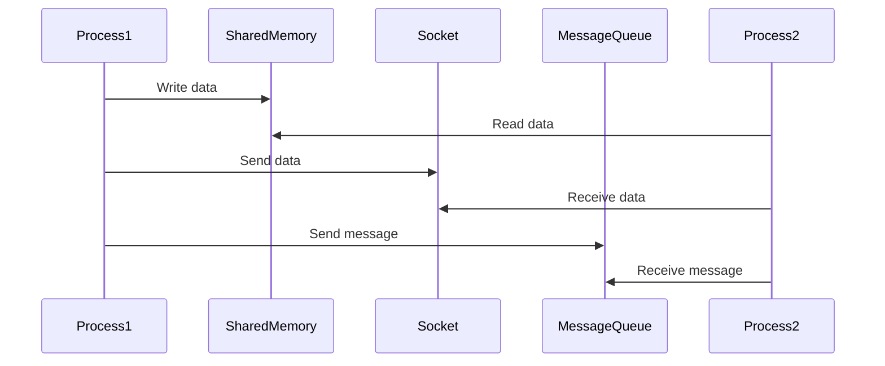

## 11.7 Inter-Process Communication (IPC)

Inter-Process Communication (IPC) is a critical aspect of software engineering, especially when designing systems that require processes to exchange data and synchronize their actions. In C++, IPC can be achieved using various mechanisms, including shared memory, sockets, and message queues. This section will delve into these IPC mechanisms, providing insights into designing robust IPC systems in C++ and addressing cross-platform considerations.

### Introduction to Inter-Process Communication

Inter-Process Communication (IPC) refers to the methods and protocols that enable processes to communicate and share data. IPC is essential in modern computing environments where multiple processes need to work together to perform complex tasks. Whether it's a client-server application, a distributed system, or a multi-threaded application, IPC plays a vital role in ensuring efficient and effective communication between processes.

### Key Concepts of IPC

Before diving into specific IPC mechanisms, let's establish a foundational understanding of the key concepts involved:

- **Processes**: Independent executing programs with their own memory space.
- **Communication**: The exchange of data between processes.
- **Synchronization**: Coordination of processes to ensure correct sequencing of operations.

### IPC Mechanisms in C++

C++ provides several IPC mechanisms, each with its own advantages and use cases. The most common IPC mechanisms include:

1. **Shared Memory**: Allows multiple processes to access the same memory space for fast data exchange.
2. **Sockets**: Enable communication between processes over a network, supporting both local and remote communication.
3. **Message Queues**: Facilitate asynchronous communication by sending and receiving messages between processes.

Let's explore each of these mechanisms in detail.

### Shared Memory

Shared memory is one of the fastest IPC mechanisms because it allows multiple processes to access the same memory space. This approach is efficient for large data transfers, as it avoids the overhead of copying data between processes.

#### Designing Shared Memory in C++

To implement shared memory in C++, we typically use system calls provided by the operating system. On Unix-like systems, the `shmget`, `shmat`, and `shmdt` functions are commonly used. Here's a basic example of how shared memory can be implemented in C++:

```cpp
#include <iostream>
#include <sys/ipc.h>
#include <sys/shm.h>
#include <cstring>

int main() {
    // Generate a unique key for the shared memory segment
    key_t key = ftok("shmfile", 65);

    // Create a shared memory segment
    int shmid = shmget(key, 1024, 0666 | IPC_CREAT);

    // Attach to the shared memory
    char *str = static_cast<char*>(shmat(shmid, nullptr, 0));

    // Write data to shared memory
    std::strcpy(str, "Hello, World!");

    std::cout << "Data written to shared memory: " << str << std::endl;

    // Detach from shared memory
    shmdt(str);

    return 0;
}
```

In this example, we create a shared memory segment and write a string to it. Another process can attach to the same segment and read the data.

#### Key Considerations for Shared Memory

- **Synchronization**: Since multiple processes can access the same memory, synchronization mechanisms (e.g., semaphores) are needed to prevent race conditions.
- **Security**: Proper permissions should be set to prevent unauthorized access to shared memory.
- **Cleanup**: Ensure that shared memory segments are properly detached and removed when no longer needed.

#### Cross-Platform Considerations

Shared memory implementation may vary between operating systems. For instance, Windows uses `CreateFileMapping` and `MapViewOfFile` functions. It's crucial to design your IPC system with portability in mind, possibly using abstraction layers to handle platform-specific details.

### Sockets

Sockets provide a versatile IPC mechanism that supports communication between processes on the same machine or across a network. They are the backbone of network programming and are widely used in client-server architectures.

#### Designing Sockets in C++

C++ offers various libraries and APIs for socket programming, including the POSIX socket API and higher-level libraries like Boost.Asio. Here's an example of a simple TCP client-server communication using POSIX sockets:

**Server Code:**

```cpp
#include <iostream>
#include <sys/socket.h>
#include <netinet/in.h>
#include <unistd.h>
#include <cstring>

int main() {
    int server_fd, new_socket;
    struct sockaddr_in address;
    int opt = 1;
    int addrlen = sizeof(address);
    char buffer[1024] = {0};

    // Create socket file descriptor
    server_fd = socket(AF_INET, SOCK_STREAM, 0);

    // Forcefully attach socket to the port 8080
    setsockopt(server_fd, SOL_SOCKET, SO_REUSEADDR | SO_REUSEPORT, &opt, sizeof(opt));

    address.sin_family = AF_INET;
    address.sin_addr.s_addr = INADDR_ANY;
    address.sin_port = htons(8080);

    // Bind the socket to the network address and port
    bind(server_fd, (struct sockaddr *)&address, sizeof(address));

    // Listen for incoming connections
    listen(server_fd, 3);

    // Accept a connection
    new_socket = accept(server_fd, (struct sockaddr *)&address, (socklen_t*)&addrlen);

    // Read data from the client
    read(new_socket, buffer, 1024);
    std::cout << "Message from client: " << buffer << std::endl;

    // Send a response to the client
    const char *response = "Hello from server";
    send(new_socket, response, strlen(response), 0);

    // Close the socket
    close(new_socket);
    close(server_fd);

    return 0;
}
```

**Client Code:**

```cpp
#include <iostream>
#include <sys/socket.h>
#include <arpa/inet.h>
#include <unistd.h>
#include <cstring>

int main() {
    int sock = 0;
    struct sockaddr_in serv_addr;
    char buffer[1024] = {0};

    // Create socket file descriptor
    sock = socket(AF_INET, SOCK_STREAM, 0);

    serv_addr.sin_family = AF_INET;
    serv_addr.sin_port = htons(8080);

    // Convert IPv4 and IPv6 addresses from text to binary form
    inet_pton(AF_INET, "127.0.0.1", &serv_addr.sin_addr);

    // Connect to the server
    connect(sock, (struct sockaddr *)&serv_addr, sizeof(serv_addr));

    // Send a message to the server
    const char *message = "Hello from client";
    send(sock, message, strlen(message), 0);

    // Read the server's response
    read(sock, buffer, 1024);
    std::cout << "Message from server: " << buffer << std::endl;

    // Close the socket
    close(sock);

    return 0;
}
```

#### Key Considerations for Sockets

- **Blocking vs. Non-blocking**: Decide whether to use blocking or non-blocking sockets based on your application's requirements.
- **Error Handling**: Implement robust error handling to manage network failures and disconnections.
- **Security**: Consider using encryption (e.g., TLS/SSL) for secure communication.

#### Cross-Platform Considerations

Socket APIs can differ between platforms. For example, Windows uses Winsock, which requires initialization and cleanup with `WSAStartup` and `WSACleanup`. Libraries like Boost.Asio abstract these differences, providing a consistent interface across platforms.

### Message Queues

Message queues offer a way to exchange messages between processes asynchronously. They are suitable for scenarios where processes need to communicate without blocking each other.

#### Designing Message Queues in C++

In C++, message queues can be implemented using POSIX message queues or System V message queues. Here's an example using POSIX message queues:

**Sender Code:**

```cpp
#include <iostream>
#include <mqueue.h>
#include <cstring>

int main() {
    mqd_t mq;
    struct mq_attr attr;

    // Set message queue attributes
    attr.mq_flags = 0;
    attr.mq_maxmsg = 10;
    attr.mq_msgsize = 1024;
    attr.mq_curmsgs = 0;

    // Create a message queue
    mq = mq_open("/test_queue", O_CREAT | O_WRONLY, 0644, &attr);

    // Send a message
    const char *message = "Hello, Message Queue!";
    mq_send(mq, message, strlen(message), 0);

    // Close the message queue
    mq_close(mq);

    return 0;
}
```

**Receiver Code:**

```cpp
#include <iostream>
#include <mqueue.h>
#include <cstring>

int main() {
    mqd_t mq;
    char buffer[1024];

    // Open the message queue
    mq = mq_open("/test_queue", O_RDONLY);

    // Receive a message
    mq_receive(mq, buffer, 1024, nullptr);
    std::cout << "Received message: " << buffer << std::endl;

    // Close the message queue
    mq_close(mq);

    // Unlink the message queue
    mq_unlink("/test_queue");

    return 0;
}
```

#### Key Considerations for Message Queues

- **Message Size**: Define appropriate message sizes and queue lengths to prevent overflow.
- **Priority**: POSIX message queues support message prioritization, which can be useful for certain applications.
- **Persistence**: Consider whether messages need to be persistent across system reboots.

#### Cross-Platform Considerations

Message queue implementations can vary between operating systems. Windows, for example, uses a different API for message queues. As with other IPC mechanisms, consider using libraries that abstract platform-specific details.

### Designing IPC Mechanisms in C++

Designing IPC mechanisms involves several considerations to ensure efficient and reliable communication between processes:

1. **Performance**: Choose the IPC mechanism that best fits your performance requirements. Shared memory is fast but requires careful synchronization, while sockets provide flexibility for network communication.

2. **Scalability**: Consider how your IPC design will scale with the number of processes. Message queues can handle many-to-many communication, while sockets can be used for client-server architectures.

3. **Security**: Implement security measures to protect data exchanged between processes. This may involve setting appropriate permissions, using encryption, and validating inputs.

4. **Portability**: Design your IPC system to be portable across different platforms. Use abstraction layers or libraries that provide consistent interfaces.

### Cross-Platform Considerations

Cross-platform development introduces additional challenges when designing IPC mechanisms. Here are some strategies to address these challenges:

- **Use Abstraction Layers**: Libraries like Boost.Asio and Qt provide abstraction layers that handle platform-specific details, allowing you to write portable code.

- **Conditional Compilation**: Use preprocessor directives to conditionally compile platform-specific code. This approach allows you to maintain a single codebase while supporting multiple platforms.

- **Testing Across Platforms**: Regularly test your IPC implementation on all target platforms to identify and resolve platform-specific issues.

### Visualizing IPC Mechanisms

To better understand how these IPC mechanisms work together, let's visualize a typical IPC architecture using a sequence diagram. This diagram illustrates the interaction between processes using shared memory, sockets, and message queues.



### Try It Yourself

Experiment with the provided code examples to gain hands-on experience with IPC mechanisms in C++. Try modifying the code to:

- Implement error handling for socket connections.
- Use semaphores to synchronize access to shared memory.
- Change message priorities in the message queue example.

### Knowledge Check

To reinforce your understanding of IPC in C++, consider the following questions:

- What are the advantages and disadvantages of using shared memory for IPC?
- How do sockets differ from message queues in terms of communication patterns?
- What are some security considerations when designing IPC mechanisms?

### Conclusion

Inter-Process Communication (IPC) is a fundamental aspect of designing complex software systems in C++. By understanding and effectively implementing IPC mechanisms such as shared memory, sockets, and message queues, you can build robust and efficient applications. Remember to consider performance, scalability, security, and portability when designing your IPC systems. As you continue to explore IPC in C++, keep experimenting, stay curious, and enjoy the journey!

## Quiz Time!



### What is the primary advantage of using shared memory for IPC?

- [x] Fast data exchange
- [ ] Simplified error handling
- [ ] Built-in security features
- [ ] Automatic synchronization

> **Explanation:** Shared memory allows multiple processes to access the same memory space, making data exchange very fast compared to other IPC mechanisms.

### Which IPC mechanism is most suitable for network communication between processes?

- [ ] Shared memory
- [x] Sockets
- [ ] Message queues
- [ ] Semaphores

> **Explanation:** Sockets are designed for communication over a network, making them ideal for network-based IPC.

### What is a key consideration when using shared memory for IPC?

- [ ] Message prioritization
- [x] Synchronization
- [ ] Network latency
- [ ] Encryption

> **Explanation:** Synchronization is crucial when using shared memory to prevent race conditions and ensure data consistency.

### Which library can be used to abstract platform-specific differences in socket programming?

- [ ] POSIX
- [x] Boost.Asio
- [ ] OpenSSL
- [ ] STL

> **Explanation:** Boost.Asio provides a consistent interface for socket programming across different platforms, abstracting platform-specific details.

### In the context of message queues, what does POSIX stand for?

- [ ] Portable Operating System Interface
- [ ] Process Operating System Interface
- [x] Portable Operating System Interface for Unix
- [ ] Process Operating System Interface for Unix

> **Explanation:** POSIX stands for Portable Operating System Interface for Unix, which is a family of standards specified by the IEEE for maintaining compatibility between operating systems.

### What is a common use case for message queues in IPC?

- [x] Asynchronous communication
- [ ] Synchronous data exchange
- [ ] Real-time video streaming
- [ ] Direct memory access

> **Explanation:** Message queues are often used for asynchronous communication, allowing processes to send and receive messages without blocking each other.

### Which of the following is a cross-platform library that can be used for IPC in C++?

- [ ] Winsock
- [ ] System V
- [x] Qt
- [ ] DirectX

> **Explanation:** Qt is a cross-platform library that provides support for IPC among other features, making it suitable for developing portable applications.

### What is a potential drawback of using sockets for IPC?

- [ ] High memory usage
- [ ] Lack of flexibility
- [x] Network latency
- [ ] Limited scalability

> **Explanation:** Sockets can introduce network latency, especially when used for communication over long distances or slow networks.

### True or False: Message queues can handle many-to-many communication patterns.

- [x] True
- [ ] False

> **Explanation:** Message queues are designed to handle many-to-many communication patterns, allowing multiple processes to send and receive messages.

### Which of the following is NOT a typical IPC mechanism?

- [ ] Shared memory
- [ ] Sockets
- [ ] Message queues
- [x] Threads

> **Explanation:** Threads are not an IPC mechanism; they are a way to achieve concurrency within a single process.


