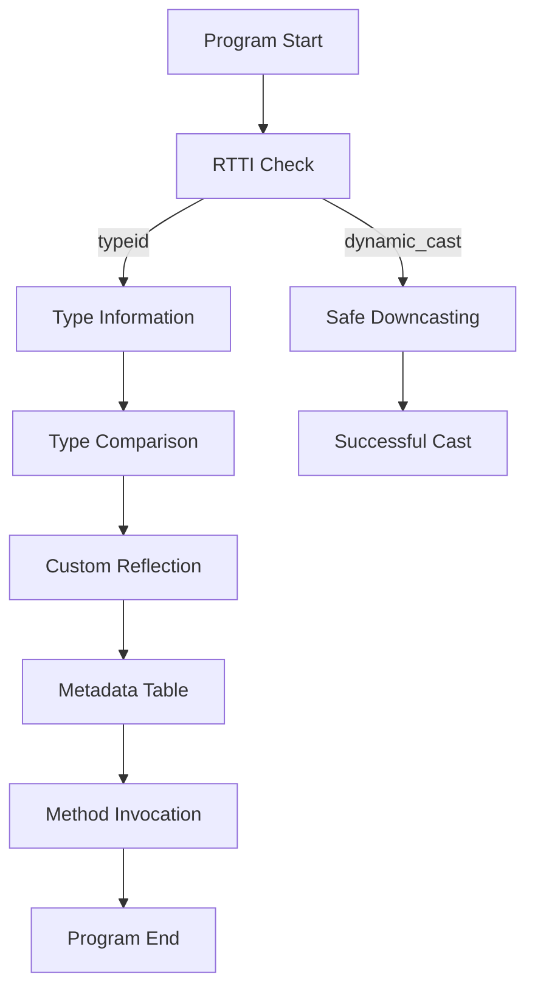

## 11.9 Reflection and Introspection

Reflection and introspection are powerful programming techniques that allow a program to examine and modify its own structure and behavior at runtime. While these concepts are well-supported in languages like Java and C#, C++ presents unique challenges and opportunities for implementing reflection and introspection. In this section, we will delve into the limitations of reflection in C++, explore the use of Run-Time Type Information (RTTI), discuss how to implement custom reflection mechanisms, and introduce libraries that facilitate reflection, such as RTTR.

### Understanding Reflection and Introspection

**Reflection** refers to the ability of a program to inspect and manipulate its own structure and behavior at runtime. This includes examining the types, properties, and methods of objects and classes. **Introspection**, on the other hand, is the ability to examine the type or properties of an object at runtime without necessarily modifying it.

Reflection and introspection enable dynamic behavior, such as:

- **Dynamic type identification**: Determining the type of an object at runtime.
- **Dynamic method invocation**: Calling methods on objects without knowing their types at compile time.
- **Metadata inspection**: Accessing information about the program's structure, such as class hierarchies and member variables.

### Limitations of Reflection in C++

C++ is a statically typed language, which means that type information is primarily available at compile time. This presents several limitations for reflection:

1. **Lack of Built-in Reflection**: Unlike languages such as Java, C++ does not have built-in support for reflection. This means that developers must implement custom solutions or use third-party libraries to achieve reflection capabilities.

2. **Performance Overhead**: Reflection can introduce performance overhead due to the need for additional metadata and runtime type checks. In performance-critical applications, this overhead may be undesirable.

3. **Complexity**: Implementing reflection in C++ can be complex and error-prone, especially when dealing with advanced features like templates and multiple inheritance.

4. **Limited Introspection**: While C++ provides some introspection capabilities through RTTI, these are limited to basic type identification and do not support more advanced reflection features like method invocation or property manipulation.

### Using RTTI (Run-Time Type Information)

RTTI is a feature in C++ that provides limited introspection capabilities. It allows you to determine the type of an object at runtime and perform safe type casting. RTTI is enabled by default in most C++ compilers and is primarily used through the `typeid` operator and the `dynamic_cast` operator.

#### The `typeid` Operator

The `typeid` operator returns a reference to a `std::type_info` object that represents the type of an expression. This can be used to compare types at runtime.

```cpp
#include <iostream>
#include <typeinfo>

class Base {
public:
    virtual ~Base() {}
};

class Derived : public Base {};

int main() {
    Base* b = new Derived();
    std::cout << "Type of b: " << typeid(*b).name() << std::endl;

    if (typeid(*b) == typeid(Derived)) {
        std::cout << "b is of type Derived" << std::endl;
    }

    delete b;
    return 0;
}
```

In this example, `typeid(*b).name()` returns the name of the type of the object pointed to by `b`. Note that `typeid` requires the type to have at least one virtual function to work correctly with polymorphic types.

#### The `dynamic_cast` Operator

The `dynamic_cast` operator is used for safe downcasting in class hierarchies. It checks the type of the object at runtime and returns a null pointer if the cast is not possible.

```cpp
#include <iostream>

class Base {
public:
    virtual ~Base() {}
};

class Derived : public Base {};

int main() {
    Base* b = new Derived();
    Derived* d = dynamic_cast<Derived*>(b);

    if (d) {
        std::cout << "Successfully cast to Derived" << std::endl;
    } else {
        std::cout << "Failed to cast to Derived" << std::endl;
    }

    delete b;
    return 0;
}
```

In this example, `dynamic_cast` safely casts `b` to a `Derived*`. If `b` does not point to a `Derived` object, `dynamic_cast` returns `nullptr`.

### Implementing Custom Reflection Mechanisms

Due to the limitations of RTTI, developers often implement custom reflection mechanisms to achieve more advanced reflection capabilities. These mechanisms typically involve maintaining metadata about classes and objects at runtime.

#### Metadata Tables

One approach to implementing custom reflection is to use metadata tables that store information about classes, methods, and properties. This information can be used to dynamically inspect and manipulate objects.

```cpp
#include <iostream>
#include <string>
#include <unordered_map>
#include <functional>

class Object {
public:
    virtual ~Object() {}
};

class Reflection {
public:
    using Method = std::function<void(Object*)>;

    static void registerMethod(const std::string& className, const std::string& methodName, Method method) {
        methods[className][methodName] = method;
    }

    static void invokeMethod(Object* obj, const std::string& className, const std::string& methodName) {
        if (methods[className].find(methodName) != methods[className].end()) {
            methods[className][methodName](obj);
        } else {
            std::cerr << "Method not found: " << methodName << std::endl;
        }
    }

private:
    static std::unordered_map<std::string, std::unordered_map<std::string, Method>> methods;
};

std::unordered_map<std::string, std::unordered_map<std::string, Reflection::Method>> Reflection::methods;

class MyClass : public Object {
public:
    void myMethod() {
        std::cout << "MyClass::myMethod called" << std::endl;
    }
};

int main() {
    MyClass obj;
    Reflection::registerMethod("MyClass", "myMethod", [](Object* obj) {
        static_cast<MyClass*>(obj)->myMethod();
    });

    Reflection::invokeMethod(&obj, "MyClass", "myMethod");

    return 0;
}
```

In this example, we define a `Reflection` class that maintains a table of methods for each class. We register a method for `MyClass` and then invoke it dynamically using the `invokeMethod` function.

#### Using Macros for Reflection

Macros can be used to simplify the process of registering classes and methods for reflection. This approach can reduce boilerplate code and make the reflection mechanism more user-friendly.

```cpp
#include <iostream>
#include <string>
#include <unordered_map>
#include <functional>

class Object {
public:
    virtual ~Object() {}
};

class Reflection {
public:
    using Method = std::function<void(Object*)>;

    static void registerMethod(const std::string& className, const std::string& methodName, Method method) {
        methods[className][methodName] = method;
    }

    static void invokeMethod(Object* obj, const std::string& className, const std::string& methodName) {
        if (methods[className].find(methodName) != methods[className].end()) {
            methods[className][methodName](obj);
        } else {
            std::cerr << "Method not found: " << methodName << std::endl;
        }
    }

private:
    static std::unordered_map<std::string, std::unordered_map<std::string, Method>> methods;
};

std::unordered_map<std::string, std::unordered_map<std::string, Reflection::Method>> Reflection::methods;

#define REGISTER_METHOD(className, methodName) \
    Reflection::registerMethod(#className, #methodName, [](Object* obj) { \
        static_cast<className*>(obj)->methodName(); \
    });

class MyClass : public Object {
public:
    void myMethod() {
        std::cout << "MyClass::myMethod called" << std::endl;
    }
};

int main() {
    MyClass obj;
    REGISTER_METHOD(MyClass, myMethod);

    Reflection::invokeMethod(&obj, "MyClass", "myMethod");

    return 0;
}
```

In this example, we use a macro `REGISTER_METHOD` to register methods for reflection. This simplifies the process of adding new methods to the reflection system.

### Libraries Providing Reflection (e.g., RTTR)

Several libraries provide reflection capabilities for C++. One of the most popular is RTTR (Run-Time Type Reflection), which offers a comprehensive reflection system with features like type registration, property access, and method invocation.

#### Introduction to RTTR

RTTR is a modern C++ library that provides run-time type reflection. It allows you to register types, methods, and properties, and then access them dynamically at runtime. RTTR is designed to be easy to use and integrate into existing projects.

#### Key Features of RTTR

- **Type Registration**: Register classes, methods, and properties for reflection.
- **Property Access**: Get and set properties dynamically.
- **Method Invocation**: Call methods on objects without knowing their types at compile time.
- **Type Information**: Access metadata about types, such as base classes and constructors.

#### Using RTTR

To use RTTR, you need to include the RTTR library in your project and register your types for reflection. Here's a simple example:

```cpp
#include <iostream>
#include <rttr/registration>

using namespace rttr;

class MyClass {
public:
    MyClass() : value(0) {}
    void setValue(int v) { value = v; }
    int getValue() const { return value; }

private:
    int value;
};

RTTR_REGISTRATION
{
    registration::class_<MyClass>("MyClass")
        .constructor<>()
        .property("value", &MyClass::getValue, &MyClass::setValue);
}

int main() {
    type myType = type::get<MyClass>();
    variant obj = myType.create();

    if (obj.is_valid()) {
        auto prop = myType.get_property("value");
        prop.set_value(obj, 42);

        std::cout << "Value: " << prop.get_value(obj).to_int() << std::endl;
    }

    return 0;
}
```

In this example, we register `MyClass` with RTTR, including its constructor and a property `value`. We then create an instance of `MyClass` using RTTR and dynamically set and get the value of the `value` property.

### Visualizing Reflection and Introspection

To better understand the concepts of reflection and introspection, let's visualize the process of using RTTI and custom reflection mechanisms.



**Diagram Description**: This flowchart illustrates the process of using RTTI and custom reflection mechanisms in a C++ program. The program starts with an RTTI check, which can lead to type information retrieval or safe downcasting. Custom reflection involves using metadata tables for method invocation.

### Try It Yourself

To deepen your understanding of reflection and introspection in C++, try modifying the code examples provided:

- **Experiment with RTTI**: Add more classes and use `typeid` and `dynamic_cast` to explore their capabilities.
- **Extend the Custom Reflection System**: Add support for more complex method signatures and properties.
- **Integrate RTTR**: Register additional classes and properties, and experiment with dynamic method invocation.

### References and Further Reading

- [RTTR Documentation](https://www.rttr.org/doc/master/)
- [C++ RTTI Overview](https://en.cppreference.com/w/cpp/language/typeid)
- [Reflection in C++: A Practical Guide](https://www.boost.org/doc/libs/1_75_0/doc/html/boost_reflection.html)

### Knowledge Check

- **What is the primary purpose of reflection in programming?**
- **How does RTTI provide introspection capabilities in C++?**
- **What are the limitations of using RTTI for reflection?**
- **How can custom reflection mechanisms be implemented in C++?**
- **What are the key features of the RTTR library?**

### Embrace the Journey

Remember, mastering reflection and introspection in C++ is a journey. As you explore these concepts, you'll gain a deeper understanding of dynamic programming techniques and how they can be applied to create flexible and powerful software architectures. Keep experimenting, stay curious, and enjoy the journey!

## Quiz Time!



### What is the primary purpose of reflection in programming?

- [x] To inspect and manipulate a program's structure and behavior at runtime
- [ ] To compile code more efficiently
- [ ] To optimize memory usage
- [ ] To enhance security features

> **Explanation:** Reflection allows a program to examine and modify its own structure and behavior at runtime, enabling dynamic type identification, method invocation, and metadata inspection.

### Which operator in C++ is used for safe downcasting?

- [ ] typeid
- [x] dynamic_cast
- [ ] static_cast
- [ ] reinterpret_cast

> **Explanation:** The `dynamic_cast` operator is used for safe downcasting in C++ class hierarchies, checking the type of the object at runtime.

### What is a limitation of RTTI in C++?

- [x] Limited to basic type identification
- [ ] High performance overhead
- [ ] Lack of support for polymorphism
- [ ] Inability to handle exceptions

> **Explanation:** RTTI in C++ is limited to basic type identification and does not support more advanced reflection features like method invocation or property manipulation.

### How can custom reflection mechanisms be implemented in C++?

- [x] Using metadata tables to store information about classes and methods
- [ ] By enabling compiler flags
- [ ] Through built-in language features
- [ ] By using only macros

> **Explanation:** Custom reflection mechanisms in C++ often involve maintaining metadata tables that store information about classes, methods, and properties, allowing for dynamic inspection and manipulation.

### What is a key feature of the RTTR library?

- [x] Type registration and dynamic method invocation
- [ ] Automatic memory management
- [ ] Built-in concurrency support
- [ ] Integrated debugging tools

> **Explanation:** RTTR provides run-time type reflection, allowing for type registration, property access, and dynamic method invocation.

### Which of the following is NOT a benefit of using reflection?

- [ ] Dynamic type identification
- [ ] Dynamic method invocation
- [x] Compile-time optimization
- [ ] Metadata inspection

> **Explanation:** Reflection is primarily used for runtime inspection and manipulation, not for compile-time optimization.

### What does the `typeid` operator return?

- [x] A reference to a `std::type_info` object
- [ ] A pointer to the object's class
- [ ] The memory address of the object
- [ ] The size of the object in bytes

> **Explanation:** The `typeid` operator returns a reference to a `std::type_info` object that represents the type of an expression.

### What is a common use case for `dynamic_cast`?

- [x] Safe downcasting in polymorphic class hierarchies
- [ ] Converting integers to strings
- [ ] Optimizing loop performance
- [ ] Managing memory allocation

> **Explanation:** `dynamic_cast` is commonly used for safe downcasting in polymorphic class hierarchies, ensuring that the object being cast is of the correct type.

### What is the purpose of using macros in custom reflection systems?

- [x] To simplify the process of registering classes and methods
- [ ] To improve runtime performance
- [ ] To enhance security features
- [ ] To reduce memory usage

> **Explanation:** Macros can be used to simplify the process of registering classes and methods for reflection, reducing boilerplate code.

### True or False: RTTR can be used to access private members of a class directly.

- [ ] True
- [x] False

> **Explanation:** RTTR respects C++'s access control and cannot be used to directly access private members of a class without appropriate accessors.


