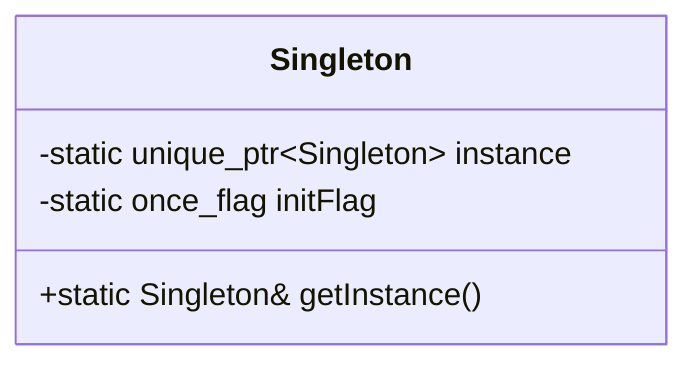
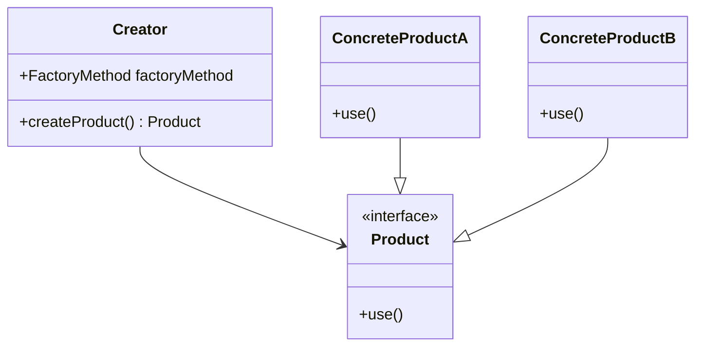
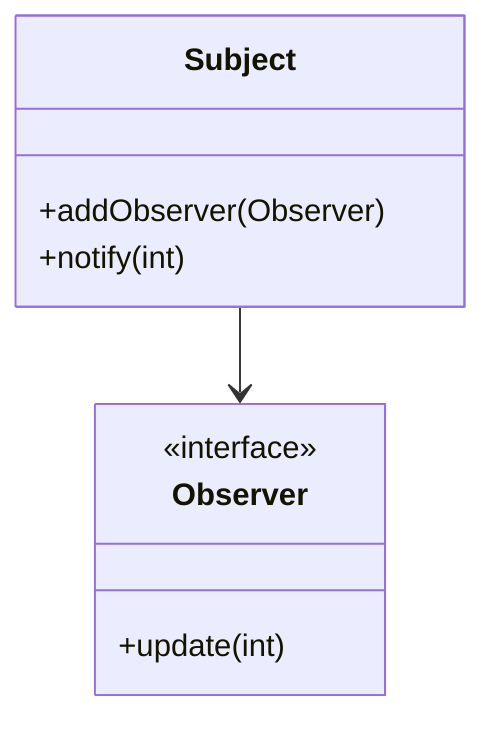
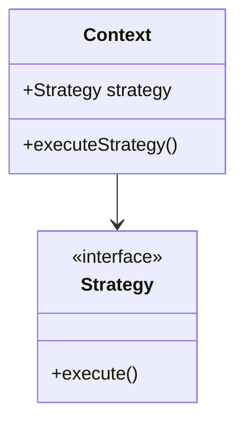

## 12.1 Modern Approaches to Classic Patterns

In this section, we will explore how modern C++ features introduced from C++11 onwards have transformed the way we implement classic design patterns. By leveraging features such as smart pointers, lambda expressions, and move semantics, we can simplify and enhance these patterns, making them more efficient and easier to maintain. Let's delve into how these modern features can be applied to some of the most commonly used design patterns.

### Revisiting Design Patterns with New Language Features

Design patterns have long been a cornerstone of software architecture, providing reusable solutions to common problems. However, as programming languages evolve, so too do the ways in which we implement these patterns. Modern C++ offers a suite of features that allow us to revisit and refine classic design patterns, streamlining their implementation and improving their performance.

#### Simplifying Patterns with Modern C++

Modern C++ features such as smart pointers, lambda expressions, and move semantics provide powerful tools for simplifying design patterns. These features help reduce boilerplate code, enhance safety, and improve performance. Let's explore how these features can be applied to some classic design patterns.

### Singleton Pattern

#### Intent

The Singleton pattern ensures that a class has only one instance and provides a global point of access to it.

#### Modern Implementation

In modern C++, the Singleton pattern can be implemented more safely and efficiently using `std::unique_ptr` and `std::call_once`. This approach ensures thread safety and lazy initialization without the need for explicit locking mechanisms.

```cpp
#include <memory>
#include <mutex>

class Singleton {
public:
    static Singleton& getInstance() {
        std::call_once(initFlag, []() {
            instance.reset(new Singleton());
        });
        return *instance;
    }

    // Other public methods
private:
    Singleton() = default;
    ~Singleton() = default;
    Singleton(const Singleton&) = delete;
    Singleton& operator=(const Singleton&) = delete;

    static std::unique_ptr<Singleton> instance;
    static std::once_flag initFlag;
};

std::unique_ptr<Singleton> Singleton::instance;
std::once_flag Singleton::initFlag;
```

#### Key Participants

- **Singleton**: The class that maintains a single instance and provides access to it.

#### Applicability

Use the Singleton pattern when:
- There must be exactly one instance of a class, and it must be accessible from a well-known access point.
- The sole instance should be extensible by subclassing, and clients should be able to use an extended instance without modifying their code.

#### Design Considerations

- **Thread Safety**: Using `std::call_once` ensures that the Singleton instance is initialized in a thread-safe manner.
- **Lazy Initialization**: The instance is created only when it is first accessed, saving resources.

### Factory Method Pattern

#### Intent

Define an interface for creating an object, but let subclasses alter the type of objects that will be created.

#### Modern Implementation

With modern C++, we can use `std::function` and lambda expressions to create more flexible and concise factory methods.

```cpp
#include <iostream>
#include <memory>
#include <functional>

class Product {
public:
    virtual void use() = 0;
    virtual ~Product() = default;
};

class ConcreteProductA : public Product {
public:
    void use() override {
        std::cout << "Using ConcreteProductA" << std::endl;
    }
};

class ConcreteProductB : public Product {
public:
    void use() override {
        std::cout << "Using ConcreteProductB" << std::endl;
    }
};

class Creator {
public:
    using FactoryMethod = std::function<std::unique_ptr<Product>()>;

    explicit Creator(FactoryMethod factoryMethod) : factoryMethod_(factoryMethod) {}

    std::unique_ptr<Product> createProduct() {
        return factoryMethod_();
    }

private:
    FactoryMethod factoryMethod_;
};

int main() {
    Creator creatorA([]() { return std::make_unique<ConcreteProductA>(); });
    Creator creatorB([]() { return std::make_unique<ConcreteProductB>(); });

    auto productA = creatorA.createProduct();
    auto productB = creatorB.createProduct();

    productA->use();
    productB->use();

    return 0;
}
```

#### Key Participants

- **Product**: Defines the interface of objects the factory method creates.
- **ConcreteProduct**: Implements the Product interface.
- **Creator**: Declares the factory method, which returns an object of type Product.

#### Applicability

Use the Factory Method pattern when:
- A class cannot anticipate the class of objects it must create.
- A class wants its subclasses to specify the objects it creates.

#### Design Considerations

- **Flexibility**: Using `std::function` allows for more flexible factory methods that can be easily changed or extended.
- **Lambda Expressions**: Simplify the creation of factory methods and reduce boilerplate code.

### Observer Pattern

#### Intent

Define a one-to-many dependency between objects so that when one object changes state, all its dependents are notified and updated automatically.

#### Modern Implementation

The Observer pattern can be implemented using `std::function` and lambda expressions to manage callbacks, making the code more concise and flexible.

```cpp
#include <iostream>
#include <vector>
#include <functional>

class Subject {
public:
    using Observer = std::function<void(int)>;

    void addObserver(Observer observer) {
        observers_.push_back(observer);
    }

    void notify(int value) {
        for (auto& observer : observers_) {
            observer(value);
        }
    }

private:
    std::vector<Observer> observers_;
};

int main() {
    Subject subject;

    subject.addObserver([](int value) {
        std::cout << "Observer 1: " << value << std::endl;
    });

    subject.addObserver([](int value) {
        std::cout << "Observer 2: " << value << std::endl;
    });

    subject.notify(42);

    return 0;
}
```

#### Key Participants

- **Subject**: Knows its observers and provides an interface for attaching and detaching observers.
- **Observer**: Defines an updating interface for objects that should be notified of changes in a subject.

#### Applicability

Use the Observer pattern when:
- An abstraction has two aspects, one dependent on the other.
- A change to one object requires changing others, and you don't know how many objects need to be changed.

#### Design Considerations

- **Decoupling**: Observers are decoupled from the subject, allowing for flexible and reusable components.
- **Lambda Expressions**: Simplify the implementation of observer callbacks.

### Strategy Pattern

#### Intent

Define a family of algorithms, encapsulate each one, and make them interchangeable. Strategy lets the algorithm vary independently from clients that use it.

#### Modern Implementation

The Strategy pattern can be implemented using `std::function` to define interchangeable strategies, making the code more flexible and easier to maintain.

```cpp
#include <iostream>
#include <functional>

class Context {
public:
    using Strategy = std::function<void()>;

    explicit Context(Strategy strategy) : strategy_(strategy) {}

    void executeStrategy() {
        strategy_();
    }

private:
    Strategy strategy_;
};

int main() {
    Context contextA([]() {
        std::cout << "Executing Strategy A" << std::endl;
    });

    Context contextB([]() {
        std::cout << "Executing Strategy B" << std::endl;
    });

    contextA.executeStrategy();
    contextB.executeStrategy();

    return 0;
}
```

#### Key Participants

- **Strategy**: Declares an interface common to all supported algorithms.
- **ConcreteStrategy**: Implements the algorithm using the Strategy interface.
- **Context**: Maintains a reference to a Strategy object.

#### Applicability

Use the Strategy pattern when:
- Many related classes differ only in their behavior.
- You need different variants of an algorithm.

#### Design Considerations

- **Interchangeability**: Strategies can be changed at runtime, providing flexibility.
- **Lambda Expressions**: Reduce the complexity of defining and using strategies.

### Try It Yourself

To deepen your understanding of these modern approaches, try modifying the code examples provided. Experiment with different strategies, observers, or products to see how the patterns adapt to changes. Consider implementing additional patterns using modern C++ features to further explore their potential.

### Visualizing Modern C++ Design Patterns

Let's visualize how modern C++ features integrate with classic design patterns using Mermaid.js diagrams.

#### Singleton Pattern Diagram



#### Factory Method Pattern Diagram



#### Observer Pattern Diagram



#### Strategy Pattern Diagram



### Differences and Similarities

While these modern implementations simplify and enhance classic design patterns, it's important to recognize their core principles remain unchanged. The use of modern C++ features primarily serves to streamline the implementation, reduce boilerplate code, and improve performance. Understanding these differences and similarities is crucial for effectively applying design patterns in modern C++.

### Knowledge Check

- **What are the benefits of using `std::call_once` in the Singleton pattern?**
- **How do lambda expressions simplify the implementation of the Observer pattern?**
- **What advantages do `std::function` and lambda expressions offer in the Strategy pattern?**

### Embrace the Journey

Remember, this is just the beginning. As you progress, you'll discover more ways to leverage modern C++ features to enhance design patterns. Keep experimenting, stay curious, and enjoy the journey!

## Quiz Time!



### What modern C++ feature is used to ensure thread safety in the Singleton pattern?

- [x] std::call_once
- [ ] std::thread
- [ ] std::mutex
- [ ] std::lock_guard

> **Explanation:** `std::call_once` ensures that the Singleton instance is initialized in a thread-safe manner, without the need for explicit locking mechanisms.

### Which modern C++ feature allows for more flexible factory methods in the Factory Method pattern?

- [x] std::function
- [ ] std::vector
- [ ] std::map
- [ ] std::set

> **Explanation:** `std::function` allows for more flexible factory methods by enabling the use of lambda expressions and other callable objects.

### How do lambda expressions simplify the implementation of the Observer pattern?

- [x] By reducing boilerplate code for observer callbacks
- [ ] By increasing the number of observers
- [ ] By making the subject more complex
- [ ] By requiring more memory

> **Explanation:** Lambda expressions reduce boilerplate code by allowing concise and flexible implementation of observer callbacks.

### What is the primary benefit of using `std::function` in the Strategy pattern?

- [x] Interchangeability of strategies
- [ ] Increased memory usage
- [ ] More complex code
- [ ] Slower execution

> **Explanation:** `std::function` allows strategies to be interchangeable and easily changed at runtime, providing flexibility.

### Which of the following is a key participant in the Observer pattern?

- [x] Subject
- [ ] Factory
- [ ] Singleton
- [ ] Context

> **Explanation:** The Subject is a key participant in the Observer pattern, as it knows its observers and provides an interface for attaching and detaching them.

### What is the role of the ConcreteProduct in the Factory Method pattern?

- [x] Implements the Product interface
- [ ] Declares the factory method
- [ ] Provides a global point of access
- [ ] Encapsulates a family of algorithms

> **Explanation:** The ConcreteProduct implements the Product interface, defining the specific behavior of the product created by the factory method.

### In the Strategy pattern, what does the Context class maintain?

- [x] A reference to a Strategy object
- [ ] A list of observers
- [ ] A single instance of a class
- [ ] A family of related classes

> **Explanation:** The Context class maintains a reference to a Strategy object, allowing it to execute the strategy's algorithm.

### What is the main advantage of using smart pointers in the Singleton pattern?

- [x] Automatic memory management
- [ ] Increased complexity
- [ ] Manual memory management
- [ ] Slower execution

> **Explanation:** Smart pointers provide automatic memory management, reducing the risk of memory leaks and simplifying the implementation.

### Which diagramming tool is used to visualize design patterns in this guide?

- [x] Mermaid.js
- [ ] PlantUML
- [ ] Graphviz
- [ ] Lucidchart

> **Explanation:** Mermaid.js is used to create diagrams that visualize design patterns in this guide, providing clear and accurate representations.

### True or False: Modern C++ features can completely replace the need for classic design patterns.

- [ ] True
- [x] False

> **Explanation:** Modern C++ features enhance and simplify the implementation of classic design patterns, but they do not replace the fundamental principles and benefits that these patterns provide.


