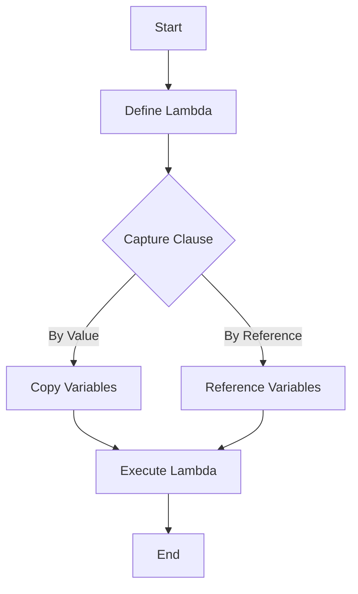

## 12.2 Using Lambdas and Functional Features

In the realm of modern C++ programming, lambdas and functional features have become indispensable tools for developers seeking to write cleaner, more efficient, and expressive code. This section delves into the intricacies of using lambdas and functional features in C++, focusing on simplifying code, replacing traditional functors, and capturing state in closures. As we explore these concepts, you'll gain a deeper understanding of how to leverage these powerful tools to enhance your C++ applications.

### Introduction to Lambdas in C++

Lambdas, introduced in C++11, are anonymous functions that allow you to define function objects inline. They provide a concise way to create function objects without the need for separate class definitions, making your code more readable and maintainable.

#### What is a Lambda?

A lambda expression in C++ is a convenient way to define a small, unnamed function object. It consists of three main components:

- **Capture Clause**: Defines which variables from the surrounding scope are accessible within the lambda.
- **Parameter List**: Specifies the parameters that the lambda accepts.
- **Function Body**: Contains the code that the lambda executes.

Here's a basic example of a lambda expression:

```cpp
#include <iostream>
#include <vector>
#include <algorithm>

int main() {
    std::vector<int> numbers = {1, 2, 3, 4, 5};

    // Lambda expression to print each number
    std::for_each(numbers.begin(), numbers.end(), [](int n) {
        std::cout << n << " ";
    });

    return 0;
}
```

In this example, the lambda `[](int n) { std::cout << n << " "; }` is used to print each element of the vector `numbers`.

### Simplifying Code with Lambdas

Lambdas can significantly simplify your code by reducing the need for boilerplate code associated with traditional function objects or functors. They allow you to define small, inline functions directly at the point of use, making your code more concise and easier to read.

#### Replacing Functors with Lambda Expressions

Before lambdas, functors (or function objects) were commonly used to encapsulate operations. However, functors often require additional class definitions, which can clutter your code. Lambdas provide a more streamlined alternative.

Consider the following example using a functor:

```cpp
#include <iostream>
#include <vector>
#include <algorithm>

struct PrintFunctor {
    void operator()(int n) const {
        std::cout << n << " ";
    }
};

int main() {
    std::vector<int> numbers = {1, 2, 3, 4, 5};

    // Using a functor to print each number
    std::for_each(numbers.begin(), numbers.end(), PrintFunctor());

    return 0;
}
```

Now, let's replace the functor with a lambda expression:

```cpp
#include <iostream>
#include <vector>
#include <algorithm>

int main() {
    std::vector<int> numbers = {1, 2, 3, 4, 5};

    // Using a lambda to print each number
    std::for_each(numbers.begin(), numbers.end(), [](int n) {
        std::cout << n << " ";
    });

    return 0;
}
```

As you can see, the lambda expression eliminates the need for a separate class definition, resulting in more concise and readable code.

### Capturing State in Closures

One of the powerful features of lambdas is their ability to capture variables from the surrounding scope, allowing them to maintain state across invocations. This capability is known as capturing state in closures.

#### Capture Modes

Lambdas can capture variables by value or by reference, depending on the capture mode specified in the capture clause:

- **Capture by Value (`[=]`)**: Copies the variables from the surrounding scope into the lambda. Modifications to these variables inside the lambda do not affect the originals.
- **Capture by Reference (`[&]`)**: Captures references to the variables from the surrounding scope. Modifications to these variables inside the lambda affect the originals.

You can also specify individual variables to capture by value or reference:

- **Capture by Value (`[x]`)**: Captures the variable `x` by value.
- **Capture by Reference (`[&x]`)**: Captures the variable `x` by reference.

Here's an example demonstrating capture modes:

```cpp
#include <iostream>

int main() {
    int x = 10;
    int y = 20;

    // Lambda capturing by value
    auto captureByValue = [=]() {
        std::cout << "Capture by value: x = " << x << ", y = " << y << std::endl;
    };

    // Lambda capturing by reference
    auto captureByReference = [&]() {
        std::cout << "Capture by reference: x = " << x << ", y = " << y << std::endl;
    };

    // Modifying x and y
    x = 30;
    y = 40;

    captureByValue();      // Outputs: Capture by value: x = 10, y = 20
    captureByReference();  // Outputs: Capture by reference: x = 30, y = 40

    return 0;
}
```

### Advanced Lambda Features

Lambdas in C++ offer several advanced features that enhance their flexibility and usability.

#### Mutable Lambdas

By default, lambdas that capture variables by value are immutable, meaning they cannot modify the captured variables. However, you can use the `mutable` keyword to allow modifications:

```cpp
#include <iostream>

int main() {
    int x = 10;

    // Mutable lambda capturing by value
    auto mutableLambda = [x]() mutable {
        x += 5;
        std::cout << "Inside mutable lambda: x = " << x << std::endl;
    };

    mutableLambda();  // Outputs: Inside mutable lambda: x = 15
    std::cout << "Outside lambda: x = " << x << std::endl;  // Outputs: Outside lambda: x = 10

    return 0;
}
```

In this example, the `mutable` keyword allows the lambda to modify the captured variable `x`, but the modification does not affect the original variable outside the lambda.

#### Generic Lambdas

C++14 introduced generic lambdas, which allow you to define lambdas with template-like behavior. This feature enables lambdas to accept parameters of any type without specifying the types explicitly.

Here's an example of a generic lambda:

```cpp
#include <iostream>

int main() {
    // Generic lambda
    auto genericLambda = [](auto a, auto b) {
        return a + b;
    };

    std::cout << "Sum of integers: " << genericLambda(3, 4) << std::endl;  // Outputs: Sum of integers: 7
    std::cout << "Sum of doubles: " << genericLambda(3.5, 4.5) << std::endl;  // Outputs: Sum of doubles: 8

    return 0;
}
```

Generic lambdas provide a powerful mechanism for writing flexible and reusable code.

### Functional Features in C++

In addition to lambdas, C++ offers several functional programming features that complement the use of lambdas and enhance your ability to write expressive code.

#### std::function

The `std::function` class template provides a type-safe way to store and invoke callable objects, including lambdas, function pointers, and functors. It abstracts the details of the callable object, allowing you to use them interchangeably.

Here's an example demonstrating the use of `std::function`:

```cpp
#include <iostream>
#include <functional>

void printMessage(const std::string& message) {
    std::cout << message << std::endl;
}

int main() {
    // Using std::function to store a lambda
    std::function<void(const std::string&)> func = [](const std::string& msg) {
        std::cout << "Lambda: " << msg << std::endl;
    };

    func("Hello, World!");  // Outputs: Lambda: Hello, World!

    // Reassigning std::function to a function pointer
    func = printMessage;
    func("Hello, C++!");  // Outputs: Hello, C++!

    return 0;
}
```

The `std::function` class template provides flexibility in managing callable objects, making it a valuable tool in functional programming.

#### std::bind

The `std::bind` function template allows you to create a new function object by binding arguments to a callable object. This feature is useful for creating partial function applications and adapting functions to different interfaces.

Here's an example demonstrating the use of `std::bind`:

```cpp
#include <iostream>
#include <functional>

void add(int a, int b) {
    std::cout << "Sum: " << a + b << std::endl;
}

int main() {
    // Binding the first argument
    auto addFive = std::bind(add, 5, std::placeholders::_1);

    addFive(10);  // Outputs: Sum: 15

    return 0;
}
```

The `std::bind` function template provides a powerful mechanism for adapting functions and creating new callable objects.

### Visualizing Lambda Expressions and Closures

To better understand how lambda expressions and closures work, let's visualize the process using a flowchart.



**Figure 1: Visualizing Lambda Expressions and Closures**

This flowchart illustrates the process of defining a lambda, capturing variables, and executing the lambda. The capture clause determines whether variables are copied or referenced, affecting how they are accessed within the lambda.

### Practical Applications of Lambdas

Lambdas are versatile tools that can be applied in various scenarios to improve code clarity and efficiency.

#### Sorting and Filtering

Lambdas are commonly used in sorting and filtering operations, where they provide a concise way to define custom comparison and filtering criteria.

Here's an example of using a lambda to sort a vector of integers in descending order:

```cpp
#include <iostream>
#include <vector>
#include <algorithm>

int main() {
    std::vector<int> numbers = {5, 2, 8, 1, 3};

    // Sorting in descending order using a lambda
    std::sort(numbers.begin(), numbers.end(), [](int a, int b) {
        return a > b;
    });

    for (int n : numbers) {
        std::cout << n << " ";  // Outputs: 8 5 3 2 1
    }

    return 0;
}
```

Lambdas provide a convenient way to define custom sorting and filtering logic directly at the point of use.

#### Event Handling

In event-driven programming, lambdas can be used to define event handlers inline, reducing the need for separate function definitions.

Here's an example of using a lambda as an event handler:

```cpp
#include <iostream>
#include <functional>

class Button {
public:
    std::function<void()> onClick;

    void click() {
        if (onClick) {
            onClick();
        }
    }
};

int main() {
    Button button;

    // Setting a lambda as the event handler
    button.onClick = []() {
        std::cout << "Button clicked!" << std::endl;
    };

    button.click();  // Outputs: Button clicked!

    return 0;
}
```

Lambdas provide a concise way to define event handlers, improving code readability and maintainability.

### Try It Yourself

To reinforce your understanding of lambdas and functional features, try modifying the code examples provided in this section. Experiment with different capture modes, parameter types, and functional features to see how they affect the behavior of the code.

### Knowledge Check

- **Question**: What is a lambda expression in C++?
- **Question**: How do lambdas simplify code compared to functors?
- **Question**: What is the difference between capturing by value and capturing by reference?
- **Question**: How can you modify captured variables in a lambda?
- **Question**: What is the purpose of the `std::function` class template?

### Embrace the Journey

Remember, mastering lambdas and functional features in C++ is a journey. As you continue to explore these concepts, you'll discover new ways to simplify your code and enhance its expressiveness. Keep experimenting, stay curious, and enjoy the journey!

## Quiz Time!



### What is a lambda expression in C++?

- [x] An anonymous function object defined inline
- [ ] A named function defined in a class
- [ ] A type of pointer to a function
- [ ] A macro for defining functions

> **Explanation:** A lambda expression is an anonymous function object defined inline, allowing for concise and readable code.

### How do lambdas simplify code compared to functors?

- [x] By eliminating the need for separate class definitions
- [ ] By requiring more boilerplate code
- [ ] By making code less readable
- [ ] By increasing the number of lines of code

> **Explanation:** Lambdas simplify code by eliminating the need for separate class definitions, making the code more concise and readable.

### What is the difference between capturing by value and capturing by reference?

- [x] Capturing by value copies variables, capturing by reference references them
- [ ] Capturing by value references variables, capturing by reference copies them
- [ ] Both capture modes copy variables
- [ ] Both capture modes reference variables

> **Explanation:** Capturing by value copies variables from the surrounding scope, while capturing by reference references them, allowing modifications to affect the original variables.

### How can you modify captured variables in a lambda?

- [x] By using the `mutable` keyword
- [ ] By capturing variables by reference
- [ ] By capturing variables by value
- [ ] By using `std::bind`

> **Explanation:** The `mutable` keyword allows modification of captured variables in a lambda when they are captured by value.

### What is the purpose of the `std::function` class template?

- [x] To store and invoke callable objects in a type-safe manner
- [ ] To define a new type of function pointer
- [ ] To replace all function pointers in C++
- [ ] To create macros for functions

> **Explanation:** The `std::function` class template provides a type-safe way to store and invoke callable objects, such as lambdas, function pointers, and functors.

### What is a generic lambda?

- [x] A lambda that can accept parameters of any type
- [ ] A lambda with a fixed parameter type
- [ ] A lambda that cannot capture variables
- [ ] A lambda that is always mutable

> **Explanation:** A generic lambda can accept parameters of any type, providing flexibility and reusability.

### How does `std::bind` enhance functional programming in C++?

- [x] By creating partial function applications
- [ ] By defining new types of functions
- [ ] By replacing all lambdas
- [ ] By eliminating the need for function pointers

> **Explanation:** `std::bind` creates partial function applications by binding arguments to callable objects, enhancing functional programming capabilities.

### What is the role of the capture clause in a lambda expression?

- [x] To specify which variables from the surrounding scope are accessible
- [ ] To define the return type of the lambda
- [ ] To specify the parameter list of the lambda
- [ ] To determine the execution order of lambdas

> **Explanation:** The capture clause specifies which variables from the surrounding scope are accessible within the lambda, determining how they are captured.

### How can lambdas be used in event-driven programming?

- [x] As inline event handlers
- [ ] As macros for events
- [ ] As global variables
- [ ] As templates for events

> **Explanation:** Lambdas can be used as inline event handlers in event-driven programming, reducing the need for separate function definitions.

### True or False: Lambdas can only capture variables by value.

- [ ] True
- [x] False

> **Explanation:** Lambdas can capture variables by both value and reference, depending on the specified capture mode.


