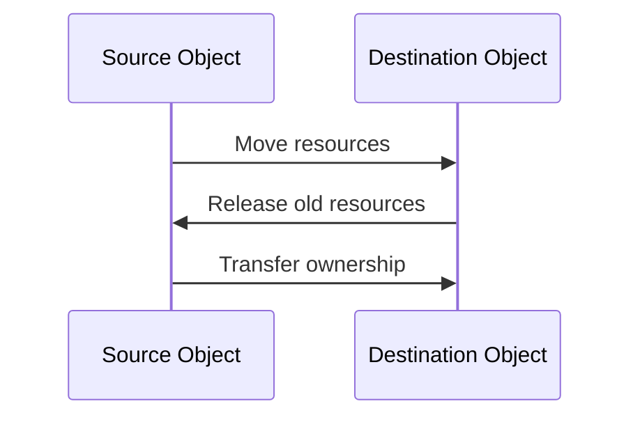

## 12.3 Move Semantics in Patterns

In the realm of modern C++ programming, move semantics have emerged as a powerful tool for optimizing performance, particularly in the context of design patterns. By leveraging rvalue references, developers can significantly reduce unnecessary copying of objects, leading to more efficient and performant code. In this section, we will delve into the intricacies of move semantics, explore how they can be integrated into design patterns, and provide practical examples of implementing efficient factories and builders.

### Understanding Move Semantics

Move semantics were introduced in C++11 to address the inefficiencies associated with copying large objects. Traditionally, when objects are passed by value or returned from functions, they are copied, which can be costly in terms of performance. Move semantics allow for the transfer of resources from one object to another without the overhead of copying.

#### Rvalue References

Rvalue references are a key component of move semantics. They are denoted by `&&` and are used to bind to temporary objects (rvalues) that are about to be destroyed. This allows the resources of the temporary object to be "moved" rather than copied, providing a significant performance boost.

```cpp
class Resource {
public:
    Resource() { /* allocate resources */ }
    ~Resource() { /* deallocate resources */ }

    // Move constructor
    Resource(Resource&& other) noexcept {
        // Transfer ownership of resources
    }

    // Move assignment operator
    Resource& operator=(Resource&& other) noexcept {
        if (this != &other) {
            // Release current resources
            // Transfer ownership of resources
        }
        return *this;
    }
};
```

In the example above, the move constructor and move assignment operator are defined to transfer ownership of resources from one `Resource` object to another, without the need for copying.

#### Lvalue vs. Rvalue

To fully grasp move semantics, it's essential to understand the distinction between lvalues and rvalues:

- **Lvalues**: Objects that have a persistent state and can be referenced by an address. They are typically variables with a name.
- **Rvalues**: Temporary objects that do not have a persistent state. They are usually returned from functions or are temporary expressions.

### Integrating Move Semantics into Design Patterns

Move semantics can be seamlessly integrated into various design patterns to enhance performance. Let's explore how this can be achieved in some common patterns.

#### Singleton Pattern

The Singleton pattern ensures that a class has only one instance and provides a global point of access to it. By using move semantics, we can optimize the creation and management of the singleton instance.

```cpp
class Singleton {
public:
    static Singleton& getInstance() {
        static Singleton instance;
        return instance;
    }

    // Delete copy constructor and assignment operator
    Singleton(const Singleton&) = delete;
    Singleton& operator=(const Singleton&) = delete;

    // Allow move constructor and assignment operator
    Singleton(Singleton&&) noexcept = default;
    Singleton& operator=(Singleton&&) noexcept = default;

private:
    Singleton() = default;
};
```

In this implementation, the copy constructor and assignment operator are deleted to prevent copying, while the move constructor and assignment operator are allowed, ensuring efficient resource management.

#### Factory Pattern

The Factory pattern is used to create objects without specifying the exact class of object that will be created. By incorporating move semantics, we can optimize the creation process, especially when dealing with large objects.

```cpp
class Product {
public:
    Product() { /* allocate resources */ }
    Product(Product&& other) noexcept { /* move resources */ }
    Product& operator=(Product&& other) noexcept { /* move resources */ return *this; }
};

class Factory {
public:
    static Product createProduct() {
        Product product;
        // Configure product
        return std::move(product);
    }
};
```

Here, the `createProduct` function returns a `Product` object using `std::move`, allowing the resources to be transferred efficiently.

#### Builder Pattern

The Builder pattern is used to construct complex objects step by step. Move semantics can be used to optimize the construction process by transferring resources between intermediate objects.

```cpp
class ComplexObject {
public:
    ComplexObject() { /* allocate resources */ }
    ComplexObject(ComplexObject&& other) noexcept { /* move resources */ }
    ComplexObject& operator=(ComplexObject&& other) noexcept { /* move resources */ return *this; }
};

class Builder {
private:
    ComplexObject object;

public:
    Builder& addPart() {
        // Add part to object
        return *this;
    }

    ComplexObject build() {
        return std::move(object);
    }
};
```

In this example, the `build` function returns the constructed `ComplexObject` using `std::move`, ensuring that resources are transferred efficiently.

### Design Considerations

When integrating move semantics into design patterns, several considerations must be taken into account:

- **Resource Management**: Ensure that resources are properly managed and released when no longer needed. This includes implementing move constructors and move assignment operators.
- **Exception Safety**: Move operations should be noexcept to guarantee exception safety and prevent resource leaks.
- **Compatibility**: Consider the compatibility of move semantics with existing code and patterns. Ensure that move operations do not interfere with other functionalities.

### Differences and Similarities

Move semantics can be confused with copy semantics, but they serve different purposes. While copy semantics involve duplicating resources, move semantics transfer ownership, resulting in more efficient resource management. It's important to distinguish between the two and use them appropriately in design patterns.

### Visualizing Move Semantics

To better understand move semantics, let's visualize the process of moving resources between objects.



In this diagram, the source object transfers its resources to the destination object, releasing its old resources and transferring ownership.

### Try It Yourself

To gain a deeper understanding of move semantics, try modifying the code examples provided. Experiment with different scenarios, such as:

- Implementing move semantics in other design patterns, such as the Prototype or Observer pattern.
- Creating a custom class with complex resources and implementing move constructors and move assignment operators.
- Measuring the performance improvements achieved by using move semantics compared to copy semantics.

### References and Further Reading

For more information on move semantics and their integration into design patterns, consider exploring the following resources:

- [C++ Reference: Move Semantics](https://en.cppreference.com/w/cpp/language/move_constructor)
- [Modern C++ Design Patterns](https://www.modernescpp.com/index.php/design-patterns-in-modern-c)
- [Effective Modern C++ by Scott Meyers](https://www.oreilly.com/library/view/effective-modern-c/9781491908419/)

### Knowledge Check

Before we conclude, let's test your understanding of move semantics with a few questions:

- What is the primary benefit of move semantics in C++?
- How do rvalue references differ from lvalue references?
- In what scenarios should move constructors and move assignment operators be used?

### Embrace the Journey

Remember, mastering move semantics and their integration into design patterns is a journey. As you continue to explore and experiment, you'll discover new ways to optimize your code and enhance performance. Stay curious, keep learning, and enjoy the process!

## Quiz Time!



### What is the primary benefit of move semantics in C++?

- [x] Reducing unnecessary copying of objects
- [ ] Increasing the size of objects
- [ ] Simplifying code syntax
- [ ] Improving code readability

> **Explanation:** Move semantics allow for the transfer of resources from one object to another without the overhead of copying, thus reducing unnecessary copying of objects.

### How do rvalue references differ from lvalue references?

- [x] Rvalue references bind to temporary objects, while lvalue references bind to named objects.
- [ ] Rvalue references bind to named objects, while lvalue references bind to temporary objects.
- [ ] Both bind to temporary objects.
- [ ] Both bind to named objects.

> **Explanation:** Rvalue references are used to bind to temporary objects (rvalues) that are about to be destroyed, while lvalue references bind to named objects with a persistent state.

### Which of the following is a key component of move semantics?

- [x] Rvalue references
- [ ] Lvalue references
- [ ] Copy constructors
- [ ] Destructor

> **Explanation:** Rvalue references, denoted by `&&`, are a key component of move semantics, allowing the transfer of resources from temporary objects.

### In which design pattern can move semantics be used to optimize object creation?

- [x] Factory Pattern
- [ ] Observer Pattern
- [ ] Strategy Pattern
- [ ] Decorator Pattern

> **Explanation:** Move semantics can be used in the Factory pattern to optimize the creation process, especially when dealing with large objects.

### What should be ensured when implementing move operations?

- [x] Resources are properly managed and released
- [ ] Resources are duplicated
- [ ] Resources are ignored
- [ ] Resources are always copied

> **Explanation:** When implementing move operations, it's important to ensure that resources are properly managed and released when no longer needed.

### What is the purpose of the `std::move` function?

- [x] To cast an object to an rvalue reference
- [ ] To cast an object to an lvalue reference
- [ ] To copy an object
- [ ] To delete an object

> **Explanation:** The `std::move` function is used to cast an object to an rvalue reference, enabling the transfer of resources.

### Which of the following is a consideration when integrating move semantics into design patterns?

- [x] Exception safety
- [ ] Increasing code complexity
- [ ] Reducing code readability
- [ ] Ignoring resource management

> **Explanation:** Exception safety is a key consideration when integrating move semantics into design patterns to prevent resource leaks.

### What is the result of using move semantics in the Builder pattern?

- [x] Efficient transfer of resources between intermediate objects
- [ ] Duplication of resources
- [ ] Increased complexity
- [ ] Reduced performance

> **Explanation:** Move semantics in the Builder pattern allow for the efficient transfer of resources between intermediate objects, optimizing the construction process.

### How can move semantics improve the Singleton pattern?

- [x] By allowing move constructor and assignment operator
- [ ] By deleting move constructor and assignment operator
- [ ] By duplicating the singleton instance
- [ ] By increasing the number of singleton instances

> **Explanation:** Allowing move constructor and assignment operator in the Singleton pattern ensures efficient resource management.

### True or False: Move semantics are only applicable in C++11 and later versions.

- [x] True
- [ ] False

> **Explanation:** Move semantics were introduced in C++11 and are applicable in C++11 and later versions.


