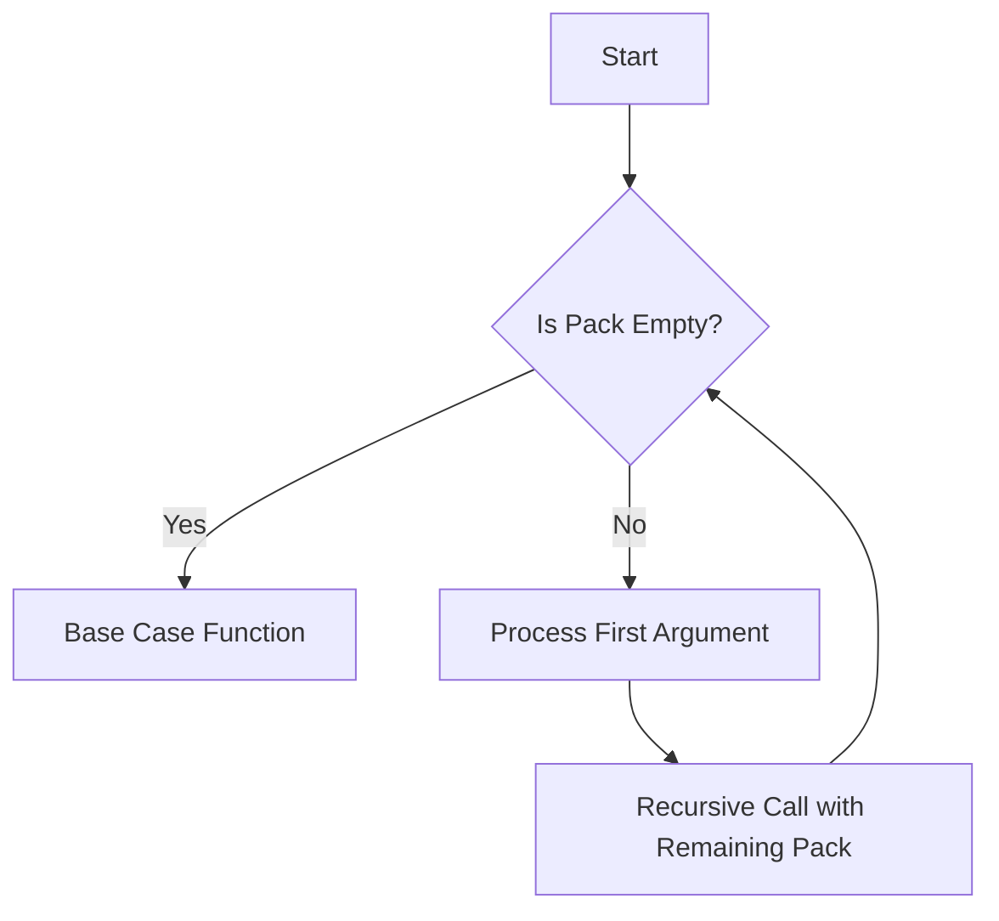

## 12.4 Variadic Templates in Patterns

Variadic templates, introduced in C++11, are a powerful feature that allows developers to write functions and classes that can accept any number of arguments. This capability is particularly useful in the context of design patterns, where flexibility and type safety are paramount. In this section, we will delve into the intricacies of variadic templates, explore their application in design patterns, and provide practical examples to illustrate their use.

### Understanding Variadic Templates

Variadic templates enable functions and classes to operate on an arbitrary number of arguments. This is achieved by using template parameter packs, which can be expanded at compile time. Let's begin by understanding the basic syntax and semantics of variadic templates.

#### Basic Syntax

A variadic template is defined using an ellipsis (`...`) in the template parameter list. Here's a simple example:

```cpp
template<typename... Args>
void print(Args... args) {
    // Function body
}
```

In this example, `Args...` is a template parameter pack that can hold zero or more template arguments. The function `print` can accept any number of arguments of any type.

#### Expanding Parameter Packs

To work with the arguments in a parameter pack, we need to expand it. This is typically done using recursion or fold expressions (introduced in C++17). Here's an example of how to print each argument in a parameter pack using recursion:

```cpp
template<typename T>
void print(T t) {
    std::cout << t << std::endl;
}

template<typename T, typename... Args>
void print(T t, Args... args) {
    std::cout << t << std::endl;
    print(args...);
}
```

In this example, the first overload of `print` handles the base case, while the second overload recursively processes each argument in the pack.

### Implementing Flexible APIs

One of the primary applications of variadic templates is in the creation of flexible APIs. By allowing functions to accept a variable number of arguments, we can design APIs that are both powerful and easy to use.

#### Example: Logging Function

Consider a logging function that needs to accept a variable number of arguments of different types. Variadic templates make this straightforward:

```cpp
template<typename... Args>
void log(const std::string& format, Args... args) {
    // Implementation that formats and logs the message
}

log("Error: {} occurred at {}", errorCode, timestamp);
```

In this example, the `log` function can accept any number of arguments, making it easy to log messages with varying levels of detail.

### Handling Variable Argument Lists

Variadic templates provide a type-safe alternative to traditional C-style variadic functions (e.g., `printf`). By using template parameter packs, we can ensure that all arguments are type-checked at compile time.

#### Example: Sum Function

Let's implement a function that calculates the sum of an arbitrary number of arguments:

```cpp
template<typename T>
T sum(T t) {
    return t;
}

template<typename T, typename... Args>
T sum(T t, Args... args) {
    return t + sum(args...);
}

int total = sum(1, 2, 3, 4, 5); // total is 15
```

In this example, the `sum` function recursively adds each argument in the parameter pack, ensuring type safety and flexibility.

### Type-Safe Variadic Functions

Type safety is a critical consideration in modern C++ programming. Variadic templates allow us to create type-safe variadic functions that leverage compile-time checks to prevent errors.

#### Example: Type-Safe Print

Consider a type-safe version of the `print` function that ensures all arguments are printable:

```cpp
template<typename T>
void safePrint(T t) {
    static_assert(std::is_arithmetic<T>::value || std::is_convertible<T, std::string>::value, "Argument must be printable");
    std::cout << t << std::endl;
}

template<typename T, typename... Args>
void safePrint(T t, Args... args) {
    safePrint(t);
    safePrint(args...);
}

safePrint(1, "Hello", 3.14); // Valid
safePrint(1, std::vector<int>{1, 2, 3}); // Compile-time error
```

In this example, the `safePrint` function uses `static_assert` to ensure that each argument is either arithmetic or convertible to a string.

### Variadic Templates in Design Patterns

Variadic templates can be used to implement several design patterns, enhancing their flexibility and expressiveness. Let's explore a few examples.

#### Factory Pattern

The Factory pattern is used to create objects without specifying the exact class of object that will be created. Variadic templates can be used to pass constructor arguments to the created object.

```cpp
template<typename T, typename... Args>
std::unique_ptr<T> create(Args&&... args) {
    return std::make_unique<T>(std::forward<Args>(args)...);
}

auto myObject = create<MyClass>(arg1, arg2, arg3);
```

In this example, the `create` function uses perfect forwarding to pass arguments to the constructor of `T`.

#### Observer Pattern

The Observer pattern defines a one-to-many dependency between objects, allowing multiple observers to listen for changes in a subject. Variadic templates can simplify the implementation of the notification mechanism.

```cpp
template<typename... Args>
class Observer {
public:
    virtual void update(Args... args) = 0;
};

template<typename... Args>
class Subject {
    std::vector<Observer<Args...>*> observers;
public:
    void attach(Observer<Args...>* observer) {
        observers.push_back(observer);
    }

    void notify(Args... args) {
        for (auto observer : observers) {
            observer->update(args...);
        }
    }
};
```

In this example, the `Subject` class can notify observers with any number of arguments, enhancing flexibility.

### Design Considerations

When using variadic templates, it's important to consider the following:

- **Compile-Time Overhead**: Variadic templates can increase compile-time overhead, especially when used extensively. Be mindful of this when designing your APIs.
- **Readability**: While variadic templates offer flexibility, they can also make code harder to read and understand. Use them judiciously and provide clear documentation.
- **Error Messages**: Template errors can be difficult to decipher. Use static assertions and type traits to provide meaningful error messages.

### Differences and Similarities

Variadic templates are often compared to traditional C-style variadic functions. Here are some key differences and similarities:

- **Type Safety**: Variadic templates provide type safety, while C-style variadic functions do not.
- **Flexibility**: Both approaches offer flexibility, but variadic templates are more powerful and expressive.
- **Complexity**: Variadic templates can be more complex to implement and understand, but they offer greater benefits in terms of safety and maintainability.

### Try It Yourself

To solidify your understanding of variadic templates, try modifying the examples provided. For instance, implement a variadic function that calculates the product of its arguments, or extend the `Observer` pattern to support different types of notifications.

### Visualizing Variadic Templates

To better understand how variadic templates work, let's visualize the process of expanding a parameter pack using a flowchart.



This flowchart illustrates the recursive nature of variadic templates, where the parameter pack is processed one argument at a time until the base case is reached.

### References and Links

For further reading on variadic templates and their applications, consider the following resources:

- [C++ Reference on Variadic Templates](https://en.cppreference.com/w/cpp/language/variadic_templates)
- [Effective Modern C++ by Scott Meyers](https://www.oreilly.com/library/view/effective-modern-c/9781491908419/)
- [The C++ Programming Language by Bjarne Stroustrup](https://www.stroustrup.com/4th.html)

### Knowledge Check

To test your understanding of variadic templates, consider the following questions:

1. What is a variadic template, and how does it differ from a regular template?
2. How can variadic templates be used to implement flexible APIs?
3. What are the benefits of using variadic templates over C-style variadic functions?
4. How can you ensure type safety when using variadic templates?
5. What are some design patterns that can benefit from variadic templates?

### Embrace the Journey

Remember, mastering variadic templates is just one step in your journey to becoming a C++ expert. As you continue to explore the language, you'll discover new ways to leverage its features to write more efficient and expressive code. Keep experimenting, stay curious, and enjoy the journey!

## Quiz Time!



### What is a variadic template?

- [x] A template that can accept a variable number of arguments.
- [ ] A template that can only accept a fixed number of arguments.
- [ ] A template that is used for creating singletons.
- [ ] A template that is used for memory management.

> **Explanation:** A variadic template is a template that can accept a variable number of arguments, allowing for flexible function and class definitions.

### How do variadic templates ensure type safety?

- [x] By performing compile-time checks on all arguments.
- [ ] By using runtime type checking.
- [ ] By using dynamic_cast for type conversion.
- [ ] By using macros to enforce type constraints.

> **Explanation:** Variadic templates ensure type safety by performing compile-time checks on all arguments, unlike C-style variadic functions.

### What is a common use case for variadic templates?

- [x] Implementing flexible APIs.
- [ ] Managing memory allocation.
- [ ] Creating GUI applications.
- [ ] Handling file I/O operations.

> **Explanation:** A common use case for variadic templates is implementing flexible APIs that can accept a variable number of arguments.

### Which of the following is a benefit of using variadic templates over C-style variadic functions?

- [x] Type safety.
- [ ] Simplicity.
- [ ] Faster runtime performance.
- [ ] Smaller code size.

> **Explanation:** Variadic templates provide type safety, which is a significant advantage over C-style variadic functions that do not perform compile-time type checks.

### What is the purpose of the ellipsis (`...`) in a variadic template?

- [x] To indicate a template parameter pack.
- [ ] To denote a comment in the code.
- [ ] To specify a default argument.
- [ ] To mark the end of a function definition.

> **Explanation:** The ellipsis (`...`) in a variadic template is used to indicate a template parameter pack, which can hold zero or more template arguments.

### How can variadic templates be used in the Factory pattern?

- [x] By passing constructor arguments to the created object.
- [ ] By managing object lifetimes.
- [ ] By enforcing singleton behavior.
- [ ] By handling object serialization.

> **Explanation:** Variadic templates can be used in the Factory pattern to pass constructor arguments to the created object, allowing for flexible object creation.

### What is a potential drawback of using variadic templates?

- [x] Increased compile-time overhead.
- [ ] Reduced runtime performance.
- [ ] Lack of type safety.
- [ ] Limited flexibility.

> **Explanation:** A potential drawback of using variadic templates is increased compile-time overhead, especially when used extensively.

### In the context of variadic templates, what is a parameter pack?

- [x] A collection of template arguments.
- [ ] A special type of iterator.
- [ ] A memory management technique.
- [ ] A design pattern for concurrency.

> **Explanation:** In the context of variadic templates, a parameter pack is a collection of template arguments that can be expanded at compile time.

### What is the purpose of `std::forward` in a variadic template function?

- [x] To perform perfect forwarding of arguments.
- [ ] To convert arguments to strings.
- [ ] To allocate memory for arguments.
- [ ] To enforce type constraints.

> **Explanation:** `std::forward` is used in a variadic template function to perform perfect forwarding of arguments, preserving their value categories.

### True or False: Variadic templates can only be used with functions, not classes.

- [ ] True
- [x] False

> **Explanation:** False. Variadic templates can be used with both functions and classes, allowing for flexible and type-safe designs.


