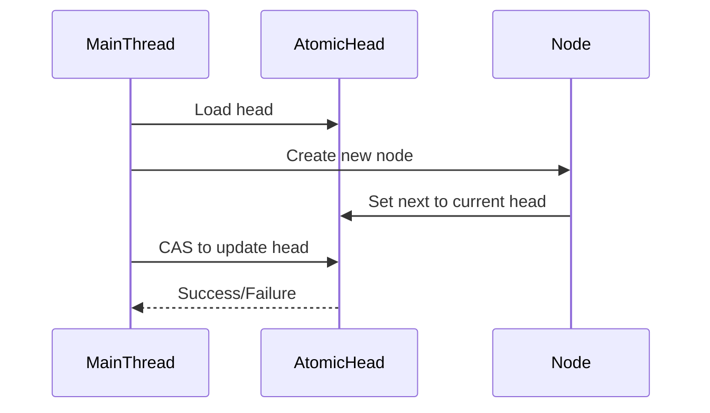
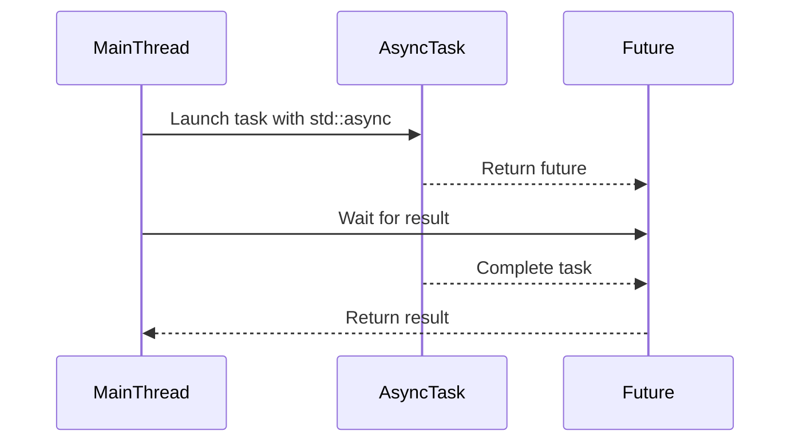

## 12.6 Concurrency Enhancements

In the ever-evolving landscape of software development, concurrency has emerged as a cornerstone for building efficient and scalable applications. Modern C++ has introduced a plethora of features that empower developers to harness the full potential of concurrent programming. In this section, we will delve into two pivotal concurrency enhancements in C++: lock-free programming with atomics and asynchronous tasks with `std::async`. These concepts not only optimize performance but also simplify the complexity associated with traditional multithreading techniques.

### Lock-Free Programming with Atomics

Lock-free programming is a paradigm that aims to eliminate the use of locks for synchronizing shared data, thereby avoiding common pitfalls such as deadlocks, priority inversion, and contention. Instead, it relies on atomic operations that ensure data consistency without blocking threads.

#### Understanding Atomics

Atomics are a set of operations that are performed as a single, indivisible step. They are crucial for implementing lock-free data structures and algorithms. In C++, the `<atomic>` header provides a comprehensive suite of atomic operations that can be used to manipulate shared data safely.

**Key Concepts:**

- **Atomicity:** Ensures that a series of operations on a shared variable are completed without interruption.
- **Memory Ordering:** Controls the visibility of changes to shared data across different threads.
- **Lock-Free Guarantees:** Provides progress guarantees such as wait-freedom, lock-freedom, and obstruction-freedom.

#### Atomic Operations in C++

C++ offers a variety of atomic operations that can be performed on integral types, pointers, and user-defined types. These operations include load, store, exchange, and compare-and-swap (CAS).

```cpp
#include <atomic>
#include <iostream>

int main() {
    std::atomic<int> atomicCounter(0);

    // Atomic increment
    atomicCounter.fetch_add(1, std::memory_order_relaxed);

    // Atomic load
    int value = atomicCounter.load(std::memory_order_acquire);

    // Atomic compare-and-swap
    int expected = value;
    if (atomicCounter.compare_exchange_strong(expected, value + 1, std::memory_order_acq_rel)) {
        std::cout << "CAS succeeded, new value: " << atomicCounter.load() << std::endl;
    } else {
        std::cout << "CAS failed, expected: " << expected << ", actual: " << atomicCounter.load() << std::endl;
    }

    return 0;
}
```

**Explanation:**

- **`fetch_add`:** Atomically increments the counter.
- **`load`:** Retrieves the current value of the atomic variable.
- **`compare_exchange_strong`:** Performs a CAS operation, updating the value only if it matches the expected value.

#### Memory Ordering

Memory ordering is a critical aspect of atomic operations that dictates how operations are perceived by different threads. C++ provides several memory orderings, including:

- **`memory_order_relaxed`:** No synchronization or ordering constraints.
- **`memory_order_acquire`:** Ensures that subsequent reads and writes are not reordered before this operation.
- **`memory_order_release`:** Ensures that previous reads and writes are not reordered after this operation.
- **`memory_order_acq_rel`:** Combines acquire and release semantics.
- **`memory_order_seq_cst`:** Provides a total ordering of operations, ensuring sequential consistency.

#### Implementing Lock-Free Data Structures

Lock-free data structures, such as queues and stacks, are designed to operate without locks, providing high performance and scalability. Let's explore a simple lock-free stack implementation using atomics.

```cpp
#include <atomic>
#include <memory>

template<typename T>
class LockFreeStack {
private:
    struct Node {
        T data;
        std::shared_ptr<Node> next;
        Node(T const& data_) : data(data_) {}
    };

    std::atomic<std::shared_ptr<Node>> head;

public:
    void push(T const& data) {
        std::shared_ptr<Node> newNode = std::make_shared<Node>(data);
        newNode->next = head.load();
        while (!head.compare_exchange_weak(newNode->next, newNode));
    }

    std::shared_ptr<T> pop() {
        std::shared_ptr<Node> oldHead = head.load();
        while (oldHead && !head.compare_exchange_weak(oldHead, oldHead->next));
        return oldHead ? std::make_shared<T>(oldHead->data) : std::shared_ptr<T>();
    }
};
```

**Explanation:**

- **`push`:** Inserts a new node at the head of the stack using CAS to ensure atomicity.
- **`pop`:** Removes the node from the head of the stack, again using CAS to maintain consistency.

#### Design Considerations

When implementing lock-free data structures, consider the following:

- **ABA Problem:** Occurs when a location is modified from A to B and back to A, causing CAS to succeed incorrectly. Use versioning or hazard pointers to mitigate this issue.
- **Memory Reclamation:** Ensure that memory is reclaimed safely to avoid memory leaks. Techniques such as hazard pointers or epoch-based reclamation can be employed.

### Asynchronous Tasks with `std::async`

Asynchronous programming allows tasks to be executed concurrently without blocking the main thread. C++11 introduced `std::async`, a powerful tool for launching tasks asynchronously, simplifying the management of concurrent operations.

#### Understanding `std::async`

`std::async` is a function template that runs a callable object (such as a function or lambda) asynchronously. It returns a `std::future` object, which can be used to retrieve the result of the asynchronous operation once it completes.

**Key Concepts:**

- **Future and Promise:** `std::future` represents a value that will be available in the future, while `std::promise` is used to set the value.
- **Launch Policies:** Control how tasks are executed, either asynchronously or deferred.

#### Using `std::async`

Let's explore how to use `std::async` to perform asynchronous tasks.

```cpp
#include <iostream>
#include <future>
#include <chrono>

int computeFactorial(int n) {
    int result = 1;
    for (int i = 1; i <= n; ++i) {
        result *= i;
    }
    return result;
}

int main() {
    std::future<int> futureResult = std::async(std::launch::async, computeFactorial, 5);

    std::cout << "Doing other work while factorial is computed..." << std::endl;

    // Wait for the result
    int result = futureResult.get();
    std::cout << "Factorial result: " << result << std::endl;

    return 0;
}
```

**Explanation:**

- **`std::async`:** Launches `computeFactorial` asynchronously.
- **`std::future::get`:** Blocks until the result is available, then retrieves it.

#### Launch Policies

`std::async` supports two launch policies:

- **`std::launch::async`:** Forces the task to run asynchronously in a separate thread.
- **`std::launch::deferred`:** Delays execution until `get` or `wait` is called.

#### Handling Exceptions

`std::async` propagates exceptions thrown by the task to the caller. These exceptions can be caught when calling `get`.

```cpp
#include <iostream>
#include <future>
#include <stdexcept>

int faultyFunction() {
    throw std::runtime_error("An error occurred");
}

int main() {
    std::future<int> futureResult = std::async(std::launch::async, faultyFunction);

    try {
        int result = futureResult.get();
    } catch (const std::exception& e) {
        std::cerr << "Exception caught: " << e.what() << std::endl;
    }

    return 0;
}
```

**Explanation:**

- **Exception Handling:** The exception thrown by `faultyFunction` is caught when `get` is called.

#### Design Considerations

When using `std::async`, consider the following:

- **Thread Pooling:** `std::async` may use a thread pool, but this is implementation-defined. Be mindful of thread resource usage.
- **Task Lifetime:** Ensure that tasks do not outlive their resources, especially when using deferred execution.

### Visualizing Concurrency Enhancements

To better understand the flow of lock-free programming and asynchronous tasks, let's visualize these concepts using Mermaid.js diagrams.

#### Lock-Free Stack Operations



**Caption:** This sequence diagram illustrates the lock-free stack push operation, highlighting the use of CAS to update the head atomically.

#### Asynchronous Task Execution



**Caption:** This sequence diagram demonstrates the lifecycle of an asynchronous task, from launching with `std::async` to retrieving the result with `std::future`.

### Try It Yourself

Experiment with the provided code examples to deepen your understanding of concurrency enhancements in C++. Here are some suggestions for modifications:

1. **Modify the Lock-Free Stack:**
   - Implement a `size` method to count the number of elements in the stack.
   - Add a `clear` method to remove all elements atomically.

2. **Enhance Asynchronous Tasks:**
   - Create a task that performs a long-running computation and periodically updates the main thread with progress.
   - Implement a timeout mechanism to cancel a task if it takes too long.

### Knowledge Check

Before we conclude, let's review some key takeaways:

- **Atomics** provide a foundation for lock-free programming, offering atomic operations and memory ordering guarantees.
- **Lock-free data structures** enhance performance by eliminating locks, but require careful consideration of issues like the ABA problem.
- **`std::async`** simplifies asynchronous programming, allowing tasks to run concurrently without blocking the main thread.
- **Launch policies** in `std::async` control task execution, providing flexibility in how tasks are managed.

### Embrace the Journey

Concurrency enhancements in modern C++ empower developers to build high-performance, scalable applications. As you explore these concepts, remember that this is just the beginning. Continue experimenting, stay curious, and enjoy the journey of mastering concurrency in C++!

## Quiz Time!



### What is the primary advantage of lock-free programming?

- [x] Avoids deadlocks and reduces contention
- [ ] Simplifies code by using locks
- [ ] Guarantees faster execution than lock-based programming
- [ ] Eliminates the need for synchronization

> **Explanation:** Lock-free programming avoids deadlocks and reduces contention by using atomic operations instead of locks.

### Which C++ header provides atomic operations?

- [x] `<atomic>`
- [ ] `<thread>`
- [ ] `<mutex>`
- [ ] `<future>`

> **Explanation:** The `<atomic>` header provides atomic operations for lock-free programming in C++.

### What does the `compare_exchange_strong` function do?

- [x] Performs a compare-and-swap operation
- [ ] Loads the current value atomically
- [ ] Increments the value atomically
- [ ] Stores a new value atomically

> **Explanation:** `compare_exchange_strong` performs a compare-and-swap operation, updating the value only if it matches the expected value.

### What is the purpose of `std::async`?

- [x] To run tasks asynchronously
- [ ] To create threads directly
- [ ] To manage mutexes
- [ ] To handle exceptions

> **Explanation:** `std::async` is used to run tasks asynchronously, returning a `std::future` for retrieving the result.

### Which launch policy forces a task to run in a separate thread?

- [x] `std::launch::async`
- [ ] `std::launch::deferred`
- [ ] `std::launch::sync`
- [ ] `std::launch::thread`

> **Explanation:** `std::launch::async` forces the task to run asynchronously in a separate thread.

### How does `std::async` propagate exceptions?

- [x] Through the `std::future` when calling `get`
- [ ] By throwing them immediately
- [ ] By logging them
- [ ] By ignoring them

> **Explanation:** Exceptions thrown by tasks launched with `std::async` are propagated through the `std::future` when calling `get`.

### What is the ABA problem in lock-free programming?

- [x] A problem where a location is modified from A to B and back to A
- [ ] A problem related to memory leaks
- [ ] A problem with thread starvation
- [ ] A problem with deadlocks

> **Explanation:** The ABA problem occurs when a location is modified from A to B and back to A, causing CAS to succeed incorrectly.

### Which memory ordering provides sequential consistency?

- [x] `memory_order_seq_cst`
- [ ] `memory_order_relaxed`
- [ ] `memory_order_acquire`
- [ ] `memory_order_release`

> **Explanation:** `memory_order_seq_cst` provides a total ordering of operations, ensuring sequential consistency.

### What is a `std::future` used for?

- [x] To represent a value that will be available in the future
- [ ] To create threads
- [ ] To manage mutexes
- [ ] To handle exceptions

> **Explanation:** `std::future` represents a value that will be available in the future, allowing asynchronous tasks to return results.

### True or False: `std::async` always creates a new thread for each task.

- [ ] True
- [x] False

> **Explanation:** `std::async` may use a thread pool or defer execution, depending on the launch policy and implementation.


