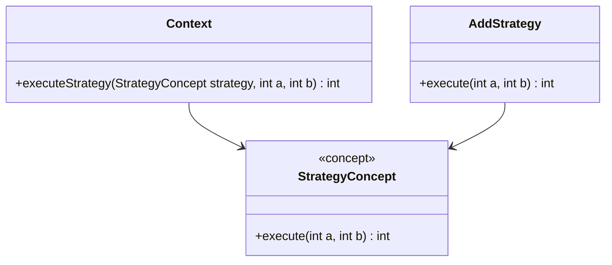

## 12.7 Applying Concepts (C++20) to Patterns

In the ever-evolving landscape of C++ programming, C++20 introduces a powerful feature known as **concepts**. Concepts allow developers to specify constraints on template parameters, effectively enforcing interface contracts. This capability enhances code readability, maintainability, and robustness, making it a valuable addition to modern C++ design patterns. In this section, we will explore how concepts can be applied to design patterns, focusing on enforcing interface contracts in templates, enhancing readability, and facilitating library design.

### Understanding Concepts in C++20

Before diving into their application in design patterns, let's first understand what concepts are and how they work in C++20.

#### What Are Concepts?

Concepts are a way to specify requirements on template parameters. They allow you to define a set of constraints that a type must satisfy to be used with a particular template. This provides a mechanism for compile-time checking of template arguments, ensuring that they meet the necessary requirements.

#### Benefits of Using Concepts

1. **Improved Readability**: Concepts make the requirements of a template explicit, improving code readability and making it easier for developers to understand the intended use of a template.

2. **Enhanced Maintainability**: By enforcing interface contracts, concepts reduce the likelihood of errors and make code maintenance easier.

3. **Better Error Messages**: Concepts provide more meaningful error messages when template requirements are not met, making it easier to diagnose and fix issues.

4. **Facilitating Library Design**: Concepts enable library designers to specify precise requirements for template parameters, leading to more robust and flexible libraries.

#### Syntax of Concepts

Concepts are defined using the `concept` keyword, followed by a boolean expression that specifies the requirements. Here's a simple example:

```cpp
template<typename T>
concept Addable = requires(T a, T b) {
    { a + b } -> std::convertible_to<T>;
};
```

In this example, the `Addable` concept requires that the type `T` supports the addition operator and that the result is convertible to `T`.

### Applying Concepts to Design Patterns

Now that we have a basic understanding of concepts, let's explore how they can be applied to various design patterns to enforce interface contracts and improve code quality.

#### 1. Strategy Pattern with Concepts

The Strategy Pattern is a behavioral design pattern that defines a family of algorithms, encapsulates each one, and makes them interchangeable. By using concepts, we can enforce that each strategy conforms to a specific interface.

**Intent**: Define a family of algorithms, encapsulate each one, and make them interchangeable.

**Key Participants**:
- **Strategy**: The interface for the algorithms.
- **ConcreteStrategy**: Implements the algorithm using the Strategy interface.
- **Context**: Maintains a reference to a Strategy object.

**Concept Implementation**:

```cpp
#include <concepts>
#include <iostream>

// Define a concept for the strategy interface
template<typename Strategy>
concept StrategyConcept = requires(Strategy s, int a, int b) {
    { s.execute(a, b) } -> std::convertible_to<int>;
};

// Concrete strategy implementing the StrategyConcept
class AddStrategy {
public:
    int execute(int a, int b) const {
        return a + b;
    }
};

// Context class using a strategy
class Context {
public:
    template<StrategyConcept S>
    int executeStrategy(S strategy, int a, int b) {
        return strategy.execute(a, b);
    }
};

int main() {
    Context context;
    AddStrategy addStrategy;
    std::cout << "Result: " << context.executeStrategy(addStrategy, 5, 3) << std::endl;
    return 0;
}
```

**Design Considerations**:
- **When to Use**: Use the Strategy Pattern when you have multiple algorithms for a specific task and want to make them interchangeable.
- **C++ Specific Features**: Concepts ensure that the strategies conform to the required interface, providing compile-time checks.

**Try It Yourself**: Modify the `AddStrategy` to create a `MultiplyStrategy` and test it with the `Context` class.

#### 2. Factory Method Pattern with Concepts

The Factory Method Pattern is a creational pattern that defines an interface for creating an object but lets subclasses alter the type of objects that will be created.

**Intent**: Define an interface for creating an object, but let subclasses decide which class to instantiate.

**Key Participants**:
- **Product**: The interface for objects the factory method creates.
- **ConcreteProduct**: Implements the Product interface.
- **Creator**: Declares the factory method.
- **ConcreteCreator**: Overrides the factory method to return an instance of ConcreteProduct.

**Concept Implementation**:

```cpp
#include <concepts>
#include <memory>

// Define a concept for the product interface
template<typename Product>
concept ProductConcept = requires(Product p) {
    { p.use() } -> std::same_as<void>;
};

// Concrete product implementing the ProductConcept
class ConcreteProduct {
public:
    void use() const {
        std::cout << "Using ConcreteProduct" << std::endl;
    }
};

// Creator class using a factory method
class Creator {
public:
    template<ProductConcept P>
    std::unique_ptr<P> createProduct() {
        return std::make_unique<P>();
    }
};

int main() {
    Creator creator;
    auto product = creator.createProduct<ConcreteProduct>();
    product->use();
    return 0;
}
```

**Design Considerations**:
- **When to Use**: Use the Factory Method Pattern when a class cannot anticipate the class of objects it must create.
- **C++ Specific Features**: Concepts ensure that the products conform to the required interface, providing compile-time checks.

**Try It Yourself**: Create another product class and use the factory method to instantiate it.

#### 3. Observer Pattern with Concepts

The Observer Pattern is a behavioral pattern that defines a one-to-many dependency between objects so that when one object changes state, all its dependents are notified and updated automatically.

**Intent**: Define a one-to-many dependency between objects so that when one object changes state, all its dependents are notified and updated automatically.

**Key Participants**:
- **Subject**: Knows its observers and provides an interface for attaching and detaching observers.
- **Observer**: Defines an updating interface for objects that should be notified of changes in a subject.
- **ConcreteObserver**: Implements the Observer interface to keep its state consistent with the subject's.

**Concept Implementation**:

```cpp
#include <concepts>
#include <vector>
#include <iostream>

// Define a concept for the observer interface
template<typename Observer>
concept ObserverConcept = requires(Observer o) {
    { o.update() } -> std::same_as<void>;
};

// Subject class
class Subject {
    std::vector<ObserverConcept auto> observers;
public:
    void attach(ObserverConcept auto observer) {
        observers.push_back(observer);
    }

    void notify() {
        for (auto& observer : observers) {
            observer.update();
        }
    }
};

// Concrete observer implementing the ObserverConcept
class ConcreteObserver {
public:
    void update() const {
        std::cout << "Observer updated" << std::endl;
    }
};

int main() {
    Subject subject;
    ConcreteObserver observer;
    subject.attach(observer);
    subject.notify();
    return 0;
}
```

**Design Considerations**:
- **When to Use**: Use the Observer Pattern when a change to one object requires changing others, and you don't know how many objects need to be changed.
- **C++ Specific Features**: Concepts ensure that the observers conform to the required interface, providing compile-time checks.

**Try It Yourself**: Add another observer and see how the `Subject` notifies all attached observers.

### Enhancing Readability and Maintainability

Concepts significantly enhance the readability and maintainability of code by making the requirements of templates explicit. This not only helps developers understand the intended use of a template but also aids in maintaining the code by providing clear constraints.

#### Example: Improving Readability with Concepts

Consider a template function that requires its parameters to be sortable. Without concepts, this requirement might be implicit, leading to potential misuse. With concepts, we can make this requirement explicit:

```cpp
#include <concepts>
#include <vector>
#include <algorithm>

// Define a concept for sortable types
template<typename T>
concept Sortable = requires(T a, T b) {
    { a < b } -> std::convertible_to<bool>;
};

// Function that sorts a vector of sortable elements
template<Sortable T>
void sortVector(std::vector<T>& vec) {
    std::sort(vec.begin(), vec.end());
}

int main() {
    std::vector<int> vec = {3, 1, 4, 1, 5};
    sortVector(vec);
    for (const auto& elem : vec) {
        std::cout << elem << " ";
    }
    return 0;
}
```

In this example, the `Sortable` concept makes it clear that the elements of the vector must be comparable using the `<` operator. This improves code readability and prevents misuse.

### Concepts in Library Design

Concepts play a crucial role in library design by allowing library authors to specify precise requirements for template parameters. This leads to more robust and flexible libraries that are easier to use and understand.

#### Example: Designing a Generic Container Library

Let's design a simple generic container library that uses concepts to enforce interface contracts.

**Intent**: Create a flexible and robust container library using concepts.

**Key Participants**:
- **Container**: The interface for the container.
- **Element**: The type of elements the container holds.

**Concept Implementation**:

```cpp
#include <concepts>
#include <vector>

// Define a concept for container elements
template<typename T>
concept ElementConcept = requires(T a, T b) {
    { a == b } -> std::convertible_to<bool>;
};

// Generic container class
template<ElementConcept T>
class GenericContainer {
    std::vector<T> elements;
public:
    void add(const T& element) {
        elements.push_back(element);
    }

    bool contains(const T& element) const {
        return std::find(elements.begin(), elements.end(), element) != elements.end();
    }
};

int main() {
    GenericContainer<int> container;
    container.add(1);
    container.add(2);
    std::cout << "Contains 1: " << container.contains(1) << std::endl;
    std::cout << "Contains 3: " << container.contains(3) << std::endl;
    return 0;
}
```

**Design Considerations**:
- **When to Use**: Use concepts in library design to enforce interface contracts and ensure that template parameters meet specific requirements.
- **C++ Specific Features**: Concepts provide compile-time checks, ensuring that the elements conform to the required interface.

**Try It Yourself**: Extend the `GenericContainer` to support other operations, such as removing elements or iterating over them.

### Visualizing Concepts and Patterns

To better understand how concepts integrate with design patterns, let's visualize the interaction between concepts and the Strategy Pattern using a class diagram.



**Diagram Description**: This class diagram illustrates the relationship between the `Context` class, the `StrategyConcept`, and the `AddStrategy` class. The `Context` class uses the `StrategyConcept` to enforce that any strategy passed to it must implement the `execute` method. The `AddStrategy` class satisfies this requirement by implementing the `execute` method.

### Knowledge Check

Let's reinforce your understanding of applying concepts to design patterns with a few questions:

1. What are the benefits of using concepts in C++20?
2. How do concepts improve the readability and maintainability of code?
3. How can concepts be applied to the Strategy Pattern?
4. What is the role of concepts in library design?
5. How do concepts provide better error messages?

### Embrace the Journey

Remember, this is just the beginning. As you progress, you'll discover more ways to leverage concepts in your C++ projects. Keep experimenting, stay curious, and enjoy the journey!

## Quiz Time!



### What are C++20 concepts primarily used for?

- [x] Enforcing constraints on template parameters
- [ ] Improving runtime performance
- [ ] Simplifying syntax for lambda expressions
- [ ] Enhancing memory management

> **Explanation:** Concepts are used to enforce constraints on template parameters, ensuring they meet specific requirements.

### How do concepts improve error messages in C++?

- [x] By providing more meaningful compile-time errors
- [ ] By reducing the number of errors
- [ ] By highlighting runtime errors
- [ ] By simplifying syntax

> **Explanation:** Concepts provide more meaningful compile-time errors by explicitly stating the requirements that were not met.

### In the Strategy Pattern, what role does the concept play?

- [x] Ensuring strategies conform to a specific interface
- [ ] Defining the context class
- [ ] Implementing the strategy algorithms
- [ ] Managing the lifecycle of strategies

> **Explanation:** Concepts ensure that strategies conform to a specific interface, providing compile-time checks.

### What is a key benefit of using concepts in library design?

- [x] Specifying precise requirements for template parameters
- [ ] Reducing the size of the library
- [ ] Improving runtime performance
- [ ] Simplifying syntax

> **Explanation:** Concepts allow library designers to specify precise requirements for template parameters, leading to more robust and flexible libraries.

### How do concepts enhance code readability?

- [x] By making template requirements explicit
- [ ] By reducing the number of lines of code
- [ ] By simplifying syntax
- [ ] By improving runtime performance

> **Explanation:** Concepts enhance code readability by making template requirements explicit, helping developers understand the intended use of a template.

### Which design pattern benefits from using concepts to enforce interface contracts?

- [x] Strategy Pattern
- [ ] Singleton Pattern
- [ ] Decorator Pattern
- [ ] Facade Pattern

> **Explanation:** The Strategy Pattern benefits from using concepts to enforce interface contracts, ensuring that strategies conform to a specific interface.

### What is the primary advantage of using concepts in templates?

- [x] Enforcing compile-time constraints
- [ ] Improving runtime performance
- [ ] Simplifying syntax
- [ ] Reducing code size

> **Explanation:** Concepts enforce compile-time constraints, ensuring that template parameters meet specific requirements.

### How do concepts facilitate library design?

- [x] By allowing precise specification of template parameter requirements
- [ ] By reducing the size of the library
- [ ] By improving runtime performance
- [ ] By simplifying syntax

> **Explanation:** Concepts facilitate library design by allowing precise specification of template parameter requirements, leading to more robust and flexible libraries.

### True or False: Concepts can be used to improve runtime performance.

- [ ] True
- [x] False

> **Explanation:** Concepts do not directly improve runtime performance; they provide compile-time checks to ensure template parameters meet specific requirements.

### What is a common use case for concepts in C++?

- [x] Enforcing interface contracts in templates
- [ ] Improving runtime performance
- [ ] Simplifying syntax for lambda expressions
- [ ] Enhancing memory management

> **Explanation:** A common use case for concepts is enforcing interface contracts in templates, ensuring that template parameters meet specific requirements.


