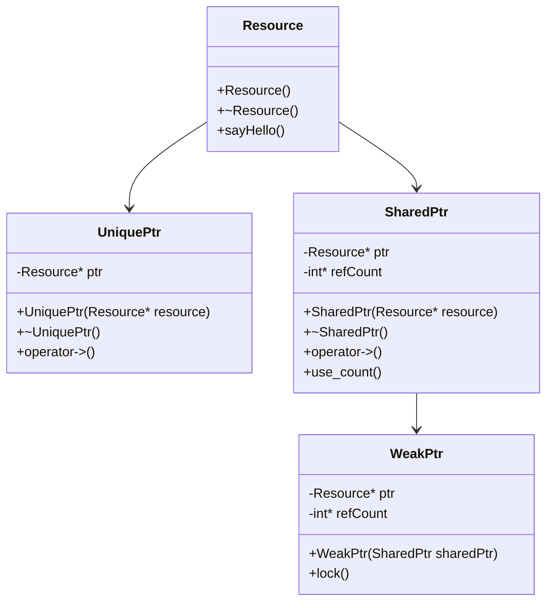

## 12.8 Modern Memory Management Techniques

In the realm of C++ programming, efficient memory management is crucial for developing robust, high-performance applications. With the advent of modern C++ standards, developers have been equipped with powerful tools to manage memory more effectively. In this section, we'll delve into modern memory management techniques, focusing on smart pointers, avoiding memory errors, and utilizing RAII (Resource Acquisition Is Initialization) for deterministic destruction.

### Introduction to Memory Management in C++

Memory management in C++ involves the allocation and deallocation of memory resources during the runtime of a program. Traditionally, this was handled manually using `new` and `delete` operators, which often led to memory leaks and undefined behavior if not managed correctly. Modern C++ introduces smart pointers and RAII, which automate and simplify memory management, reducing the risk of errors.

### Leveraging Smart Pointers

Smart pointers are a feature of the C++ Standard Library introduced in C++11, designed to manage the lifetime of dynamically allocated objects. They automatically release memory when it is no longer needed, thus preventing memory leaks and dangling pointers.

#### Types of Smart Pointers

There are three primary types of smart pointers in C++:

1. **`std::unique_ptr`**: Represents exclusive ownership of a resource. It ensures that there is only one `unique_ptr` pointing to a resource at any time.

2. **`std::shared_ptr`**: Allows multiple pointers to share ownership of a resource. It uses reference counting to keep track of how many `shared_ptr` instances point to the same resource.

3. **`std::weak_ptr`**: Works with `std::shared_ptr` to prevent cyclic references. It does not contribute to the reference count, allowing the resource to be deallocated when only `weak_ptr` instances remain.

#### Using `std::unique_ptr`

`std::unique_ptr` is the simplest form of smart pointer, providing exclusive ownership semantics. It is ideal for managing resources that should have a single owner.

```cpp
#include <iostream>
#include <memory>

class Resource {
public:
    Resource() { std::cout << "Resource acquired\n"; }
    ~Resource() { std::cout << "Resource destroyed\n"; }
    void sayHello() { std::cout << "Hello from Resource\n"; }
};

int main() {
    std::unique_ptr<Resource> resPtr(new Resource());
    resPtr->sayHello();

    // Transfer ownership
    std::unique_ptr<Resource> anotherPtr = std::move(resPtr);
    if (!resPtr) {
        std::cout << "resPtr is now empty\n";
    }

    return 0;
}
```

In this example, `std::unique_ptr` manages the `Resource` object. Ownership can be transferred using `std::move`, ensuring that only one pointer owns the resource at any time.

#### Using `std::shared_ptr`

`std::shared_ptr` is used when multiple parts of a program need to share ownership of a resource. It keeps track of how many `shared_ptr` instances point to the resource and deletes it when the count reaches zero.

```cpp
#include <iostream>
#include <memory>

class Resource {
public:
    Resource() { std::cout << "Resource acquired\n"; }
    ~Resource() { std::cout << "Resource destroyed\n"; }
    void sayHello() { std::cout << "Hello from Resource\n"; }
};

void useResource(std::shared_ptr<Resource> resPtr) {
    resPtr->sayHello();
}

int main() {
    std::shared_ptr<Resource> resPtr = std::make_shared<Resource>();
    useResource(resPtr);
    std::cout << "Resource use count: " << resPtr.use_count() << "\n";

    return 0;
}
```

Here, `std::shared_ptr` allows multiple functions to share ownership of the `Resource` object. The `use_count` method shows how many `shared_ptr` instances point to the resource.

#### Using `std::weak_ptr`

`std::weak_ptr` is used to break cyclic dependencies that can occur with `std::shared_ptr`. It provides a way to access a shared resource without affecting its reference count.

```cpp
#include <iostream>
#include <memory>

class Resource {
public:
    std::shared_ptr<Resource> partner;
    Resource() { std::cout << "Resource acquired\n"; }
    ~Resource() { std::cout << "Resource destroyed\n"; }
    void sayHello() { std::cout << "Hello from Resource\n"; }
};

int main() {
    std::shared_ptr<Resource> resPtr1 = std::make_shared<Resource>();
    std::shared_ptr<Resource> resPtr2 = std::make_shared<Resource>();

    resPtr1->partner = resPtr2;
    resPtr2->partner = resPtr1; // This creates a cyclic reference

    std::weak_ptr<Resource> weakResPtr = resPtr1->partner;
    if (auto sharedResPtr = weakResPtr.lock()) {
        sharedResPtr->sayHello();
    }

    return 0;
}
```

In this example, `std::weak_ptr` is used to access the partner resource without increasing the reference count, thus preventing a memory leak due to cyclic references.

### Avoiding Memory Errors

Memory errors such as leaks, dangling pointers, and double deletions can lead to undefined behavior and crashes. Modern C++ provides tools and techniques to avoid these issues.

#### Memory Leaks

A memory leak occurs when a program allocates memory but fails to release it. Smart pointers automatically release memory when it is no longer needed, mitigating this risk.

#### Dangling Pointers

A dangling pointer points to a memory location that has been freed. Smart pointers automatically set themselves to `nullptr` when the resource is released, preventing access to invalid memory.

#### Double Deletions

Double deletion occurs when a program attempts to delete the same memory location more than once. Smart pointers ensure that the resource is deleted only once.

### RAII and Deterministic Destruction

RAII is a programming idiom that ties resource management to object lifetime. It ensures that resources are acquired during object construction and released during destruction, providing deterministic resource management.

#### Implementing RAII

RAII is implemented by creating classes that manage resources. The constructor acquires the resource, and the destructor releases it.

```cpp
#include <iostream>
#include <fstream>

class FileHandler {
    std::fstream file;
public:
    FileHandler(const std::string& filename) {
        file.open(filename, std::ios::out);
        if (!file.is_open()) {
            throw std::runtime_error("Failed to open file");
        }
    }

    ~FileHandler() {
        if (file.is_open()) {
            file.close();
            std::cout << "File closed\n";
        }
    }

    void write(const std::string& content) {
        if (file.is_open()) {
            file << content;
        }
    }
};

int main() {
    try {
        FileHandler fh("example.txt");
        fh.write("Hello, RAII!");
    } catch (const std::exception& e) {
        std::cerr << e.what() << '\n';
    }

    return 0;
}
```

In this example, `FileHandler` manages a file resource. The file is opened in the constructor and closed in the destructor, ensuring that the resource is always released.

### Combining Smart Pointers and RAII

Smart pointers and RAII can be combined to manage complex resources effectively. Smart pointers provide automatic memory management, while RAII ensures deterministic resource cleanup.

#### Example: Managing Database Connections

Consider a scenario where we need to manage database connections. We can use smart pointers and RAII to ensure that connections are properly opened and closed.

```cpp
#include <iostream>
#include <memory>

class DatabaseConnection {
public:
    DatabaseConnection() { std::cout << "Database connection opened\n"; }
    ~DatabaseConnection() { std::cout << "Database connection closed\n"; }
    void executeQuery(const std::string& query) {
        std::cout << "Executing query: " << query << "\n";
    }
};

int main() {
    std::unique_ptr<DatabaseConnection> dbConn = std::make_unique<DatabaseConnection>();
    dbConn->executeQuery("SELECT * FROM users");

    return 0;
}
```

In this example, `std::unique_ptr` ensures that the database connection is closed when it goes out of scope, preventing resource leaks.

### Visualizing Smart Pointers and RAII

To better understand how smart pointers and RAII work together, let's visualize their interaction using a class diagram.



This diagram illustrates the relationship between `Resource`, `UniquePtr`, `SharedPtr`, and `WeakPtr`. Each smart pointer type manages a `Resource` object, with `SharedPtr` and `WeakPtr` sharing ownership.

### Try It Yourself

To solidify your understanding of smart pointers and RAII, try modifying the code examples provided. Experiment with:

- Transferring ownership between `std::unique_ptr` instances.
- Creating cyclic references with `std::shared_ptr` and resolving them using `std::weak_ptr`.
- Implementing RAII for different types of resources, such as network sockets or file handles.

### References and Further Reading

For more information on modern memory management techniques in C++, consider exploring the following resources:

- [C++ Reference: Smart Pointers](https://en.cppreference.com/w/cpp/memory)
- [C++ Core Guidelines](https://isocpp.github.io/CppCoreGuidelines/CppCoreGuidelines)
- [Effective Modern C++ by Scott Meyers](https://www.oreilly.com/library/view/effective-modern-c/9781491908419/)

### Knowledge Check

Before we wrap up, let's reinforce what we've learned with a few questions:

- What are the three primary types of smart pointers in C++?
- How does `std::unique_ptr` differ from `std::shared_ptr`?
- What is RAII, and how does it help manage resources?
- How can `std::weak_ptr` prevent memory leaks in cyclic references?

### Embrace the Journey

Remember, mastering memory management in C++ is a journey. As you continue to explore and experiment with these techniques, you'll gain confidence in building efficient, error-free applications. Keep learning, stay curious, and enjoy the process!

## Quiz Time!



### What is the primary purpose of `std::unique_ptr`?

- [x] To provide exclusive ownership of a resource
- [ ] To allow multiple pointers to share ownership of a resource
- [ ] To prevent memory leaks in cyclic references
- [ ] To manage reference counting

> **Explanation:** `std::unique_ptr` provides exclusive ownership, ensuring only one pointer owns a resource at any time.

### How does `std::shared_ptr` manage resource ownership?

- [x] By using reference counting
- [ ] By transferring ownership
- [ ] By using weak references
- [ ] By locking resources

> **Explanation:** `std::shared_ptr` uses reference counting to manage shared ownership of a resource.

### What problem does `std::weak_ptr` solve?

- [x] Preventing memory leaks in cyclic references
- [ ] Managing exclusive ownership
- [ ] Increasing reference count
- [ ] Providing thread safety

> **Explanation:** `std::weak_ptr` prevents memory leaks by not contributing to the reference count, breaking cyclic dependencies.

### What does RAII stand for?

- [x] Resource Acquisition Is Initialization
- [ ] Resource Allocation Is Initialization
- [ ] Resource Acquisition Is Immediate
- [ ] Resource Allocation Is Immediate

> **Explanation:** RAII stands for Resource Acquisition Is Initialization, a programming idiom that ties resource management to object lifetime.

### Which smart pointer should you use for exclusive ownership?

- [x] `std::unique_ptr`
- [ ] `std::shared_ptr`
- [ ] `std::weak_ptr`
- [ ] `std::auto_ptr`

> **Explanation:** `std::unique_ptr` is designed for exclusive ownership of a resource.

### What is a memory leak?

- [x] Memory that is allocated but not released
- [ ] Memory that is released but not allocated
- [ ] Memory that is shared between multiple pointers
- [ ] Memory that is locked by a pointer

> **Explanation:** A memory leak occurs when memory is allocated but not released, leading to wasted resources.

### How can RAII help prevent resource leaks?

- [x] By tying resource management to object lifetime
- [ ] By using reference counting
- [ ] By preventing cyclic references
- [ ] By locking resources

> **Explanation:** RAII ensures resources are acquired and released in the constructor and destructor, preventing leaks.

### What is the use of `std::make_shared`?

- [x] To create a `std::shared_ptr` with a single allocation
- [ ] To create a `std::unique_ptr` with a single allocation
- [ ] To create a `std::weak_ptr` with a single allocation
- [ ] To create a `std::shared_ptr` without reference counting

> **Explanation:** `std::make_shared` creates a `std::shared_ptr` with a single allocation, optimizing memory usage.

### What is the primary advantage of using smart pointers?

- [x] Automatic memory management
- [ ] Manual memory management
- [ ] Increased performance
- [ ] Simplified syntax

> **Explanation:** Smart pointers provide automatic memory management, reducing the risk of memory errors.

### True or False: `std::weak_ptr` increases the reference count of a resource.

- [ ] True
- [x] False

> **Explanation:** `std::weak_ptr` does not increase the reference count, allowing resources to be deallocated when only weak pointers remain.


