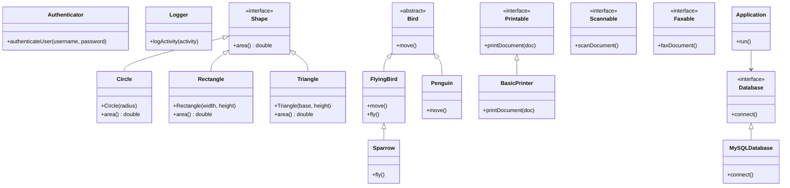

## 13.1 SOLID Principles in C++

In the realm of software engineering, the SOLID principles serve as a cornerstone for building robust, maintainable, and scalable systems. These principles, when applied to C++ design, can significantly enhance the quality of your software architecture. This section delves into each of the SOLID principles—Single Responsibility, Open-Closed, Liskov Substitution, Interface Segregation, and Dependency Inversion—providing insights, examples, and best practices tailored for C++ developers.

### Introduction to SOLID Principles

The SOLID principles are a set of five design principles intended to make software designs more understandable, flexible, and maintainable. They were introduced by Robert C. Martin, also known as Uncle Bob, and have become a fundamental part of object-oriented design.

#### Why SOLID Matters in C++

C++ is a powerful language that offers a rich set of features for object-oriented programming. However, with great power comes great responsibility. The complexity of C++ can lead to designs that are difficult to maintain and extend. By adhering to SOLID principles, C++ developers can create systems that are easier to manage and evolve over time.

### Single Responsibility Principle (SRP)

The Single Responsibility Principle states that a class should have only one reason to change, meaning it should have only one job or responsibility.

#### Understanding SRP in C++

In C++, adhering to SRP involves designing classes that encapsulate a single functionality or concern. This reduces the risk of changes in one part of the system affecting other parts.

**Example:**

Consider a class that handles both user authentication and logging. This violates SRP because it has multiple responsibilities.

```cpp
class UserManager {
public:
    void authenticateUser(const std::string& username, const std::string& password) {
        // Authentication logic
    }

    void logActivity(const std::string& activity) {
        // Logging logic
    }
};
```

**Refactoring for SRP:**

```cpp
class Authenticator {
public:
    void authenticateUser(const std::string& username, const std::string& password) {
        // Authentication logic
    }
};

class Logger {
public:
    void logActivity(const std::string& activity) {
        // Logging logic
    }
};
```

By separating responsibilities into distinct classes, we make the system more modular and easier to maintain.

### Open-Closed Principle (OCP)

The Open-Closed Principle suggests that software entities should be open for extension but closed for modification. This means you should be able to add new functionality without changing existing code.

#### Implementing OCP in C++

In C++, OCP can be achieved through polymorphism and inheritance. By defining interfaces or abstract classes, you can extend functionality without altering existing code.

**Example:**

Suppose we have a `Shape` class with a method to calculate the area.

```cpp
class Shape {
public:
    virtual double area() const = 0;
};

class Circle : public Shape {
public:
    Circle(double radius) : radius(radius) {}
    double area() const override {
        return 3.14159 * radius * radius;
    }
private:
    double radius;
};

class Rectangle : public Shape {
public:
    Rectangle(double width, double height) : width(width), height(height) {}
    double area() const override {
        return width * height;
    }
private:
    double width, height;
};
```

Adding a new shape, like a `Triangle`, does not require modifying existing classes.

```cpp
class Triangle : public Shape {
public:
    Triangle(double base, double height) : base(base), height(height) {}
    double area() const override {
        return 0.5 * base * height;
    }
private:
    double base, height;
};
```

### Liskov Substitution Principle (LSP)

The Liskov Substitution Principle states that objects of a superclass should be replaceable with objects of a subclass without affecting the correctness of the program.

#### Applying LSP in C++

In C++, LSP ensures that derived classes extend the base class without altering expected behavior. This principle is crucial for achieving polymorphism.

**Example:**

Consider a base class `Bird` with a method `fly`.

```cpp
class Bird {
public:
    virtual void fly() {
        // Flying logic
    }
};

class Sparrow : public Bird {
    void fly() override {
        // Sparrow-specific flying logic
    }
};
```

If we introduce a `Penguin` class, which cannot fly, it would violate LSP if it inherits from `Bird`.

```cpp
class Penguin : public Bird {
    void fly() override {
        // Penguins can't fly, so this method should not be implemented
    }
};
```

To adhere to LSP, we can refactor the design:

```cpp
class Bird {
public:
    virtual void move() = 0;
};

class FlyingBird : public Bird {
public:
    void move() override {
        fly();
    }
    virtual void fly() = 0;
};

class Sparrow : public FlyingBird {
    void fly() override {
        // Sparrow-specific flying logic
    }
};

class Penguin : public Bird {
    void move() override {
        // Penguin-specific walking logic
    }
};
```

### Interface Segregation Principle (ISP)

The Interface Segregation Principle advises that clients should not be forced to depend on interfaces they do not use. This means creating smaller, more specific interfaces rather than one large, general-purpose interface.

#### Implementing ISP in C++

In C++, ISP can be implemented by designing interfaces that are focused on specific functionalities. This prevents classes from having to implement methods they do not need.

**Example:**

Suppose we have a `Printer` interface with multiple methods.

```cpp
class Printer {
public:
    virtual void printDocument(const std::string& doc) = 0;
    virtual void scanDocument() = 0;
    virtual void faxDocument() = 0;
};
```

A basic printer that only prints would have to implement unnecessary methods.

**Refactoring for ISP:**

```cpp
class Printable {
public:
    virtual void printDocument(const std::string& doc) = 0;
};

class Scannable {
public:
    virtual void scanDocument() = 0;
};

class Faxable {
public:
    virtual void faxDocument() = 0;
};

class BasicPrinter : public Printable {
public:
    void printDocument(const std::string& doc) override {
        // Print logic
    }
};
```

By segregating interfaces, we ensure that classes only implement the functionality they require.

### Dependency Inversion Principle (DIP)

The Dependency Inversion Principle states that high-level modules should not depend on low-level modules. Both should depend on abstractions. Additionally, abstractions should not depend on details; details should depend on abstractions.

#### Applying DIP in C++

In C++, DIP can be achieved by using interfaces or abstract classes to decouple high-level and low-level modules.

**Example:**

Consider a `Database` class that directly depends on a `MySQLDatabase` implementation.

```cpp
class MySQLDatabase {
public:
    void connect() {
        // Connection logic
    }
};

class Application {
public:
    Application(MySQLDatabase& db) : db(db) {}
    void run() {
        db.connect();
    }
private:
    MySQLDatabase& db;
};
```

This design tightly couples `Application` to `MySQLDatabase`.

**Refactoring for DIP:**

```cpp
class Database {
public:
    virtual void connect() = 0;
};

class MySQLDatabase : public Database {
public:
    void connect() override {
        // MySQL-specific connection logic
    }
};

class Application {
public:
    Application(Database& db) : db(db) {}
    void run() {
        db.connect();
    }
private:
    Database& db;
};
```

By depending on the `Database` abstraction, `Application` can work with any database implementation.

### Visualizing SOLID Principles

To better understand the relationships and dependencies in SOLID principles, let's visualize them using a class diagram.



### Key Takeaways

- **Single Responsibility Principle (SRP):** Ensure each class has one responsibility, reducing the impact of changes.
- **Open-Closed Principle (OCP):** Design classes to be extendable without modification, promoting flexibility.
- **Liskov Substitution Principle (LSP):** Ensure derived classes can substitute base classes without altering functionality.
- **Interface Segregation Principle (ISP):** Create specific interfaces to prevent unnecessary dependencies.
- **Dependency Inversion Principle (DIP):** Depend on abstractions, not concrete implementations, to enhance decoupling.

### Try It Yourself

Experiment with the code examples provided by modifying them to fit different scenarios. For instance, try creating a new shape class that calculates the perimeter instead of the area. Implement additional interfaces for the printer example, such as a `Copier` interface, and see how it integrates with the existing design.

### Further Reading

For more information on SOLID principles and their application in C++, consider exploring these resources:

- [SOLID Principles of Object-Oriented Design](https://en.wikipedia.org/wiki/SOLID)
- [Design Patterns: Elements of Reusable Object-Oriented Software](https://en.wikipedia.org/wiki/Design_Patterns)
- [C++ Programming Language](https://en.wikipedia.org/wiki/C%2B%2B)

### Embrace the Journey

Remember, mastering SOLID principles is a journey. As you continue to apply these principles in your projects, you'll find your designs becoming more robust and adaptable. Keep experimenting, stay curious, and enjoy the process of refining your skills.

## Quiz Time!



### Which principle states that a class should have only one reason to change?

- [x] Single Responsibility Principle
- [ ] Open-Closed Principle
- [ ] Liskov Substitution Principle
- [ ] Interface Segregation Principle

> **Explanation:** The Single Responsibility Principle emphasizes that a class should have only one responsibility, reducing the risk of changes affecting multiple functionalities.


### What does the Open-Closed Principle advocate for?

- [x] Open for extension, closed for modification
- [ ] Open for modification, closed for extension
- [ ] Open for inheritance, closed for instantiation
- [ ] Open for instantiation, closed for inheritance

> **Explanation:** The Open-Closed Principle suggests that software entities should be extendable without modifying existing code, promoting flexibility and reusability.


### Which principle ensures that derived classes can replace base classes without altering functionality?

- [x] Liskov Substitution Principle
- [ ] Single Responsibility Principle
- [ ] Dependency Inversion Principle
- [ ] Interface Segregation Principle

> **Explanation:** The Liskov Substitution Principle ensures that derived classes can be substituted for base classes without affecting the correctness of the program.


### What is the key idea behind the Interface Segregation Principle?

- [x] Clients should not be forced to depend on interfaces they do not use
- [ ] Interfaces should be as large as possible
- [ ] Interfaces should be implemented by all classes
- [ ] Interfaces should be abstract classes

> **Explanation:** The Interface Segregation Principle advises creating smaller, more specific interfaces to prevent clients from depending on unnecessary methods.


### How can the Dependency Inversion Principle be achieved in C++?

- [x] By using interfaces or abstract classes to decouple high-level and low-level modules
- [ ] By using concrete classes for all dependencies
- [ ] By avoiding the use of interfaces
- [ ] By implementing all dependencies within a single class

> **Explanation:** The Dependency Inversion Principle can be achieved by relying on abstractions, such as interfaces or abstract classes, to decouple high-level and low-level modules.


### Which principle is violated if a class has multiple responsibilities?

- [x] Single Responsibility Principle
- [ ] Open-Closed Principle
- [ ] Liskov Substitution Principle
- [ ] Dependency Inversion Principle

> **Explanation:** The Single Responsibility Principle is violated if a class has multiple responsibilities, as it should only have one reason to change.


### What does the Open-Closed Principle promote?

- [x] Flexibility and reusability
- [ ] Complexity and rigidity
- [ ] Simplicity and immutability
- [ ] Inheritance and encapsulation

> **Explanation:** The Open-Closed Principle promotes flexibility and reusability by allowing software entities to be extended without modifying existing code.


### Which principle is concerned with the substitutability of derived classes?

- [x] Liskov Substitution Principle
- [ ] Single Responsibility Principle
- [ ] Open-Closed Principle
- [ ] Interface Segregation Principle

> **Explanation:** The Liskov Substitution Principle is concerned with ensuring that derived classes can substitute base classes without altering functionality.


### What is the main focus of the Interface Segregation Principle?

- [x] Creating smaller, more specific interfaces
- [ ] Creating larger, general-purpose interfaces
- [ ] Avoiding the use of interfaces
- [ ] Implementing all methods in a single interface

> **Explanation:** The Interface Segregation Principle focuses on creating smaller, more specific interfaces to prevent clients from depending on unnecessary methods.


### True or False: The Dependency Inversion Principle suggests that high-level modules should depend on low-level modules.

- [ ] True
- [x] False

> **Explanation:** False. The Dependency Inversion Principle suggests that both high-level and low-level modules should depend on abstractions, not on each other.


