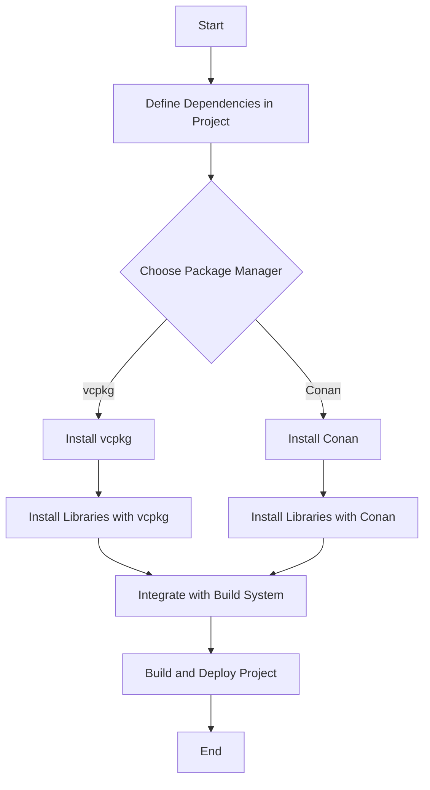

## 13.10 Deployment and Package Management

In the realm of C++ software development, deployment and package management are crucial components that ensure the efficient delivery and maintenance of software applications. As software systems grow in complexity, managing dependencies and creating reusable libraries become essential tasks for developers. This section delves into the best practices for deployment and package management in C++, with a particular focus on using popular tools such as vcpkg and Conan.

### Understanding Deployment and Package Management

Deployment in software development refers to the process of distributing and installing software applications on target environments. It encompasses various activities, including compiling the code, packaging the application, and configuring it for the target system. Effective deployment ensures that software runs smoothly across different platforms and environments.

Package management, on the other hand, involves handling software dependencies, libraries, and tools required for the application to function correctly. A package manager automates the process of installing, upgrading, configuring, and removing software packages, making it easier to manage dependencies and ensure compatibility.

### The Role of Package Managers in C++

In C++ development, package managers play a vital role in simplifying the management of libraries and dependencies. They provide a centralized repository of precompiled libraries and tools, which can be easily integrated into projects. Two popular package managers in the C++ ecosystem are vcpkg and Conan.

#### vcpkg: A Cross-Platform Package Manager for C++

vcpkg is a free and open-source package manager developed by Microsoft. It simplifies the acquisition and management of C++ libraries across different platforms, including Windows, Linux, and macOS. vcpkg provides a unified interface for managing dependencies, making it easier to integrate third-party libraries into C++ projects.

**Key Features of vcpkg:**

- **Cross-Platform Support:** vcpkg supports multiple operating systems, allowing developers to manage dependencies consistently across different environments.
- **Large Library Repository:** vcpkg offers a vast collection of libraries, making it easy to find and integrate the necessary dependencies for your project.
- **Simple Integration:** vcpkg integrates seamlessly with popular build systems like CMake, simplifying the process of adding and managing dependencies.
- **Version Control:** vcpkg allows developers to specify library versions, ensuring compatibility and stability in projects.

**Using vcpkg in a C++ Project:**

To use vcpkg in your C++ project, follow these steps:

1. **Install vcpkg:**
   Clone the vcpkg repository and run the bootstrap script to build the vcpkg executable.

   ```bash
   git clone https://github.com/microsoft/vcpkg.git
   cd vcpkg
   ./bootstrap-vcpkg.sh
   ```

2. **Integrate vcpkg with CMake:**
   Use the `vcpkg integrate install` command to set up vcpkg for use with CMake.

   ```bash
   ./vcpkg integrate install
   ```

3. **Install Libraries:**
   Use the `vcpkg install` command to install the required libraries for your project.

   ```bash
   ./vcpkg install boost
   ```

4. **Include vcpkg in CMakeLists.txt:**
   Add the following lines to your `CMakeLists.txt` file to use vcpkg-installed libraries.

   ```cmake
   cmake_minimum_required(VERSION 3.10)
   project(MyProject)

   # Include vcpkg toolchain file
   set(CMAKE_TOOLCHAIN_FILE "${CMAKE_SOURCE_DIR}/vcpkg/scripts/buildsystems/vcpkg.cmake")

   find_package(Boost REQUIRED)

   add_executable(MyExecutable main.cpp)
   target_link_libraries(MyExecutable Boost::Boost)
   ```

#### Conan: A Decentralized Package Manager for C++

Conan is another popular package manager for C++ that focuses on providing a decentralized and flexible approach to dependency management. It allows developers to create, share, and manage packages across different platforms and configurations.

**Key Features of Conan:**

- **Decentralized Repositories:** Conan supports multiple remote repositories, enabling developers to host and share packages privately or publicly.
- **Customizable Builds:** Conan allows developers to customize the build process, including compiler settings, options, and configurations.
- **Integration with Build Systems:** Conan integrates with various build systems, including CMake, Make, and MSBuild, providing flexibility in managing dependencies.
- **Cross-Platform Compatibility:** Conan supports multiple operating systems and architectures, making it suitable for cross-platform development.

**Using Conan in a C++ Project:**

To use Conan in your C++ project, follow these steps:

1. **Install Conan:**
   Use pip to install Conan on your system.

   ```bash
   pip install conan
   ```

2. **Create a Conanfile:**
   Create a `conanfile.txt` or `conanfile.py` to specify the dependencies for your project.

   ```plaintext
   [requires]
   boost/1.76.0

   [generators]
   cmake
   ```

3. **Install Dependencies:**
   Use the `conan install` command to install the specified dependencies.

   ```bash
   conan install .
   ```

4. **Integrate Conan with CMake:**
   Modify your `CMakeLists.txt` to include Conan-generated files.

   ```cmake
   cmake_minimum_required(VERSION 3.10)
   project(MyProject)

   include(${CMAKE_BINARY_DIR}/conanbuildinfo.cmake)
   conan_basic_setup()

   add_executable(MyExecutable main.cpp)
   target_link_libraries(MyExecutable ${CONAN_LIBS})
   ```

### Managing Dependencies Effectively

Managing dependencies is a critical aspect of software development, especially in large and complex projects. Here are some best practices for managing dependencies effectively:

1. **Use Version Control:**
   Always specify the version of dependencies to ensure compatibility and stability. This helps prevent issues caused by breaking changes in newer versions of libraries.

2. **Minimize Direct Dependencies:**
   Limit the number of direct dependencies in your project. Rely on transitive dependencies whenever possible to reduce complexity and potential conflicts.

3. **Regularly Update Dependencies:**
   Keep your dependencies up to date to benefit from bug fixes, security patches, and new features. However, ensure that updates do not introduce breaking changes.

4. **Use Dependency Management Tools:**
   Leverage package managers like vcpkg and Conan to automate the process of managing dependencies. These tools simplify the installation, configuration, and removal of libraries.

5. **Isolate Dependencies:**
   Use virtual environments or containerization to isolate dependencies and prevent conflicts between different projects.

### Creating Reusable Libraries

Creating reusable libraries is a key practice in software development that promotes code reuse, reduces duplication, and improves maintainability. Here are some guidelines for creating reusable libraries in C++:

1. **Design for Reusability:**
   Design your library with reusability in mind. Ensure that it is modular, well-documented, and easy to integrate into different projects.

2. **Follow Coding Standards:**
   Adhere to consistent coding standards and best practices to ensure that your library is easy to read and maintain.

3. **Provide Clear Documentation:**
   Include comprehensive documentation that explains how to use the library, its features, and any dependencies it requires.

4. **Use Versioning:**
   Implement versioning for your library to manage changes and ensure backward compatibility.

5. **Test Thoroughly:**
   Write unit tests and integration tests to verify the functionality and reliability of your library. Ensure that it works correctly across different platforms and configurations.

6. **Distribute via Package Managers:**
   Publish your library to package managers like vcpkg and Conan to make it easily accessible to other developers. This also helps in managing dependencies and updates.

### Visualizing Dependency Management with Package Managers

To better understand how package managers like vcpkg and Conan manage dependencies, let's visualize the process using a flowchart.



**Diagram Explanation:**

- **Start:** Begin by defining the dependencies required for your project.
- **Choose Package Manager:** Decide whether to use vcpkg or Conan based on your project's needs.
- **Install vcpkg/Conan:** Install the chosen package manager on your system.
- **Install Libraries:** Use the package manager to install the necessary libraries.
- **Integrate with Build System:** Integrate the installed libraries with your build system (e.g., CMake).
- **Build and Deploy Project:** Build and deploy your project using the configured dependencies.

### Try It Yourself

To gain hands-on experience with package management in C++, try the following exercise:

1. **Set Up a New C++ Project:**
   Create a new C++ project using your preferred IDE or text editor.

2. **Choose a Package Manager:**
   Decide whether to use vcpkg or Conan for managing dependencies.

3. **Define Dependencies:**
   Identify the libraries your project requires and specify them in a `conanfile.txt` or `vcpkg.json`.

4. **Install Dependencies:**
   Use the chosen package manager to install the specified libraries.

5. **Integrate with Build System:**
   Modify your `CMakeLists.txt` to include the installed libraries.

6. **Build and Run Your Project:**
   Compile and run your project to ensure that the dependencies are correctly integrated.

### Knowledge Check

To reinforce your understanding of deployment and package management in C++, consider the following questions:

1. What are the key differences between vcpkg and Conan?
2. How can you ensure compatibility and stability when managing dependencies?
3. What are the benefits of using package managers in C++ development?
4. How can you create a reusable library in C++?
5. What are some best practices for managing dependencies in a C++ project?

### Embrace the Journey

Remember, mastering deployment and package management in C++ is a journey that requires continuous learning and practice. By leveraging tools like vcpkg and Conan, you can streamline the process of managing dependencies and creating reusable libraries, ultimately leading to more efficient and maintainable software development. Keep experimenting, stay curious, and enjoy the journey!

## Quiz Time!



### What is the primary purpose of a package manager in C++ development?

- [x] To automate the process of managing software dependencies
- [ ] To compile C++ code into executable files
- [ ] To provide a graphical interface for C++ development
- [ ] To optimize C++ code for performance

> **Explanation:** A package manager automates the process of installing, upgrading, configuring, and removing software dependencies, making it easier to manage libraries and ensure compatibility in C++ projects.

### Which package manager is developed by Microsoft for C++?

- [x] vcpkg
- [ ] Conan
- [ ] npm
- [ ] pip

> **Explanation:** vcpkg is a free and open-source package manager developed by Microsoft specifically for managing C++ libraries across different platforms.

### How can you integrate vcpkg with CMake in a C++ project?

- [x] By using the `vcpkg integrate install` command and including the vcpkg toolchain file in `CMakeLists.txt`
- [ ] By installing vcpkg as a system package
- [ ] By manually copying library files into the project directory
- [ ] By using a graphical interface to add libraries

> **Explanation:** vcpkg can be integrated with CMake by running the `vcpkg integrate install` command and including the vcpkg toolchain file in the `CMakeLists.txt` file.

### What is a key feature of Conan as a package manager?

- [x] It supports decentralized repositories for sharing packages
- [ ] It is only available for Windows platforms
- [ ] It requires a graphical interface for installation
- [ ] It does not support custom build configurations

> **Explanation:** Conan supports decentralized repositories, allowing developers to host and share packages privately or publicly, and it provides flexibility in managing dependencies.

### What is a best practice for managing dependencies in a C++ project?

- [x] Use version control to specify library versions
- [ ] Avoid using package managers
- [ ] Install all libraries manually
- [ ] Ignore transitive dependencies

> **Explanation:** Using version control to specify library versions ensures compatibility and stability, preventing issues caused by breaking changes in newer versions of libraries.

### What is the benefit of creating reusable libraries in C++?

- [x] It promotes code reuse and reduces duplication
- [ ] It increases the complexity of the codebase
- [ ] It makes the code harder to maintain
- [ ] It requires more manual configuration

> **Explanation:** Creating reusable libraries promotes code reuse, reduces duplication, and improves maintainability, making it easier to integrate and manage code across different projects.

### How can you distribute a C++ library to make it easily accessible to other developers?

- [x] Publish it to package managers like vcpkg and Conan
- [ ] Keep it as a private repository
- [ ] Distribute it via email
- [ ] Include it in every project manually

> **Explanation:** Publishing a library to package managers like vcpkg and Conan makes it easily accessible to other developers, helping in managing dependencies and updates.

### What is the purpose of the `conanfile.txt` in a Conan-managed project?

- [x] To specify the dependencies and configurations for the project
- [ ] To compile the C++ code
- [ ] To provide a graphical interface for the project
- [ ] To manage user permissions

> **Explanation:** The `conanfile.txt` specifies the dependencies and configurations for a Conan-managed project, allowing Conan to install and manage the required libraries.

### Which command is used to install dependencies in a Conan-managed project?

- [x] `conan install`
- [ ] `conan build`
- [ ] `conan compile`
- [ ] `conan deploy`

> **Explanation:** The `conan install` command is used to install the specified dependencies in a Conan-managed project.

### True or False: vcpkg and Conan can be used together in the same C++ project.

- [x] True
- [ ] False

> **Explanation:** vcpkg and Conan can be used together in the same C++ project, allowing developers to leverage the strengths of both package managers for managing dependencies.


