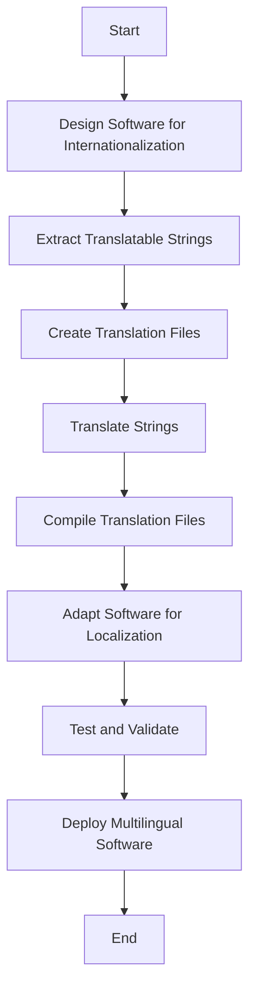

## 13.11 Internationalization and Localization

In today's globalized world, creating software that can reach a diverse audience is more important than ever. Internationalization (i18n) and localization (l10n) are crucial processes in software development that enable applications to support multiple languages and regional differences. In this section, we will delve into the best practices for implementing internationalization and localization in C++ applications, ensuring your software can cater to a global audience.

### Understanding Internationalization and Localization

Before diving into the technical details, let's clarify the concepts of internationalization and localization:

- **Internationalization (i18n):** This is the process of designing and developing software in a way that makes it easy to adapt to various languages and regions without requiring engineering changes. It involves abstracting text and other locale-specific elements from the codebase.

- **Localization (l10n):** This refers to the process of adapting internationalized software for a specific region or language by translating text and adjusting other locale-specific elements, such as date formats, currency symbols, and cultural references.

### Key Concepts in Internationalization and Localization

#### Unicode and Character Encoding

To support multiple languages, it's essential to use a character encoding that can represent all the characters needed for those languages. **Unicode** is the most widely used character encoding standard that supports virtually all writing systems. In C++, the `std::wstring` and `std::u16string`/`std::u32string` types can be used to handle wide characters and Unicode strings.

#### Locale

A **locale** is a set of parameters that defines the user's language, country, and any special variant preferences. In C++, the `<locale>` library provides mechanisms to handle locale-specific data, such as number formatting, date and time formatting, and currency symbols.

#### Resource Bundles

**Resource bundles** are collections of locale-specific resources, such as strings and images, used by an application. They allow developers to separate the translation and localization data from the code, making it easier to manage and update.

### Implementing Internationalization in C++

Let's explore how to implement internationalization in C++ applications, focusing on writing code that supports multiple languages.

#### Using the `<locale>` Library

The `<locale>` library in C++ provides tools for handling locale-specific formatting. Here's a simple example of using `<locale>` to format numbers according to the user's locale:

```cpp
#include <iostream>
#include <locale>

int main() {
    // Set the global locale to the user's preferred locale
    std::locale::global(std::locale(""));

    // Use the global locale for output
    std::cout.imbue(std::locale());

    // Format a number according to the locale
    double number = 1234567.89;
    std::cout << "Formatted number: " << number << std::endl;

    return 0;
}
```

In this example, the program sets the global locale to the user's preferred locale and formats a number accordingly. This demonstrates how easy it is to use the `<locale>` library for locale-specific formatting.

#### Handling Strings with `gettext`

`gettext` is a popular library for managing translations in software applications. It provides a simple way to mark strings for translation and retrieve the translated strings at runtime. Here's how you can use `gettext` in a C++ application:

1. **Mark Strings for Translation:**

   Use the `_()` macro to mark strings for translation:

   ```cpp
   #include <libintl.h>
   #define _(STRING) gettext(STRING)

   int main() {
       // Initialize gettext
       setlocale(LC_ALL, "");
       bindtextdomain("myapp", "/usr/share/locale");
       textdomain("myapp");

       // Use the _() macro to mark strings for translation
       std::cout << _("Hello, World!") << std::endl;

       return 0;
   }
   ```

2. **Create Translation Files:**

   Use tools like `xgettext` to extract translatable strings from your source code and generate `.po` files for each language.

3. **Compile Translation Files:**

   Convert `.po` files into binary `.mo` files using `msgfmt`, and place them in the appropriate directory structure for `gettext` to find.

#### Managing Resource Bundles

Resource bundles are essential for organizing and managing localization data. In C++, you can use libraries like **Boost.Locale** to handle resource bundles efficiently. Here's an example of using Boost.Locale to manage translations:

```cpp
#include <boost/locale.hpp>
#include <iostream>

int main() {
    // Set the global locale to the user's preferred locale
    boost::locale::generator gen;
    std::locale::global(gen(""));

    // Use the global locale for output
    std::cout.imbue(std::locale());

    // Translate a string using Boost.Locale
    std::cout << boost::locale::translate("Hello, World!") << std::endl;

    return 0;
}
```

Boost.Locale provides a powerful and flexible way to handle translations and other locale-specific data in C++ applications.

### Implementing Localization in C++

Localization involves adapting your software to specific languages and regions. Let's explore some best practices for implementing localization in C++.

#### Handling Date and Time Formatting

Date and time formats vary widely across different regions. The `<locale>` library can help format dates and times according to the user's locale:

```cpp
#include <iostream>
#include <locale>
#include <ctime>

int main() {
    // Set the global locale to the user's preferred locale
    std::locale::global(std::locale(""));

    // Use the global locale for output
    std::cout.imbue(std::locale());

    // Get the current time
    std::time_t t = std::time(nullptr);
    char buffer[100];

    // Format the date and time according to the locale
    std::strftime(buffer, sizeof(buffer), "%c", std::localtime(&t));
    std::cout << "Current date and time: " << buffer << std::endl;

    return 0;
}
```

This example demonstrates how to format the current date and time according to the user's locale using the `<locale>` library.

#### Currency and Number Formatting

Currency symbols and number formats also vary across regions. The `<locale>` library provides tools for handling these differences:

```cpp
#include <iostream>
#include <locale>

int main() {
    // Set the global locale to the user's preferred locale
    std::locale::global(std::locale(""));

    // Use the global locale for output
    std::cout.imbue(std::locale());

    // Format a currency value according to the locale
    double amount = 1234.56;
    std::cout << "Formatted currency: " << std::showbase << std::put_money(amount * 100) << std::endl;

    return 0;
}
```

This example shows how to format a currency value according to the user's locale using the `<locale>` library.

#### Managing Localization Files

Localization files, such as `.po` and `.mo` files, are crucial for managing translations. Here are some best practices for handling localization files:

- **Organize Files by Language and Region:**

  Create a directory structure that organizes localization files by language and region. For example:

  ```
  /locales
      /en_US
          /LC_MESSAGES
              myapp.mo
      /fr_FR
          /LC_MESSAGES
              myapp.mo
  ```

- **Use Version Control:**

  Store localization files in a version control system, such as Git, to track changes and collaborate with translators.

- **Automate the Translation Process:**

  Use tools like `gettext` and `msgfmt` to automate the extraction, translation, and compilation of localization files.

### Visualizing the Internationalization and Localization Process

To better understand the internationalization and localization process, let's visualize it using a flowchart:



**Figure 1:** The flowchart above illustrates the steps involved in internationalizing and localizing software, from designing the software to deploying the multilingual application.

### Try It Yourself

Now that we've covered the basics of internationalization and localization in C++, let's put it into practice. Try modifying the code examples to support additional languages or customize the formatting for different locales. Experiment with different libraries and tools to find the best fit for your application's needs.

### Knowledge Check

To reinforce your understanding of internationalization and localization in C++, consider the following questions:

1. What is the difference between internationalization and localization?
2. How does the `<locale>` library help with formatting locale-specific data?
3. What are some best practices for managing localization files?
4. How can `gettext` be used to manage translations in a C++ application?
5. Why is Unicode important for supporting multiple languages?

### Conclusion

Internationalization and localization are essential processes for creating software that can reach a global audience. By following best practices and leveraging the tools and libraries available in C++, you can ensure your applications are ready for the diverse needs of users worldwide. Remember, this is just the beginning. As you progress, you'll build more complex and interactive applications that cater to a global audience. Keep experimenting, stay curious, and enjoy the journey!

## Quiz Time!



### What is the primary goal of internationalization (i18n)?

- [x] To design software that can be easily adapted to various languages and regions without requiring engineering changes.
- [ ] To translate software into multiple languages.
- [ ] To create a separate version of the software for each region.
- [ ] To manage localization files and resources.

> **Explanation:** Internationalization (i18n) involves designing software in a way that makes it easy to adapt to various languages and regions without requiring engineering changes.

### Which C++ library provides tools for handling locale-specific formatting?

- [x] `<locale>`
- [ ] `<iostream>`
- [ ] `<vector>`
- [ ] `<string>`

> **Explanation:** The `<locale>` library in C++ provides tools for handling locale-specific formatting, such as number and date formatting.

### What is the purpose of resource bundles in internationalization?

- [x] To organize and manage locale-specific resources, such as strings and images, separately from the code.
- [ ] To compile the software for different regions.
- [ ] To provide a backup of the source code.
- [ ] To handle memory management in C++.

> **Explanation:** Resource bundles are collections of locale-specific resources used by an application, allowing developers to separate translation and localization data from the code.

### How can `gettext` be used in a C++ application?

- [x] By marking strings for translation using the `_()` macro and retrieving translated strings at runtime.
- [ ] By compiling the source code into binary files.
- [ ] By managing memory allocation and deallocation.
- [ ] By handling network communication.

> **Explanation:** `gettext` is used in C++ applications by marking strings for translation with the `_()` macro and retrieving translated strings at runtime.

### What is a best practice for managing localization files?

- [x] Organize files by language and region and use version control.
- [ ] Store all localization files in a single directory.
- [ ] Use binary files for translations.
- [ ] Avoid using version control for localization files.

> **Explanation:** A best practice for managing localization files is to organize them by language and region and use version control to track changes and collaborate with translators.

### Why is Unicode important for supporting multiple languages?

- [x] It provides a character encoding standard that supports virtually all writing systems.
- [ ] It is a programming language used for internationalization.
- [ ] It is a tool for compiling localization files.
- [ ] It is a library for handling network communication.

> **Explanation:** Unicode is important for supporting multiple languages because it provides a character encoding standard that supports virtually all writing systems.

### What is the role of the `<locale>` library in C++?

- [x] It provides mechanisms to handle locale-specific data, such as number formatting, date and time formatting, and currency symbols.
- [ ] It manages memory allocation and deallocation.
- [ ] It handles network communication.
- [ ] It compiles source code into binary files.

> **Explanation:** The `<locale>` library in C++ provides mechanisms to handle locale-specific data, such as number formatting, date and time formatting, and currency symbols.

### How can Boost.Locale be used in a C++ application?

- [x] By managing translations and other locale-specific data.
- [ ] By compiling source code into binary files.
- [ ] By handling network communication.
- [ ] By managing memory allocation and deallocation.

> **Explanation:** Boost.Locale can be used in a C++ application to manage translations and other locale-specific data.

### What is a locale in the context of internationalization?

- [x] A set of parameters that defines the user's language, country, and any special variant preferences.
- [ ] A programming language used for internationalization.
- [ ] A tool for compiling localization files.
- [ ] A library for handling network communication.

> **Explanation:** A locale is a set of parameters that defines the user's language, country, and any special variant preferences.

### True or False: Localization involves designing software to be easily adapted to various languages and regions.

- [ ] True
- [x] False

> **Explanation:** Localization involves adapting internationalized software for a specific region or language, while internationalization involves designing software to be easily adapted to various languages and regions.


