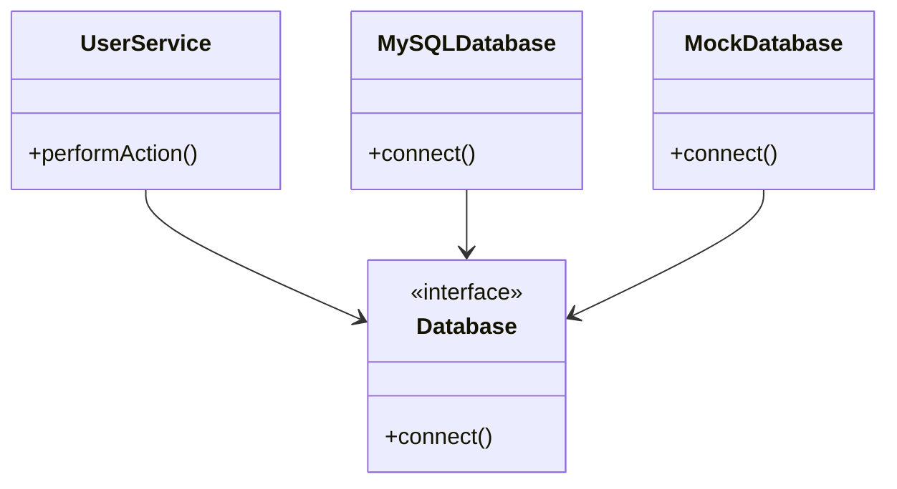

## 13.12 Design for Testability

Designing for testability is a crucial aspect of software development that ensures your code is robust, maintainable, and easy to verify. In this section, we will delve into the principles and practices that make C++ code more testable. We will explore concepts such as dependency injection, interface segregation, mocking, and stubbing, providing you with the tools and techniques to write code that is not only functional but also easy to test.

### Introduction to Testability

Testability refers to the ease with which software can be tested to ensure it behaves as expected. High testability means that the software can be easily verified through automated tests, which can be run frequently to catch regressions and ensure quality. Designing for testability involves structuring your code in such a way that it is easy to isolate components and test them independently.

#### Key Benefits of Testable Code

1. **Improved Quality**: Testable code is more likely to be free of defects because it can be thoroughly tested.
2. **Easier Maintenance**: Changes to the codebase can be verified quickly, reducing the risk of introducing bugs.
3. **Faster Development**: Automated tests provide immediate feedback, allowing developers to catch issues early.
4. **Better Design**: Writing testable code often leads to better software design, as it encourages separation of concerns and modularity.

### Principles of Designing for Testability

To design code that is easy to test, we must adhere to several key principles:

#### 1. Separation of Concerns

Separation of concerns is a design principle for separating a computer program into distinct sections, such that each section addresses a separate concern. By separating concerns, we can isolate functionality and test it independently.

#### 2. Dependency Injection

Dependency Injection (DI) is a technique for achieving Inversion of Control (IoC) between classes and their dependencies. Instead of a class creating its dependencies, they are provided to the class, usually through its constructor or setter methods. This makes it easier to replace real dependencies with mocks or stubs during testing.

**Example:**

```cpp
class Database {
public:
    virtual void connect() = 0;
    virtual ~Database() = default;
};

class MySQLDatabase : public Database {
public:
    void connect() override {
        // Connect to MySQL database
    }
};

class UserService {
private:
    Database& database;
public:
    UserService(Database& db) : database(db) {}
    void performAction() {
        database.connect();
        // Perform some action
    }
};

// In tests, we can inject a mock database
class MockDatabase : public Database {
public:
    void connect() override {
        // Mock connection
    }
};

// Usage in tests
MockDatabase mockDb;
UserService userService(mockDb);
```

#### 3. Interface Segregation

The Interface Segregation Principle (ISP) states that no client should be forced to depend on methods it does not use. By designing small, specific interfaces, we can ensure that classes only implement the functionality they need, making them easier to test.

**Example:**

```cpp
class Printer {
public:
    virtual void print() = 0;
    virtual ~Printer() = default;
};

class Scanner {
public:
    virtual void scan() = 0;
    virtual ~Scanner() = default;
};

class MultiFunctionDevice : public Printer, public Scanner {
public:
    void print() override {
        // Print implementation
    }

    void scan() override {
        // Scan implementation
    }
};
```

#### 4. Use of Mocks and Stubs

Mocks and stubs are objects that simulate the behavior of real objects. They are used in testing to isolate the unit of work being tested. Mocks can verify that certain interactions occurred, while stubs provide predefined responses to method calls.

**Example:**

```cpp
class NetworkService {
public:
    virtual std::string fetchData() = 0;
    virtual ~NetworkService() = default;
};

class RealNetworkService : public NetworkService {
public:
    std::string fetchData() override {
        // Fetch data from network
        return "real data";
    }
};

class MockNetworkService : public NetworkService {
public:
    std::string fetchData() override {
        return "mock data";
    }
};

// Usage in tests
MockNetworkService mockService;
std::string data = mockService.fetchData();
// Assert that data is "mock data"
```

### Implementing Dependency Injection

Dependency injection can be implemented in several ways in C++:

#### Constructor Injection

Constructor injection involves passing dependencies to a class through its constructor. This is the most common form of dependency injection and ensures that a class is always in a valid state.

**Example:**

```cpp
class Logger {
public:
    virtual void log(const std::string& message) = 0;
    virtual ~Logger() = default;
};

class FileLogger : public Logger {
public:
    void log(const std::string& message) override {
        // Log to file
    }
};

class Application {
private:
    Logger& logger;
public:
    Application(Logger& log) : logger(log) {}
    void run() {
        logger.log("Application started");
    }
};

// Usage
FileLogger fileLogger;
Application app(fileLogger);
```

#### Setter Injection

Setter injection involves providing dependencies through setter methods. This allows for more flexibility, as dependencies can be changed at runtime.

**Example:**

```cpp
class ConfigurableApplication {
private:
    Logger* logger;
public:
    void setLogger(Logger* log) {
        logger = log;
    }
    void run() {
        if (logger) {
            logger->log("Application started");
        }
    }
};

// Usage
ConfigurableApplication app;
FileLogger fileLogger;
app.setLogger(&fileLogger);
app.run();
```

#### Interface Injection

Interface injection involves defining an interface that a class must implement to receive its dependencies. This is less common in C++ but can be useful in certain scenarios.

**Example:**

```cpp
class LoggerProvider {
public:
    virtual void setLogger(Logger* log) = 0;
    virtual ~LoggerProvider() = default;
};

class AdvancedApplication : public LoggerProvider {
private:
    Logger* logger;
public:
    void setLogger(Logger* log) override {
        logger = log;
    }
    void run() {
        if (logger) {
            logger->log("Advanced application started");
        }
    }
};

// Usage
AdvancedApplication app;
FileLogger fileLogger;
app.setLogger(&fileLogger);
app.run();
```

### Interface Segregation in Practice

Interface segregation can be achieved by designing interfaces that are specific to the needs of the client. This reduces the number of methods a class must implement and makes it easier to test.

**Example:**

```cpp
class Document {
public:
    virtual void open() = 0;
    virtual void close() = 0;
    virtual ~Document() = default;
};

class Readable {
public:
    virtual void read() = 0;
    virtual ~Readable() = default;
};

class Writable {
public:
    virtual void write() = 0;
    virtual ~Writable() = default;
};

class TextDocument : public Document, public Readable, public Writable {
public:
    void open() override {
        // Open document
    }

    void close() override {
        // Close document
    }

    void read() override {
        // Read document
    }

    void write() override {
        // Write document
    }
};
```

### Mocking and Stubbing Techniques

Mocking and stubbing are essential techniques for isolating the unit of work being tested. They allow us to simulate the behavior of complex dependencies and focus on testing the logic of the class under test.

#### Using Google Mock

Google Mock is a popular C++ mocking framework that integrates with Google Test. It provides a simple way to create mock objects and define expectations on their behavior.

**Example:**

```cpp
#include <gmock/gmock.h>

class MockDatabase : public Database {
public:
    MOCK_METHOD(void, connect, (), (override));
};

TEST(UserServiceTest, ConnectsToDatabase) {
    MockDatabase mockDb;
    EXPECT_CALL(mockDb, connect()).Times(1);

    UserService userService(mockDb);
    userService.performAction();
}
```

#### Manual Mocking

In some cases, you may want to create mock objects manually without using a framework. This can be done by creating a subclass that overrides the methods of the interface and provides mock implementations.

**Example:**

```cpp
class ManualMockDatabase : public Database {
public:
    bool connectCalled = false;

    void connect() override {
        connectCalled = true;
    }
};

// Usage in tests
ManualMockDatabase mockDb;
UserService userService(mockDb);
userService.performAction();
// Assert that connectCalled is true
```

### Try It Yourself

To solidify your understanding of designing for testability, try modifying the code examples provided. For instance, you can:

- Implement a new service class that depends on multiple interfaces and test it using mocks.
- Create a new interface and implement a class that uses setter injection to receive its dependencies.
- Write tests for a class using both Google Mock and manual mocking techniques.

### Visualizing Dependency Injection

To better understand how dependency injection works, let's visualize it using a class diagram.



**Diagram Description:** The diagram illustrates the relationship between `UserService` and its dependency on the `Database` interface. The `MySQLDatabase` and `MockDatabase` classes implement the `Database` interface, allowing `UserService` to use either a real or mock database.

### Knowledge Check

- Explain the benefits of designing for testability.
- Describe how dependency injection improves testability.
- Demonstrate how to use interface segregation to create testable code.
- Provide an example of how to use mocks and stubs in testing.

### Conclusion

Designing for testability is an essential practice for creating robust and maintainable software. By adhering to principles such as separation of concerns, dependency injection, and interface segregation, we can write code that is easy to test and verify. Mocking and stubbing further enhance our ability to isolate and test individual components, ensuring that our software behaves as expected.

Remember, this is just the beginning. As you progress, you'll discover more techniques and patterns that can help you design testable code. Keep experimenting, stay curious, and enjoy the journey!

## Quiz Time!



### What is the primary benefit of designing code for testability?

- [x] It makes the code easier to test and maintain.
- [ ] It increases the performance of the code.
- [ ] It reduces the size of the codebase.
- [ ] It eliminates the need for documentation.

> **Explanation:** Designing code for testability primarily makes it easier to test and maintain, ensuring that the code can be verified through automated tests.

### Which of the following is a technique for achieving Inversion of Control?

- [x] Dependency Injection
- [ ] Interface Segregation
- [ ] Mocking
- [ ] Stubbing

> **Explanation:** Dependency Injection is a technique for achieving Inversion of Control by providing dependencies to a class rather than having the class create them.

### What is the Interface Segregation Principle?

- [x] No client should be forced to depend on methods it does not use.
- [ ] A class should have only one reason to change.
- [ ] High-level modules should not depend on low-level modules.
- [ ] Classes should be open for extension but closed for modification.

> **Explanation:** The Interface Segregation Principle states that no client should be forced to depend on methods it does not use, promoting the creation of small, specific interfaces.

### Which of the following is NOT a form of dependency injection?

- [ ] Constructor Injection
- [ ] Setter Injection
- [x] Interface Segregation
- [ ] Interface Injection

> **Explanation:** Interface Segregation is not a form of dependency injection; it is a design principle that focuses on creating specific interfaces.

### What is the purpose of using mocks in testing?

- [x] To simulate the behavior of real objects and isolate the unit of work being tested.
- [ ] To increase the performance of the tests.
- [ ] To reduce the number of test cases needed.
- [ ] To eliminate the need for real dependencies.

> **Explanation:** Mocks are used in testing to simulate the behavior of real objects, allowing us to isolate the unit of work being tested and verify interactions.

### Which C++ framework is commonly used for mocking in tests?

- [x] Google Mock
- [ ] Boost.Test
- [ ] Catch2
- [ ] CppUnit

> **Explanation:** Google Mock is a popular C++ framework used for creating mock objects and defining expectations on their behavior.

### What is a stub in the context of testing?

- [x] An object that provides predefined responses to method calls.
- [ ] An object that verifies interactions with other objects.
- [ ] A tool for measuring code coverage.
- [ ] A technique for achieving Inversion of Control.

> **Explanation:** A stub is an object that provides predefined responses to method calls, allowing us to simulate the behavior of real objects in tests.

### How does constructor injection improve testability?

- [x] By ensuring that a class is always in a valid state with its dependencies provided.
- [ ] By allowing dependencies to be changed at runtime.
- [ ] By reducing the number of methods a class must implement.
- [ ] By eliminating the need for real dependencies.

> **Explanation:** Constructor injection improves testability by ensuring that a class is always in a valid state with its dependencies provided, making it easier to replace real dependencies with mocks during testing.

### What is the main advantage of using interface segregation?

- [x] It reduces the number of methods a class must implement, making it easier to test.
- [ ] It increases the performance of the code.
- [ ] It eliminates the need for documentation.
- [ ] It reduces the size of the codebase.

> **Explanation:** The main advantage of using interface segregation is that it reduces the number of methods a class must implement, making it easier to test and maintain.

### True or False: Designing for testability often leads to better software design.

- [x] True
- [ ] False

> **Explanation:** True. Designing for testability often leads to better software design, as it encourages separation of concerns, modularity, and adherence to design principles.


