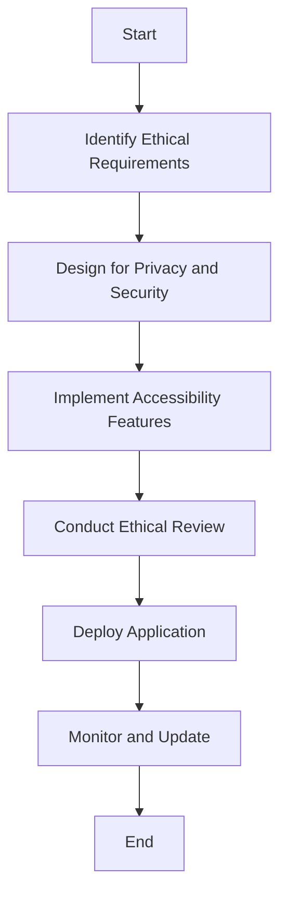

## 13.13 Ethical Considerations in Software Design

In the rapidly evolving landscape of software development, ethical considerations have become paramount. As expert software engineers and architects, we must ensure that our creations not only perform efficiently but also adhere to ethical standards. This section delves into the ethical dimensions of software design, focusing on handling user data responsibly, designing for accessibility, and addressing privacy and security considerations in C++ applications.

### Handling User Data Responsibly

User data is the lifeblood of many applications, providing insights and driving functionalities. However, with great power comes great responsibility. Mishandling user data can lead to privacy breaches, legal repercussions, and loss of user trust. Let's explore how we can handle user data responsibly.

#### Data Minimization

**Principle:** Collect only the data necessary for the functionality of your application. Avoid gathering excessive information that could pose a risk if compromised.

**Implementation:** In C++, ensure that data structures and databases are designed to store only essential information. Use templates and type traits to enforce constraints on data types and sizes.

```cpp
#include <iostream>
#include <string>
#include <vector>

// A simple user data structure
struct UserData {
    std::string username;
    std::string email;
    // Avoid storing unnecessary sensitive information
};

// Function to collect user data
void collectUserData(const std::string& username, const std::string& email) {
    UserData user{username, email};
    // Process user data
}

int main() {
    collectUserData("john_doe", "john@example.com");
    return 0;
}
```

#### Data Anonymization

**Principle:** Anonymize data to protect user identities. This involves removing or obfuscating personal identifiers.

**Implementation:** Use hashing algorithms and encryption techniques available in C++ libraries to anonymize data before storage or analysis.

```cpp
#include <iostream>
#include <string>
#include <openssl/sha.h>

// Function to hash user data
std::string hashData(const std::string& data) {
    unsigned char hash[SHA256_DIGEST_LENGTH];
    SHA256(reinterpret_cast<const unsigned char*>(data.c_str()), data.size(), hash);
    std::string hashedData(reinterpret_cast<char*>(hash), SHA256_DIGEST_LENGTH);
    return hashedData;
}

int main() {
    std::string email = "john@example.com";
    std::string hashedEmail = hashData(email);
    std::cout << "Hashed Email: " << hashedEmail << std::endl;
    return 0;
}
```

#### Data Retention Policies

**Principle:** Establish clear data retention policies to determine how long data should be stored and when it should be deleted.

**Implementation:** Implement automated processes in your C++ applications to periodically review and purge outdated data.

```cpp
#include <iostream>
#include <vector>
#include <ctime>

// Simulated database of user data
struct UserRecord {
    std::string username;
    std::time_t lastActive;
};

// Function to purge old data
void purgeOldData(std::vector<UserRecord>& records, std::time_t currentTime, std::time_t retentionPeriod) {
    records.erase(std::remove_if(records.begin(), records.end(),
        [currentTime, retentionPeriod](const UserRecord& record) {
            return (currentTime - record.lastActive) > retentionPeriod;
        }), records.end());
}

int main() {
    std::vector<UserRecord> userRecords = {{"john_doe", std::time(nullptr) - 100000}};
    std::time_t currentTime = std::time(nullptr);
    std::time_t retentionPeriod = 86400; // 1 day in seconds
    purgeOldData(userRecords, currentTime, retentionPeriod);
    return 0;
}
```

### Designing for Accessibility

Accessibility ensures that software is usable by people with a wide range of abilities and disabilities. Designing for accessibility is not just a legal requirement in many jurisdictions but also an ethical obligation to ensure inclusivity.

#### User Interface Design

**Principle:** Design interfaces that are easy to navigate and understand for all users, including those with disabilities.

**Implementation:** Use libraries like Qt in C++ to create accessible user interfaces. Ensure that all interactive elements are keyboard-navigable and provide alternative text for images.

```cpp
#include <QApplication>
#include <QPushButton>
#include <QVBoxLayout>
#include <QWidget>

int main(int argc, char *argv[]) {
    QApplication app(argc, argv);

    QWidget window;
    QVBoxLayout layout(&window);

    QPushButton button("Accessible Button");
    button.setAccessibleName("Button for submitting data");
    layout.addWidget(&button);

    window.show();
    return app.exec();
}
```

#### Color Contrast and Text Size

**Principle:** Ensure sufficient color contrast and adjustable text size for readability.

**Implementation:** Use stylesheets in Qt to set high-contrast color schemes and allow users to adjust text size.

```cpp
#include <QApplication>
#include <QLabel>
#include <QVBoxLayout>
#include <QWidget>

int main(int argc, char *argv[]) {
    QApplication app(argc, argv);

    QWidget window;
    QVBoxLayout layout(&window);

    QLabel label("High Contrast Text");
    label.setStyleSheet("color: white; background-color: black; font-size: 18px;");
    layout.addWidget(&label);

    window.show();
    return app.exec();
}
```

#### Assistive Technologies

**Principle:** Support assistive technologies such as screen readers and voice recognition.

**Implementation:** Ensure that your C++ applications provide necessary hooks and metadata for assistive technologies to function effectively.

```cpp
#include <QApplication>
#include <QLabel>
#include <QVBoxLayout>
#include <QWidget>

int main(int argc, char *argv[]) {
    QApplication app(argc, argv);

    QWidget window;
    QVBoxLayout layout(&window);

    QLabel label("Screen Reader Accessible Text");
    label.setAccessibleDescription("This text is accessible to screen readers");
    layout.addWidget(&label);

    window.show();
    return app.exec();
}
```

### Privacy and Security Considerations

Privacy and security are critical components of ethical software design. Protecting user data from unauthorized access and ensuring secure communication are essential to maintaining user trust.

#### Encryption

**Principle:** Encrypt sensitive data both in transit and at rest to prevent unauthorized access.

**Implementation:** Use C++ libraries like OpenSSL to implement encryption for data storage and communication.

```cpp
#include <iostream>
#include <openssl/aes.h>

// Function to encrypt data
void encryptData(const unsigned char* data, unsigned char* encryptedData, const unsigned char* key) {
    AES_KEY encryptKey;
    AES_set_encrypt_key(key, 128, &encryptKey);
    AES_encrypt(data, encryptedData, &encryptKey);
}

int main() {
    unsigned char data[] = "Sensitive Data";
    unsigned char encryptedData[AES_BLOCK_SIZE];
    unsigned char key[] = "encryptionkey123";

    encryptData(data, encryptedData, key);
    std::cout << "Encrypted Data: " << encryptedData << std::endl;
    return 0;
}
```

#### Secure Authentication

**Principle:** Implement secure authentication mechanisms to verify user identities.

**Implementation:** Use multi-factor authentication (MFA) and secure password storage techniques such as hashing with salt.

```cpp
#include <iostream>
#include <string>
#include <openssl/sha.h>
#include <openssl/rand.h>

// Function to hash password with salt
std::string hashPassword(const std::string& password, const std::string& salt) {
    std::string saltedPassword = password + salt;
    unsigned char hash[SHA256_DIGEST_LENGTH];
    SHA256(reinterpret_cast<const unsigned char*>(saltedPassword.c_str()), saltedPassword.size(), hash);
    return std::string(reinterpret_cast<char*>(hash), SHA256_DIGEST_LENGTH);
}

// Function to generate random salt
std::string generateSalt() {
    unsigned char salt[16];
    RAND_bytes(salt, sizeof(salt));
    return std::string(reinterpret_cast<char*>(salt), sizeof(salt));
}

int main() {
    std::string password = "securepassword";
    std::string salt = generateSalt();
    std::string hashedPassword = hashPassword(password, salt);
    std::cout << "Hashed Password: " << hashedPassword << std::endl;
    return 0;
}
```

#### Secure Communication

**Principle:** Ensure secure communication channels to protect data in transit.

**Implementation:** Use TLS (Transport Layer Security) for secure communication between clients and servers. C++ libraries like Boost.Asio can be used to implement secure sockets.

```cpp
#include <boost/asio.hpp>
#include <boost/asio/ssl.hpp>

int main() {
    boost::asio::io_context io_context;
    boost::asio::ssl::context ssl_context(boost::asio::ssl::context::sslv23);
    ssl_context.set_verify_mode(boost::asio::ssl::verify_peer);

    boost::asio::ssl::stream<boost::asio::ip::tcp::socket> socket(io_context, ssl_context);
    // Establish secure connection
    return 0;
}
```

### Visualizing Ethical Software Design

To better understand how ethical considerations integrate into software design, let's visualize the process using a flowchart. This flowchart outlines the steps involved in ensuring ethical design practices are followed throughout the software development lifecycle.



**Description:** This flowchart illustrates the ethical software design process, starting from identifying ethical requirements to deploying and maintaining the application.

### Knowledge Check

- **Question:** What is the principle of data minimization, and why is it important?
- **Answer:** Data minimization involves collecting only the data necessary for the application's functionality. It is important because it reduces the risk of data breaches and protects user privacy.

- **Question:** How can C++ developers ensure their applications are accessible to users with disabilities?
- **Answer:** Developers can use libraries like Qt to create accessible user interfaces, ensure keyboard navigability, provide alternative text for images, and support assistive technologies.

### Try It Yourself

Experiment with the provided code examples by modifying them to suit different scenarios. For instance, try implementing a different hashing algorithm for password storage or adjust the UI elements in the Qt examples to enhance accessibility.

### Embrace the Journey

Remember, ethical software design is an ongoing process. As technology evolves, so do the ethical challenges we face. Stay informed, continue learning, and strive to create software that not only meets functional requirements but also upholds ethical standards.

## Quiz Time!



### What is the principle of data minimization?

- [x] Collect only the data necessary for the functionality of your application.
- [ ] Collect as much data as possible for future use.
- [ ] Store data indefinitely without deletion.
- [ ] Share user data with third parties.

> **Explanation:** Data minimization involves collecting only the data necessary for the application's functionality to protect user privacy and reduce risk.

### How can C++ developers ensure their applications are accessible?

- [x] Use libraries like Qt to create accessible user interfaces.
- [ ] Ignore keyboard navigability.
- [ ] Avoid providing alternative text for images.
- [ ] Disable assistive technologies.

> **Explanation:** Developers should use libraries like Qt to create accessible user interfaces, ensure keyboard navigability, provide alternative text for images, and support assistive technologies.

### What is the purpose of data anonymization?

- [x] Protect user identities by removing or obfuscating personal identifiers.
- [ ] Increase data storage requirements.
- [ ] Make data easily accessible to everyone.
- [ ] Share data with unauthorized users.

> **Explanation:** Data anonymization protects user identities by removing or obfuscating personal identifiers, enhancing privacy.

### What is a key benefit of using encryption in software design?

- [x] Prevent unauthorized access to sensitive data.
- [ ] Increase data processing speed.
- [ ] Simplify data management.
- [ ] Reduce storage costs.

> **Explanation:** Encryption prevents unauthorized access to sensitive data, ensuring privacy and security.

### Which of the following is a secure authentication mechanism?

- [x] Multi-factor authentication (MFA)
- [ ] Storing passwords in plain text
- [x] Hashing passwords with salt
- [ ] Using weak passwords

> **Explanation:** Multi-factor authentication (MFA) and hashing passwords with salt are secure authentication mechanisms that enhance security.

### What is the role of TLS in secure communication?

- [x] Ensure secure communication channels to protect data in transit.
- [ ] Increase data transmission speed.
- [ ] Simplify network configuration.
- [ ] Reduce network latency.

> **Explanation:** TLS ensures secure communication channels, protecting data in transit from unauthorized access.

### How can developers implement secure password storage?

- [x] Hash passwords with salt before storing them.
- [ ] Store passwords in plain text.
- [x] Use strong hashing algorithms.
- [ ] Share passwords with third parties.

> **Explanation:** Developers should hash passwords with salt using strong hashing algorithms before storing them to ensure secure password storage.

### What is the importance of designing for accessibility?

- [x] Ensure software is usable by people with a wide range of abilities and disabilities.
- [ ] Increase development time.
- [ ] Simplify user interfaces.
- [ ] Reduce application functionality.

> **Explanation:** Designing for accessibility ensures software is usable by people with a wide range of abilities and disabilities, promoting inclusivity.

### What is the purpose of a data retention policy?

- [x] Determine how long data should be stored and when it should be deleted.
- [ ] Increase data storage capacity.
- [ ] Share data with unauthorized users.
- [ ] Store data indefinitely.

> **Explanation:** A data retention policy determines how long data should be stored and when it should be deleted, ensuring responsible data management.

### True or False: Ethical software design is a one-time process.

- [ ] True
- [x] False

> **Explanation:** Ethical software design is an ongoing process that evolves with technology and ethical challenges, requiring continuous learning and adaptation.


