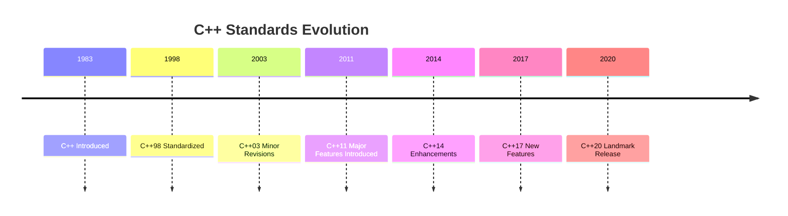

## 13.14 Keeping Up with C++ Standards

In the fast-paced world of software development, staying current with the latest C++ standards is crucial for leveraging new language features and maintaining a competitive edge. As C++ continues to evolve, it introduces powerful tools and constructs that can significantly enhance your code's efficiency, readability, and maintainability. This section will guide you through the journey of mastering modern C++ standards, from understanding the motivation behind changes to effectively integrating new features into your projects.

### Understanding the Evolution of C++ Standards

C++ has undergone significant transformations since its inception, with each new standard bringing a host of features designed to improve the language. The major standards—C++98, C++03, C++11, C++14, C++17, and C++20—have progressively introduced enhancements that address various aspects of programming, from performance and safety to expressiveness and ease of use.

#### Key Milestones in C++ Standards

- **C++98/C++03**: These early standards laid the foundation for modern C++ with features like templates, exceptions, and the Standard Template Library (STL).
- **C++11**: Often considered a major turning point, C++11 introduced features such as auto, lambda expressions, smart pointers, and move semantics, significantly modernizing the language.
- **C++14**: This standard refined C++11 features, offering enhancements like generic lambdas and relaxed constexpr restrictions.
- **C++17**: Building on its predecessors, C++17 introduced features like std::optional, std::variant, and parallel algorithms, further enhancing the language's capabilities.
- **C++20**: A landmark release, C++20 brought concepts, ranges, coroutines, and modules, marking a new era of expressiveness and efficiency.

### Leveraging New Features Appropriately

To effectively utilize new C++ features, it's essential to understand their purpose and how they fit into your development workflow. Let's explore some of the key features introduced in recent standards and how they can be leveraged to improve your code.

#### Auto and Type Inference

The `auto` keyword, introduced in C++11, allows for automatic type deduction, simplifying code and reducing verbosity. It is particularly useful in scenarios where the type is complex or evident from the context.

```cpp
auto x = 42; // x is deduced to be an int
auto y = 3.14; // y is deduced to be a double
```

**Try It Yourself**: Experiment with `auto` by replacing explicit types in your code with `auto` and observe how it affects readability and maintainability.

#### Lambda Expressions

Lambdas provide a concise way to define anonymous functions, making them ideal for use in algorithms and event handling. They enhance code readability by keeping function logic close to where it's used.

```cpp
std::vector<int> numbers = {1, 2, 3, 4, 5};
std::for_each(numbers.begin(), numbers.end(), [](int n) { std::cout << n << " "; });
```

**Try It Yourself**: Modify the lambda to capture variables by reference or value and observe how it changes the behavior.

#### Smart Pointers

Smart pointers, such as `std::unique_ptr` and `std::shared_ptr`, manage dynamic memory automatically, reducing the risk of memory leaks and dangling pointers.

```cpp
std::unique_ptr<int> ptr = std::make_unique<int>(10);
```

**Try It Yourself**: Replace raw pointers in your code with smart pointers and monitor the impact on memory management.

#### Move Semantics and Rvalue References

Move semantics optimize resource management by allowing the transfer of resources from temporary objects, reducing unnecessary copying.

```cpp
std::vector<int> v1 = {1, 2, 3};
std::vector<int> v2 = std::move(v1); // v1 is now empty
```

**Try It Yourself**: Implement move constructors and move assignment operators in your classes to see how they improve performance.

### Modern C++ Features in Practice

Let's delve deeper into some of the advanced features introduced in recent standards and explore practical examples of their usage.

#### Concepts (C++20)

Concepts provide a way to specify constraints on template parameters, enhancing code readability and error messages.

```cpp
template<typename T>
concept Incrementable = requires(T x) { ++x; };

template<Incrementable T>
void increment(T& value) {
    ++value;
}
```

**Try It Yourself**: Define your own concepts and apply them to template functions to enforce constraints.

#### Ranges (C++20)

The ranges library offers a more expressive way to work with collections, enabling lazy evaluation and composition of operations.

```cpp
#include <ranges>
#include <vector>

std::vector<int> numbers = {1, 2, 3, 4, 5};
auto squares = numbers | std::views::transform([](int n) { return n * n; });
```

**Try It Yourself**: Chain multiple range operations and observe how they affect the code's readability and efficiency.

#### Coroutines (C++20)

Coroutines simplify asynchronous programming by allowing functions to suspend and resume execution, making them ideal for tasks like I/O operations and event loops.

```cpp
#include <coroutine>
#include <iostream>

struct SimpleTask {
    struct promise_type {
        SimpleTask get_return_object() { return {}; }
        std::suspend_never initial_suspend() { return {}; }
        std::suspend_never final_suspend() noexcept { return {}; }
        void return_void() {}
        void unhandled_exception() { std::terminate(); }
    };
};

SimpleTask exampleCoroutine() {
    std::cout << "Hello, ";
    co_await std::suspend_always{};
    std::cout << "world!";
}

int main() {
    exampleCoroutine();
    return 0;
}
```

**Try It Yourself**: Implement a coroutine that performs asynchronous I/O operations and observe how it simplifies the code.

### Visualizing C++ Standards Evolution

To better understand the evolution of C++ standards and their impact, let's visualize the key features introduced in each standard using a timeline diagram.



**Diagram Description**: This timeline illustrates the progression of C++ standards, highlighting the major releases and their contributions to the language.

### Staying Current with C++ Standards

Keeping up with C++ standards involves more than just understanding new features; it requires a proactive approach to learning and adapting to changes. Here are some strategies to stay current:

1. **Engage with the Community**: Participate in forums, attend conferences, and join C++ user groups to stay informed about the latest developments and best practices.

2. **Follow the Standardization Process**: Keep an eye on the C++ standardization committee's work, including proposals and discussions, to anticipate upcoming changes.

3. **Experiment with New Features**: Regularly experiment with new language features in small projects to gain hands-on experience and understand their practical applications.

4. **Leverage Online Resources**: Utilize reputable online resources, such as [cppreference.com](https://en.cppreference.com/) and [isocpp.org](https://isocpp.org/), for comprehensive documentation and tutorials.

5. **Read Books and Articles**: Invest time in reading books and articles by C++ experts to deepen your understanding of modern C++ and its applications.

### Knowledge Check

To reinforce your understanding of modern C++ standards, consider the following questions:

- How do concepts enhance template programming in C++20?
- What are the benefits of using ranges over traditional STL algorithms?
- How do coroutines improve asynchronous programming in C++?

### Conclusion

Staying current with C++ standards is an ongoing journey that requires dedication and a willingness to adapt. By mastering modern C++ features and integrating them into your development workflow, you can create efficient, robust, and maintainable software. Remember, this is just the beginning. As C++ continues to evolve, new opportunities for innovation and improvement will arise. Keep experimenting, stay curious, and enjoy the journey!

## Quiz Time!



### What is the primary purpose of the `auto` keyword in C++?

- [x] To allow automatic type deduction
- [ ] To declare variables as constant
- [ ] To define anonymous functions
- [ ] To manage dynamic memory

> **Explanation:** The `auto` keyword in C++ is used for automatic type deduction, allowing the compiler to infer the type of a variable from its initializer.

### Which C++ standard introduced lambda expressions?

- [ ] C++03
- [x] C++11
- [ ] C++14
- [ ] C++17

> **Explanation:** Lambda expressions were introduced in C++11, providing a concise way to define anonymous functions.

### What is a key benefit of using smart pointers in C++?

- [x] Automatic memory management
- [ ] Faster execution speed
- [ ] Simplified syntax
- [ ] Enhanced security

> **Explanation:** Smart pointers in C++ manage dynamic memory automatically, reducing the risk of memory leaks and dangling pointers.

### How do move semantics improve performance in C++?

- [x] By transferring resources from temporary objects
- [ ] By copying objects more efficiently
- [ ] By simplifying code syntax
- [ ] By enhancing type safety

> **Explanation:** Move semantics allow the transfer of resources from temporary objects, reducing unnecessary copying and improving performance.

### What feature of C++20 allows for specifying constraints on template parameters?

- [ ] Ranges
- [ ] Coroutines
- [x] Concepts
- [ ] Modules

> **Explanation:** Concepts in C++20 provide a way to specify constraints on template parameters, enhancing code readability and error messages.

### Which C++20 feature simplifies asynchronous programming?

- [ ] Ranges
- [x] Coroutines
- [ ] Concepts
- [ ] Modules

> **Explanation:** Coroutines in C++20 simplify asynchronous programming by allowing functions to suspend and resume execution.

### What is the advantage of using ranges in C++20?

- [x] More expressive collection operations
- [ ] Faster execution speed
- [ ] Simplified syntax
- [ ] Enhanced security

> **Explanation:** The ranges library in C++20 offers a more expressive way to work with collections, enabling lazy evaluation and composition of operations.

### How can you stay informed about upcoming changes in C++ standards?

- [x] Follow the C++ standardization committee's work
- [ ] Only read books about C++98
- [ ] Avoid online forums and discussions
- [ ] Focus solely on legacy codebases

> **Explanation:** Following the C++ standardization committee's work, including proposals and discussions, helps anticipate upcoming changes.

### Which online resource is recommended for comprehensive C++ documentation?

- [ ] W3Schools
- [x] cppreference.com
- [ ] Stack Overflow
- [ ] GitHub

> **Explanation:** cppreference.com is a reputable online resource for comprehensive C++ documentation and tutorials.

### Staying current with C++ standards requires:

- [x] A proactive approach to learning and adapting
- [ ] Ignoring new language features
- [ ] Focusing only on legacy code
- [ ] Avoiding experimentation with new features

> **Explanation:** Staying current with C++ standards requires a proactive approach to learning and adapting to changes, including experimenting with new features.


