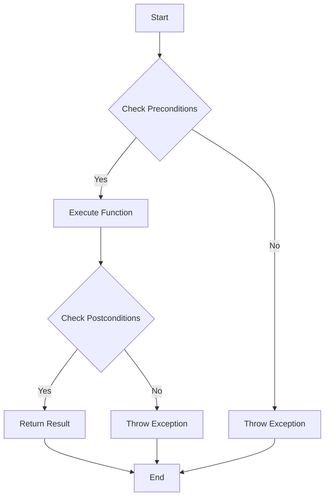

## 13.2 Design by Contract

In the realm of software engineering, ensuring the correctness and robustness of code is paramount. One powerful methodology to achieve this is **Design by Contract (DbC)**. Originating from the Eiffel programming language, DbC is a design philosophy that treats software components as entities bound by formal agreements, or "contracts." These contracts define the rights and responsibilities of software components, ensuring that each part of the system behaves as expected.

### Understanding Design by Contract

Design by Contract is a systematic approach to software design that emphasizes the importance of defining clear and precise agreements between software components. These agreements are expressed in terms of:

- **Preconditions**: Conditions that must be true before a function or method is executed.
- **Postconditions**: Conditions that must be true after a function or method has executed.
- **Invariants**: Conditions that must always be true for a class or data structure.

By adhering to these contracts, developers can create software that is more reliable, maintainable, and easier to debug.

### The Role of Contracts in Software Design

Contracts serve as a form of documentation and specification that clarifies the expected behavior of software components. They provide a framework for reasoning about code correctness and help identify potential issues early in the development process. Let's delve deeper into each component of a contract.

#### Preconditions

Preconditions are assertions that must hold true before a function or method is invoked. They define the valid input states for a function and serve as a gatekeeper to ensure that the function operates on valid data. If a precondition is violated, the function should not proceed.

**Example:**

Consider a function that calculates the square root of a number. A precondition for this function would be that the input number must be non-negative.

```cpp
#include <cmath>
#include <stdexcept>

// Function to calculate the square root
double calculateSquareRoot(double number) {
    // Precondition: The number must be non-negative
    if (number < 0) {
        throw std::invalid_argument("Number must be non-negative");
    }
    return std::sqrt(number);
}
```

In this example, the precondition ensures that the function only attempts to calculate the square root of a valid number, preventing potential errors or undefined behavior.

#### Postconditions

Postconditions are assertions that must hold true after a function or method has completed its execution. They define the expected state of the system after the function has run and help verify that the function has achieved its intended purpose.

**Example:**

Continuing with the square root example, a postcondition might be that the result squared should equal the original number (within a small margin of error due to floating-point precision).

```cpp
#include <cmath>
#include <stdexcept>

// Function to calculate the square root
double calculateSquareRoot(double number) {
    // Precondition: The number must be non-negative
    if (number < 0) {
        throw std::invalid_argument("Number must be non-negative");
    }
    
    double result = std::sqrt(number);
    
    // Postcondition: The square of the result should be approximately equal to the original number
    if (std::abs(result * result - number) > 1e-9) {
        throw std::logic_error("Postcondition failed: result squared does not equal the original number");
    }
    
    return result;
}
```

The postcondition in this example ensures that the function's output is consistent with its mathematical definition.

#### Invariants

Invariants are conditions that must always hold true for a class or data structure, regardless of the operations performed on it. They define the consistent state of an object and are crucial for maintaining the integrity of data structures.

**Example:**

Consider a class representing a bank account. An invariant might be that the account balance must never be negative.

```cpp
#include <stdexcept>

class BankAccount {
private:
    double balance;

public:
    BankAccount(double initialBalance) : balance(initialBalance) {
        // Invariant: Balance must never be negative
        if (balance < 0) {
            throw std::invalid_argument("Initial balance cannot be negative");
        }
    }

    void deposit(double amount) {
        if (amount < 0) {
            throw std::invalid_argument("Deposit amount cannot be negative");
        }
        balance += amount;
    }

    void withdraw(double amount) {
        if (amount < 0) {
            throw std::invalid_argument("Withdrawal amount cannot be negative");
        }
        if (balance - amount < 0) {
            throw std::logic_error("Invariant violated: Balance cannot be negative");
        }
        balance -= amount;
    }

    double getBalance() const {
        return balance;
    }
};
```

In this example, the invariant ensures that the bank account's balance remains valid throughout its lifecycle.

### Implementing Design by Contract in C++

While C++ does not natively support Design by Contract as some other languages do, it is possible to implement DbC principles using assertions and exception handling. Let's explore how to effectively apply DbC in C++.

#### Using Assertions

Assertions are a powerful tool for implementing preconditions, postconditions, and invariants. The `assert` macro in C++ can be used to verify conditions at runtime, providing a simple way to enforce contracts.

**Example:**

```cpp
#include <cassert>
#include <cmath>

// Function to calculate the square root
double calculateSquareRoot(double number) {
    // Precondition: The number must be non-negative
    assert(number >= 0);

    double result = std::sqrt(number);

    // Postcondition: The square of the result should be approximately equal to the original number
    assert(std::abs(result * result - number) <= 1e-9);

    return result;
}
```

In this example, assertions are used to enforce both the precondition and postcondition, ensuring that the function behaves correctly.

#### Exception Handling

Exception handling can be used to enforce contracts by throwing exceptions when a contract is violated. This approach provides more flexibility and allows for graceful error handling.

**Example:**

```cpp
#include <cmath>
#include <stdexcept>

// Function to calculate the square root
double calculateSquareRoot(double number) {
    // Precondition: The number must be non-negative
    if (number < 0) {
        throw std::invalid_argument("Number must be non-negative");
    }

    double result = std::sqrt(number);

    // Postcondition: The square of the result should be approximately equal to the original number
    if (std::abs(result * result - number) > 1e-9) {
        throw std::logic_error("Postcondition failed: result squared does not equal the original number");
    }

    return result;
}
```

This example demonstrates how exceptions can be used to enforce contracts, providing clear error messages when a contract is violated.

### Visualizing Design by Contract

To better understand the flow of Design by Contract, let's visualize the process using a flowchart.



**Figure 1: Flowchart of Design by Contract**

This flowchart illustrates the typical process of executing a function with Design by Contract, highlighting the importance of checking preconditions and postconditions.

### Best Practices for Design by Contract

When implementing Design by Contract in C++, consider the following best practices:

1. **Clearly Define Contracts**: Ensure that preconditions, postconditions, and invariants are well-defined and documented. This clarity helps both developers and users understand the expected behavior of the software.

2. **Use Assertions Wisely**: While assertions are useful for enforcing contracts, they should not be used for error handling in production code. Use them primarily during development and testing.

3. **Leverage Exception Handling**: Use exceptions to handle contract violations gracefully, providing meaningful error messages and allowing the program to recover or terminate safely.

4. **Test Contracts Thoroughly**: Write unit tests to verify that contracts are correctly enforced. This testing helps catch potential issues early and ensures that the software behaves as expected.

5. **Document Contracts**: Include contract information in code comments and documentation. This practice aids in code maintenance and helps new developers understand the system's requirements.

6. **Balance Performance and Correctness**: While enforcing contracts is important, be mindful of the performance implications. In performance-critical code, consider the trade-offs between thorough contract enforcement and execution speed.

### Try It Yourself

To gain a deeper understanding of Design by Contract, try modifying the code examples provided. Experiment with different preconditions, postconditions, and invariants. Consider the following exercises:

1. **Exercise 1**: Modify the `calculateSquareRoot` function to handle complex numbers. Update the preconditions and postconditions accordingly.

2. **Exercise 2**: Implement a class representing a stack data structure. Define invariants to ensure the stack's integrity, such as ensuring that the stack size never exceeds a predefined limit.

3. **Exercise 3**: Create a function that sorts an array of integers. Define preconditions to ensure that the input array is not null and postconditions to verify that the array is sorted in ascending order.

### Knowledge Check

To reinforce your understanding of Design by Contract, consider the following questions:

- What are the key components of a contract in software design?
- How can assertions be used to enforce contracts in C++?
- What are the benefits of using exception handling for contract enforcement?
- How can Design by Contract improve software reliability and maintainability?

### Embrace the Journey

Remember, mastering Design by Contract is a journey. As you continue to explore and apply these principles, you'll gain a deeper understanding of software correctness and design. Keep experimenting, stay curious, and enjoy the process of creating robust and reliable software.

## Quiz Time!



### What are the key components of a contract in software design?

- [x] Preconditions, postconditions, and invariants
- [ ] Preconditions, exceptions, and assertions
- [ ] Postconditions, exceptions, and invariants
- [ ] Assertions, exceptions, and invariants

> **Explanation:** The key components of a contract in software design are preconditions, postconditions, and invariants. These elements define the expected behavior of software components.

### How can assertions be used in C++?

- [x] To enforce preconditions and postconditions
- [ ] To handle exceptions
- [ ] To manage memory
- [ ] To optimize performance

> **Explanation:** Assertions in C++ are used to enforce preconditions and postconditions by verifying conditions at runtime.

### What is the purpose of preconditions in Design by Contract?

- [x] To define valid input states for a function
- [ ] To handle exceptions
- [ ] To manage memory
- [ ] To optimize performance

> **Explanation:** Preconditions define the valid input states for a function, ensuring that the function operates on valid data.

### What is the role of postconditions in Design by Contract?

- [x] To define the expected state of the system after a function has run
- [ ] To handle exceptions
- [ ] To manage memory
- [ ] To optimize performance

> **Explanation:** Postconditions define the expected state of the system after a function has run, verifying that the function has achieved its intended purpose.

### How can exception handling be used in Design by Contract?

- [x] To enforce contracts by throwing exceptions when a contract is violated
- [ ] To manage memory
- [ ] To optimize performance
- [ ] To handle assertions

> **Explanation:** Exception handling can be used to enforce contracts by throwing exceptions when a contract is violated, providing clear error messages.

### What is an invariant in Design by Contract?

- [x] A condition that must always hold true for a class or data structure
- [ ] A condition that must be true before a function is executed
- [ ] A condition that must be true after a function has executed
- [ ] A condition used to handle exceptions

> **Explanation:** An invariant is a condition that must always hold true for a class or data structure, ensuring its integrity.

### What is the benefit of documenting contracts in code?

- [x] It aids in code maintenance and helps new developers understand the system's requirements
- [ ] It optimizes performance
- [ ] It manages memory
- [ ] It handles exceptions

> **Explanation:** Documenting contracts in code aids in code maintenance and helps new developers understand the system's requirements.

### What should be considered when balancing performance and correctness in Design by Contract?

- [x] The trade-offs between thorough contract enforcement and execution speed
- [ ] The use of exceptions
- [ ] The management of memory
- [ ] The optimization of performance

> **Explanation:** When balancing performance and correctness in Design by Contract, consider the trade-offs between thorough contract enforcement and execution speed.

### How can Design by Contract improve software reliability?

- [x] By providing a framework for reasoning about code correctness and identifying potential issues early
- [ ] By optimizing performance
- [ ] By managing memory
- [ ] By handling exceptions

> **Explanation:** Design by Contract improves software reliability by providing a framework for reasoning about code correctness and identifying potential issues early.

### True or False: Design by Contract is a methodology that treats software components as entities bound by formal agreements.

- [x] True
- [ ] False

> **Explanation:** True. Design by Contract is a methodology that treats software components as entities bound by formal agreements, or "contracts."


