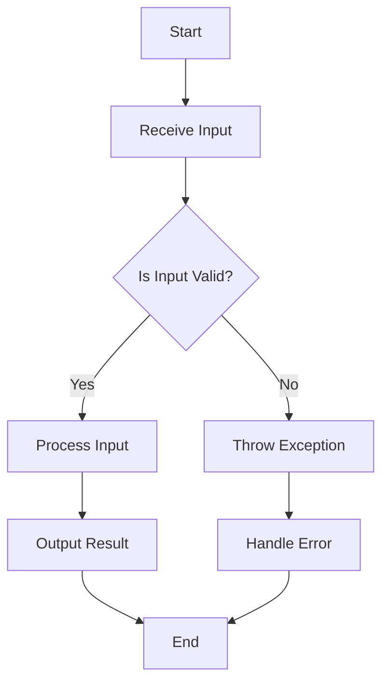

## 13.3 Defensive Programming

Defensive programming is a crucial practice in software development, especially in a language as powerful and complex as C++. It involves writing code that anticipates and safely handles potential errors and unexpected conditions. By adopting defensive programming techniques, developers can create robust, reliable, and maintainable software that is less prone to bugs and easier to debug and extend.

### Introduction to Defensive Programming

Defensive programming is akin to building a fortress around your code. It ensures that your software behaves predictably even when faced with unexpected inputs or conditions. This approach is particularly important in C++, where the language's flexibility and power can lead to subtle bugs if not handled carefully.

#### Key Concepts

1. **Error Prevention**: Anticipate potential errors and handle them before they occur.
2. **Input Validation**: Ensure that all inputs to a system are valid and within expected ranges.
3. **Assumption Checks**: Verify that assumptions made in the code are still valid during execution.
4. **Fail-Safe Defaults**: Design systems to fail safely, without causing harm or data loss.
5. **Code Readability and Maintainability**: Write clear, understandable code that is easy to maintain and extend.

### Why Defensive Programming Matters in C++

C++ offers unparalleled control over system resources, but this power comes with responsibility. Errors such as buffer overflows, null pointer dereferences, and memory leaks can lead to catastrophic failures. Defensive programming helps mitigate these risks by enforcing strict checks and balances throughout the code.

#### Benefits

- **Increased Reliability**: Code is less likely to fail unexpectedly.
- **Improved Security**: Reduces vulnerabilities that could be exploited by malicious actors.
- **Easier Debugging**: Clear error messages and predictable behavior simplify troubleshooting.
- **Better Maintenance**: Code is easier to understand and modify, reducing the risk of introducing new bugs.

### Core Techniques of Defensive Programming

#### 1. Input Validation

Input validation is the first line of defense against unexpected behavior. Always assume that inputs can be incorrect or malicious and validate them accordingly.

**Example: Validating User Input**

```cpp
#include <iostream>
#include <stdexcept>

void processInput(int value) {
    if (value < 0 || value > 100) {
        throw std::out_of_range("Input value must be between 0 and 100.");
    }
    // Proceed with processing
    std::cout << "Processing value: " << value << std::endl;
}

int main() {
    int userInput;
    std::cout << "Enter a value between 0 and 100: ";
    std::cin >> userInput;

    try {
        processInput(userInput);
    } catch (const std::out_of_range& e) {
        std::cerr << "Error: " << e.what() << std::endl;
    }

    return 0;
}
```

**Key Points:**

- Validate inputs at the earliest opportunity.
- Use exceptions to handle invalid inputs gracefully.
- Provide clear error messages to guide users.

#### 2. Assumption Checks

Assumptions are often made during development, such as a function always receiving a valid pointer. Defensive programming involves verifying these assumptions at runtime.

**Example: Checking Pointer Validity**

```cpp
#include <iostream>
#include <stdexcept>

void processData(int* data) {
    if (data == nullptr) {
        throw std::invalid_argument("Received null pointer.");
    }
    // Proceed with processing
    std::cout << "Processing data: " << *data << std::endl;
}

int main() {
    int* ptr = nullptr;

    try {
        processData(ptr);
    } catch (const std::invalid_argument& e) {
        std::cerr << "Error: " << e.what() << std::endl;
    }

    return 0;
}
```

**Key Points:**

- Always check pointers for null before dereferencing.
- Use assertions to verify assumptions during development.

#### 3. Fail-Safe Defaults

Design systems to default to a safe state in the event of an error. This approach minimizes the impact of failures and prevents data corruption.

**Example: Safe File Handling**

```cpp
#include <iostream>
#include <fstream>
#include <stdexcept>

void readFile(const std::string& filename) {
    std::ifstream file(filename);
    if (!file.is_open()) {
        throw std::runtime_error("Failed to open file.");
    }

    std::string line;
    while (std::getline(file, line)) {
        std::cout << line << std::endl;
    }

    file.close();
}

int main() {
    try {
        readFile("example.txt");
    } catch (const std::runtime_error& e) {
        std::cerr << "Error: " << e.what() << std::endl;
    }

    return 0;
}
```

**Key Points:**

- Ensure resources are properly released in case of failure.
- Use RAII (Resource Acquisition Is Initialization) to manage resource lifetimes.

#### 4. Code Readability and Maintainability

Clear, well-documented code is easier to understand and less prone to errors. Use consistent naming conventions, comments, and modular design to enhance readability.

**Example: Modular Function Design**

```cpp
#include <iostream>
#include <vector>
#include <algorithm>

// Function to calculate the average of a list of numbers
double calculateAverage(const std::vector<int>& numbers) {
    if (numbers.empty()) {
        throw std::invalid_argument("The list of numbers is empty.");
    }

    int sum = std::accumulate(numbers.begin(), numbers.end(), 0);
    return static_cast<double>(sum) / numbers.size();
}

int main() {
    std::vector<int> numbers = {1, 2, 3, 4, 5};

    try {
        double average = calculateAverage(numbers);
        std::cout << "Average: " << average << std::endl;
    } catch (const std::invalid_argument& e) {
        std::cerr << "Error: " << e.what() << std::endl;
    }

    return 0;
}
```

**Key Points:**

- Break down complex functions into smaller, manageable pieces.
- Use meaningful variable and function names.
- Document assumptions and logic with comments.

### Advanced Defensive Programming Techniques

#### 1. Using Assertions

Assertions are a powerful tool for verifying assumptions during development. They help catch errors early and provide valuable debugging information.

**Example: Using Assertions**

```cpp
#include <cassert>
#include <iostream>

void processArray(const int* array, size_t size) {
    assert(array != nullptr && "Array pointer is null.");
    assert(size > 0 && "Array size must be greater than zero.");

    for (size_t i = 0; i < size; ++i) {
        std::cout << "Element " << i << ": " << array[i] << std::endl;
    }
}

int main() {
    int numbers[] = {10, 20, 30};
    processArray(numbers, 3);

    return 0;
}
```

**Key Points:**

- Use assertions to check critical assumptions.
- Disable assertions in production code to avoid performance overhead.

#### 2. Exception Safety

Ensure that your code is exception-safe by using techniques like RAII and exception specifications. This approach prevents resource leaks and undefined behavior.

**Example: Exception-Safe Resource Management**

```cpp
#include <iostream>
#include <memory>

class Resource {
public:
    Resource() { std::cout << "Resource acquired." << std::endl; }
    ~Resource() { std::cout << "Resource released." << std::endl; }
};

void useResource() {
    std::unique_ptr<Resource> resource = std::make_unique<Resource>();
    // Perform operations with resource
    std::cout << "Using resource." << std::endl;
}

int main() {
    try {
        useResource();
    } catch (...) {
        std::cerr << "An error occurred." << std::endl;
    }

    return 0;
}
```

**Key Points:**

- Use smart pointers to manage dynamic memory safely.
- Ensure all resources are released in case of exceptions.

#### 3. Defensive Copying

Avoid unintended modifications by making defensive copies of objects when necessary. This technique is especially useful when dealing with shared resources.

**Example: Defensive Copying**

```cpp
#include <iostream>
#include <vector>

class DataProcessor {
public:
    void processData(std::vector<int> data) {
        // Make a copy of the data to prevent external modifications
        std::vector<int> localData = data;

        for (int& value : localData) {
            value *= 2; // Example processing
        }

        for (const int& value : localData) {
            std::cout << value << " ";
        }
        std::cout << std::endl;
    }
};

int main() {
    std::vector<int> numbers = {1, 2, 3, 4, 5};
    DataProcessor processor;
    processor.processData(numbers);

    return 0;
}
```

**Key Points:**

- Use defensive copying to protect against unintended side effects.
- Consider the performance impact of copying large objects.

### Visualizing Defensive Programming Concepts

To better understand the flow of defensive programming techniques, let's visualize the process of input validation and error handling using a flowchart.



**Description:**

- **Receive Input**: The program receives input from the user or another source.
- **Is Input Valid?**: The input is checked against predefined validation rules.
- **Process Input**: If the input is valid, it is processed accordingly.
- **Throw Exception**: If the input is invalid, an exception is thrown.
- **Handle Error**: The error is caught and handled gracefully.
- **Output Result**: The result of the processing is output to the user.
- **End**: The program concludes its execution.

### Defensive Programming in Practice

#### Case Study: Building a Robust File Parser

Let's apply defensive programming techniques to build a robust file parser that reads and processes data from a file. We'll focus on input validation, error handling, and resource management.

**Example: File Parser Implementation**

```cpp
#include <iostream>
#include <fstream>
#include <string>
#include <stdexcept>

class FileParser {
public:
    void parseFile(const std::string& filename) {
        std::ifstream file(filename);
        if (!file.is_open()) {
            throw std::runtime_error("Failed to open file: " + filename);
        }

        std::string line;
        while (std::getline(file, line)) {
            if (!isValidLine(line)) {
                throw std::runtime_error("Invalid data format in file.");
            }
            processLine(line);
        }

        file.close();
    }

private:
    bool isValidLine(const std::string& line) {
        // Simple validation: check if line is not empty
        return !line.empty();
    }

    void processLine(const std::string& line) {
        // Process the line (e.g., parse data, store in a structure)
        std::cout << "Processing line: " << line << std::endl;
    }
};

int main() {
    FileParser parser;
    try {
        parser.parseFile("data.txt");
    } catch (const std::runtime_error& e) {
        std::cerr << "Error: " << e.what() << std::endl;
    }

    return 0;
}
```

**Key Points:**

- Validate file existence and format before processing.
- Use exceptions to handle errors and provide meaningful messages.
- Ensure resources like file handles are properly released.

### Try It Yourself

Experiment with the file parser example by modifying the `isValidLine` function to implement more complex validation rules, such as checking for specific data formats or patterns. Observe how the program behaves with different input files and error conditions.

### Knowledge Check

- What is the primary goal of defensive programming?
- How can input validation prevent errors in a C++ program?
- Why is it important to verify assumptions in your code?
- How does RAII help in managing resources safely?
- What are the benefits of using assertions during development?

### Conclusion

Defensive programming is an essential practice for developing reliable and secure C++ applications. By validating inputs, checking assumptions, and managing resources carefully, you can prevent many common errors and vulnerabilities. Remember, the goal is to anticipate potential issues and handle them gracefully, ensuring your software remains robust and maintainable.

### Embrace the Journey

As you continue to develop your skills in C++ and defensive programming, remember that this is just the beginning. Keep experimenting, stay curious, and enjoy the journey of creating reliable and efficient software. Defensive programming is not just about preventing errors; it's about building a foundation of trust and reliability in your code.

## Quiz Time!



### What is the primary goal of defensive programming?

- [x] To prevent errors and ensure code reliability
- [ ] To optimize code for performance
- [ ] To make code more readable
- [ ] To reduce code size

> **Explanation:** Defensive programming aims to prevent errors and ensure that code behaves predictably, even in unexpected situations.

### Which technique is used to ensure that inputs to a system are valid?

- [x] Input validation
- [ ] Exception handling
- [ ] Code optimization
- [ ] Resource management

> **Explanation:** Input validation is the process of checking inputs to ensure they meet expected criteria before processing.

### What is the purpose of assumption checks in defensive programming?

- [x] To verify that assumptions made in the code are valid during execution
- [ ] To improve code performance
- [ ] To simplify code logic
- [ ] To reduce code duplication

> **Explanation:** Assumption checks ensure that assumptions made during development hold true during execution, preventing unexpected behavior.

### How does RAII help in resource management?

- [x] By ensuring resources are acquired and released safely
- [ ] By optimizing resource usage
- [ ] By reducing resource allocation time
- [ ] By increasing resource availability

> **Explanation:** RAII (Resource Acquisition Is Initialization) ensures that resources are properly acquired and released, preventing leaks and undefined behavior.

### Why are assertions used during development?

- [x] To verify critical assumptions and catch errors early
- [ ] To improve code readability
- [ ] To enhance code performance
- [ ] To reduce code size

> **Explanation:** Assertions are used to verify critical assumptions and catch errors early in the development process.

### What is a key benefit of using exceptions in C++?

- [x] They allow for graceful error handling
- [ ] They improve code performance
- [ ] They reduce code complexity
- [ ] They enhance code readability

> **Explanation:** Exceptions provide a mechanism for handling errors gracefully, allowing the program to recover or terminate safely.

### What is defensive copying used for?

- [x] To prevent unintended modifications to shared resources
- [ ] To optimize memory usage
- [ ] To reduce code duplication
- [ ] To enhance code readability

> **Explanation:** Defensive copying creates a copy of an object to prevent unintended modifications, especially when dealing with shared resources.

### How can you ensure that a pointer is valid before using it?

- [x] By checking if the pointer is null
- [ ] By optimizing the pointer
- [ ] By converting the pointer to a reference
- [ ] By using the pointer in a loop

> **Explanation:** Checking if a pointer is null ensures it is valid before dereferencing, preventing null pointer dereferences.

### What is the purpose of fail-safe defaults?

- [x] To ensure systems default to a safe state in case of failure
- [ ] To improve system performance
- [ ] To reduce system complexity
- [ ] To enhance system readability

> **Explanation:** Fail-safe defaults ensure that systems default to a safe state in case of failure, minimizing the impact of errors.

### Defensive programming is primarily concerned with:

- [x] Preventing errors and ensuring code reliability
- [ ] Optimizing code for performance
- [ ] Simplifying code logic
- [ ] Reducing code size

> **Explanation:** Defensive programming focuses on preventing errors and ensuring that code behaves predictably, even in unexpected situations.


