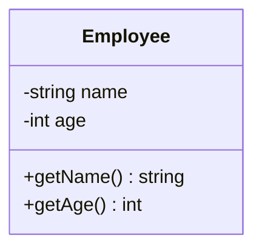

## 13.4 Clean Code and Readability

In the realm of software engineering, clean code and readability are paramount for creating maintainable, efficient, and scalable applications. As expert developers and architects, we must strive to write code that not only works but is also easy to understand and modify. This section delves into the principles of clean code and readability in C++ software design, providing insights into writing self-documenting code, refactoring for clarity, and maintaining small, manageable functions and classes.

### Writing Self-Documenting Code

Self-documenting code is code that is written in such a way that it is easy to understand without requiring extensive comments or external documentation. This is achieved by using meaningful names, clear structure, and straightforward logic.

#### Meaningful Naming Conventions

Choosing the right names for variables, functions, and classes is crucial for readability. Names should be descriptive and convey the purpose or function of the entity they represent.

- **Variables**: Use nouns or noun phrases that clearly indicate the variable's role. For example, `int userAge` is more descriptive than `int a`.
- **Functions**: Use verbs or verb phrases that describe the action performed. For example, `void calculateSalary()` is clearer than `void calc()`.
- **Classes**: Use nouns that represent the concept or entity the class models. For example, `class Employee` is more intuitive than `class E`.

#### Consistent Naming Patterns

Consistency in naming conventions helps maintain readability across a codebase. Adopting a naming style guide, such as camelCase for variables and functions or PascalCase for classes, ensures uniformity.

#### Code Example: Naming Conventions

```cpp
class Employee {
public:
    Employee(const std::string& name, int age) : name_(name), age_(age) {}

    std::string getName() const { return name_; }
    int getAge() const { return age_; }

private:
    std::string name_;
    int age_;
};
```

In this example, the class and its members are named to clearly represent their purpose, enhancing readability.

#### Avoiding Magic Numbers

Magic numbers are numeric literals embedded in code without explanation. Replacing them with named constants improves clarity.

```cpp
const double PI = 3.14159;
const int MAX_USERS = 100;

// Usage
double area = PI * radius * radius;
```

By using named constants, we make the code more understandable and maintainable.

### Refactoring for Clarity

Refactoring is the process of restructuring existing code without changing its external behavior. This practice is essential for improving code readability and maintainability.

#### Simplifying Complex Logic

Complex logic can often be simplified by breaking it down into smaller, more manageable pieces. This can be achieved by extracting methods or using design patterns.

#### Code Example: Simplifying Logic

Before refactoring:

```cpp
void processOrder(Order& order) {
    if (order.isPaid() && !order.isShipped()) {
        // Process order
    }
}
```

After refactoring:

```cpp
void processOrder(Order& order) {
    if (canProcessOrder(order)) {
        // Process order
    }
}

bool canProcessOrder(const Order& order) {
    return order.isPaid() && !order.isShipped();
}
```

By extracting the condition into a separate function, we make the code more readable and reusable.

#### Removing Redundancies

Eliminate redundant code to reduce clutter and improve readability. This includes removing duplicate code, unnecessary comments, and unused variables.

### Keeping Functions and Classes Small

Small functions and classes are easier to understand, test, and maintain. They should have a single responsibility and do one thing well.

#### Single Responsibility Principle

Adhering to the Single Responsibility Principle (SRP) ensures that a class or function has only one reason to change. This makes the code more robust and easier to manage.

#### Code Example: Single Responsibility

```cpp
class ReportGenerator {
public:
    void generateReport(const Data& data) {
        // Generate report
    }
};

class DataFetcher {
public:
    Data fetchData() {
        // Fetch data
    }
};
```

In this example, `ReportGenerator` is responsible only for generating reports, while `DataFetcher` handles data retrieval.

#### Limiting Function Length

Functions should be concise and focused. A common guideline is to keep functions within 20-30 lines of code. If a function grows too large, consider breaking it into smaller helper functions.

#### Code Example: Limiting Function Length

```cpp
void processTransaction(const Transaction& transaction) {
    validateTransaction(transaction);
    executeTransaction(transaction);
    logTransaction(transaction);
}

void validateTransaction(const Transaction& transaction) {
    // Validation logic
}

void executeTransaction(const Transaction& transaction) {
    // Execution logic
}

void logTransaction(const Transaction& transaction) {
    // Logging logic
}
```

By breaking down the `processTransaction` function into smaller parts, we enhance readability and maintainability.

### Visualizing Code Structure

Visual aids can significantly enhance understanding of code structure and flow. Diagrams such as class diagrams, sequence diagrams, and flowcharts can provide a clear overview of complex systems.

#### Class Diagram Example



This class diagram visually represents the `Employee` class, showing its attributes and methods.

### References and Links

- [Clean Code: A Handbook of Agile Software Craftsmanship by Robert C. Martin](https://www.amazon.com/Clean-Code-Handbook-Software-Craftsmanship/dp/0132350882)
- [Google C++ Style Guide](https://google.github.io/styleguide/cppguide.html)

### Knowledge Check

- What are the benefits of using meaningful naming conventions in code?
- How can refactoring improve code readability?
- Why is it important to keep functions and classes small?

### Embrace the Journey

Remember, writing clean and readable code is a continuous journey. As you progress, you'll find new ways to improve your coding practices. Keep experimenting, stay curious, and enjoy the process of crafting elegant and maintainable software!

## Quiz Time!



### What is the primary benefit of writing self-documenting code?

- [x] It makes the code easier to understand without extensive comments.
- [ ] It eliminates the need for any documentation.
- [ ] It allows for faster execution of the code.
- [ ] It reduces the number of lines in the code.

> **Explanation:** Self-documenting code is designed to be easily understood by others, reducing the need for extensive comments.

### Which of the following is a key aspect of meaningful naming conventions?

- [x] Using descriptive and clear names for variables and functions.
- [ ] Using single-letter variable names for brevity.
- [ ] Naming variables after their data type.
- [ ] Using random names to avoid conflicts.

> **Explanation:** Descriptive names help convey the purpose and function of variables and functions, enhancing readability.

### What is the purpose of refactoring code?

- [x] To improve code readability and maintainability without changing its behavior.
- [ ] To add new features to the code.
- [ ] To increase the execution speed of the code.
- [ ] To remove all comments from the code.

> **Explanation:** Refactoring focuses on restructuring code to improve its readability and maintainability while preserving its functionality.

### How can magic numbers be avoided in code?

- [x] By replacing them with named constants.
- [ ] By using them only in comments.
- [ ] By ensuring they are used consistently throughout the code.
- [ ] By writing them in a separate file.

> **Explanation:** Named constants provide clarity and context, making the code more understandable.

### What is the Single Responsibility Principle?

- [x] A class or function should have only one reason to change.
- [ ] A class should handle multiple responsibilities.
- [ ] A function should perform multiple tasks.
- [ ] A variable should store multiple types of data.

> **Explanation:** The Single Responsibility Principle ensures that a class or function is focused on a single task, making it easier to manage.

### Why is it important to limit the length of functions?

- [x] To enhance readability and maintainability.
- [ ] To reduce the number of lines in the code.
- [ ] To ensure faster execution.
- [ ] To make the code more complex.

> **Explanation:** Shorter functions are easier to understand, test, and maintain, improving overall code quality.

### What is a benefit of using diagrams to visualize code structure?

- [x] They provide a clear overview of complex systems.
- [ ] They eliminate the need for code comments.
- [ ] They make the code execute faster.
- [ ] They reduce the number of lines in the code.

> **Explanation:** Diagrams help convey the structure and flow of code, aiding in understanding complex systems.

### What is the role of refactoring in clean code?

- [x] To restructure code for better readability without altering its behavior.
- [ ] To add new features to the code.
- [ ] To remove all comments from the code.
- [ ] To increase the execution speed of the code.

> **Explanation:** Refactoring involves restructuring code to improve readability and maintainability while keeping its behavior unchanged.

### How can redundancy be reduced in code?

- [x] By eliminating duplicate code and unused variables.
- [ ] By adding more comments.
- [ ] By using more complex logic.
- [ ] By increasing the number of functions.

> **Explanation:** Reducing redundancy involves removing unnecessary elements, simplifying the codebase.

### True or False: Clean code practices are only necessary for large projects.

- [ ] True
- [x] False

> **Explanation:** Clean code practices are essential for projects of all sizes to ensure maintainability and readability.




