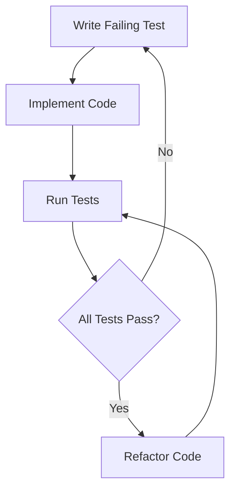

## 13.5 Testing and Test-Driven Development

In the realm of software engineering, testing is an indispensable practice that ensures the reliability, functionality, and performance of applications. As C++ developers, mastering testing and test-driven development (TDD) can significantly enhance the quality of our codebases. This section delves into the intricacies of testing in C++, focusing on unit testing frameworks like Google Test and Catch2, writing testable code, and mocking dependencies. Let's embark on this journey to elevate our testing skills and embrace the principles of TDD.

### Introduction to Testing in C++

Testing in C++ involves verifying that individual units of code, such as functions and classes, perform as expected. It is a crucial step in the software development lifecycle, providing confidence that code changes do not introduce new bugs. Testing can be categorized into several types, including unit testing, integration testing, system testing, and acceptance testing. Our focus here will be on unit testing and TDD, which are foundational for building robust C++ applications.

#### Why Testing Matters

Testing is not merely a box-ticking exercise; it is a practice that offers numerous benefits:

- **Improved Code Quality**: By identifying defects early, testing helps maintain high standards of code quality.
- **Facilitated Refactoring**: With a comprehensive suite of tests, developers can refactor code with confidence, knowing that existing functionality is preserved.
- **Enhanced Collaboration**: Tests serve as documentation, clarifying the intended behavior of code for team members.
- **Reduced Debugging Time**: Automated tests quickly pinpoint issues, reducing the time spent on debugging.

### Unit Testing Frameworks: Google Test and Catch2

Unit testing frameworks provide the tools and structure needed to write and execute tests efficiently. In the C++ ecosystem, Google Test and Catch2 are two popular frameworks that offer robust features for unit testing.

#### Google Test

Google Test, also known as GTest, is a widely-used C++ testing framework developed by Google. It provides a rich set of assertions, test fixtures, and utilities to streamline the testing process.

##### Key Features of Google Test

- **Assertions**: Google Test offers a variety of assertions to verify conditions, such as `EXPECT_EQ`, `ASSERT_TRUE`, and `EXPECT_THROW`.
- **Test Fixtures**: Test fixtures allow for the setup and teardown of common test data, promoting code reuse and organization.
- **Parameterized Tests**: Google Test supports parameterized tests, enabling the execution of the same test logic with different inputs.
- **Mocking Support**: With Google Mock, an extension of Google Test, developers can create mock objects to simulate dependencies.

##### Sample Code Snippet

```cpp
#include <gtest/gtest.h>

// Function to be tested
int Add(int a, int b) {
    return a + b;
}

// Test case
TEST(AdditionTest, HandlesPositiveNumbers) {
    EXPECT_EQ(Add(1, 2), 3);
    EXPECT_EQ(Add(10, 20), 30);
}

int main(int argc, char **argv) {
    ::testing::InitGoogleTest(&argc, argv);
    return RUN_ALL_TESTS();
}
```

In this example, we define a simple function `Add` and test it using Google Test. The `EXPECT_EQ` assertion checks that the function returns the expected results.

#### Catch2

Catch2 is another popular C++ testing framework known for its simplicity and ease of use. It is header-only, meaning it does not require separate compilation or linking, which simplifies integration into projects.

##### Key Features of Catch2

- **Expressive Assertions**: Catch2 provides a range of assertions with a natural syntax, such as `REQUIRE` and `CHECK`.
- **BDD-Style Testing**: Catch2 supports behavior-driven development (BDD) style testing with `SCENARIO` and `GIVEN` constructs.
- **Test Cases and Sections**: Tests can be organized into test cases and sections, allowing for fine-grained control over test execution.
- **Extensibility**: Catch2 is highly extensible, enabling customization through plugins and listeners.

##### Sample Code Snippet

```cpp
#define CATCH_CONFIG_MAIN
#include <catch2/catch.hpp>

// Function to be tested
int Multiply(int a, int b) {
    return a * b;
}

// Test case
TEST_CASE("Multiplication works correctly", "[multiply]") {
    REQUIRE(Multiply(2, 3) == 6);
    REQUIRE(Multiply(5, 4) == 20);
}
```

This example demonstrates how to use Catch2 to test a `Multiply` function. The `REQUIRE` assertions verify that the function produces the correct results.

### Writing Testable Code

To write effective tests, our code must be designed with testability in mind. Testable code is modular, loosely coupled, and adheres to the principles of SOLID design.

#### Principles of Testable Code

1. **Single Responsibility Principle**: Ensure that each class or function has a single responsibility, making it easier to isolate and test.
2. **Loose Coupling**: Minimize dependencies between components to facilitate independent testing.
3. **Dependency Injection**: Use dependency injection to provide dependencies externally, allowing for easy substitution with mocks or stubs during testing.
4. **Interface Segregation**: Define interfaces that are specific to client needs, enabling focused testing of individual behaviors.

#### Example: Refactoring for Testability

Consider the following code snippet, which is difficult to test due to tight coupling:

```cpp
class Database {
public:
    void Connect() {
        // Connect to database
    }
    void Query(const std::string& query) {
        // Execute query
    }
};

class UserService {
    Database db;
public:
    void GetUser(int userId) {
        db.Connect();
        db.Query("SELECT * FROM users WHERE id = " + std::to_string(userId));
    }
};
```

To improve testability, we can refactor the code to use dependency injection:

```cpp
class IDatabase {
public:
    virtual void Connect() = 0;
    virtual void Query(const std::string& query) = 0;
    virtual ~IDatabase() = default;
};

class UserService {
    IDatabase& db;
public:
    UserService(IDatabase& database) : db(database) {}

    void GetUser(int userId) {
        db.Connect();
        db.Query("SELECT * FROM users WHERE id = " + std::to_string(userId));
    }
};
```

By introducing the `IDatabase` interface, we can easily substitute a mock database during testing, isolating the `UserService` from external dependencies.

### Mocking Dependencies

Mocking is a technique used to simulate the behavior of complex dependencies, allowing us to test components in isolation. In C++, Google Mock is a powerful library for creating mock objects.

#### Creating Mocks with Google Mock

Google Mock provides a simple syntax for defining mock classes and specifying expected behaviors.

##### Example: Mocking a Database

```cpp
#include <gmock/gmock.h>

class MockDatabase : public IDatabase {
public:
    MOCK_METHOD(void, Connect, (), (override));
    MOCK_METHOD(void, Query, (const std::string& query), (override));
};

TEST(UserServiceTest, GetUserQueriesDatabase) {
    MockDatabase mockDb;
    UserService userService(mockDb);

    EXPECT_CALL(mockDb, Connect()).Times(1);
    EXPECT_CALL(mockDb, Query("SELECT * FROM users WHERE id = 1")).Times(1);

    userService.GetUser(1);
}
```

In this test, we use `EXPECT_CALL` to specify the expected interactions with the `MockDatabase`. The test verifies that `UserService::GetUser` correctly calls `Connect` and `Query`.

### Test-Driven Development (TDD)

Test-driven development is a software development methodology that emphasizes writing tests before writing the corresponding code. TDD follows a simple cycle: Red, Green, Refactor.

#### The TDD Cycle

1. **Red**: Write a test that fails because the desired functionality is not yet implemented.
2. **Green**: Write the minimum amount of code necessary to make the test pass.
3. **Refactor**: Refactor the code to improve its structure and readability while ensuring all tests still pass.

#### Benefits of TDD

- **Improved Design**: TDD encourages thoughtful design by focusing on the interface and behavior of components before implementation.
- **Comprehensive Test Coverage**: By writing tests first, TDD ensures that all code is covered by tests.
- **Reduced Defects**: TDD helps catch defects early, reducing the likelihood of bugs in production.

#### Example: Implementing TDD

Let's walk through a simple TDD example to implement a `Calculator` class with an `Add` method.

##### Step 1: Write a Failing Test

```cpp
#include <gtest/gtest.h>

class Calculator {
public:
    int Add(int a, int b);
};

TEST(CalculatorTest, Add) {
    Calculator calc;
    EXPECT_EQ(calc.Add(2, 3), 5);
}
```

At this stage, the test will fail because the `Add` method is not implemented.

##### Step 2: Implement the Code

```cpp
class Calculator {
public:
    int Add(int a, int b) {
        return a + b;
    }
};
```

With the `Add` method implemented, the test should now pass.

##### Step 3: Refactor

In this simple example, there may not be much to refactor. However, in more complex scenarios, this step involves improving code structure and removing duplication.

### Try It Yourself

To solidify your understanding, try modifying the code examples:

- **Experiment with Google Test and Catch2**: Create additional test cases for different scenarios, such as edge cases and error conditions.
- **Refactor for Testability**: Identify tightly coupled components in your projects and refactor them to use dependency injection.
- **Implement TDD**: Choose a small feature or bug fix and apply the TDD cycle to implement it.

### Visualizing the TDD Cycle

To better understand the TDD process, let's visualize the cycle using a flowchart.



**Figure 1: Visualizing the TDD Cycle**

This flowchart illustrates the iterative nature of TDD, where we continuously write tests, implement code, and refactor.

### References and Links

For further reading and exploration, consider the following resources:

- [Google Test Documentation](https://github.com/google/googletest)
- [Catch2 Documentation](https://github.com/catchorg/Catch2)
- [Test-Driven Development by Example](https://www.amazon.com/Test-Driven-Development-Kent-Beck/dp/0321146530) by Kent Beck

### Knowledge Check

Before we conclude, let's reinforce our learning with a few questions:

- **What are the key benefits of testing in C++?**
- **How does dependency injection improve testability?**
- **What is the purpose of mocking in unit testing?**
- **Describe the TDD cycle and its benefits.**

### Embrace the Journey

Remember, mastering testing and TDD is a journey. As you progress, you'll build more robust and maintainable C++ applications. Keep experimenting, stay curious, and enjoy the process!

## Quiz Time!



### What is the primary purpose of unit testing in C++?

- [x] To verify that individual units of code perform as expected
- [ ] To test the entire application for performance issues
- [ ] To replace manual testing entirely
- [ ] To ensure the application is free of any bugs

> **Explanation:** Unit testing focuses on verifying the correctness of individual units of code, such as functions and classes, ensuring they perform as expected.

### Which C++ testing framework is known for its simplicity and header-only design?

- [ ] Google Test
- [x] Catch2
- [ ] Boost.Test
- [ ] CppUnit

> **Explanation:** Catch2 is a header-only C++ testing framework known for its simplicity and ease of integration into projects.

### In the context of TDD, what does the "Red" phase involve?

- [ ] Writing code to pass the test
- [x] Writing a test that initially fails
- [ ] Refactoring the code
- [ ] Running all tests

> **Explanation:** The "Red" phase in TDD involves writing a test that initially fails because the desired functionality is not yet implemented.

### What is the role of dependency injection in writing testable code?

- [x] To provide dependencies externally, allowing for easy substitution with mocks
- [ ] To increase coupling between components
- [ ] To eliminate the need for interfaces
- [ ] To reduce the number of tests needed

> **Explanation:** Dependency injection allows dependencies to be provided externally, facilitating the substitution of real dependencies with mocks during testing.

### How does Google Mock assist in unit testing?

- [x] By creating mock objects to simulate dependencies
- [ ] By automatically generating test cases
- [ ] By eliminating the need for assertions
- [ ] By providing a graphical user interface for tests

> **Explanation:** Google Mock assists in unit testing by allowing developers to create mock objects that simulate the behavior of complex dependencies.

### Which of the following is a benefit of test-driven development (TDD)?

- [x] Improved design and comprehensive test coverage
- [ ] Faster development without tests
- [ ] Reduced need for refactoring
- [ ] Elimination of all bugs

> **Explanation:** TDD improves design by focusing on interfaces and behaviors before implementation, and it ensures comprehensive test coverage.

### What is a key characteristic of testable code?

- [x] Loose coupling between components
- [ ] High complexity and interdependence
- [ ] Lack of interfaces
- [ ] Extensive use of global variables

> **Explanation:** Testable code is characterized by loose coupling between components, which allows for independent testing and easier substitution of dependencies.

### In the TDD cycle, what follows after writing a failing test?

- [ ] Refactoring the code
- [ ] Running all tests
- [x] Implementing the minimum code to pass the test
- [ ] Writing documentation

> **Explanation:** After writing a failing test, the next step in the TDD cycle is to implement the minimum amount of code necessary to make the test pass.

### What is the purpose of refactoring in the TDD cycle?

- [x] To improve code structure and readability while ensuring all tests still pass
- [ ] To add new features to the code
- [ ] To remove tests that are no longer needed
- [ ] To increase the complexity of the code

> **Explanation:** Refactoring in the TDD cycle aims to improve the structure and readability of the code without altering its functionality, ensuring all tests still pass.

### True or False: Mocking is used to test the integration of all components in a system.

- [ ] True
- [x] False

> **Explanation:** Mocking is used to simulate the behavior of complex dependencies, allowing individual components to be tested in isolation, not for testing the integration of all components.


