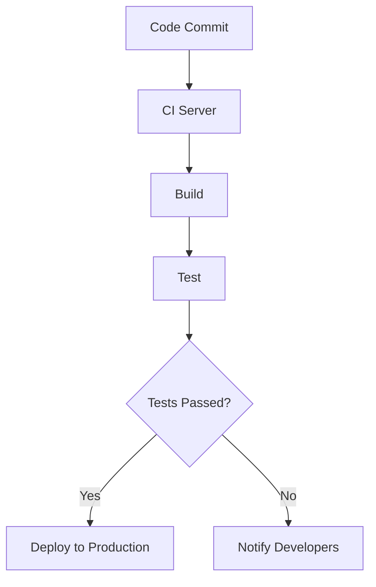

## 13.6 Continuous Integration and Deployment

Continuous Integration (CI) and Continuous Deployment (CD) are essential practices in modern software development, enabling teams to deliver high-quality software more efficiently. In this section, we will explore how to set up CI/CD pipelines for C++ projects, focusing on tools like Jenkins and GitHub Actions. We'll cover best practices for automating builds, tests, and deployments, ensuring that your C++ applications are robust, scalable, and maintainable.

### Understanding Continuous Integration and Deployment

**Continuous Integration (CI)** is a development practice where developers integrate code into a shared repository frequently, ideally several times a day. Each integration is verified by an automated build and test process, allowing teams to detect problems early.

**Continuous Deployment (CD)** extends CI by automatically deploying code changes to a production environment after passing the CI process. This practice ensures that software can be released to users quickly and reliably.

#### Key Benefits of CI/CD

- **Faster Feedback:** Automated tests provide immediate feedback on code changes, allowing developers to address issues promptly.
- **Reduced Risk:** Frequent integration and testing reduce the risk of integration problems and bugs in production.
- **Improved Collaboration:** CI/CD encourages collaboration among team members by providing a shared platform for code integration and testing.
- **Higher Quality:** Automated testing and deployment ensure that only code that meets quality standards is released.

### Setting Up CI/CD Pipelines for C++ Projects

A CI/CD pipeline is a series of automated processes that enable the continuous delivery of software. Let's explore how to set up a CI/CD pipeline for a C++ project using Jenkins and GitHub Actions.

#### Jenkins: An Overview

[Jenkins](https://www.jenkins.io/) is an open-source automation server that supports building, deploying, and automating software projects. It is highly extensible, with a rich ecosystem of plugins that support various tools and technologies.

##### Setting Up Jenkins for C++ Projects

1. **Install Jenkins:**
   - Download and install Jenkins from the official website.
   - Start Jenkins and access the web interface.

2. **Configure Jenkins:**
   - Install necessary plugins, such as the Git plugin for version control and the CMake plugin for building C++ projects.
   - Set up a Jenkins job for your C++ project.

3. **Create a Jenkins Pipeline:**
   - Use a Jenkinsfile to define your CI/CD pipeline. Here's an example Jenkinsfile for a C++ project:

   ```groovy
   pipeline {
       agent any
       stages {
           stage('Checkout') {
               steps {
                   git 'https://github.com/your-repo/cpp-project.git'
               }
           }
           stage('Build') {
               steps {
                   sh 'cmake .'
                   sh 'make'
               }
           }
           stage('Test') {
               steps {
                   sh './run-tests'
               }
           }
           stage('Deploy') {
               steps {
                   sh './deploy.sh'
               }
           }
       }
   }
   ```

   - **Stage Descriptions:**
     - **Checkout:** Pulls the latest code from the repository.
     - **Build:** Compiles the C++ code using CMake and Make.
     - **Test:** Runs automated tests to ensure code quality.
     - **Deploy:** Deploys the application to a specified environment.

4. **Monitor Builds:**
   - Use Jenkins' dashboard to monitor build status and logs.
   - Set up notifications for build failures or successes.

#### GitHub Actions: An Overview

[GitHub Actions](https://github.com/features/actions) is a CI/CD platform integrated with GitHub, allowing you to automate workflows directly from your GitHub repository.

##### Setting Up GitHub Actions for C++ Projects

1. **Create a Workflow File:**
   - Add a `.github/workflows/ci.yml` file to your repository. Here's an example workflow for a C++ project:

   ```yaml
   name: CI

   on: [push, pull_request]

   jobs:
     build:

       runs-on: ubuntu-latest

       steps:
       - name: Checkout code
         uses: actions/checkout@v2

       - name: Set up CMake
         uses: lukka/get-cmake@v2

       - name: Build
         run: cmake . && make

       - name: Run tests
         run: ./run-tests
   ```

   - **Job Descriptions:**
     - **Checkout code:** Checks out the code from the repository.
     - **Set up CMake:** Installs CMake on the runner.
     - **Build:** Compiles the C++ code.
     - **Run tests:** Executes the test suite.

2. **Trigger Workflows:**
   - The workflow is triggered on every push or pull request, ensuring that all code changes are tested and built.

3. **Monitor Workflow Runs:**
   - Use the GitHub Actions tab in your repository to view workflow runs, logs, and statuses.

### Best Practices for CI/CD in C++ Projects

Implementing CI/CD effectively requires following best practices to ensure smooth and efficient processes. Here are some key practices to consider:

#### Automate Everything

- **Automate Builds and Tests:** Ensure that all builds and tests are automated to reduce manual intervention and errors.
- **Automate Deployments:** Use scripts and tools to automate deployments, minimizing the risk of human error.

#### Maintain a Clean Codebase

- **Keep the Master Branch Stable:** Ensure that the master branch is always in a deployable state by using feature branches for development.
- **Use Code Reviews:** Implement code reviews to maintain code quality and catch issues early.

#### Monitor and Optimize

- **Monitor Pipeline Performance:** Regularly monitor the performance of your CI/CD pipeline to identify bottlenecks and optimize processes.
- **Use Metrics and Logs:** Collect metrics and logs to gain insights into pipeline performance and troubleshoot issues.

#### Secure Your Pipeline

- **Use Secure Credentials:** Store credentials securely and avoid hardcoding them in scripts or configuration files.
- **Implement Access Controls:** Restrict access to CI/CD tools and resources to authorized personnel only.

### Code Examples and Exercises

Let's dive into some code examples and exercises to reinforce the concepts discussed.

#### Example: Jenkins Pipeline for C++ Project

Here's a more detailed Jenkinsfile example with comments explaining each step:

```groovy
pipeline {
    agent any
    environment {
        BUILD_DIR = 'build'
    }
    stages {
        stage('Checkout') {
            steps {
                // Clone the repository
                git 'https://github.com/your-repo/cpp-project.git'
            }
        }
        stage('Build') {
            steps {
                // Create build directory and run CMake
                sh 'mkdir -p ${BUILD_DIR} && cd ${BUILD_DIR} && cmake ..'
                // Compile the project
                sh 'cd ${BUILD_DIR} && make'
            }
        }
        stage('Test') {
            steps {
                // Run tests
                sh 'cd ${BUILD_DIR} && ctest'
            }
        }
        stage('Deploy') {
            steps {
                // Deploy the application
                sh './deploy.sh'
            }
        }
    }
    post {
        always {
            // Clean up build directory
            sh 'rm -rf ${BUILD_DIR}'
        }
        success {
            // Notify success
            echo 'Build and deployment successful!'
        }
        failure {
            // Notify failure
            echo 'Build or deployment failed!'
        }
    }
}
```

#### Exercise: Modify the Jenkins Pipeline

Try modifying the Jenkins pipeline to include additional stages, such as static analysis or packaging. Experiment with different configurations and observe the results.

#### Example: GitHub Actions Workflow for C++ Project

Here's a more detailed GitHub Actions workflow example:

```yaml
name: CI

on:
  push:
    branches:
      - main
  pull_request:
    branches:
      - main

jobs:
  build:

    runs-on: ubuntu-latest

    steps:
    - name: Checkout code
      uses: actions/checkout@v2

    - name: Set up CMake
      uses: lukka/get-cmake@v2

    - name: Build
      run: cmake -B build -S . && cmake --build build

    - name: Run tests
      run: cd build && ctest

    - name: Upload test results
      if: always()
      uses: actions/upload-artifact@v2
      with:
        name: test-results
        path: build/test-results
```

#### Exercise: Extend the GitHub Actions Workflow

Extend the GitHub Actions workflow to include additional steps, such as code coverage analysis or deployment to a staging environment. Experiment with different configurations and observe the results.

### Visualizing CI/CD Pipelines

To better understand the flow of a CI/CD pipeline, let's visualize it using a Mermaid.js diagram.



**Diagram Description:** This diagram represents a typical CI/CD pipeline. It starts with a code commit, followed by the CI server triggering a build. The build is then tested, and if the tests pass, the code is deployed to production. If the tests fail, developers are notified.

### References and Further Reading

- [Jenkins Documentation](https://www.jenkins.io/doc/)
- [GitHub Actions Documentation](https://docs.github.com/en/actions)
- [CMake Documentation](https://cmake.org/documentation/)
- [Best Practices for CI/CD](https://martinfowler.com/articles/continuousIntegration.html)

### Knowledge Check

Let's test your understanding of CI/CD concepts with some questions and exercises.

#### Questions

1. What is the primary goal of Continuous Integration?
2. How does Continuous Deployment differ from Continuous Integration?
3. What are some common tools used for CI/CD in C++ projects?
4. Why is it important to automate builds and tests in a CI/CD pipeline?
5. What are some best practices for securing a CI/CD pipeline?

#### Exercises

1. Set up a Jenkins pipeline for a simple C++ project and automate the build and test process.
2. Create a GitHub Actions workflow for a C++ project and experiment with different triggers and steps.
3. Monitor the performance of your CI/CD pipeline and identify areas for optimization.

### Embrace the Journey

Remember, mastering CI/CD is a journey. As you progress, you'll discover more advanced techniques and tools to enhance your pipelines. Keep experimenting, stay curious, and enjoy the process of continuous improvement!

## Quiz Time!



### What is the primary goal of Continuous Integration?

- [x] To integrate code changes frequently and detect issues early
- [ ] To deploy code changes to production automatically
- [ ] To replace manual testing with automated testing
- [ ] To eliminate the need for code reviews

> **Explanation:** Continuous Integration aims to integrate code changes frequently and detect issues early through automated builds and tests.

### How does Continuous Deployment differ from Continuous Integration?

- [x] Continuous Deployment involves automatically deploying code changes to production
- [ ] Continuous Deployment focuses on integrating code changes frequently
- [ ] Continuous Deployment eliminates the need for automated testing
- [ ] Continuous Deployment is a manual process

> **Explanation:** Continuous Deployment extends Continuous Integration by automatically deploying code changes to production after passing the CI process.

### Which tool is commonly used for CI/CD in C++ projects?

- [x] Jenkins
- [ ] Visual Studio Code
- [ ] Notepad++
- [ ] Microsoft Word

> **Explanation:** Jenkins is a popular tool for CI/CD in C++ projects, providing automation for building, testing, and deploying software.

### Why is it important to automate builds and tests in a CI/CD pipeline?

- [x] To reduce manual intervention and errors
- [ ] To increase the complexity of the pipeline
- [ ] To eliminate the need for developers
- [ ] To slow down the development process

> **Explanation:** Automating builds and tests reduces manual intervention and errors, ensuring a more efficient and reliable CI/CD process.

### What is a best practice for securing a CI/CD pipeline?

- [x] Use secure credentials and restrict access
- [ ] Hardcode credentials in scripts
- [ ] Allow unrestricted access to all users
- [ ] Disable logging and monitoring

> **Explanation:** Using secure credentials and restricting access to authorized personnel are best practices for securing a CI/CD pipeline.

### What is the role of a Jenkinsfile in a Jenkins pipeline?

- [x] To define the CI/CD pipeline stages and steps
- [ ] To store code changes
- [ ] To manage user permissions
- [ ] To replace the Jenkins dashboard

> **Explanation:** A Jenkinsfile is used to define the stages and steps of a CI/CD pipeline in Jenkins.

### What is the purpose of the 'Test' stage in a CI/CD pipeline?

- [x] To run automated tests and ensure code quality
- [ ] To deploy the application to production
- [ ] To compile the code
- [ ] To notify developers of changes

> **Explanation:** The 'Test' stage runs automated tests to ensure code quality before deployment.

### How can you monitor the performance of a CI/CD pipeline?

- [x] By collecting metrics and logs
- [ ] By disabling notifications
- [ ] By ignoring build failures
- [ ] By reducing the number of tests

> **Explanation:** Collecting metrics and logs helps monitor the performance of a CI/CD pipeline and identify areas for optimization.

### What is a common trigger for a GitHub Actions workflow?

- [x] A push or pull request to a repository
- [ ] A scheduled calendar event
- [ ] A manual button click
- [ ] A system reboot

> **Explanation:** GitHub Actions workflows are commonly triggered by a push or pull request to a repository.

### True or False: Continuous Deployment eliminates the need for code reviews.

- [ ] True
- [x] False

> **Explanation:** Continuous Deployment does not eliminate the need for code reviews; it automates the deployment process after code changes pass the CI process.


