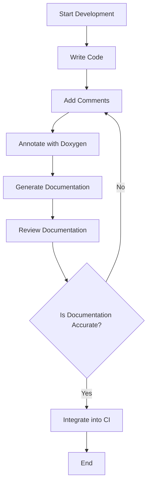

## 13.7 Documentation and Code Comments

In the realm of software engineering, particularly in C++ development, documentation and code comments are indispensable tools that enhance code readability, maintainability, and collaboration. This section delves into the best practices for documenting C++ code, using tools like Doxygen for API documentation, and writing effective comments that serve both current and future developers.

### The Importance of Documentation and Comments

Documentation and comments are often overlooked aspects of software development, yet they play a crucial role in the lifecycle of a project. They provide context, explain complex logic, and serve as a guide for developers who may work on the codebase in the future. Let's explore why they are essential:

- **Enhance Readability**: Well-documented code is easier to read and understand, reducing the time needed for new developers to get up to speed.
- **Facilitate Maintenance**: Clear documentation helps in maintaining and updating code, as it provides insights into the original design and intent.
- **Improve Collaboration**: In team environments, documentation ensures that all team members have a shared understanding of the codebase.
- **Support Debugging and Testing**: Comments can highlight potential pitfalls and areas that require careful testing, aiding in debugging and quality assurance.

### Writing Effective Code Comments

Code comments are annotations in the source code that explain what the code does, why certain decisions were made, and any other relevant information. Here are some best practices for writing effective comments:

#### 1. **Keep Comments Up-to-Date**

Ensure that comments are updated whenever the code changes. Outdated comments can be misleading and more harmful than no comments at all.

#### 2. **Be Clear and Concise**

Comments should be clear and to the point. Avoid verbose explanations and focus on the "why" rather than the "how," as the code itself should explain the "how."

#### 3. **Use Comments to Explain Intent**

Explain the purpose behind complex logic or algorithms. This helps future developers understand the rationale behind certain implementations.

#### 4. **Avoid Redundant Comments**

Do not state the obvious. Comments like `// increment i` for the line `i++` are unnecessary and clutter the code.

#### 5. **Use Proper Formatting**

Use consistent formatting for comments to enhance readability. For example, use a single line for brief comments and block comments for more detailed explanations.

#### 6. **Document Edge Cases and Assumptions**

Highlight any assumptions made in the code and document how edge cases are handled. This is crucial for understanding the limitations and expected behavior of the code.

#### 7. **Include TODOs and FIXMEs**

Use comments to mark areas that require further attention or improvement. Use tags like `TODO` or `FIXME` to make these comments easily searchable.

#### Example of Well-Commented Code

```cpp
#include <iostream>
#include <vector>

// Function to calculate the average of a vector of integers
// Assumes the vector is non-empty
double calculateAverage(const std::vector<int>& numbers) {
    // Check for an empty vector and return 0 to avoid division by zero
    if (numbers.empty()) {
        std::cerr << "Warning: Empty vector provided to calculateAverage." << std::endl;
        return 0.0;
    }

    int sum = 0;
    // Accumulate the sum of all numbers in the vector
    for (int number : numbers) {
        sum += number;
    }

    // Calculate and return the average
    return static_cast<double>(sum) / numbers.size();
}

int main() {
    std::vector<int> data = {10, 20, 30, 40, 50};
    // Output the average of the data vector
    std::cout << "Average: " << calculateAverage(data) << std::endl;
    return 0;
}
```

### Using Doxygen for API Documentation

Doxygen is a powerful tool for generating documentation from annotated C++ source code. It supports various output formats, including HTML and LaTeX, making it a versatile choice for creating comprehensive API documentation.

#### Setting Up Doxygen

1. **Install Doxygen**: Download and install Doxygen from the [official website](https://www.doxygen.nl/).

2. **Create a Configuration File**: Use the `doxygen -g` command to generate a default configuration file (`Doxyfile`). Customize this file to suit your project's needs.

3. **Annotate Your Code**: Use Doxygen-specific comments to annotate your code. These comments will be parsed by Doxygen to generate the documentation.

#### Doxygen Comment Syntax

Doxygen supports several comment styles. Here are the most common:

- **Single-Line Comments**: Use `///` or `//!` for single-line comments.
- **Multi-Line Comments**: Use `/** ... */` or `/*! ... */` for block comments.

#### Key Doxygen Tags

- `@brief`: Provides a brief description of a function or class.
- `@param`: Describes a function parameter.
- `@return`: Describes the return value of a function.
- `@see`: References related functions or classes.
- `@note`: Adds additional information or warnings.

#### Example of Doxygen Comments

```cpp
/**
 * @brief Calculates the average of a vector of integers.
 * 
 * This function computes the average of the numbers in the provided vector.
 * It assumes that the vector is not empty.
 * 
 * @param numbers A vector of integers.
 * @return The average of the numbers as a double.
 * @see calculateSum
 */
double calculateAverage(const std::vector<int>& numbers);
```

#### Generating Documentation

Once your code is annotated, run Doxygen with the configuration file to generate the documentation:

```bash
doxygen Doxyfile
```

This command will produce the documentation in the specified output format, which can be viewed in a web browser or a document viewer.

### Maintaining Documentation

Maintaining documentation is an ongoing process that requires discipline and regular updates. Here are some strategies to ensure your documentation remains accurate and useful:

#### 1. **Integrate Documentation into the Development Process**

Make documentation a part of the development workflow. Encourage developers to update documentation as they write or modify code.

#### 2. **Conduct Regular Documentation Reviews**

Schedule periodic reviews of the documentation to ensure it remains relevant and accurate. This can be part of code reviews or separate documentation audits.

#### 3. **Use Version Control for Documentation**

Store documentation in the same version control system as the code. This ensures that documentation changes are tracked alongside code changes, providing a historical record of both.

#### 4. **Automate Documentation Generation**

Use continuous integration (CI) tools to automate the generation of documentation. This ensures that the latest documentation is always available and reduces the manual effort required to keep it up to date.

#### 5. **Encourage Feedback and Contributions**

Create a culture where team members feel comfortable providing feedback on documentation. Encourage contributions to improve clarity and completeness.

### Visualizing Documentation Workflow

To better understand the documentation workflow, let's visualize it using a flowchart:



**Figure 1**: Documentation Workflow in C++ Development

### Common Pitfalls and How to Avoid Them

Even with the best intentions, documentation can fall short. Here are some common pitfalls and how to avoid them:

- **Incomplete Documentation**: Ensure all public interfaces and complex logic are documented. Use tools to identify undocumented code.
- **Outdated Information**: Regularly review and update documentation to reflect code changes.
- **Over-Documentation**: Avoid documenting trivial code. Focus on complex logic and design decisions.
- **Lack of Consistency**: Establish and enforce a consistent style for comments and documentation across the project.

### Try It Yourself: Enhancing Documentation

To practice enhancing documentation, try the following exercises:

1. **Annotate a Simple Project**: Choose a small C++ project and add Doxygen comments to all public interfaces and complex functions. Generate the documentation and review it for completeness.

2. **Refactor Comments**: Take a piece of code with poor or outdated comments. Update the comments to reflect the current state of the code and ensure they explain the intent and logic clearly.

3. **Automate Documentation Generation**: Set up a CI pipeline to automatically generate and publish documentation whenever code is pushed to the repository.

### Knowledge Check

Before we conclude, let's reinforce what we've learned:

- What are the key benefits of using Doxygen for documentation?
- How can you ensure comments remain up-to-date with code changes?
- What are some common pitfalls in documentation, and how can they be avoided?

### Conclusion

Documentation and code comments are vital components of software development that enhance code quality, maintainability, and collaboration. By following best practices and leveraging tools like Doxygen, developers can create comprehensive and useful documentation that supports the entire software lifecycle. Remember, documentation is not a one-time task but an ongoing process that requires attention and care.

## Quiz Time!



### What is the primary purpose of code comments?

- [x] To explain the intent and logic behind the code
- [ ] To increase the size of the codebase
- [ ] To replace the need for documentation
- [ ] To make the code run faster

> **Explanation:** Code comments are used to explain the intent and logic behind the code, making it easier for others to understand and maintain.

### Which Doxygen tag is used to describe a function parameter?

- [ ] @brief
- [x] @param
- [ ] @return
- [ ] @see

> **Explanation:** The `@param` tag is used in Doxygen to describe a function parameter.

### How can you ensure that documentation remains up-to-date?

- [x] Integrate documentation updates into the development process
- [ ] Write documentation only at the end of the project
- [ ] Avoid using version control for documentation
- [ ] Ignore feedback from team members

> **Explanation:** Integrating documentation updates into the development process ensures that it remains accurate and up-to-date.

### What is a common pitfall in documentation?

- [ ] Writing too many comments
- [x] Having outdated information
- [ ] Using Doxygen
- [ ] Automating documentation generation

> **Explanation:** Outdated information is a common pitfall in documentation, as it can mislead developers and reduce the documentation's usefulness.

### What tool can be used to automate documentation generation?

- [x] Continuous Integration (CI) tools
- [ ] Text editors
- [ ] Spreadsheet software
- [ ] Email clients

> **Explanation:** Continuous Integration (CI) tools can automate the generation of documentation, ensuring it is always up-to-date.

### Which of the following is NOT a benefit of using Doxygen?

- [ ] Generating HTML documentation
- [ ] Supporting multiple output formats
- [x] Automatically fixing code errors
- [ ] Providing a structured way to document code

> **Explanation:** Doxygen does not automatically fix code errors; it is used for generating documentation.

### What is the purpose of the `@see` tag in Doxygen?

- [ ] To describe a function parameter
- [ ] To provide a brief description
- [x] To reference related functions or classes
- [ ] To note additional information

> **Explanation:** The `@see` tag in Doxygen is used to reference related functions or classes.

### Why is it important to avoid redundant comments?

- [x] They clutter the code and provide no additional value
- [ ] They make the code run slower
- [ ] They increase the file size
- [ ] They are difficult to write

> **Explanation:** Redundant comments clutter the code and provide no additional value, making it harder to read.

### What should be included in comments to explain complex logic?

- [x] The intent and purpose behind the logic
- [ ] The exact code implementation
- [ ] The author's name
- [ ] The date the code was written

> **Explanation:** Comments should include the intent and purpose behind complex logic to help others understand why certain decisions were made.

### True or False: Documentation is a one-time task that should be completed at the end of a project.

- [ ] True
- [x] False

> **Explanation:** Documentation is an ongoing process that should be maintained throughout the project's lifecycle, not just at the end.


