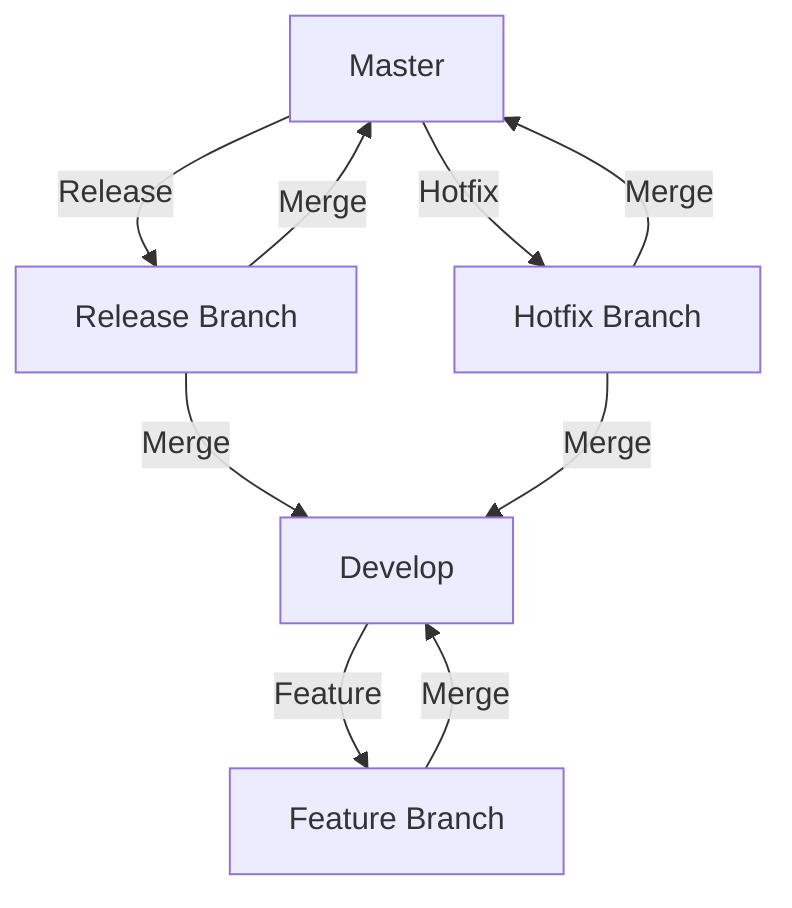

## 13.8 Version Control Strategies

In the realm of software development, version control systems (VCS) are indispensable tools that help manage changes to source code over time. They allow multiple developers to collaborate on a project, track changes, and maintain a history of code evolution. For C++ developers, mastering version control strategies is crucial for maintaining code quality, facilitating collaboration, and ensuring the robustness of software architecture. In this section, we will delve into various version control strategies, focusing on branching strategies like GitFlow, managing large codebases, and best practices for code reviews and pull requests.

### Understanding Version Control Systems

Before diving into specific strategies, let's briefly explore what version control systems are and why they are essential.

#### What is a Version Control System?

A version control system is a tool that helps developers manage changes to source code over time. It records every modification made to the codebase, allowing developers to revert to previous versions if needed. VCS can be centralized, like Subversion (SVN), or distributed, like Git and Mercurial.

#### Why Use Version Control?

- **Collaboration**: Multiple developers can work on the same project simultaneously without overwriting each other's changes.
- **History Tracking**: Every change is recorded, providing a detailed history of the project.
- **Branching and Merging**: Developers can create branches to work on features or fixes independently and merge them back into the main codebase.
- **Backup and Restore**: Code is stored in a repository, providing a backup that can be restored if needed.

### Branching Strategies

Branching is a core concept in version control that allows developers to diverge from the main codebase to work on features, fixes, or experiments. Effective branching strategies are crucial for managing complex projects and ensuring smooth collaboration.

#### GitFlow

GitFlow is a popular branching strategy that provides a structured workflow for managing feature development, releases, and hotfixes. It is particularly well-suited for projects with a scheduled release cycle.

**Key Concepts of GitFlow**:

- **Master Branch**: The main branch that always reflects the production-ready state of the project.
- **Develop Branch**: The integration branch where features are merged before being released.
- **Feature Branches**: Created from the develop branch for new features. Once a feature is complete, it is merged back into develop.
- **Release Branches**: Created from develop when preparing for a new release. This branch allows for final testing and bug fixes before merging into master and develop.
- **Hotfix Branches**: Created from master to address critical issues in production. Once fixed, they are merged back into both master and develop.

**Advantages of GitFlow**:

- **Clear Workflow**: Provides a clear process for feature development, releases, and hotfixes.
- **Parallel Development**: Supports multiple feature branches, allowing parallel development.
- **Stable Releases**: Ensures that the master branch is always production-ready.

**Disadvantages of GitFlow**:

- **Complexity**: Can be complex for small teams or projects with continuous delivery.
- **Overhead**: Requires more branches and merges, which can be cumbersome for simple projects.

#### GitHub Flow

GitHub Flow is a simpler alternative to GitFlow, designed for projects with continuous delivery. It emphasizes short-lived branches and frequent deployments.

**Key Concepts of GitHub Flow**:

- **Master Branch**: The main branch that reflects the production-ready state.
- **Feature Branches**: Created from master for new features or fixes. Once complete, they are merged back into master via pull requests.

**Advantages of GitHub Flow**:

- **Simplicity**: Fewer branches and simpler workflow.
- **Continuous Delivery**: Supports frequent deployments and quick iterations.

**Disadvantages of GitHub Flow**:

- **Less Structure**: Lacks the structured release process of GitFlow.
- **Potential Instability**: Master branch can become unstable if not managed carefully.

#### Trunk-Based Development

Trunk-Based Development is a branching strategy where developers work directly on a single branch, often called the "trunk" or "main." It emphasizes frequent commits and continuous integration.

**Key Concepts of Trunk-Based Development**:

- **Single Branch**: All development occurs on a single branch.
- **Feature Toggles**: Used to enable or disable features in production without branching.

**Advantages of Trunk-Based Development**:

- **Simplicity**: No need to manage multiple branches.
- **Fast Feedback**: Encourages continuous integration and fast feedback.

**Disadvantages of Trunk-Based Development**:

- **Risk of Instability**: Higher risk of breaking changes affecting the main branch.
- **Requires Discipline**: Developers must be disciplined in writing tests and using feature toggles.

### Managing Large Codebases

Managing large codebases presents unique challenges, including maintaining code quality, ensuring performance, and facilitating collaboration. Here are some strategies to address these challenges.

#### Modularization

Modularization involves breaking a large codebase into smaller, independent modules. This approach improves maintainability and allows teams to work on different modules concurrently.

- **Encapsulation**: Each module encapsulates its functionality, reducing dependencies.
- **Reusability**: Modules can be reused across different projects.
- **Isolation**: Changes in one module have minimal impact on others.

#### Codebase Organization

Organizing the codebase logically is crucial for managing large projects. Consider the following practices:

- **Directory Structure**: Use a consistent directory structure to organize files logically.
- **Naming Conventions**: Adopt consistent naming conventions for files, classes, and functions.
- **Documentation**: Provide clear documentation for each module and component.

#### Continuous Integration

Continuous Integration (CI) is a practice where developers frequently integrate their code into a shared repository. Automated tests are run to detect integration issues early.

- **Automated Testing**: Run unit tests, integration tests, and static analysis tools automatically.
- **Build Automation**: Automate the build process to ensure consistency.
- **Feedback Loop**: Provide fast feedback to developers on the status of their changes.

### Code Reviews and Pull Requests

Code reviews and pull requests are essential practices for maintaining code quality and facilitating collaboration. They provide an opportunity for developers to share knowledge, catch bugs, and ensure adherence to coding standards.

#### Code Reviews

Code reviews involve examining code changes to ensure they meet quality standards. Here are some best practices for effective code reviews:

- **Review Small Changes**: Focus on small, manageable changes to make reviews more effective.
- **Provide Constructive Feedback**: Offer specific, actionable feedback to help improve the code.
- **Encourage Discussion**: Use code reviews as an opportunity for discussion and learning.

#### Pull Requests

Pull requests are a mechanism for proposing changes to a codebase. They allow developers to review and discuss changes before merging them into the main branch.

- **Clear Description**: Provide a clear description of the changes and their purpose.
- **Link to Issues**: Link pull requests to relevant issues or tasks for context.
- **Automated Checks**: Use automated checks to ensure code quality and compliance with standards.

### Try It Yourself

To solidify your understanding of version control strategies, try experimenting with different branching strategies in a Git repository. Create a small project and practice using GitFlow, GitHub Flow, and Trunk-Based Development. Observe how each strategy affects your workflow and collaboration.

### Visualizing Version Control Workflows

Let's visualize the typical workflow of a GitFlow strategy using a Mermaid.js diagram. This will help you understand the flow of branches and merges in a GitFlow-based project.

This diagram illustrates the flow of branches in a GitFlow strategy, highlighting the relationships between master, develop, feature, release, and hotfix branches.

### Knowledge Check

- What are the key differences between GitFlow and GitHub Flow?
- How does Trunk-Based Development differ from traditional branching strategies?
- Why is modularization important for managing large codebases?
- What are some best practices for code reviews and pull requests?

### References and Links

- [GitFlow Workflow](https://www.atlassian.com/git/tutorials/comparing-workflows/gitflow-workflow)
- [GitHub Flow](https://guides.github.com/introduction/flow/)
- [Trunk-Based Development](https://trunkbaseddevelopment.com/)
- [Continuous Integration](https://www.martinfowler.com/articles/continuousIntegration.html)

### Embrace the Journey

Remember, mastering version control strategies is an ongoing journey. As you gain experience, you'll discover which strategies work best for your team and projects. Keep experimenting, stay curious, and enjoy the process of refining your workflow.

## Quiz Time!



### What is the main branch in GitFlow that reflects the production-ready state of the project?

- [x] Master Branch
- [ ] Develop Branch
- [ ] Feature Branch
- [ ] Release Branch

> **Explanation:** In GitFlow, the master branch always reflects the production-ready state of the project.

### Which branching strategy emphasizes short-lived branches and frequent deployments?

- [ ] GitFlow
- [x] GitHub Flow
- [ ] Trunk-Based Development
- [ ] Centralized Workflow

> **Explanation:** GitHub Flow is designed for continuous delivery, emphasizing short-lived branches and frequent deployments.

### What is the primary advantage of Trunk-Based Development?

- [ ] Complex branching structure
- [ ] Slow feedback loop
- [x] Fast feedback and simplicity
- [ ] High risk of instability

> **Explanation:** Trunk-Based Development emphasizes fast feedback and simplicity by using a single branch for development.

### Which of the following is NOT a key concept of GitFlow?

- [ ] Master Branch
- [ ] Develop Branch
- [ ] Feature Branch
- [x] Trunk Branch

> **Explanation:** GitFlow does not include a "Trunk Branch"; it uses master, develop, feature, release, and hotfix branches.

### What is a common disadvantage of GitFlow?

- [x] Complexity
- [ ] Simplicity
- [ ] Continuous delivery support
- [ ] Frequent deployments

> **Explanation:** GitFlow can be complex, especially for small teams or projects with continuous delivery.

### Why is modularization important in managing large codebases?

- [ ] It increases dependencies
- [x] It improves maintainability
- [ ] It reduces code reuse
- [ ] It complicates the codebase

> **Explanation:** Modularization improves maintainability by breaking a large codebase into smaller, independent modules.

### Which practice involves examining code changes to ensure they meet quality standards?

- [ ] Pull Requests
- [x] Code Reviews
- [ ] Continuous Integration
- [ ] Feature Toggles

> **Explanation:** Code reviews involve examining code changes to ensure they meet quality standards.

### What is a key benefit of using pull requests?

- [x] Facilitating discussion and review before merging changes
- [ ] Automatically merging changes without review
- [ ] Avoiding code reviews
- [ ] Replacing version control systems

> **Explanation:** Pull requests facilitate discussion and review before merging changes into the main branch.

### Which of the following is a best practice for code reviews?

- [x] Review small changes
- [ ] Review large changes
- [ ] Avoid providing feedback
- [ ] Skip code reviews for minor changes

> **Explanation:** Reviewing small changes makes code reviews more effective and manageable.

### True or False: Continuous Integration involves developers frequently integrating their code into a shared repository with automated tests.

- [x] True
- [ ] False

> **Explanation:** Continuous Integration involves frequent integration of code into a shared repository with automated tests to detect integration issues early.


