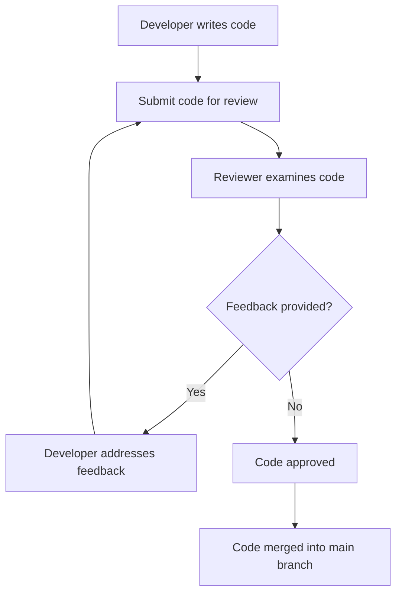
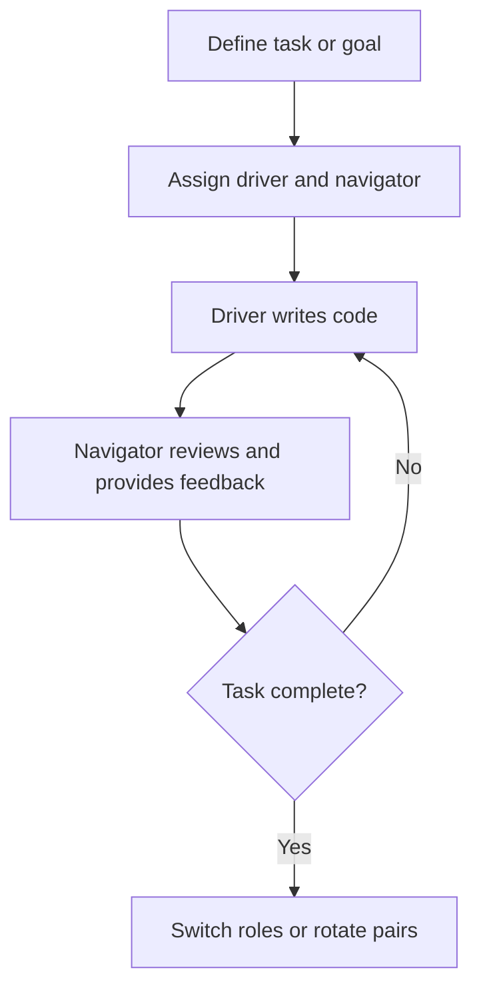

## 13.9 Code Review and Pair Programming

In the realm of software engineering, particularly in C++ development, code review and pair programming are two pivotal practices that significantly enhance code quality, foster team collaboration, and drive continuous improvement. This section delves into the intricacies of these practices, offering insights and strategies for expert software engineers and architects.

### Understanding Code Review

Code review is a systematic examination of source code intended to find and fix mistakes overlooked in the initial development phase, thus improving the overall quality of software. It is a crucial step in the software development lifecycle, ensuring that code adheres to the project's coding standards and is free from bugs.

#### Objectives of Code Review

1. **Identify Defects Early**: Catching errors early in the development process reduces the cost and effort required to fix them later.
2. **Improve Code Quality**: Ensures that the code is clean, efficient, and maintainable.
3. **Share Knowledge**: Facilitates knowledge transfer among team members, enhancing team skills and understanding of the codebase.
4. **Ensure Compliance with Standards**: Verifies adherence to coding standards and best practices.

#### Types of Code Reviews

- **Formal Code Review**: A structured process involving multiple reviewers and often includes a meeting to discuss the code.
- **Over-the-Shoulder Review**: An informal review where a developer walks through the code with a colleague.
- **Email Pass-Around**: Code is sent to reviewers via email for feedback.
- **Tool-Assisted Review**: Utilizes tools like GitHub, GitLab, or Bitbucket to facilitate the review process.

### Conducting Effective Code Reviews

To conduct effective code reviews, consider the following strategies:

#### Set Clear Goals

Define what you aim to achieve with the code review. This could include finding bugs, improving code readability, or ensuring adherence to design patterns.

#### Use Checklists

Develop checklists to ensure consistency and thoroughness in reviews. A checklist might include items like:

- Are variable names descriptive?
- Is the code free of commented-out sections?
- Are error conditions handled appropriately?

#### Focus on the Code, Not the Developer

Critique the code, not the person who wrote it. Maintain a positive and constructive tone to foster a collaborative environment.

#### Limit Review Size

Reviewing too much code at once can be overwhelming and counterproductive. Aim to review no more than 200-400 lines of code at a time.

#### Provide Constructive Feedback

Offer actionable suggestions for improvement rather than vague criticisms. For example, instead of saying "This function is too complex," suggest ways to simplify it.

#### Encourage Discussion

Promote open dialogue about the code. Encourage developers to explain their thought processes and reasoning behind certain decisions.

#### Utilize Code Review Tools

Leverage tools like GitHub's pull request feature or Gerrit to streamline the review process. These tools often include features for commenting, tracking changes, and integrating with CI/CD pipelines.

### Code Review Workflow

Here is a typical workflow for conducting a code review:

**Figure 1: Code Review Workflow**

### Pair Programming

Pair programming is a collaborative approach where two developers work together at one workstation. One developer, the "driver," writes code while the other, the "observer" or "navigator," reviews each line of code as it is typed.

#### Benefits of Pair Programming

1. **Improved Code Quality**: Immediate feedback and continuous review lead to higher quality code.
2. **Enhanced Collaboration**: Fosters communication and collaboration between team members.
3. **Knowledge Sharing**: Facilitates knowledge transfer and skill development.
4. **Reduced Risk of Errors**: Two sets of eyes are more likely to catch mistakes.
5. **Increased Team Cohesion**: Builds stronger working relationships and team dynamics.

#### Pair Programming Styles

- **Driver-Navigator**: The driver writes code while the navigator reviews and provides feedback.
- **Ping-Pong**: Developers alternate roles frequently, often after completing a small task or test.
- **Strong-Style Pairing**: The driver writes code based on instructions from the navigator, who focuses on the broader design and strategy.

### Implementing Pair Programming

To effectively implement pair programming, consider the following tips:

#### Choose the Right Pair

Pair developers with complementary skills and experience levels. This can enhance learning and productivity.

#### Establish Clear Roles

Define the roles of driver and navigator clearly. Ensure both developers understand their responsibilities.

#### Communicate Effectively

Encourage open and continuous communication. The navigator should feel comfortable voicing suggestions and concerns.

#### Rotate Pairs Regularly

Rotate pairs to prevent burnout and ensure diverse perspectives are shared across the team.

#### Use Pair Programming Tools

Leverage tools like Visual Studio Live Share or JetBrains Code With Me to facilitate remote pair programming.

### Pair Programming Workflow

Here is a typical workflow for pair programming:

**Figure 2: Pair Programming Workflow**

### Code Review vs. Pair Programming

While both practices aim to improve code quality and foster collaboration, they have distinct differences:

- **Timing**: Code reviews occur after code is written, while pair programming involves real-time collaboration.
- **Focus**: Code reviews focus on the final product, whereas pair programming emphasizes the development process.
- **Interaction**: Code reviews are often asynchronous, while pair programming requires synchronous collaboration.

### Integrating Code Review and Pair Programming

Combining code review and pair programming can yield significant benefits. For instance, pair programming can be used for complex tasks requiring immediate feedback, while code reviews can be reserved for broader oversight and adherence to standards.

### Challenges and Solutions

#### Code Review Challenges

- **Time-Consuming**: Code reviews can be time-intensive. Solution: Limit review size and use checklists to streamline the process.
- **Inconsistent Feedback**: Different reviewers may have varying standards. Solution: Establish clear guidelines and use checklists.
- **Resistance to Feedback**: Developers may be resistant to criticism. Solution: Foster a positive and constructive review culture.

#### Pair Programming Challenges

- **Personality Clashes**: Not all developers work well together. Solution: Rotate pairs and encourage open communication.
- **Increased Resource Usage**: Pair programming requires two developers for one task. Solution: Use it selectively for complex or critical tasks.

### Best Practices for Code Review and Pair Programming

#### Code Review Best Practices

- **Automate Where Possible**: Use automated tools to check for style and syntax errors.
- **Prioritize Critical Code**: Focus reviews on critical sections of code that impact performance or security.
- **Document Review Findings**: Keep a record of feedback and changes made during reviews.

#### Pair Programming Best Practices

- **Set Clear Goals**: Define what you aim to achieve with each pairing session.
- **Encourage Mutual Respect**: Foster an environment of respect and collaboration.
- **Reflect and Adapt**: Regularly review the effectiveness of pair programming and make adjustments as needed.

### Try It Yourself

To get hands-on experience with code review and pair programming, try the following exercises:

1. **Code Review Exercise**: Select a piece of code from your current project and conduct a code review with a colleague. Use a checklist to guide your review and provide constructive feedback.

2. **Pair Programming Exercise**: Choose a small task or feature to implement with a partner. Alternate roles between driver and navigator, and reflect on the experience afterward.

### Conclusion

Code review and pair programming are powerful practices that can significantly enhance the quality of your C++ code and the effectiveness of your development team. By fostering collaboration, knowledge sharing, and continuous improvement, these practices help create a more robust and maintainable codebase.

Remember, this is just the beginning. As you progress, you'll find new ways to integrate these practices into your workflow, leading to even greater success in your software development endeavors. Keep experimenting, stay curious, and enjoy the journey!

## Quiz Time!



### What is the primary objective of code review?

- [x] Identify defects early
- [ ] Increase code complexity
- [ ] Reduce the number of developers
- [ ] Eliminate the need for testing

> **Explanation:** The primary objective of code review is to identify defects early in the development process, reducing the cost and effort required to fix them later.

### Which of the following is a benefit of pair programming?

- [x] Improved code quality
- [ ] Increased individual productivity
- [ ] Reduced communication
- [ ] Less knowledge sharing

> **Explanation:** Pair programming improves code quality through immediate feedback and continuous review, fostering collaboration and knowledge sharing.

### What is a common challenge in code review?

- [x] Time-consuming process
- [ ] Lack of tools
- [ ] No need for guidelines
- [ ] Reduced code quality

> **Explanation:** Code reviews can be time-consuming, but this challenge can be mitigated by limiting review size and using checklists.

### In pair programming, what is the role of the "navigator"?

- [x] Review and provide feedback
- [ ] Write code
- [ ] Manage the project
- [ ] Test the code

> **Explanation:** In pair programming, the navigator reviews the code written by the driver and provides feedback.

### Which tool can be used for remote pair programming?

- [x] Visual Studio Live Share
- [ ] Microsoft Word
- [ ] Excel
- [ ] PowerPoint

> **Explanation:** Visual Studio Live Share is a tool that facilitates remote pair programming by allowing developers to collaborate in real-time.

### What is the focus of code reviews?

- [x] The final product
- [ ] The development process
- [ ] Personal opinions
- [ ] Project management

> **Explanation:** Code reviews focus on the final product, ensuring it meets coding standards and is free from defects.

### How can code review feedback be made more consistent?

- [x] Use checklists
- [ ] Ignore guidelines
- [ ] Increase review size
- [ ] Avoid documentation

> **Explanation:** Using checklists helps ensure consistency and thoroughness in code review feedback.

### What is a benefit of integrating code review and pair programming?

- [x] Enhanced code quality
- [ ] Increased isolation
- [ ] Reduced collaboration
- [ ] Less knowledge sharing

> **Explanation:** Integrating code review and pair programming enhances code quality by combining immediate feedback with broader oversight.

### What is a challenge of pair programming?

- [x] Personality clashes
- [ ] Reduced code quality
- [ ] Lack of communication
- [ ] Decreased collaboration

> **Explanation:** Personality clashes can occur in pair programming, but rotating pairs and encouraging open communication can help mitigate this challenge.

### True or False: Pair programming requires asynchronous collaboration.

- [ ] True
- [x] False

> **Explanation:** Pair programming requires synchronous collaboration, with two developers working together in real-time.


